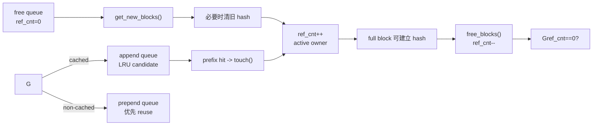

# AI Infra Daily — Day 1（源码导航版）
## Blackwell TMEM 编址 / Allocation + vLLM BlockPool 生命周期

**预计总用时：55 分钟**

- Blackwell / PTX：20～22 分钟
- KV Cache / vLLM 源码：20～22 分钟
- 面试：10～12 分钟

今天的原则不是“看完一个文件”，而是完成两个最小闭环：

1. `TMEM taddr → allocation → CuTe TMEM fragment`
2. `KVCacheBlock → allocate → touch → free → eviction candidate`

---

# 第一章：Blackwell / PTX
## 目标：彻底分开 TMEM 的容量、地址编码和 allocation

**建议用时：20～22 分钟**

## 1. 先看官方 Figure 182，不自己画 layout


来源：NVIDIA PTX ISA 9.3，Figure 182 — **Tensor Memory Layout and Addressing**  
章节：<https://docs.nvidia.com/cuda/parallel-thread-execution/#tensor-memory-addressing>

这张图只看三个事实：

- 一个 CTA 的 TMEM 视图有 **128 lanes × 512 columns**；
- 每个 lane 横向 512 columns，共 `2 KiB`；
- `taddr` 是 32-bit 编码：高 16 bit 是 lane index，低 16 bit 是 column index。

PTX 的地址编码可以写成：

$$
\text{taddr}=(\text{lane}\ll16)+\text{column}
$$

所以：

```text
lane 0, col 0 -> 0x0000.0000
lane 0, col 1 -> 0x0000.0001

lane 1, col 0 -> 0x0001.0000
```

因此数值上：

$$
0x0001\_0000 = 65536
$$

但这里的 `65536` 是 **encoded taddr 的数值跨度**，不是 64 KiB 的物理距离。

不要从这个 token encoding 推断“TMEM 是普通 row-major/column-major byte array”。

### 容量仍然是：

$$
128\times512\times32\text{ bits}
=256\text{ KiB}
$$

---

## 2. PTX 阅读导航：只读 3 小节

### 阅读目标

读完后你要能回答：

1. `taddr` 为什么不是普通 byte address？
2. `tcgen05.alloc 128` 到底申请了什么？
3. `dealloc` 与 `relinquish_alloc_permit` 为什么不是一件事？

### 阅读范围

**A. 9.7.17.1.1 — Tensor Memory Addressing**  
<https://docs.nvidia.com/cuda/parallel-thread-execution/#tensor-memory-addressing>

只读从：

```text
Tensor Memory addresses are 32-bit wide...
```

到 Figure 182。

预计：**2～3 分钟**。

**B. 9.7.17.1.2 — Tensor Memory Allocation**  
<https://docs.nvidia.com/cuda/parallel-thread-execution/#tensor-memory-allocation>

只读 allocation granularity 那一段。

预计：**2 分钟**。

你要抓住：

```text
allocation unit = 32 columns
nCols = power of two
allocate one column => all 128 lanes of that column
```

**C. 9.7.17.7.1 — tcgen05.alloc/dealloc/relinquish**  
<https://docs.nvidia.com/cuda/parallel-thread-execution/#tensorcore-5th-generation-instructions-tcgen05-alloc-tcgen05-dealloc-tcgen05-relinquish-alloc-permit>

从 Syntax 开始，到 Example 1 结束。

预计：**5 分钟**。

重点只看：

```ptx
tcgen05.alloc...
tcgen05.dealloc...
tcgen05.relinquish_alloc_permit...
```

以及三个语义：

- `alloc` 是 blocking；
- allocation base 被写到 `shared::cta [dst]`；
- kernel 退出前 allocated TMEM 必须 dealloc。

---

## 3. 进入 CUTLASS 前需要的最小先验

不要先读整个 SM100 GEMM。

今天只需要知道：

```text
TiledMma
  -> 描述 tcgen05 MMA 的逻辑分块

make_fragment_C(...)
  -> 产生 accumulator 的逻辑 TMEM fragment/layout

TmemAllocator
  -> 负责申请真实 TMEM columns

retrieve_ptr(...)
  -> 取得这次 allocation 的 TMEM base

cute.make_tensor(base, layout)
  -> 把实际 storage base 与逻辑 layout 绑定
```

这里最容易混的是：

> `make_fragment_C()` 定义布局，不等于它已经申请了 TMEM storage。

---

## 4. CUTLASS 阅读导航

官方 guide：  
<https://docs.nvidia.com/cutlass/4.5.2/media/docs/pythonDSL/mma_docs/tcgen05_programming.html>

### 开始

搜索：

```text
C fragment (accumulator) — TMEM allocation
```

### 结束

读到：

```python
tCtAcc = cute.make_tensor(tmem_ptr, tCtAcc.layout)
```

然后停止。

预计：**5～6 分钟，约 25～35 行代码/说明**。

### 本轮不要读

- GMEM→SMEM TMA setup
- pipeline barrier
- block scaling
- CTA-pair
- epilogue 完整实现

### 读完自检

1. `make_fragment_C` 与 `TmemAllocator.allocate` 的职责各是什么？
2. 为什么 base pointer 与 layout 要到最后才能组成 `tCtAcc`？
3. 为什么 `alloc` 返回结果经由 SMEM，而不是只放某线程私有寄存器？

---

# 第二章：KV Cache / State Management
## 目标：只读 BlockPool 的状态闭环，不读 `kv_cache_manager.py`

**建议用时：20～22 分钟**

今天**明确不碰**：

- `KVCacheManager.allocate_slots()` 大函数；
- block table；
- slot mapping；
- hybrid cache；
- P/D connector；
- Mamba；
- PagedAttention kernel。

这些全部往后放。

---

## 1. 先看官方 Figure 7 / 8

### Figure 7：第一次把 KV 写进 paged memory


来源：vLLM 官方博客《Inside vLLM: Anatomy of a High-Throughput LLM Inference System》，Figure 7  
<https://vllm.ai/blog/2025-09-05-anatomy-of-vllm>

只看：

```text
CPU:
KVCacheBlock metadata
- block_id
- ref_cnt
- block_hash

GPU:
physical KV blocks
```

关键点：`KVCacheBlock` 是 **管理对象**，不是 GPU KV tensor 本身。

### Figure 8：旧 request 已结束，block 仍然能被 prefix hit


这张图今天最重要。

第一条 request 已经结束时，旧 blocks 的 `ref_cnt` 可以回到 0；但只要旧 hash identity 还有效，第二条 request 仍可命中并重新拿回这些 blocks。

因此先建立：

```text
request ownership lifetime
!=
cached-content lifetime
```

---

# 2. 源码阅读前置数据结构

今天只认 4 个东西。

### `KVCacheBlock`

```text
block_id
    physical block 的身份

ref_cnt
    当前 active requests 的引用数

block_hash
    这块内容是否拥有可查找的 prefix-cache identity

prev_free_block / next_free_block
    该 block 在 free/eviction queue 中的位置
```

### `FreeKVCacheBlockQueue`

不是“里面所有内容都无效”的 queue。

更准确：

> 当前没有 active owner、可以被 allocator 重用的 blocks 的队列。

其中一部分仍然带有效 prefix-cache hash。

### `BlockHashToBlockMap`

```text
block hash -> cached KVCacheBlock
```

### `BlockPool`

把：

```text
physical block metadata
free queue
prefix hash lookup
allocation / eviction
```

放在一起管理。

---

# 3. 今天只需要知道 3 个 invariant

读源码前先记住，否则容易越看越乱。

### Invariant 1

```text
ref_cnt > 0
=> block 不能作为 free/reallocation candidate
```

### Invariant 2

```text
ref_cnt == 0
!= block_hash 一定为空
```

即：

```text
ref_cnt == 0 && block_hash != None
```

是合法状态。

### Invariant 3

真正重新把一个 cached-free block 分给别的内容前，必须先：

```text
清除旧 hash identity
```

否则 hash map 会指向已经被覆盖的 KV。

---

# 4. 源码阅读导航

本课固定到 vLLM commit：

`80771bbbddf9e5153eea3aca8055049ee5aaaed1`

Commit：  
<https://github.com/vllm-project/vllm/commit/80771bbbddf9e5153eea3aca8055049ee5aaaed1>

总阅读量约 **120 行有效代码/注释**，预计 **15～18 分钟**。

---

## Step 1 — 只看 `KVCacheBlock` 字段

文件：

`vllm/v1/core/kv_cache_utils.py`

固定链接：  
<https://github.com/vllm-project/vllm/blob/80771bbbddf9e5153eea3aca8055049ee5aaaed1/vllm/v1/core/kv_cache_utils.py#L146-L165>

### 读

`L146-L165`，约 20 行。

### 停

看到：

```python
is_null: bool = False
```

就停。

### 不要读

后面的 hash helper、MM hash、LoRA hash。

### 你要回答

为什么一个 block 同时需要 `ref_cnt` 和 `block_hash`？

---

## Step 2 — 只看 free queue 的设计说明，不读完整实现

同一文件：

<https://github.com/vllm-project/vllm/blob/80771bbbddf9e5153eea3aca8055049ee5aaaed1/vllm/v1/core/kv_cache_utils.py#L206-L221>

只读 `FreeKVCacheBlockQueue` 的 docstring，约 16 行。

你需要知道两件事：

1. 为什么不用 Python `deque`：需要 O(1) middle removal；
2. queue 本身也编码 eviction priority。

**今天不读 `popleft_n/remove/append_n` 的具体链表代码。**

---

## Step 3 — 真正读 allocation

文件：

`vllm/v1/core/block_pool.py`

<https://github.com/vllm-project/vllm/blob/80771bbbddf9e5153eea3aca8055049ee5aaaed1/vllm/v1/core/block_pool.py#L597-L646>

读：

```text
get_new_blocks()
_maybe_evict_cached_block()
```

约 50 行。

### 阅读时删掉脑子里的噪音

所有：

```python
metrics_collector
_emit_block_removed_events
```

先当作不存在。

主路径只剩：

```text
free queue popleft
    ↓
如果旧 block 还有 cache identity -> evict hash
    ↓
assert ref_cnt == 0
    ↓
ref_cnt += 1
```

---

## Step 4 — 读 cache hit 与 free

同一文件：

<https://github.com/vllm-project/vllm/blob/80771bbbddf9e5153eea3aca8055049ee5aaaed1/vllm/v1/core/block_pool.py#L647-L684>

只读：

```text
touch()
free_blocks()
```

约 38 行。

### `touch()` 只回答

为什么：

```python
if block.ref_cnt == 0:
    free_block_queue.remove(block)
```

必须发生在 `ref_cnt += 1` 附近？

### `free_blocks()` 只回答

当前版本为什么把：

```text
non-cached blocks -> prepend
cached blocks     -> append
```

分开？

源码注释已经给出：

- non-cached：LIFO reuse，偏 locality；
- cached：FIFO reuse，形成 LRU eviction 行为。

---

# 5. 把四段源码连成一个状态机



---

# 6. 读完后只回答 4 个问题

1. `ref_cnt==0 && block_hash!=None` 为什么合法？
2. prefix hit 时为什么需要从 free queue 中间摘掉 block？
3. allocator 拿到一个仍有 hash 的 free block 时为什么必须先 evict identity？
4. 为什么 cached 与 non-cached free block 的 queue placement 不一样？

如果这 4 个能回答，今天 KV 部分就完成，不再继续追 `KVCacheManager`。

---

# 第三章：面试

## 口述题：TMEM allocation 为什么会参与 occupancy / deadlock reasoning？

### 标准答案

`tcgen05.alloc` 不是普通编译期静态地址计算，而是运行时、可能 blocking 的 TMEM resource allocation。一个 CTA 要等待 SM 上出现足够 TMEM columns 才能继续，因此 kernel 的可驻留 CTA 数除了 register/SMEM 之外还受到 TMEM allocation 约束。

如果多个 producer/consumer CTA 或 CTA-pair 的执行顺序要求某些 CTA 先释放 TMEM，但这些 CTA 又因为 residency/resource 等待无法被调度，就需要把 TMEM 生命周期纳入 deadlock 分析。

工程上因此要同时看：

```text
SMEM
register
TMEM columns
CTA role / residency
allocation / deallocation ordering
```

而不能只按传统 occupancy 表判断。

---

## 手撕：CUDA warp stable softmax（32 个元素）

要求：一个 warp 正好处理 32 个 `float`，每线程一个元素，原地输出 softmax。

```cpp
__device__ __forceinline__
float warp_reduce_max(float x) {
    unsigned mask = 0xffffffffu;
    for (int offset = 16; offset > 0; offset >>= 1) {
        x = fmaxf(x, __shfl_down_sync(mask, x, offset));
    }
    return __shfl_sync(mask, x, 0);
}

__device__ __forceinline__
float warp_reduce_sum(float x) {
    unsigned mask = 0xffffffffu;
    for (int offset = 16; offset > 0; offset >>= 1) {
        x += __shfl_down_sync(mask, x, offset);
    }
    return __shfl_sync(mask, x, 0);
}

__global__ void warp_softmax32(float* x) {
    int lane = threadIdx.x & 31;

    float v = x[lane];

    float m = warp_reduce_max(v);
    float e = expf(v - m);
    float s = warp_reduce_sum(e);

    x[lane] = e / s;
}
```

自检：

- 为什么先减 max？
- `__shfl_sync(mask, x, 0)` 在这里为什么必要？
- 如果元素数不是 32，mask/neutral value 要怎么改？

---

# Day 1 验收

1. 能看 Figure 182 解释 `65536` 是 taddr 编码跨度，不是容量。
2. 能在 15～18 分钟内走完 `KVCacheBlock → get_new_blocks → touch/free` 的指定源码范围。
3. 能口述 `ref_cnt` 与 `block_hash` 两套 lifetime 的区别。

**Day 2：进入 `tcgen05.ld` collective；KV 进入 `block_table → slot_mapping`。**
