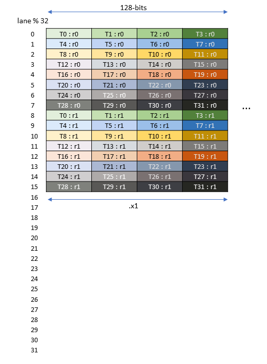
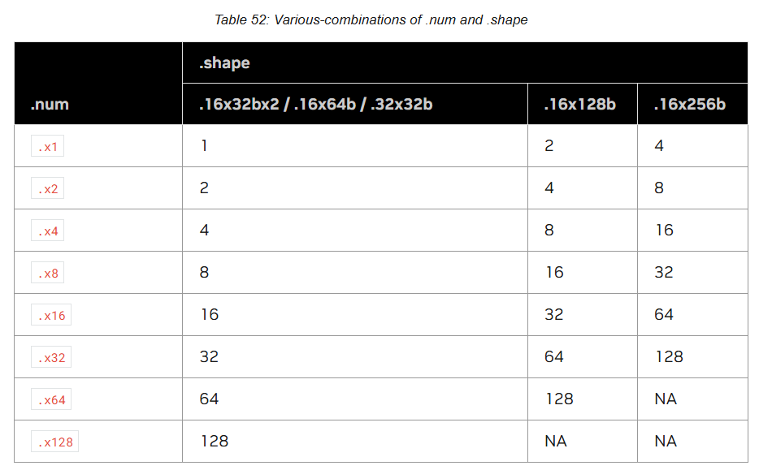
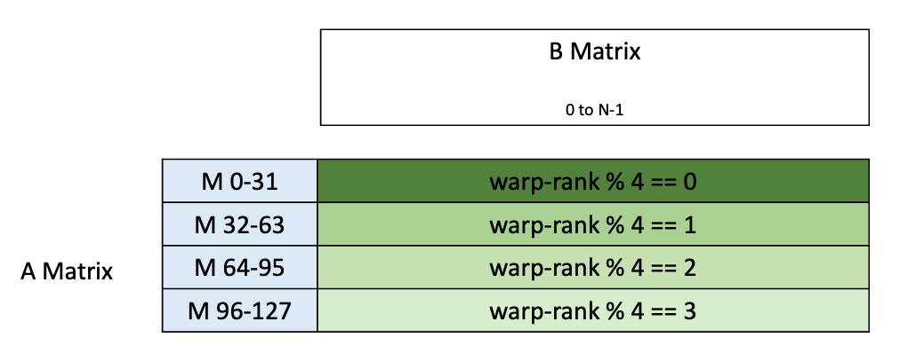
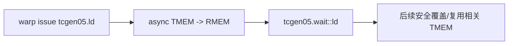
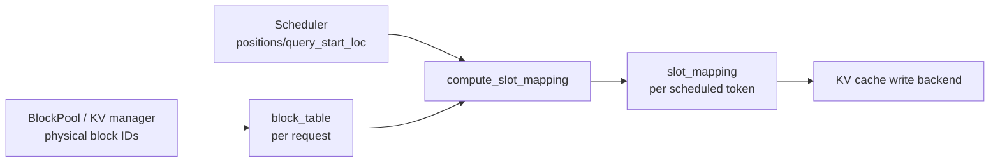

# AI Infra Daily — Day 2（源码导航版）
## `tcgen05.ld` warp collective + vLLM `block_table → slot_mapping`

**预计总用时：55 分钟**

- Blackwell / PTX：20～22 分钟
- KV Cache / vLLM 源码：20～22 分钟
- 面试：10～12 分钟

今天完成两个执行侧闭环：

1. `TMEM base taddr → warp collective tcgen05.ld → per-thread RMEM fragment`
2. `request physical block IDs → block_table → scheduled token → slot_mapping`

---

# 第一章：Blackwell / PTX
## `tcgen05.ld`：不要按普通 thread-private load 去理解

**建议用时：20～22 分钟**

---

## 1. 先看官方 Figure 183 / 184 / 185

<p align="center">
  
  
  
</p>

来源：NVIDIA PTX ISA 9.3，Figure 183 / 184 / 185，用来解释表 52 中不同 shape 的寄存器排布。

原图位置：[Figure 183 — `.32x32b`](https://docs.nvidia.com/cuda/parallel-thread-execution/#tcgen05-mma-fragment-3232b) / [Figure 184 — `.16x64b`](https://docs.nvidia.com/cuda/parallel-thread-execution/#tcgen05-mma-fragment-1664b) / [Figure 185 — `.16x128b`](https://docs.nvidia.com/cuda/parallel-thread-execution/#tcgen05-mma-fragment-16128b)



这张图今天看两件事：

1. `.32x32b` 是一次 **warp collective** 的 data-movement shape；
2. `.x1/.x2` 决定每 thread 最终得到多少个 `.b32` register。

图里 `T0:r0 ... T31:r0` 表示 collective 之后各线程收到的 register slice，不是 32 个线程分别自己随便提供 32 个 TMEM 地址。

---

## 2. 先验：warp 只能访问自己的 32-lane chunk

PTX `9.7.17.8.1 Access restrictions`：

| warp 在 warpgroup 内的位置 | 可访问 TMEM lanes |
|---|---|
| 0 | 0–31 |
| 1 | 32–63 |
| 2 | 64–95 |
| 3 | 96–127 |

<p align="center">
  
  
</p>

但四个 warp 都可以访问全部 columns。

所以：

```text
warp position
    -> 选择可访问的 32-lane chunk

taddr column + instruction shape
    -> 决定 collective movement
```

不要把它简化成“thread i 永远只能访问 lane i”。

---

# 3. PTX 阅读导航

## Step 1 — Access restrictions

### 前置条件

- TMEM 已经完成分配；`.cta_group::1` 是由 **一个 warp** 集体执行 `tcgen05.alloc`，不是某一个线程单独执行。
- 先分清两个编号：thread lane 是线程在线程束内的编号，TMEM lane 是 TMEM 的 128 条 lane，二者不是同一个概念。
- 访问范围看的是 `warp_id_in_warpgroup`，不是 CTA 内的全局 `warp_id`，也不是这个 warp 被安排成 load、compute 还是 store。一个 warpgroup 固定含 4 个连续 warp，因此 `warp_id_in_warpgroup = warp_id % 4`；若 CTA 一共有 6 个 warp，则 warp 4、5 是第二个 warpgroup 中的 0、1 号 warp。

### 本步目的

先确定“当前 warp 合法访问哪 32 条 TMEM lanes”。读完只需要得到 `warpgroup 内位置 -> TMEM lane 范围` 的映射；这一节不负责解释 `taddr`、fragment shape，也不能单凭它推出计算 warp 必须排在 CTA 的前 4 个。

### 你要回答

如果 CTA 有 6 个 warp，`warp_id = 4` 的 warp 属于哪个 warpgroup、在该 warpgroup 中的编号是什么、因此能访问哪 32 条 TMEM lanes？

```text
回答：

标准答案：
```

[直达 9.7.17.8.1 — Access restrictions](https://docs.nvidia.com/cuda/parallel-thread-execution/#tcgen05-tensor-memory-ld-st-access-restrictions)

从：

```text
Not all threads of the CTA...
```

读完整个 4-row 表。

预计：**2 分钟**。

**总结：** 每个warpgroup只能访问自己的warp的TMEM lane,比如warp0 可以访问0-31 lane TMEM；在编程中，如KDA，最好将前四个计算warp在前，也就是组成一个warpgroup而不是加载和写回的warp在前。

---

## Step 2 — `.32x32b` fragment

### 前置条件

- 已经通过 Step 1 知道当前 warp 能访问哪一组 32 条 TMEM lanes。
- 这里先按“位搬运”看图，不解释这些 32 bit 最终代表 `float32`、两个 `float16`，还是其他数据类型。

### 本步目的

确定一次 collective load/store 的形状以及每个线程需要多少个 `.b32` 寄存器。对 `.32x32b`，一个 warp 访问 32 条 TMEM lanes；`.x1` 时每条 lane 搬 32 bit、每线程对应 1 个 `.b32` 寄存器，`.x2` 时重复两次、每线程对应 2 个 `.b32` 寄存器。这里建立的是 TMEM fragment 与 warp 线程寄存器的分发关系，并没有分配 TMEM 或寄存器。

### 你要回答

为什么 Figure 183 不能理解成“thread `i` 永远读取 TMEM lane `i`”？`.32x32b.x2` 相比 `.x1`，整个 warp 额外覆盖的是哪一个维度？

```text
回答：

标准答案：
```


[直达 9.7.17.2.3.1.1 — Matrix fragments for shape `.32x32b`](https://docs.nvidia.com/cuda/parallel-thread-execution/#tcgen05-matrix-fragments-shape-3232b)

从：

```text
A tcgen05{.ld,.st}.32x32b instruction...
```

读到 Figure 183。

预计：**3 分钟**。

你要回答：

`.x1` 与 `.x2` 对每线程寄存器数量有什么变化？

```text
回答：x1和x2的区别就是寄存器的数量区别，在TMEM中表现位col的倍数

标准答案：
```

---

## Step 3 — `tcgen05.ld`

### 前置条件

- TMEM 中已经有可读取的数据，产生这些数据的异步操作已经用对应的完成机制同步好；这和 Step 4 讨论的“`tcgen05.ld` 发出以后何时完成”是两个方向的同步。
- Step 1 已确定可访问的 TMEM lanes，Step 2 已确定 `.shape.num` 对应的 collective fragment 和目标寄存器数量。
- 由于指令带 `.sync.aligned`，整个 warp 必须一致执行，且所有线程必须给出相同的 collective base `taddr`。

### 本步目的

把语法中的三个东西连起来：共同的 `[taddr]` 决定 collective base，`.shape.num` 决定搬运范围，`{r0, r1, ...}` 接收各线程分到的结果。`tcgen05.ld` 的指令接口就是 **TMEM -> 寄存器**，不能把目标直接写成 shared memory；若后续确实需要 SMEM，还要再执行一次寄存器到 SMEM 的 store。

### 你要回答

为什么 32 个线程可以共同完成一次 `tcgen05.ld`，但 32 个线程不能各自传入不同的 `taddr`？如果目标必须落到 SMEM，中间还缺哪一步？

```text
回答：

标准答案：
```

[直达 9.7.17.8.3 — `tcgen05.ld`](https://docs.nvidia.com/cuda/parallel-thread-execution/#tcgen05-instructions-tcgen05-ld)

从 Syntax 开始，读到 description 中：

```text
All the threads in the warp must specify the same value of taddr...
```

然后停。

预计：**4～5 分钟**。

### 最关键一句

同一个 warp 的所有线程必须提供 **相同 `taddr`**，它是 collective load 的 base address。

所以：

```ptx
tcgen05.ld.sync.aligned.32x32b.x2.b32 {r0, r1}, [taddr];
```

不是：

```text
32 threads × 32 private taddr
```

而是：

```text
one warp
+ one common collective base taddr
+ .32x32b.x2 movement rule
-> each thread gets r0/r1
```

---

## Step 4 — 为什么还有 `tcgen05.wait::ld`

### 前置条件

- 当前 warp 已经发出一个或多个异步 `tcgen05.ld`。
- 后续将出现可能与这些 load 冲突的操作，例如 `tcgen05.mma` 覆盖同一片 TMEM，或者生产者 warp 准备通过线程间同步把完成状态交给别的 warp。

### 本步目的

确认 `tcgen05.wait::ld` 等待的是“当前执行线程此前发出的所有 `tcgen05.ld` 完成”，从而阻止后续操作越过尚未完成的 TMEM 读取并产生 anti-dependency hazard。它不是用来等待更早的 `tcgen05.mma` 生产数据；同线程后续直接使用目标寄存器时，真实寄存器依赖本身会保持次序，但不会代替这里需要的 TMEM 内存次序。

### 你要回答

若代码顺序是 `tcgen05.ld [taddr] -> tcgen05.mma [taddr]`，`tcgen05.wait::ld` 解决的具体竞争是什么？它等待的是 `mma` 的完成，还是 `ld` 的完成？

```text
回答：

标准答案：
```

[直达 9.7.17.8.5 — `tcgen05.wait`](https://docs.nvidia.com/cuda/parallel-thread-execution/#tcgen05-instructions-tcgen05-wait)

PTX 指出：

`tcgen05.ld` 是 asynchronous operation；真正要避免后续操作覆盖相关 TMEM 的 anti-dependency hazard，需要 `tcgen05.wait::ld`。

先形成：



今天不深挖所有 fence/mbarrier 组合。

---

# 4. CUTLASS 阅读导航

### 前置条件

- PTX Step 1～3 已经给出当前 warp 可访问的 TMEM lanes、`.32x32b.xN` fragment 分发规则，以及 `tcgen05.ld` 的共同 base `taddr`。
- `tCtAcc` 已经通过真实 `tmem_ptr` 与 accumulator layout 绑定，source 是 TMEM tensor；目标 `tCgC` 只用于推导每线程应接收的 GMEM/RMEM 分区形状。

### 本步目的

把 CuTe 抽象逐层映射回 PTX：`Ld32x32bOp` 选择硬件 load shape/repetition，`make_tmem_copy()` 建立 collective tiled copy，`get_slice(tidx)` 取得当前线程视图，`partition_S/partition_D` 生成对应分区，最后 `cute.copy()` 才真正发出 TMEM→RMEM 搬运。读完要能区分 layout/partition 构造与实际数据移动。

### 你要回答

在这段 CuTe 代码中，哪一行只是构造 copy/layout 视图，哪一行才真正触发 TMEM→RMEM 的数据搬运？

```text
回答：

标准答案：
```

官方 guide：  
<https://docs.nvidia.com/cutlass/4.5.2/media/docs/pythonDSL/mma_docs/tcgen05_programming.html>

搜索标题：

```text
Reading the accumulator from TMEM
```

### 只读这段核心代码

从：

```python
copy_atom_t2r = cute.make_copy_atom(
    tcgen05.Ld32x32bOp(...),
    ...
)
```

到：

```python
tTR_tAcc = thr_copy_t2r.partition_S(tCtAcc)
```

预计：**4～5 分钟，约 20～30 行**。

### 进入前先知道这 4 个对象

```text
Ld32x32bOp
    PTX instruction-level movement atom

make_tmem_copy
    把 copy atom 与 TMEM tensor layout 组合

get_slice(tidx)
    当前 thread 在 collective copy 中的 view

partition_S(tCtAcc)
    当前 thread 对应的 source logical fragment
```

### 不要误解

CuTe 没有把 collective instruction 改造成普通 per-thread load。

它是在算：

> collective instruction 中，thread `tidx` 对应哪部分逻辑 tensor。

### 今天跳过

- epilogue store
- pipeline stages
- block scaling
- `tcgen05.cp`
- CTA-pair

---

# 第二章：KV Cache / State Management
## `block_table → slot_mapping`：只读最普通单卡路径

**建议用时：20～22 分钟**

---

# 1. 先看 vLLM 官方 Figure 4


来源：vLLM 官方博客 Figure 4  
<https://vllm.ai/blog/2025-09-05-anatomy-of-vllm>

今天忽略图里的 continuous batching 教学。

只盯：

```text
CPU:
allocate_slots / physical block IDs
        ↓
slot_mapping

GPU:
reshape_and_cache_flash
        ↓
paged KV memory
```

你现在要理解的是：

> `BlockPool` 分出来的 physical block ID，怎么进一步变成“本轮这个 token 的 K/V 写到哪个 flat slot”。

---

# 2. 阅读前置数据结构

今天只认 4 个输入。

### `block_table`

shape 近似：

```text
[max_num_reqs, max_num_blocks_per_req]
```

每一 row 对应一个 request。

例如：

```text
request A:
[9, 2, 13]
```

表示：

```text
logical block 0 -> physical block 9
logical block 1 -> physical block 2
logical block 2 -> physical block 13
```

### `positions`

当前 scheduled tokens 的 sequence position。

例如：

```text
[6, 7, 8]
```

### `query_start_loc`

把 flattened token batch 分回各 request 的 prefix sum 边界。

例如：

```text
request0 3 tokens
request1 2 tokens

query_start_loc = [0, 3, 5]
```

### `slot_mapping`

本轮每个 scheduled token 对应的 flat physical cache slot。

---

# 3. 先手算普通路径

先假设：

```text
CP world size = 1
blocks_per_kv_block = 1
kernel block size = KV manager block size = B
```

那么 position `p`：

$$
b=\left\lfloor\frac{p}{B}\right\rfloor
$$

$$
o=p\bmod B
$$

$$
\text{physical block}
=\text{block\_table}[r,b]
$$

$$
\text{slot}
=\text{physical block}\times B+o
$$

例：

```text
B = 4
block_table = [9, 2, 13]
positions = [6, 7, 8]
```

得到：

```text
p=6 -> block 2, offset 2 -> slot 10
p=7 -> block 2, offset 3 -> slot 11
p=8 -> block 13, offset 0 -> slot 52
```

---

# 4. 源码阅读导航

固定到同一 vLLM commit：

`80771bbbddf9e5153eea3aca8055049ee5aaaed1`

文件：

`vllm/v1/worker/block_table.py`

总必读约 **125～135 行**，预计 **15～18 分钟**。

本轮阅读时强行做两个 mental simplification：

```text
TOTAL_CP_WORLD_SIZE = 1
BLOCKS_PER_KV_BLOCK = 1
```

先把普通 paged KV 路径看懂，再回头看 CP/hybrid。

---

## Step 1 — 认 `BlockTable` 真正存什么

### 前置条件

- 先知道构造参数的含义：`max_num_reqs` 是最多并发 request 数，`max_num_blocks_per_req` 是每个 request 最多持有的 block 数，`max_num_batched_tokens` 是一轮最多调度的 token 数。
- 本轮先取普通路径 `kernel_block_size == block_size`，因此一个 allocator block 就是一个 kernel block，不展开 hybrid block splitting。

### 本步目的

只认清三个容器的形状、粒度和生命周期：二维 `block_table[row, logical_block]` 保存 request 到 physical block 的映射，`num_blocks_per_row[row]` 保存该行当前有效长度，一维 `slot_mapping[token_idx]` 是本轮 scheduled tokens 的输出缓冲区。构造函数只是在预分配容器，此时还没有把 request 的 `block_ids` 写入行，也没有计算任何 token slot。

### 你要回答

为什么 `block_table` 要按 request 组织成二维，而 `slot_mapping` 只需按本轮 flattened token 组织成一维？分别说出它们的生命周期。

```text
回答：

标准答案：
```

<https://github.com/vllm-project/vllm/blob/80771bbbddf9e5153eea3aca8055049ee5aaaed1/vllm/v1/worker/block_table.py#L57-L128>

### 实际读

- `L57-L90`
- `L112-L128`

约 **51 行**。

### 暂时跳过

`L91-L110` 的 hybrid block splitting 细节。

你只要看到：

```python
self.block_table = ...
self.num_blocks_per_row = ...
self.slot_mapping = ...
```

### 读完回答

为什么：

```text
block_table 是二维
slot_mapping 是一维

```

```text
回答：因为block_table是存储一个最大的能够并行处理的req，而slog_mapping是处理一个req的token 物理slot和逻辑slot。

标准答案：
```

---

## Step 2 — 看 request physical IDs 怎么进 row

### 前置条件

- KV cache manager / block allocator 已经为某个 request 分配好 `block_ids`；本 Step 不负责申请物理块。
- 该 request 已经对应一个 `row_idx`，而 Step 1 的 CPU/NumPy `block_table` 容器已经存在。

### 本步目的

把 allocator 给出的 physical block IDs 写成 `block_table[row_idx, logical_block] = physical_block_id`。`add_row()` 先把有效长度归零再写整行，`append_row()` 从当前有效长度后继续追加；本 Step 只形成 CPU 侧 request-level page table，还没有按 token 计算 `slot_mapping`，也没有写 K/V 数据。

### 你要回答

同一个 `row_idx` 已有 2 个 block 时，调用 `append_row([7, 8], row_idx)` 与调用 `add_row([7, 8], row_idx)` 的结果有什么区别？

```text
回答：

标准答案：
```

<https://github.com/vllm-project/vllm/blob/80771bbbddf9e5153eea3aca8055049ee5aaaed1/vllm/v1/worker/block_table.py#L157-L177>

读：

```text
append_row()
add_row()
```

约 21 行。

忽略 `use_hybrid_blocks=True` 的分支内容，只看普通路径：

```text
block_ids
    -> block_table.np[row_idx, start:end]
```

---

## Step 3 — 看 Python wrapper

### 前置条件

- Step 2 对 `block_table.np` 的更新要在 GPU 侧可见；调用链会通过 `commit_block_table(num_reqs)` 把有效行复制到 `block_table.gpu`。
- scheduler / ModelRunner 已准备好 `num_reqs`、长度为 `num_reqs + 1` 的 `query_start_loc`，以及长度为本轮 token 总数的 `positions`。

### 本步目的

确认 Python wrapper 只做路径选择和参数转发：`NONE` 模式直接返回；普通 KV 的 `TOKEN_TO_KV_SLOT` 模式根据 `positions.shape[0]` 得到 `num_tokens`，再把边界、位置、GPU block table 和 block-size 参数交给 Triton kernel。`position // block_size` 和最终 slot 公式不在 wrapper 中执行。

### 你要回答

如果 `slot_mapping_mode == SlotMappingMode.NONE`，`compute_slot_mapping()` 为什么可以直接返回？这条路径的 `block_table` 还可能被谁当作 state/index 使用？

```text
回答：

标准答案：
```

<https://github.com/vllm-project/vllm/blob/80771bbbddf9e5153eea3aca8055049ee5aaaed1/vllm/v1/worker/block_table.py#L201-L229>

读 `compute_slot_mapping()`，约 29 行。

最重要的是这段：

```python
if self.slot_mapping_mode == SlotMappingMode.NONE:
    # Mamba/GDN groups consume the block table as recurrent state
    # indices and do not use per-token slot mappings.
    return
```

先把这个信息留住：

```text
KV:
request -> block IDs -> token slot mapping

Mamba/GDN:
request -> state/block ID
         -> 不需要 token-level slot mapping
```

后面学 recurrent state 时会回来。

---

## Step 4 — 只读 Triton kernel 的主计算

### 前置条件

- GPU 上的 `block_table` 已包含每个 active request 的 physical block IDs，且每个 scheduled position 所需的 logical block 都已经分配；kernel 不会在缺 block 时临时申请。
- `positions[i]` 给出 flattened token `i` 在其 request 内的逻辑 token 位置；对 request `r`，`query_start_loc[r]` 到 `query_start_loc[r + 1]` 是它在 flattened batch 中的左闭右开区间。
- 无投机推理、无 MTP 的纯 decode 若有 3 个 request 且每个 request 本轮各 1 个 token，则 `query_start_loc = [0, 1, 2, 3]`：最后的 `3` 是总 token 数和 exclusive end，不是第 4 个 request。只要某个 request 本轮有多个 token，这组边界就会改变。
- 本轮继续采用单 CP rank、allocator block size 等于 kernel block size 的简化条件。

### 本步目的

对每个 scheduled token 完成 `position -> logical block/offset -> physical block -> flat KV slot`。输出的 `slot_mapping[i]` 告诉后续 KV-cache 写入逻辑：本轮第 `i` 个 token 的 K/V 应落到哪一个物理 slot。

### 你要回答

在单卡普通路径下，若 `block_size = 16`、某 token 的 `position = 34`，且该 request 的 `block_table` 第 2 个 logical block 存的是 physical block `12`，最终 `slot_mapping` 应是多少？

```text
回答：

标准答案：
```

<https://github.com/vllm-project/vllm/blob/80771bbbddf9e5153eea3aca8055049ee5aaaed1/vllm/v1/worker/block_table.py#L442-L475>

约 34 行。

### 进入前先把复杂量约掉

令：

```text
TOTAL_CP_WORLD_SIZE = 1
TOTAL_CP_RANK = 0
CP_KV_CACHE_INTERLEAVE_SIZE = 1
BLOCKS_PER_KV_BLOCK = 1
```

那么源码中：

```python
virtual_block_indices
virtual_block_offsets
is_local
local_block_offsets
```

会退化成普通：

```text
block_idx = pos // block_size
offset    = pos % block_size
```

最终真正核心就是：

```python
block_numbers = block_table[row, block_idx]
slot_ids = block_numbers * block_size + offset
```

### 本轮明确跳过

- CUDA graph padding branch `L431-L440`
- CP interleave 的物理意义
- JIT `dispatch/compile/warmup`
- `MultiGroupBlockTable`
- hybrid block splitting

这些全部不是今天的目标。

---

## Bonus：只有提前完成才看

`map_to_kernel_blocks()`：

<https://github.com/vllm-project/vllm/blob/80771bbbddf9e5153eea3aca8055049ee5aaaed1/vllm/v1/worker/block_table.py#L239-L266>

它说明：

```text
allocator block size
!=
kernel block size
```

可以通过：

```text
manager block -> multiple kernel blocks
```

解耦。

**如果已经超过 18 分钟，今天直接不看。**

---

# 5. 这两种 metadata 的职责必须分开



### `block_table`

偏 storage ownership / history lookup：

```text
logical block -> physical block
```

### `slot_mapping`

偏本轮 write execution：

```text
current token -> flat physical slot
```

不要把两个都泛称为“page table”。

---

# 6. 读完自检

1. 为什么 `block_table` 生命周期比 `slot_mapping` 长？
2. `query_start_loc` 在 flattened token batch 中解决什么问题？
3. 单卡普通路径下，kernel 的哪几行真正组成 `position → slot`？
4. 为什么 Mamba/GDN 可以保留 block/state index，却直接 `SlotMappingMode.NONE`？

```text
回答：

标准答案：
```

答完就停，不继续追 attention backend。

---

# 第三章：面试

## 口述题：`block_table` 与 `slot_mapping` 为什么都要存在？

```text
回答：

标准答案：

`block_table` 描述 request 的 logical-block→physical-block ownership/mapping，是跨 execution step 维护的 request-level metadata。

`slot_mapping` 则针对当前 forward 中实际 scheduled 的 tokens，根据 request row、position 和 block table 动态计算 token→flat physical cache slot，是 per-step execution metadata。

拆开这两层后：

- allocator 可以独立管理 storage granularity；
- scheduler 每轮只生成当前 token 需要的执行 metadata；
- kernel 不必理解 request-level allocator 状态；
- recurrent state 类型还可以复用 request→storage ID，而跳过 token-level slot mapping。
```

---

## 手撕：LeetCode 560 — Subarray Sum Equals K

要求：$O(n)$。

```text
回答：

标准答案：
```

```cpp
#include <unordered_map>
#include <vector>
using namespace std;

class Solution {
public:
    int subarraySum(vector<int>& nums, int k) {
        unordered_map<long long, int> cnt;
        cnt[0] = 1;

        long long prefix = 0;
        int ans = 0;

        for (int x : nums) {
            prefix += x;

            auto it = cnt.find(prefix - k);
            if (it != cnt.end()) {
                ans += it->second;
            }

            ++cnt[prefix];
        }

        return ans;
    }
};
```

解释必须能说出来：

若：

$$
P_j-P_i=k
$$

则：

$$
P_i=P_j-k
$$

所以遍历当前 prefix 时，只需要统计之前出现过多少个 `prefix-k`。

注意 `cnt[0]=1` 用于处理从 index 0 开始的合法子数组。

---

# Day 2 验收

1. 能看 Figure 183 解释 `.32x32b.x1/x2` 是 warp collective movement，不是 thread-private address loads。
2. 能在 15～18 分钟内按指定范围读完 `BlockTable → compute_slot_mapping → Triton main path`。
3. 能从源码中亲手化简出 `slot = physical_block * block_size + offset`，并知道 Mamba/GDN 为什么可以跳过它。

**下一课不再增加 KV 源码量：Blackwell 进入 `tcgen05.cp`；state 主线开始补 Mamba 最小状态转移先验。**
