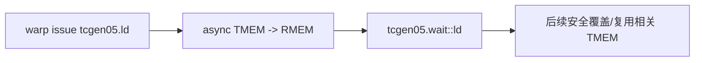
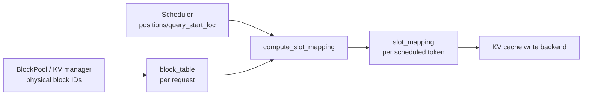

# AI Infra Daily — Day 2（源码导航版）
## `tcgen05.ld` warp collective + vLLM `block_table → slot_mapping`

**预计总用时：55 分钟**

- Blackwell / PTX：20～22 分钟
- KV Cache / vLLM 源码：20～22 分钟
- 面试：10～12 分钟

今天完成两个执行侧闭环：

1. `TMEM base taddr → warp collective tcgen05.ld → per-thread RMEM fragment`
2. `request physical block IDs → block_table → scheduled token → slot_mapping`

---

# 第一章：Blackwell / PTX
## `tcgen05.ld`：不要按普通 thread-private load 去理解

**建议用时：20～22 分钟**

---

## 1. 先看官方 Figure 183


来源：NVIDIA PTX ISA 9.3，Figure 183 — **Matrix Fragment for shape `.32x32b`**  
章节：<https://docs.nvidia.com/cuda/parallel-thread-execution/#matrix-fragments-for-shape-32x32b>

这张图今天看两件事：

1. `.32x32b` 是一次 **warp collective** 的 data-movement shape；
2. `.x1/.x2` 决定每 thread 最终得到多少个 `.b32` register。

图里 `T0:r0 ... T31:r0` 表示 collective 之后各线程收到的 register slice，不是 32 个线程分别自己随便提供 32 个 TMEM 地址。

---

## 2. 先验：warp 只能访问自己的 32-lane chunk

PTX `9.7.17.8.1 Access restrictions`：

| warp 在 warpgroup 内的位置 | 可访问 TMEM lanes |
|---|---|
| 0 | 0–31 |
| 1 | 32–63 |
| 2 | 64–95 |
| 3 | 96–127 |

但四个 warp 都可以访问全部 columns。

所以：

```text
warp position
    -> 选择可访问的 32-lane chunk

taddr column + instruction shape
    -> 决定 collective movement
```

不要把它简化成“thread i 永远只能访问 lane i”。

---

# 3. PTX 阅读导航

## Step 1 — Access restrictions

<https://docs.nvidia.com/cuda/parallel-thread-execution/#tensor-memory-and-register-load-store-instructions-access-restrictions>

从：

```text
Not all threads of the CTA...
```

读完整个 4-row 表。

预计：**2 分钟**。

---

## Step 2 — `.32x32b` fragment

<https://docs.nvidia.com/cuda/parallel-thread-execution/#matrix-fragments-for-shape-32x32b>

从：

```text
A tcgen05{.ld,.st}.32x32b instruction...
```

读到 Figure 183。

预计：**3 分钟**。

你要回答：

```text
.x1 与 .x2 对每线程寄存器数量有什么变化？
```

---

## Step 3 — `tcgen05.ld`

<https://docs.nvidia.com/cuda/parallel-thread-execution/#tensorcore-5th-generation-instructions-tcgen05-ld>

从 Syntax 开始，读到 description 中：

```text
All the threads in the warp must specify the same value of taddr...
```

然后停。

预计：**4～5 分钟**。

### 最关键一句

同一个 warp 的所有线程必须提供 **相同 `taddr`**，它是 collective load 的 base address。

所以：

```ptx
tcgen05.ld.sync.aligned.32x32b.x2.b32 {r0, r1}, [taddr];
```

不是：

```text
32 threads × 32 private taddr
```

而是：

```text
one warp
+ one common collective base taddr
+ .32x32b.x2 movement rule
-> each thread gets r0/r1
```

---

## Step 4 — 为什么还有 `tcgen05.wait::ld`

PTX 同一章 synchronization 部分明确指出：

`tcgen05.ld` 是 asynchronous operation；真正要避免后续操作覆盖相关 TMEM 的 anti-dependency hazard，需要 `tcgen05.wait::ld`。

先形成：



今天不深挖所有 fence/mbarrier 组合。

---

# 4. CUTLASS 阅读导航

官方 guide：  
<https://docs.nvidia.com/cutlass/4.5.2/media/docs/pythonDSL/mma_docs/tcgen05_programming.html>

搜索标题：

```text
Reading the accumulator from TMEM
```

### 只读这段核心代码

从：

```python
copy_atom_t2r = cute.make_copy_atom(
    tcgen05.Ld32x32bOp(...),
    ...
)
```

到：

```python
tTR_tAcc = thr_copy_t2r.partition_S(tCtAcc)
```

预计：**4～5 分钟，约 20～30 行**。

### 进入前先知道这 4 个对象

```text
Ld32x32bOp
    PTX instruction-level movement atom

make_tmem_copy
    把 copy atom 与 TMEM tensor layout 组合

get_slice(tidx)
    当前 thread 在 collective copy 中的 view

partition_S(tCtAcc)
    当前 thread 对应的 source logical fragment
```

### 不要误解

CuTe 没有把 collective instruction 改造成普通 per-thread load。

它是在算：

> collective instruction 中，thread `tidx` 对应哪部分逻辑 tensor。

### 今天跳过

- epilogue store
- pipeline stages
- block scaling
- `tcgen05.cp`
- CTA-pair

---

# 第二章：KV Cache / State Management
## `block_table → slot_mapping`：只读最普通单卡路径

**建议用时：20～22 分钟**

---

# 1. 先看 vLLM 官方 Figure 4


来源：vLLM 官方博客 Figure 4  
<https://vllm.ai/blog/2025-09-05-anatomy-of-vllm>

今天忽略图里的 continuous batching 教学。

只盯：

```text
CPU:
allocate_slots / physical block IDs
        ↓
slot_mapping

GPU:
reshape_and_cache_flash
        ↓
paged KV memory
```

你现在要理解的是：

> `BlockPool` 分出来的 physical block ID，怎么进一步变成“本轮这个 token 的 K/V 写到哪个 flat slot”。

---

# 2. 阅读前置数据结构

今天只认 4 个输入。

### `block_table`

shape 近似：

```text
[max_num_reqs, max_num_blocks_per_req]
```

每一 row 对应一个 request。

例如：

```text
request A:
[9, 2, 13]
```

表示：

```text
logical block 0 -> physical block 9
logical block 1 -> physical block 2
logical block 2 -> physical block 13
```

### `positions`

当前 scheduled tokens 的 sequence position。

例如：

```text
[6, 7, 8]
```

### `query_start_loc`

把 flattened token batch 分回各 request 的 prefix sum 边界。

例如：

```text
request0 3 tokens
request1 2 tokens

query_start_loc = [0, 3, 5]
```

### `slot_mapping`

本轮每个 scheduled token 对应的 flat physical cache slot。

---

# 3. 先手算普通路径

先假设：

```text
CP world size = 1
blocks_per_kv_block = 1
kernel block size = KV manager block size = B
```

那么 position `p`：

$$
b=\left\lfloor\frac{p}{B}\right\rfloor
$$

$$
o=p\bmod B
$$

$$
\text{physical block}
=\text{block\_table}[r,b]
$$

$$
\text{slot}
=\text{physical block}\times B+o
$$

例：

```text
B = 4
block_table = [9, 2, 13]
positions = [6, 7, 8]
```

得到：

```text
p=6 -> block 2, offset 2 -> slot 10
p=7 -> block 2, offset 3 -> slot 11
p=8 -> block 13, offset 0 -> slot 52
```

---

# 4. 源码阅读导航

固定到同一 vLLM commit：

`80771bbbddf9e5153eea3aca8055049ee5aaaed1`

文件：

`vllm/v1/worker/block_table.py`

总必读约 **125～135 行**，预计 **15～18 分钟**。

本轮阅读时强行做两个 mental simplification：

```text
TOTAL_CP_WORLD_SIZE = 1
BLOCKS_PER_KV_BLOCK = 1
```

先把普通 paged KV 路径看懂，再回头看 CP/hybrid。

---

## Step 1 — 认 `BlockTable` 真正存什么

<https://github.com/vllm-project/vllm/blob/80771bbbddf9e5153eea3aca8055049ee5aaaed1/vllm/v1/worker/block_table.py#L48-L113>

### 实际读

- `L48-L90`
- `L105-L113`

约 **52 行**。

### 暂时跳过

`L91-L103` 的 hybrid block splitting 细节。

你只要看到：

```python
self.block_table = ...
self.num_blocks_per_row = ...
self.slot_mapping = ...
```

### 读完回答

为什么：

```text
block_table 是二维
slot_mapping 是一维
```

---

## Step 2 — 看 request physical IDs 怎么进 row

<https://github.com/vllm-project/vllm/blob/80771bbbddf9e5153eea3aca8055049ee5aaaed1/vllm/v1/worker/block_table.py#L147-L166>

读：

```text
append_row()
add_row()
```

约 20 行。

忽略 `use_hybrid_blocks=True` 的分支内容，只看普通路径：

```text
block_ids
    -> block_table.np[row_idx, start:end]
```

---

## Step 3 — 看 Python wrapper

<https://github.com/vllm-project/vllm/blob/80771bbbddf9e5153eea3aca8055049ee5aaaed1/vllm/v1/worker/block_table.py#L186-L213>

读 `compute_slot_mapping()`，约 28 行。

最重要的是这段：

```python
if self.slot_mapping_mode == SlotMappingMode.NONE:
    # Mamba/GDN groups consume the block table as recurrent state
    # indices and do not use per-token slot mappings.
    return
```

先把这个信息留住：

```text
KV:
request -> block IDs -> token slot mapping

Mamba/GDN:
request -> state/block ID
         -> 不需要 token-level slot mapping
```

后面学 recurrent state 时会回来。

---

## Step 4 — 只读 Triton kernel 的主计算

<https://github.com/vllm-project/vllm/blob/80771bbbddf9e5153eea3aca8055049ee5aaaed1/vllm/v1/worker/block_table.py#L409-L440>

约 32 行。

### 进入前先把复杂量约掉

令：

```text
TOTAL_CP_WORLD_SIZE = 1
TOTAL_CP_RANK = 0
CP_KV_CACHE_INTERLEAVE_SIZE = 1
BLOCKS_PER_KV_BLOCK = 1
```

那么源码中：

```python
virtual_block_indices
virtual_block_offsets
is_local
local_block_offsets
```

会退化成普通：

```text
block_idx = pos // block_size
offset    = pos % block_size
```

最终真正核心就是：

```python
block_numbers = block_table[row, block_idx]
slot_ids = block_numbers * block_size + offset
```

### 本轮明确跳过

- CUDA graph padding branch `L399-L408`
- CP interleave 的物理意义
- JIT `dispatch/compile/warmup`
- `MultiGroupBlockTable`
- hybrid block splitting

这些全部不是今天的目标。

---

## Bonus：只有提前完成才看

`map_to_kernel_blocks()`：

<https://github.com/vllm-project/vllm/blob/80771bbbddf9e5153eea3aca8055049ee5aaaed1/vllm/v1/worker/block_table.py#L221-L246>

它说明：

```text
allocator block size
!=
kernel block size
```

可以通过：

```text
manager block -> multiple kernel blocks
```

解耦。

**如果已经超过 18 分钟，今天直接不看。**

---

# 5. 这两种 metadata 的职责必须分开



### `block_table`

偏 storage ownership / history lookup：

```text
logical block -> physical block
```

### `slot_mapping`

偏本轮 write execution：

```text
current token -> flat physical slot
```

不要把两个都泛称为“page table”。

---

# 6. 读完自检

1. 为什么 `block_table` 生命周期比 `slot_mapping` 长？
2. `query_start_loc` 在 flattened token batch 中解决什么问题？
3. 单卡普通路径下，kernel 的哪几行真正组成 `position → slot`？
4. 为什么 Mamba/GDN 可以保留 block/state index，却直接 `SlotMappingMode.NONE`？

答完就停，不继续追 attention backend。

---

# 第三章：面试

## 口述题：`block_table` 与 `slot_mapping` 为什么都要存在？

### 标准答案

`block_table` 描述 request 的 logical-block→physical-block ownership/mapping，是跨 execution step 维护的 request-level metadata。

`slot_mapping` 则针对当前 forward 中实际 scheduled 的 tokens，根据 request row、position 和 block table 动态计算 token→flat physical cache slot，是 per-step execution metadata。

拆开这两层后：

- allocator 可以独立管理 storage granularity；
- scheduler 每轮只生成当前 token 需要的执行 metadata；
- kernel 不必理解 request-level allocator 状态；
- recurrent state 类型还可以复用 request→storage ID，而跳过 token-level slot mapping。

---

## 手撕：LeetCode 560 — Subarray Sum Equals K

要求：$O(n)$。

```cpp
#include <unordered_map>
#include <vector>
using namespace std;

class Solution {
public:
    int subarraySum(vector<int>& nums, int k) {
        unordered_map<long long, int> cnt;
        cnt[0] = 1;

        long long prefix = 0;
        int ans = 0;

        for (int x : nums) {
            prefix += x;

            auto it = cnt.find(prefix - k);
            if (it != cnt.end()) {
                ans += it->second;
            }

            ++cnt[prefix];
        }

        return ans;
    }
};
```

解释必须能说出来：

若：

$$
P_j-P_i=k
$$

则：

$$
P_i=P_j-k
$$

所以遍历当前 prefix 时，只需要统计之前出现过多少个 `prefix-k`。

注意 `cnt[0]=1` 用于处理从 index 0 开始的合法子数组。

---

# Day 2 验收

1. 能看 Figure 183 解释 `.32x32b.x1/x2` 是 warp collective movement，不是 thread-private address loads。
2. 能在 15～18 分钟内按指定范围读完 `BlockTable → compute_slot_mapping → Triton main path`。
3. 能从源码中亲手化简出 `slot = physical_block * block_size + offset`，并知道 Mamba/GDN 为什么可以跳过它。

**下一课不再增加 KV 源码量：Blackwell 进入 `tcgen05.cp`；state 主线开始补 Mamba 最小状态转移先验。**
