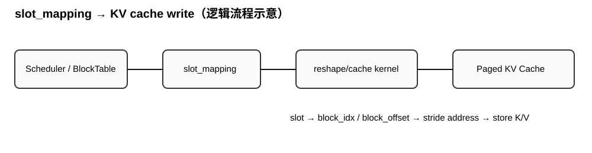

# AI Infra Daily --- Day 3

## `tcgen05.cp`：SMEM→TMEM + vLLM `slot_mapping` 真正落到 KV Cache

**总预算：约 55 分钟**：Blackwell/PTX 22 分钟；KV Cache 22 分钟；面试 11
分钟。

今天不扩支线。前两天已经建立 TMEM 地址/`ld` 语义，以及
`BlockPool → block_table → slot_mapping`。今天各往前走一步：Blackwell 看
**什么情况下数据从 SMEM 直接进 TMEM**；vLLM 看 **`slot_mapping`
被谁消费、怎样变成真实 KV cache 写地址**。

# Part 1 --- Blackwell / PTX：`tcgen05.cp`

## 进入主题前：先知道这段在干什么（2 分钟）

前两天你看到 TMEM 主要承担 accumulator；但 `tcgen05` 还提供 SMEM→TMEM
的专用数据路径。`tcgen05.cp` 不是普通 `ld/st` 的替代品：它按 Tensor Core
所需矩阵形状组织搬运，并可在特定低比特格式下顺便做 decompression。

``` text
GMEM --TMA--> SMEM --tcgen05.cp--> TMEM --> tcgen05 consumer
```

进入 PTX
只盯：`SMEM descriptor`、`taddr`、`shape`、`cta_group`、`decompression`。今天不展开低比特编码。

## PTX 导航（约 10 分钟）

### Step 1 — 数据移动总入口

#### 前置条件

- 先把两段 copy 分开：TMA / `cp.async.bulk.tensor` 已经把所需 tile 从 GMEM 放进 SMEM；`tcgen05.cp` 接手的是下一段 SMEM→TMEM。
- 目的 TMEM columns 已经完成 allocation，后续能够提供合法 `taddr`；本 Step 暂时不展开 producer completion 和 TMEM consumer 同步。

#### 本步目的

只确认 `tcgen05.cp` 在整个数据流中的方向与边界：source 是 shared memory，destination 是 Tensor Memory，而且操作是异步发起。读完不要把它误认为 GMEM→SMEM 的 TMA，也不要推断所有 MMA operand 都必须经过它。

#### 你要回答

把 `GMEM --TMA--> SMEM --tcgen05.cp--> TMEM` 中的两次搬运分别写出 source、destination 和发起者；为什么 `tcgen05.cp` 不能替代前面的 TMA？

```text
回答：不知道，这里没说，我猜测可能还是多级cache的原因是一样的，因为smem更大复用率更高，会提升计算密度，而TMEM太小，频繁的读取导致计算密度低。

标准答案：
```

[直达 9.7.17.9 — Tensor Memory Data Movement Instructions](https://docs.nvidia.com/cuda/parallel-thread-execution/#tcgen05-data-movement-instructions)

只读标题下的开头一段。PTX 在这里把 `tcgen05.cp` 定义为 shared memory 到
Tensor Memory 的异步 copy。

``` text
cp.async.bulk.tensor / TMA : GMEM → SMEM
tcgen05.cp                 : SMEM → TMEM
```

### Step 2 — `tcgen05.cp` 指令正文

#### 前置条件

- SMEM 中已经存在按 Tensor Core 要求组织的 source tile，并能构造描述该矩阵的 64-bit `s-desc`；TMEM destination 已有 base `taddr`。
- `tcgen05.cp` 是 single-thread issue：由一个线程发出 collective data movement，不要求整个 warp 像 `tcgen05.ld.sync.aligned` 那样共同执行；同一 kernel 内所有 `tcgen05` 指令仍必须使用一致的 `.cta_group`。

#### 本步目的

把语法中的职责严格拆开：`s-desc` 解释 SMEM source，`.shape` 规定硬件搬运 footprint，`.cta_group` 决定访问一个还是一对 CTA 的 TMEM，`[taddr]` 指向 TMEM destination。此步只说明如何发起 copy，不把“已发出”当成“consumer 已可安全使用”。

#### 你要回答

在 `tcgen05.cp.cta_group::1.128x256b [taddr], s-desc` 中，哪个 operand 描述 SMEM 源矩阵，哪个 operand 指向 TMEM 目的地？`.shape` 与 `s-desc` 为什么不能互换职责？

```text
回答：

标准答案：
```

[直达 9.7.17.9.2 — `tcgen05.cp`](https://docs.nvidia.com/cuda/parallel-thread-execution/#tcgen05-instructions-tcgen05-cp)

从 Syntax 开始，只抓 `taddr`、`s-desc`、`shape`、`cta_group`。大量 shape
表先不背。你要形成的结论是：destination 用 TMEM address 描述；source
是描述 Tensor Core 所需 SMEM tile 的 descriptor，所以它天然不是 byte-copy。

### Step 3 — Optional Decompression

#### 前置条件

- 只有指令同时指定合法的 `.src_fmt` 与 `.dst_fmt` 时，copy 才会执行格式展开；普通 dense F16/BF16 copy 不自动经过这条低比特 decompression 路径。
- source 在 SMEM 中必须满足 PTX 对 4-bit/6-bit packed vector 及 padding 的布局约束，destination 则按 8-bit 格式落入 TMEM。

#### 本步目的

只建立“decompression 可以融合进 SMEM→TMEM copy”这一能力边界，并通过 Figure 194 看清 4-bit packed source 到 8-bit destination 的宽度变化。今天不计算单个编码位，也不把 optional 路径当作 `tcgen05.cp` 的通用必做步骤。

#### 你要回答

什么条件下 `tcgen05.cp` 才会做 4/6-bit 到 8-bit 的 decompression？普通 F16/BF16 的 SMEM→TMEM copy 是否自动走这条路径？

```text
回答：

标准答案：
```

[直达 9.7.17.9.1 — Optional Decompression](https://docs.nvidia.com/cuda/parallel-thread-execution/#tcgen05-optional-decompression)

只扫开头一句：4-bit/6-bit custom floating types 可以在 copy 过程中展开到
8-bit。

最后直达并只看第一张 4-bit→8-bit 官方示意图：
[Figure 194 — Decompression from 4-bit to 8-bit](https://docs.nvidia.com/cuda/parallel-thread-execution/#tcgen05-decompression-4b8b)。


**明确跳过**：所有 4/6-bit bit-level encoding、block scaling、MMA
instruction descriptor、CTA-pair shape 细节、完整 mbarrier 协议。

## CUTLASS 官方数据流（4 分钟）

### 前置条件

- PTX 三步已经确认 `tcgen05.cp` 是可选的 SMEM→TMEM 异步路径，而 TMA 负责 GMEM→SMEM。
- 这里只观察 operand residency 与数据流，不进入具体 GEMM tile、pipeline stage 或同步实现。

### 本步目的

把 `tcgen05.cp` 放回完整 MMA 数据流，判断某个 operand 是以 SMEM descriptor 直接供 MMA 使用，还是先复制到 TMEM。读完要得到“是否需要 SMEM→TMEM 取决于 operand source / MMA kind / 数据格式”的边界，不能把刚学到的指令扩成所有 dense GEMM 的必经路径。

### 你要回答

在 `A/B: GMEM → SMEM → MMA` 与 `C/D: TMEM → RMEM → GMEM` 两条路径中，哪一条默认不需要 `tcgen05.cp`？什么条件会让 operand 额外经过 SMEM→TMEM？

```text
回答：

标准答案：
```

<https://docs.nvidia.com/cutlass/4.5.2/media/docs/pythonDSL/mma_docs/tcgen05_programming.html>

先看 `Global Memory (GMEM) to MMA data flow overview`。只追：

``` text
A/B : GMEM → SMEM → MMA
C/D :          TMEM → RMEM → GMEM
```

注意：dense F16/BF16 常规路径里 A/B 可以直接以 SMEM descriptor 给
MMA。因此学了 `tcgen05.cp` 不等于每个 Blackwell GEMM 都必须
SMEM→TMEM；是否使用取决于 operand source / MMA kind / low-bit 等设计。

## CuTe 对照（约 6 分钟）

### 前置条件

- 已经能分别解释 PTX 的 `[taddr]`、`s-desc` 和 `.shape`，并且手上有描述 source SMEM tile 与 destination TMEM tile 的 CuTe tensors/layouts。
- 这里的 `CopyAtom/TiledCopy` 是 collective mapping 描述；创建这些对象本身不会搬运数据。

### 本步目的

追清 CuTe 怎样把逻辑 tensor 分区降到合法 `tcgen05.cp`：`make_s2t_copy()` 组合 copy atom 与 TMEM layout，`get_s2t_smem_desc_tensor()` 产生硬件需要的 SMEM descriptor view，最终 copy 调用才发出指令。读完应能从 wrapper 对象反查 source、destination 与 PTX shape，而不是把 layout 当成 storage 或执行结果。

### 你要回答

`make_s2t_copy()` 和最终的 `cute.copy(...)` 分别处在“描述映射”还是“执行搬运”阶段？哪一步才真正可能发出 `tcgen05.cp`？

```text
回答：

标准答案：
```

进入前先知道：PTX 给的是 `taddr + s-desc + shape`；CuTe 负责把"哪个 SMEM
tensor tile 对应哪个 TMEM tensor tile"编码成 `CopyAtom/TiledCopy`。

API：<https://docs.nvidia.com/cutlass/latest/media/docs/pythonDSL/cute_dsl_api/cute_nvgpu_tcgen05.html>

只搜索并读： - `make_s2t_copy(...)` - `get_s2t_smem_desc_tensor(...)` -
遇到 broadcast 时扫 `append_s2t_broadcast_mode(...)`

``` text
SMEM Tensor + TMEM Tensor + S2T CopyAtom
                    ↓
                TiledCopy
                    ↓
                tcgen05.cp
```

最容易误解：CuTe layout 描述 collective copy 如何覆盖逻辑
tensor，**layout 本身不是一次数据搬运**。

# Part 2 --- vLLM：`slot_mapping` 怎么真正写进 KV Cache

## 进入主题前（2 分钟）

Day 2 到 `slot_mapping`
就停了：`position → logical block → physical block → flat slot`。今天闭环
execution side：attention backend 拿到本轮 K/V 后，怎样消费 flat
slot，把 token 写进 paged cache tensor。

只盯四个对象：`key/value`、`slot_mapping`、`block_size`、`key_cache/value_cache`。

``` text
block_idx    = slot // block_size
block_offset = slot %  block_size
```

## 前置数据结构（3 分钟）

`key/value`：当前 forward 新算出的
`[num_tokens, num_kv_heads, head_size]`。

`slot_mapping`：`[num_tokens]`；第 `t` 个值告诉 kernel token `t`
应写到哪个 flat cache slot。

普通 Triton cache 主路径先看作
`[num_blocks, block_size, num_heads, head_size]`。

两个 invariant： 1. `slot < 0` 是 padding/无效 token，不能写 cache。 2.
`slot_mapping` 只决定"哪一 block、哪一 slot"；head/dim 内部 layout 由
cache tensor stride 决定。

## 最小流程



``` text
BlockTable.compute_slot_mapping()
        ↓
slot_mapping
        ↓
attention backend
        ↓
triton_reshape_and_cache_flash(...)
        ↓
reshape_and_cache_kernel_flash
        ↓
slot → (block_idx, block_offset)
        ↓
stride address
        ↓
tl.store K/V
```

## 源码阅读导航（15 分钟，约 120 行）

文件：`vllm/v1/attention/ops/triton_reshape_and_cache_flash.py`

<https://github.com/vllm-project/vllm/blob/main/vllm/v1/attention/ops/triton_reshape_and_cache_flash.py>

### Step 1：kernel 地址主路径（8 分钟）

#### 前置条件

- Day 2 已经生成 GPU 上的一维 `slot_mapping[num_tokens]`；`slot_mapping[token_idx]` 与当前 forward 的 `key[token_idx]`、`value[token_idx]` 指向同一个 scheduled token。
- 本 Step 只走普通非 head-major、非 per-token-head quantization 路径，把 cache 看成 `[num_blocks, block_size, num_kv_heads, head_size]`，所有 stride 都由 wrapper 传入。

#### 本步目的

追完一次真实写入：每个 Triton program 先取 `token_idx` 和 `slot_idx`，负 slot 立即跳过；合法 slot 拆成 `block_idx` 与 `block_offset`，再叠加 head/dim stride 形成 K/V 目标地址，最后执行 `tl.store`。读完应能从一个 flat slot 推到 cache tensor 中的物理位置，而不需要回看 `Request` 或 `BlockPool`。

#### 你要回答

当 `slot_idx = -1` 时 kernel 为什么必须在计算 `block_idx` 前直接返回？当 `slot_idx >= 0` 时，`block_idx` 和 `block_offset` 分别由什么公式得到？

```text
回答：

标准答案：
```

搜索：

``` python
def reshape_and_cache_kernel_flash(
```

从参数读到第一次 K/V `tl.store(...)` 完成后停止。只追：

``` text
token_idx
slot_idx
slot_idx < 0
block_idx
block_offset
普通 4D layout 的 tgt_idx_k/tgt_idx_v
key_load/value_load
tl.store
```

跳过：head-major、FP8 scale、TILE_SIZE 调优、per-token-head
quantization、DiffKV、ROCm/XPU。

普通 4D layout 的目标地址本质：

$$
addr = base
+ block\_idx \cdot stride_{block}
+ block\_offset \cdot stride_{page}
+ head \cdot stride_{head}
+ dim
$$

### Step 2：wrapper launch contract（5 分钟）

#### 前置条件

- 调用方已经提供同一批 token 的 `key/value/slot_mapping`，以及实际的 `key_cache/value_cache` tensor；前三者的 token 维必须对齐。
- kernel 不自行猜测 cache layout，所以 wrapper 必须从 tensor shape/stride 中取得 `block_size`、block/page/head stride，并选择普通 4D 或 head-major 分支。

#### 本步目的

确认 wrapper 怎样把 PyTorch tensor contract 降成 Triton launch contract：计算 layout 参数和二维 grid，传入所有 pointer、stride、dtype/scale 及 constexpr。读完要知道 grid 的第一维对应 `slot_mapping` 中的 token，第二维覆盖该 token 的 head×dim 数据。

#### 你要回答

为什么 kernel 可以只接收 `slot_mapping`、strides 和 cache tensor，而不需要知道 `BlockPool` 或 `Request`？如果 cache 改成 head-major，改变的是 `slot_mapping` 还是 stride/layout 参数？

```text
回答：

标准答案：
```

搜索：

``` python
def triton_reshape_and_cache_flash(
```

只读函数参数 → `block_size/strides` → grid → kernel launch。确认 wrapper
把 tensor strides 与 `slot_mapping` 一起交给 kernel，所以 kernel
不需要知道 `BlockPool`、`Request`、`Scheduler`。

### Step 3：backend 调用点（2 分钟）

#### 前置条件

- 当前走 decoder 或 cross-attention 的 KV-cache update 路径；encoder-only 分支不写 paged KV cache。
- attention backend 已拿到本层新产生的 `key/value`、该层 `kv_cache` 和 metadata 中的 `slot_mapping`；本 Step 先看普通非 per-token-head quantization 分支。

#### 本步目的

把高层调用与前两步接上：backend 将统一 `kv_cache` view 拆成 `key_cache/value_cache`，再把 `key/value/cache/slot_mapping/dtype/scale` 传给 wrapper。读到调用结束就停，确认 cache-write kernel 的输入已经齐全；attention 读取和 scheduler 逻辑不在这个调用点展开。

#### 你要回答

backend 调用 `triton_reshape_and_cache_flash()` 时，`slot_mapping` 与 `key/value` 的第 0 维为什么必须对应同一批 token？如果是 encoder-only attention，为什么这条 KV-cache update 不执行？

```text
回答：

标准答案：
```

文件：`vllm/v1/attention/backends/triton_attn.py`

<https://github.com/vllm-project/vllm/blob/main/vllm/v1/attention/backends/triton_attn.py>

搜索 `triton_reshape_and_cache_flash(`，只看调用点周围，确认传入
`key/value/key_cache/value_cache/slot_mapping/dtype/scale`，然后停止。

## 自检

1.  为什么 `slot_mapping` 能解耦 Scheduler/BlockPool 与 cache-write
    kernel？
2.  为什么 `slot_mapping` 一维，而 cache tensor 可以是四维/五维？
3.  为什么 `slot < 0` 必须最先处理？
4.  cache 改成 head-major 后，为什么 `slot_mapping` 语义可以不变？

```text
回答：

标准答案：
```

# Part 3 --- 面试（约 11 分钟）

## 口述：为什么 allocator block size 与 kernel layout 可以解耦？

```text
回答：

标准答案：
```

allocator 关心 request ownership、复用、eviction、fragmentation；kernel
关心 tensor layout 和访问效率。中间用
`block_table / slot_mapping / stride metadata`
翻译。只要执行侧最终得到正确
`(physical block, in-block offset)`，allocator 不需要知道 head/dim
排列，kernel 也不需要理解 request/refcount/hash。

追问：为什么不让 kernel 直接查
Request/BlockPool？因为会把高层动态状态泄漏到设备执行层，metadata 与
CPU/GPU 边界复杂，也更难 CUDA Graph 化。

## 手撕：CUDA `float4` copy + tail

``` cpp
#include <cuda_runtime.h>

__global__ void copy_float4(
    const float* __restrict__ src,
    float* __restrict__ dst,
    int n) {
    int tid = blockIdx.x * blockDim.x + threadIdx.x;
    int vec_n = n / 4;
    if (tid < vec_n) {
        reinterpret_cast<float4*>(dst)[tid] =
            reinterpret_cast<const float4*>(src)[tid];
    }
    int tail = vec_n * 4;
    if (tid == 0) {
        for (int i = tail; i < n; ++i)
            dst[i] = src[i];
    }
}
```

```text
回答：

标准答案：
```

必须主动补：这个版本假设 `src/dst` 满足 `float4` 对齐；任意偏移 pointer
不一定满足。

# 今日验收

1.  能一句话区分 `TMA GMEM→SMEM` 与
    `tcgen05.cp SMEM→TMEM`，并知道后者不是每个 dense GEMM 必经。
2.  能指出 `slot → block_idx/block_offset → stride address → tl.store`
    完整写路径。
3.  能解释为什么 KV tensor layout 改变时 `slot_mapping` 的语义仍可不变。

**下一课：`tcgen05.mma` operand/accumulator 数据流与 single-thread
issue；KV/state 侧进入 paged cache read path。**
