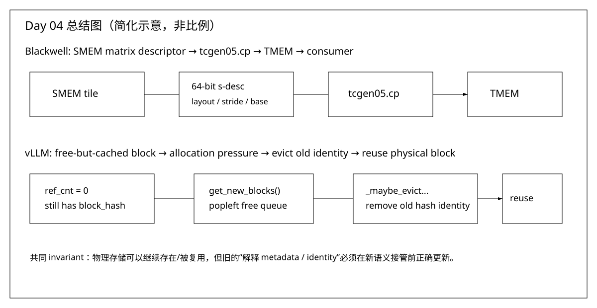

# Day 04 — Blackwell `tcgen05.cp` 与 KV Block Hash 生命周期

日期：2026-08-31  
预计学习时间：45~60 分钟  
承接：前面已经建立 TMEM 的物理组织、地址与 allocation 基础；KV 侧已经知道 block/prefix cache 的基本角色。今天不再扩概念面，而是回答两个具体问题：**数据怎样以硬件规定的 shape 从 SMEM 进入 TMEM？一个已经 free 的 KV block 为什么还能保持 cache identity，又在什么时候真正 eviction？**

## 今日目标

学完后你应该能做到三件事：第一，看到 `tcgen05.cp.cta_group.shape [taddr], s-desc` 时能把每个 operand/qualifier 放回真实数据通路；第二，解释 `.shape` 为什么描述的是 TMEM 的 `lane × bits-across-columns` 而不是普通二维 tensor shape；第三，沿着 vLLM `get_new_blocks() → _maybe_evict_cached_block()` 解释“free、cached、evicted、reused”四个状态为什么不是同义词。



怎么看：上半部分只表达 `s-desc` 负责解释 SMEM 源矩阵、`.shape` 规定硬件数据移动形状、`taddr` 指向 TMEM 目的地；下半部分只表达一个 `ref_cnt=0` 的 block 可以仍有旧 prefix identity，直到它真的被 allocator 取出复用时才清理旧 hash。最容易误解的是把“free”直接等价成“cache metadata 已删除”。

## 第一部分：Blackwell `tcgen05.cp`（约 22 分钟）

### 1. 为什么现在看 `tcgen05.cp`

前面的 TMEM allocation 只解决“TMEM 空间属于谁、地址怎么表示”，并没有解决“数据怎样进去”。真正进入 MMA pipeline 前，你必须把 **TMEM address、SMEM matrix descriptor、data movement shape** 串成一次真实的数据移动，否则后面看 CuTe 的 TMEM copy atom 时只会看到模板参数，看不到硬件语义。

这一节不要求你把整个 `tcgen05` 家族读完。今天只建立一条链：`SMEM tile → s-desc → tcgen05.cp → taddr/TMEM`。同步和 producer/consumer pipeline 只建立边界，下节再展开。

### 2. 阅读前置条件

- **TMEM address**：把它当成 TMEM 中的逻辑目的地址；今天只需要知道 `taddr` 指向 copy 的目的位置，不重新展开 allocation 编码。
- **SMEM matrix descriptor**：它不是数据，而是一个 64-bit descriptor，用来告诉 Tensor Core 路径怎样解释 shared-memory 中的源矩阵。
- **CTA group**：今天只需要知道 `.cta_group::1/2` 决定一次指令访问当前 CTA 还是当前+peer CTA 的 TMEM；同一 kernel 中 `tcgen05` 的 `.cta_group` 必须一致。
- **TMEM lane/column 心智模型**：这里的 data movement shape 不是 GEMM 的 `M×N×K`，而是“覆盖多少 TMEM lanes × 每个 lane 横跨多少 bits”。

如果这四条能在脑中各说一句，就够进入原文；不需要先掌握 `tcgen05.mma`。

### 3. 读完必须达到什么目的

读完下面 8~10 分钟原文后，你必须能回答：

1. `s-desc` 与 `taddr` 分别描述 source 的什么、destination 的什么？
2. `.128x256b` 中的 `128` 和 `256b` 分别对应 TMEM 的哪个维度？
3. 为什么 `tcgen05.cp` 不是“给一个 SMEM pointer + byte count”的普通 memcpy？
4. `.cta_group::2` 改变的是一次指令覆盖的 CTA/TMEM 范围，而不是把 `.shape` 简单乘二。

```text
回答：

标准答案：
```

### 4. 精确阅读导航

#### 4.1 先看 Data Movement Shape：3 分钟

##### 前置条件

- 已经知道 TMEM 的逻辑坐标是 lane × column，每个 `(lane, column)` 位置承载 32 bit；这里的 lane 不是 thread lane。
- 暂时不考虑 SMEM descriptor、数据类型和发出指令的线程，只看一条 copy 在 TMEM 坐标系中覆盖多大范围。

##### 本步目的

建立 `.shape = lane × bits-across-columns` 的唯一读法，并认出 `tcgen05.cp` 支持的合法 shape 集合。读完 `.128x256b` 应直接翻译成“128 条 TMEM lanes、每条 lane 横跨 256 bit”，不能把它读成普通 tensor 的 128×256 个元素。

##### 你要回答

看到 `.128x256b` 时，`128` 和 `256b` 分别是什么；为什么不能读成 128×256 个元素？

```text
回答：

标准答案：
```

阅读范围：PTX ISA 9.3，§9.7.17.2.3 `Data Movement Shape`。只看 shape 的定义和 `.cp` 支持的 shape 表；后面的 `.ld/.st` fragment layout 今天跳过。

重点盯：`lane`、`size`、`.4x256b`、`.32x128b`、`.64x128b`、`.128x128b`、`.128x256b`。

直接链接：[9.7.17.2.3 — Data Movement Shape](https://docs.nvidia.com/cuda/parallel-thread-execution/#tcgen05-data-movement-shape)

原文给出的关键定义是：data movement shape 写成 `lane × size`；`lane` 是 TMEM rows 数，`size` 是沿 TMEM columns 方向的数据量（bits）。因此 `.128x256b` 首先应读成“覆盖 128 个 TMEM lanes，每 lane 横跨 256 bits”，而不是“128×256 个元素”。这一步是今天最重要的坐标系校正。

#### 4.2 再看 `tcgen05.cp`：5~7 分钟

##### 前置条件

- Step 4.1 已经给出 `.shape` 的硬件 footprint；SMEM source tile 已经准备好并可由 64-bit `s-desc` 描述，TMEM destination 也已经 allocation 并有合法 `taddr`。
- `tcgen05.cp` 由一个线程发出异步 copy；`.cta_group` 决定访问当前 CTA 还是 CTA pair 的 TMEM，而且同一 kernel 内所有 `tcgen05` 指令必须保持一致的 `.cta_group`。

##### 本步目的

把四个语法角色接成一次真实数据移动：`s-desc` 解释 source、`.shape` 规定 footprint、指令异步发起、`[taddr]` 指向 destination。读完只需要解释 issue contract；copy completion、跨线程交接和后续 MMA 等待留给同步章节。

##### 你要回答

在 `tcgen05.cp.cta_group::1.128x256b [taddr], s-desc` 中，`s-desc`、`taddr`、`.shape`、`.cta_group` 各负责什么；为什么说由一个线程发起仍然是硬件规定的 copy？

```text
回答：

标准答案：
```

阅读范围：PTX ISA 9.3，§9.7.17.9.2 `Tensorcore 5th Generation Instructions: tcgen05.cp`。只看 Syntax + Description 中 `s-desc`、`taddr`、`.shape`、`.cta_group` 的定义；decompression/multicast 细节今天只知道“存在”，不深入。

直接链接：[9.7.17.9.2 — `tcgen05.cp`](https://docs.nvidia.com/cuda/parallel-thread-execution/#tcgen05-instructions-tcgen05-cp)

重点盯这条语法骨架：

```ptx
tcgen05.cp.cta_group.shape [taddr], s-desc;
```

把它强制翻译成：

```text
s-desc
  ↓ 解释 shared-memory source matrix
.shape
  ↓ 选择硬件规定的数据移动 footprint
tcgen05.cp
  ↓ 异步发起
[taddr]
  ↓ 写入 Tensor Memory
```

不要把 `s-desc` 和 `.shape` 合并成一个概念：descriptor 负责“源数据怎么寻址/解释”，shape 负责“这条指令搬多大的硬件规定区域”。

### 5. CUTLASS/CuTe 对照：为什么 wrapper 看起来比 PTX 更抽象

#### 前置条件

- Step 4.1/4.2 已经明确 PTX 的合法 `.shape`、SMEM `s-desc`、TMEM `taddr` 与 single-thread issue contract。
- 这里只核对 wrapper 到 PTX 的参数映射，不要求先理解完整 CuTe layout algebra 或 GEMM pipeline。

#### 本步目的

确认 CUTLASS Python DSL 的 primitive 只是把高层参数组织后落到底层 `tcgen05.cp`，不能绕过 PTX 对 shape、multicast、format 与 `.cta_group` 的限制。读完应能把 wrapper 中的 destination、source descriptor 和 shape 一一映回指令语法，而不是把 wrapper 看成另一套硬件语义。

#### 你要回答

CUTLASS primitive 相比 PTX 改变的是语法封装还是数据移动语义？哪些 PTX 约束仍然保留？

```text
回答：

标准答案：
```

NVIDIA CUTLASS Python DSL 的 `tcgen05_cp` primitive 直接把 `shape`、`taddr` 等参数映射到底层 `tcgen05.cp`，并明确把它描述为 asynchronous SMEM→TMEM copy。这里的工程意义不是让你现在学 Python DSL，而是验证：CuTe/CUTLASS 的 copy abstraction 最终仍然受 PTX 的合法 shape/multicast 组合约束。

直接链接：[CUTLASS `tcgen05_cp()` primitive](https://docs.nvidia.com/cutlass/latest/media/docs/pythonDSL/primitives.html#cutlass.experimental.primitives.tcgen05_cp)

阅读只看 `tcgen05_cp` 条目，2~3 分钟；跳过其他 primitives。

### 6. Blackwell 自检

1. 如果 source layout 改了，优先变化的是 `s-desc` 还是 `taddr`？
2. `.128x256b` 的 `256b` 为什么不能直接解释成 N=256？
3. 如果以后 CuTe 给你一个 TMEM copy atom，你应该先追它的 logical layout，还是先确认最终映射到哪种 PTX data movement shape？为什么？

```text
回答：

标准答案：
```

## 第二部分：vLLM BlockPool 的 cache identity 与 eviction（约 18 分钟）

### 7. 为什么现在看这段源码

你已经知道 prefix cache 用 block hash 找可复用 block，但只知道 `hash → block` 还不够，因为 allocator 同时需要复用物理 block。真正容易混的是：**request 已经不用一个 block 时，它可以进入 free queue，但旧 prefix 仍可能有价值，所以 hash identity 不一定立即删除。**

因此今天不读整个 KVCacheManager，而只追一个非常窄的状态变化：`cached + ref_cnt=0 → allocator 取出 → 清旧 hash → 新 owner 使用`。把这个 invariant 搞清楚，后面 block table、slot mapping、scheduler/cache manager 才不会混成一团。

### 8. 阅读前置条件

- `KVCacheBlock.block_id`：物理 block 的稳定身份。
- `ref_cnt`：当前有多少活跃使用者；`0` 不代表 hash metadata 必须不存在。
- `free_block_queue`：既是可分配 block 的来源，在 prefix caching 开启时也承载 eviction priority。
- `block_hash` / `BlockHashToBlockMap`：prefix identity 到物理 block 的索引，不等于物理 block 本身。

### 9. 读完必须达到什么目的

读完后你必须能画出：

```text
running/cached
    ↓ ref_cnt → 0
free queue + still cached
    ↓ get_new_blocks()
_maybe_evict_cached_block()
    ↓ remove old hash metadata
same physical block_id reused
```

并能解释：为什么 `_maybe_evict_cached_block()` 的职责是**清旧 cache identity**，不是“释放 GPU KV memory”。

### 10. 精确源码导航

#### 10.1 `BlockHashToBlockMap`：4 分钟

##### 前置条件

- 已经分清 physical `KVCacheBlock` 与 prefix identity：`block_id` 标识物理块，hash key 表示这块内容可由哪个 prefix 查到。
- cached block 可能仍被 running request 引用，也可能已经 `ref_cnt == 0` 并进入 free queue；是否 cached 不能由 ownership 状态单独推出。

##### 本步目的

看清 prefix lookup 索引本身保存什么：一个 `BlockHashWithGroupId` 可以映射一个或多个 physical blocks，`get_one_block()` 返回其中一个候选，`insert()`/`pop()` 维护 identity。此步只研究 hash→block 索引，不讨论 allocator 何时选择或复用 block。

##### 你要回答

同一个 hash 对应多个 physical blocks 时，`get_one_block()` 返回什么；为什么实现不即时 dedupe？

```text
回答：

标准答案：
```

文件：`vllm/v1/core/block_pool.py`

阅读对象：`class BlockHashToBlockMap` 的类注释和 `get_one_block()` / `insert()` / `pop()`。

直接链接：[固定 commit：`BlockHashToBlockMap`](https://github.com/vllm-project/vllm/blob/80771bbbddf9e5153eea3aca8055049ee5aaaed1/vllm/v1/core/block_pool.py#L33-L140)

重点盯类注释中的两个事实：cached block 可以仍被 running request 使用，也可以已经在 `free_block_queue` 中等待潜在 eviction；当前实现允许相同 hash 对应多个物理 blocks，不做即时 physical dedupe。

跳过：metrics/events 的细节。

#### 10.2 `BlockPool.__init__()`：2 分钟

##### 前置条件

- Step 10.1 已经知道正向 hash 索引的用途，`KVCacheBlock` 也已具备 `block_id/ref_cnt/block_hash` 和 free-list links。
- `BlockPool` 初始化时会一次性创建固定数量的 metadata blocks；这里不是按 request 动态申请新的 Python block 对象或 GPU KV tensor。

##### 本步目的

确认三个容器的所有者和分工：`free_block_queue` 决定可分配候选及 eviction 顺序，`cached_block_hash_to_block` 支持 prefix 正向查找，`cached_block_hashes_by_block` 支持按 physical block 反查并清除它关联的全部 hash keys。读完只建立容器关系，不进入状态变化。

##### 你要回答

`free_block_queue`、`cached_block_hash_to_block`、`cached_block_hashes_by_block` 各回答什么查询或状态问题？

```text
回答：

标准答案：
```

同一文件，读 `free_block_queue`、`cached_block_hash_to_block`、`cached_block_hashes_by_block` 三个字段初始化。

直接链接：[固定 commit：`BlockPool.__init__()` 三个字段](https://github.com/vllm-project/vllm/blob/80771bbbddf9e5153eea3aca8055049ee5aaaed1/vllm/v1/core/block_pool.py#L162-L185)

目的不是记字段，而是把三个角色分开：

```text
free_block_queue             → allocator / eviction order
cached_block_hash_to_block   → prefix lookup
cached_block_hashes_by_block → 从 physical block 反查并清理它拥有的 hash keys
```

#### 10.3 `get_new_blocks()` → `_maybe_evict_cached_block()`：6~8 分钟

##### 前置条件

- free queue 中至少有 `num_blocks` 个候选；被取出的 block 必须是 `ref_cnt == 0`，但可能仍带旧 `block_hash` 并存在于 prefix 索引中。
- 这里的“allocate”是把已有 physical `block_id` 转交给新 owner，不是创建或释放底层 GPU KV-cache allocation。

##### 本步目的

追清不可颠倒的状态顺序：`popleft_n()` 先取得候选，`_maybe_evict_cached_block()` 删除该 physical block 的全部旧 hash identity 并重置 hash，随后才 `ref_cnt += 1` 交给新 owner。读完要能指出：eviction 改变的是 cache metadata 语义，physical block 本身仍被原地复用。

##### 你要回答

为什么顺序必须是 `popleft_n()` → 清旧 hash → `ref_cnt++`？如果先 `ref_cnt++`，会破坏哪个 invariant？

```text
回答：

标准答案：
```

同一文件，先读 `get_new_blocks()`，紧接着读 `_maybe_evict_cached_block()`。

直接链接：[固定 commit：`get_new_blocks()` → `_maybe_evict_cached_block()`](https://github.com/vllm-project/vllm/blob/80771bbbddf9e5153eea3aca8055049ee5aaaed1/vllm/v1/core/block_pool.py#L647-L700)

重点只看这条调用：

```text
free_block_queue.popleft_n()
        ↓
for block in ret
        ↓
_maybe_evict_cached_block(block)
        ↓
_remove_cached_block_hashes(block)
        ↓
old prefix identity removed
        ↓
ref_cnt += 1
```

这里的关键 invariant 是：**allocator 真正把一个 free block 交给新 owner 前，旧 prefix identity 必须失效。**物理 `block_id` 可以复用，旧 hash 不能跟着进入新语义。

#### 10.4 `touch()`：2 分钟

##### 前置条件

- prefix lookup 已经返回要复用的 cached blocks；其中 `ref_cnt > 0` 的 block 仍有 owner，`ref_cnt == 0` 的 block 则同时处在 free queue 中等待潜在 eviction。
- `touch()` 发生在复用旧 prefix identity 的路径，不是为新内容重新分配 block 的路径，因此不应清除 hash。

##### 本步目的

确认 cached-free block 怎样恢复 active ownership：若 `ref_cnt == 0`，先从 free queue 中间移除，防止 allocator 同时取走；然后统一增加 `ref_cnt`。这一步证明 `free` 与 `evicted` 是两个独立状态，命中后 physical block 和原 hash identity 都继续有效。

##### 你要回答

`touch()` 命中 `ref_cnt=0` 的 cached block 时，为什么移出 free queue 但不 `reset_hash`？

```text
回答：

标准答案：
```

继续读 `touch()`。

直接链接：[固定 commit：`touch()`](https://github.com/vllm-project/vllm/blob/80771bbbddf9e5153eea3aca8055049ee5aaaed1/vllm/v1/core/block_pool.py#L702-L717)

你只需要确认：prefix hit 到一个 `ref_cnt=0` 的 cached block 时，它会先从 free queue 移除，再增加 `ref_cnt`。这正好证明“free queue 中”与“已经 eviction”不是一回事。

### 11. 这次明确跳过什么

今天不要读 connector、P/D disaggregation、hybrid KV groups、KV events、partial block caching、Mamba 特殊分支。它们会把一个本来只有四个状态的 invariant 扩散成十几个分支。

### 12. vLLM 自检

1. 一个 `ref_cnt=0` 的 block 为什么仍然可能 prefix hit？
2. `_maybe_evict_cached_block()` 为什么放在 `popleft_n()` 之后、`ref_cnt += 1` 之前？
3. 如果复用物理 block 时忘记删除旧 hash，会产生哪类错误：内存泄漏、错误 prefix hit，还是 block_id 改变？
4. `touch()` 为什么需要把 `ref_cnt=0` 的 block 从 free queue 移除？

```text
回答：

标准答案：
```

## 第三部分：把两个主题压成一个工程 invariant（约 5 分钟）

这两段今天放在一起，不是因为它们业务上相关，而是因为它们共享同一种工程思维：**物理存储和解释它的 metadata 必须分开看。**

Blackwell 中，SMEM/TMEM 是物理存储，descriptor/shape 决定硬件怎样解释和移动它；vLLM 中，KV block 是物理存储，hash/refcount/free-queue position 决定运行时怎样解释它的身份和生命周期。很多 infra bug 都来自把“这块内存还存在”误认为“旧语义还有效”，或者反过来。

## 第四部分：口述题 + 短手写（约 10 分钟）

### 口述题

为什么 `ref_cnt == 0` 不能直接推出 `block_hash is None`？

要求 90 秒内说清：free、cached、evicted 三个概念；为什么保留 hash 有 prefix reuse 价值；为什么真正重新分配前必须 eviction。

```text
回答：

标准答案：
```

### 手写训练：只写 ownership/address grammar

固定 `half A[M,K]` row-major，CTA 搬 `[BM=128, BK=32]`，256 threads，每次 vector transaction 8 个 half。不要写 MMA、不要模板化 dtype、不要 swizzle。

只补下面函数的索引部分：

```cpp
__global__ void copy_A_tile(const half* A, half* smem, int M, int K, int k_iter) {
    constexpr int BM = 128;
    constexpr int BK = 32;
    constexpr int Vec = 8;

    // TODO:
    // cta_m / cta_k
    // tid
    // item
    // linear
    // local_m / local_k
    // global_m / global_k
    // gmem_off / smem_off
}
```

Review 只看：坐标层级有没有混；`item → linear → local → global → offset` 是否稳定；有没有把多层语义重新塞进一个巨大表达式。

```text
回答：

标准答案：
```

## 验收标准

- 能把 `s-desc`、`.shape`、`taddr` 放回 `SMEM → TMEM` 数据通路，并正确解释 `lane × bits`。
- 能解释 `free ≠ evicted`，并复述 `get_new_blocks() → _maybe_evict_cached_block()` 的状态变化。
- 手写 copy 索引时坚持 `CTA origin → item → local → global → physical offset`，不临时发明另一套地址语法。

下一课：`tcgen05.cp` 的 completion/synchronization 与 `BlockPool` free/refcount 状态变化继续向 scheduler/cache-manager 边界推进。

## 参考资料

1. NVIDIA PTX ISA 9.3: <https://docs.nvidia.com/cuda/parallel-thread-execution/>
2. NVIDIA CUTLASS `tcgen05_cp()` primitive: <https://docs.nvidia.com/cutlass/latest/media/docs/pythonDSL/primitives.html#cutlass.experimental.primitives.tcgen05_cp>
3. vLLM `block_pool.py`（固定 commit）: <https://github.com/vllm-project/vllm/blob/80771bbbddf9e5153eea3aca8055049ee5aaaed1/vllm/v1/core/block_pool.py>
4. vLLM Automatic Prefix Caching: <https://docs.vllm.ai/en/latest/features/automatic_prefix_caching.html>
