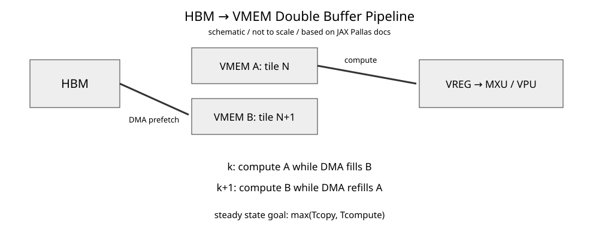

# Google TPU Day 3：HBM、VMEM 与 Double Buffering

- 日期：2026-08-28
- 预计学习时间：约 30 分钟
- 承接：Day 2 已建立 `TensorCore → MXU/VPU/Scalar Unit`；今天只回答数据如何持续喂给执行单元。

## 今日目标

理解 HBM、VMEM、SMEM 的角色；为什么 HBM 数据先进入片上 working set；以及 double buffering 隐藏的是 latency/bubble，不是创造 bandwidth。

## 1. 基本数据路径

JAX Pallas 官方文档把 TensorCore 分成 memory spaces、registers 和 compute units。HBM 是设备 DRAM，VMEM 是 vector SRAM，SMEM 是 scalar SRAM；VPU/MXU 操作 VREG，Scalar Unit 操作 SREG。

```text
HBM --DMA/copy--> VMEM --> VREG --> VPU/MXU
SMEM -----------> SREG ----------> Scalar Unit
```

Pallas Quickstart 明确说明：HBM Ref 不能直接用于普通计算，数据先复制到 VMEM，结果再写回 HBM。因此 VMEM 不应理解成普通透明 L1 cache，而是程序可见的 staging/working-set SRAM。

## 2. Ironwood 的容量尺度

JAX Hardware Reference 的数字是 **per TensorCore**。TPU 7X/Ironwood 每 TensorCore 公布约 64 MiB VMEM、1 MiB SMEM、103 GB HBM、3.7 TB/s HBM bandwidth。Ironwood 一颗 chip 有两个 TensorCore；不要混淆 per-core 与 per-chip 数字。

$$
\text{HBM capacity} \gg \text{VMEM capacity}
$$

权重、KV cache、activation 不可能全部常驻 VMEM，所以 kernel 必须持续把 working tile 从 HBM 搬入 VMEM。

## 3. 同步 copy 为什么制造 bubble

```python
pltpu.sync_copy(x_hbm, x_vmem)
out_vmem[...] = f(x_vmem[...])
pltpu.sync_copy(out_vmem, out_hbm)
```

近似时间线：

```text
DMA:      [ load N ]             [ load N+1 ]
Compute:             [ compute N ]          [ compute N+1 ]
```

DMA 与 compute 没重叠，硬件轮流闲置。

## 4. Double buffering



**怎么看：**

- A/B 是两个逻辑 VMEM buffer slot，不代表真实 SRAM 物理 bank。
- compute 使用 A 中 tile N 时，DMA 把 tile N+1 搬入 B。
- 下一轮交换 A/B，避免覆盖正在计算的数据。
- 图为 `schematic / not to scale`，依据 JAX Pallas pipelining 语义重绘。

理想 steady state 从 $T_{copy}+T_{compute}$ 变为：

$$
\max(T_{copy},T_{compute})
$$

JAX TPU Pipelining 当前默认 input/output buffer count 为 2；`BlockSpec` 可用 `pl.Buffered(...)` 控制 buffering，`pltpu.emit_pipeline` 负责组织 block slicing、buffer reuse 和搬运。

## 5. `emit_pipeline` 替你做什么

```python
def body(x_vmem, y_vmem, o_vmem):
    o_vmem[...] = x_vmem[...] + y_vmem[...]

pltpu.emit_pipeline(
    body,
    grid=...,
    in_specs=[...],
    out_specs=...,
)(x_hbm, y_hbm, o_hbm)
```

body 描述 VMEM 上的计算；pipeline machinery 组织 HBM block → VMEM slot → compute → output，以及下一 block 的预取。

这不是“不管 memory”。你仍决定 block shape、memory space 和 pipeline，只是不必手写全部 copy/wait 状态机。

## 6. NVIDIA 对照

| TPU | NVIDIA GPU | 作用 |
|---|---|---|
| HBM | global/HBM | 大容量设备内存 |
| VMEM | shared-memory scratchpad（粗类比） | tile staging |
| VREG | register | compute operand |
| HBM→VMEM | TMA/cp.async→SMEM | 隐藏搬运延迟 |
| `emit_pipeline` | CUTLASS/CuTe pipeline | 管理多 buffer |

CUDA 普通 global load 可以直接进入 register；Pallas TPU 的 HBM Ref 通常先进入 VMEM/SMEM。这使 TPU 的显式 working-set 模型更强。

## 7. AI Infra 映射：decode 为什么仍会 memory-bound

若每个 decode tile 搬权重耗时 `T_copy`，计算耗时 `T_compute`，double buffering 能重叠两者。但若：

$$
T_{copy} \gg T_{compute}
$$

steady state 仍约等于 `T_copy`。

所以 pipeline **隐藏 latency，不创造 bandwidth**。decode GEMV/小 M GEMM 即使 pipeline 完美，仍可能被每 token 必须搬运的 weight/KV bytes 和 HBM bandwidth 卡住。

## 容易混淆的点

1. VMEM 不是普通透明 L1，而是 Pallas 显式 memory space。
2. Double buffering 不会让 HBM bandwidth 翻倍。
3. Buffer 越多不一定越好；更多 buffer 消耗 SRAM，bandwidth-bound 时加 stage 也没用。
4. TPU `SMEM` 是 scalar SRAM，不对应 NVIDIA shared memory。

## 结论

今天只记这一条：`HBM 大数据 → 分 block → VMEM working set → VREG → MXU/VPU`。高性能版本的关键是 `compute tile N` 与 `prefetch tile N+1` 重叠，所以第一问不是“MXU 有多少 FLOPS”，而是“下一块数据能不能在当前块算完前到 VMEM”。

## 验收标准

1. 能解释 HBM Ref 为什么先 copy 到 VMEM 才计算。
2. 能画出 A/B 两个 VMEM slot 的 double-buffer 时序。
3. 能解释 memory-bound decode 为什么即使 double buffering 正确仍受 HBM bandwidth 限制。

**下一课：Google TPU Day 4 —— VMEM layout、VREG tiling 与 MXU block shape。**

## 参考资料

1. [JAX Pallas — TPU Pipelining](https://docs.jax.dev/en/latest/pallas/tpu/pipelining.html)
2. [JAX Pallas — Quickstart: TPU](https://docs.jax.dev/en/latest/pallas/tpu/quickstart.html)
3. [JAX Pallas — TPU Hardware Reference](https://docs.jax.dev/en/latest/pallas/tpu/hardware.html)
4. [Google Cloud — Inside the Ironwood TPU codesigned AI stack](https://cloud.google.com/blog/products/compute/inside-the-ironwood-tpu-codesigned-ai-stack/)
