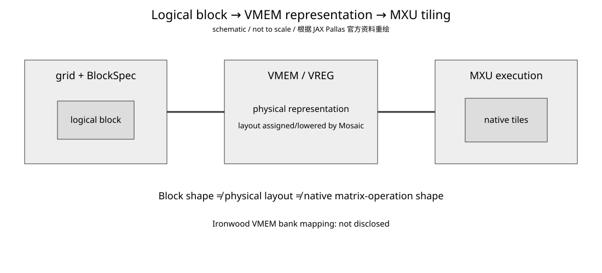

# Google TPU Day 4：Block、Layout 与 MXU Tiling——“一个 Tile”其实有三层含义

- 日期：2026-08-31
- 预计学习时间：约 30 分钟
- 承接：Day 3 已建立 `HBM → VMEM → VREG → MXU/VPU` 与 double buffering；今天只回答搬进 VMEM 的 block 怎样变成 MXU 真正执行的矩阵块。
- 资料状态：以截至 2026-08-31 的 JAX/Pallas 与 Google Cloud 公开资料为准。Pallas 仍是实验性接口；软件 API 与硬件事实分开看。

## 今日目标

今天只固定一个分层：`logical block`、`VMEM/VREG physical layout`、`MXU native tiling` 不是同一个东西。以后看到 `BlockSpec`、layout pass、`256×256 MXU` 时，先判断它属于哪一层。

## 1. “Tile”为什么容易把人带沟里

写 CUDA/CuTe 时，我们会区分 CTA tile、SMEM/register layout 和 MMA atom。TPU 同样存在多层映射，只是 Pallas/Mosaic 暴露方式不同。



**怎么看：**

- 左边 `grid + BlockSpec` 先解决一个 program instance 拥有哪块逻辑数据。
- 中间解决 logical shape 如何成为 VMEM/VREG 中可执行的 physical representation。
- 右边才是 MXU native matrix execution；Pallas 官方 matmul 教程明确说，更大的 Pallas block 可以由 compiler 继续 tile 到 MXU。
- 图不表示 Ironwood 的真实 SRAM bank/floorplan；完整 VMEM bank mapping 当前公开资料未披露。

## 2. 第一层：`BlockSpec` 是逻辑工作块

Pallas 的 `grid` 对应逻辑循环空间，`BlockSpec(block_shape, index_map)` 把 grid coordinate 映射成输入/输出数组的 block。Pallas Design 文档还说明，在 TPU lowering 中，`BlockSpec` 可以转换成 Mosaic pipeline schedule。

以 GEMM 为例，官方 TPU matmul 教程用三维 grid 表达 M/N/K blocked loops；`bm`、`bk`、`bn` 是 kernel 的算法分块参数。

```text
BlockSpec shape
≠ VMEM physical layout
≠ MXU native operation shape
```

所以看到 `(128,128)` 的 `BlockSpec`，不能直接说“MXU 就执行 128×128”。

## 3. 第二层：logical shape 还要落成 physical representation

上一课把 VMEM 定位为显式 working-set SRAM。今天再加一句：程序看到的二维数组 shape，不等于硬件里已经天然存在一个二维 row-major SRAM。

截至 2026-08-31，JAX Pallas changelog 显示 TPU `CompilerParams.needs_layout_passes` 已默认开启，官方同时注明 layout passes 仍在开发。这说明现代 Mosaic TPU 正在让 compiler 更主动地完成 layout assignment/lowering。

这里不要越过公开资料：Ironwood TensorCore VMEM 的完整 bank mapping、bank 数和类似 CuTe `Shape/Stride` 的物理映射并未完整公开。因此我们确认“存在 physical layout/lowering 问题”，但不猜具体 bank 结构。

## 4. 第三层：MXU 自己还有 native systolic tiling

Google Cloud 当前架构资料给出，TPU v6e 和 TPU7x/Ironwood 的 MXU 使用 `256×256` systolic array。这个数字描述矩阵乘硬件阵列，不代表 Pallas `BlockSpec` 必须固定为 `(256,256)`。

Pallas 官方 Matrix Multiplication 教程明确指出：MXU 只能执行较小的 native matrix multiplication，但 Pallas 可以接收更大的 block，并自动继续 tile 到 MXU。

```text
Pallas GEMM block
        ↓
Mosaic/compiler tiling
        ↓
one or more MXU operations
```

这与 CUDA/CUTLASS 的层次很像：CTA tile 并不等于某条 WGMMA/tcgen05 的 instruction shape。

## 5. compiler 会 tile，为什么 block shape 仍然重要

自动 tiling 只意味着你不用手工表达每一步 systolic operation，不意味着 block shape 随便选。它仍影响 VMEM working set、HBM reuse、pipeline overlap、padding/utilization 和 fusion 空间。

Pallas 官方 matmul 教程把性能分析放在 block matrix multiplication、tiling、pipelining 和 arithmetic intensity 上。block 太小，单块 compute 可能不足以隐藏搬运；block 太大，又会消耗更多 VMEM，降低可用 buffering/fusion 空间。

因此正确问题不是“MXU 是 256，所以 block 选 256 吗”，而是“这个 logical block 能否在 VMEM 容量、数据 reuse、pipeline 与 MXU utilization 之间取得合适平衡”。

## 6. 一个 GEMM 的完整映射

假设 `A/B/C` 都围绕 4096 规模，我们选 `bm=bk=bn=256`。思考顺序应当是：

```text
global GEMM
↓
grid / BlockSpec 选择逻辑 A/B/C blocks
↓
DMA staging 到 VMEM
↓
Mosaic 决定/合法化 VMEM、VREG physical layout
↓
dot/matmul lowering 映射到 MXU native execution
↓
需要时由 VPU 做 fused elementwise/epilogue
```

这里恰好都出现 256 很容易造成错觉，但概念仍不能画等号；换成更大的 Pallas block 时，compiler 仍可继续拆分。

## 7. NVIDIA 对照：最像 CuTe 的三层分解

| TPU/Pallas | NVIDIA/CuTe 粗对照 | 问题 |
|---|---|---|
| `grid + BlockSpec` | CTA/problem tile | 谁负责哪块逻辑数据 |
| VMEM/VREG layout | SMEM swizzle + register layout | 数据怎样摆 |
| MXU tiling | MMA/WGMMA/tcgen05 tiled MMA | 怎样拆成 native matrix ops |
| Mosaic layout/tiling passes | CuTe templates + compiler lowering | 从逻辑描述落到硬件 |

差别在暴露程度。CuTe 经常让 kernel author 显式组合 `Shape/Stride/Swizzle/TiledMMA`；当前 Mosaic TPU 把更多 layout assignment 放进 compiler pass。因此读 TPU kernel 时，不一定能在源码里直接看到所有物理映射。

## 8. AI workload 映射：decode 小 M 为什么难

Prefill GEMM 的 M 大，容易形成规则二维工作块并提高 operand reuse。decode 的 M 很小，会减少 matrix engine 可利用的二维工作量，padding/under-utilization 与 memory traffic 占比都会上升。

```text
small M
↓
有效二维 tile 变瘦
↓
MXU utilization / reuse 下降
↓
更容易 memory-bound
```

这与 NVIDIA 上 decode GEMM/GEMV 难以打满 Tensor Core 属于同一类根因。continuous batching、token batching、quantization、fusion 不只是软件技巧，它们也在改变最终可构造的硬件工作块。

## 容易混淆的点

1. MXU 是 `256×256`，不代表 Pallas block 必须是 `256×256`。
2. `BlockSpec` 不是 physical layout；它主要描述逻辑 block 与 index mapping。
3. compiler 自动 layout 不代表 layout 不影响性能；自动化的是选择/lowering，物理组织仍然影响 feeding efficiency。
4. Ironwood 的完整 VMEM bank mapping 当前未公开，不应从 Pallas API 反推出虚构的 floorplan。

## 结论

今天固定这一条：`Logical partition → VMEM/VREG physical representation → MXU native tiling`。以后看到“tile”，先问它属于哪一层。

## 验收标准

1. 能解释 `BlockSpec`、VMEM/VREG layout、MXU tiling 为什么是三层。
2. 能解释 `256×256 MXU` 为什么不等于 `BlockSpec` 必须 256×256。
3. 能用 NVIDIA 的 `CTA tile → SMEM/register layout → MMA/WGMMA` 做粗对照，同时知道不是硬件一一对应。

**明日预告：Google TPU Day 5 —— Mosaic/XLA 编译链。**

## 参考资料

1. [JAX Pallas — Matrix Multiplication](https://docs.jax.dev/en/latest/pallas/tpu/matmul.html)
2. [JAX Pallas — Pallas Design](https://docs.jax.dev/en/latest/pallas/design/design.html)
3. [JAX Pallas — TPU Pipelining](https://docs.jax.dev/en/latest/pallas/tpu/pipelining.html)
4. [JAX Pallas — Changelog](https://docs.jax.dev/en/latest/pallas/CHANGELOG.html)
5. [JAX Pallas — TPU CompilerParams](https://docs.jax.dev/en/latest/_autosummary/jax.experimental.pallas.tpu.CompilerParams.html)
6. [Google Cloud — Cloud TPU documentation](https://docs.cloud.google.com/tpu/docs)
7. [Google Cloud — TPU7x performance optimizations](https://docs.cloud.google.com/tpu/docs/ironwood-performance)
