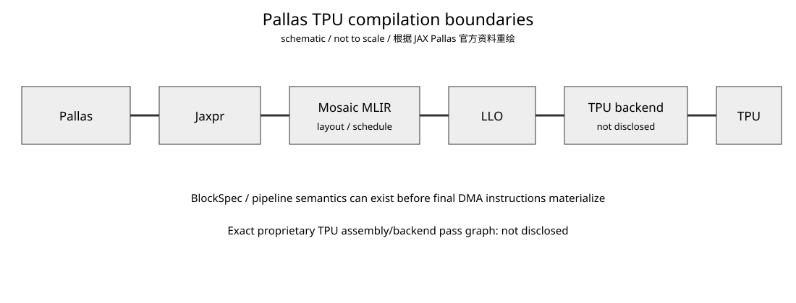

# Google TPU Day 5：Mosaic 编译链——Pallas 到 TPU executable 的责任边界

- 日期：2026-09-02
- 预计学习时间：约 30 分钟
- 承接：Day 4 已把 `BlockSpec → physical layout → MXU tiling` 分成三层；今天只追踪这些信息进入 compiler 后分别在哪一段被处理。
- 资料状态：截至 2026-09-02。Pallas 仍是 experimental；Google 未完整公开的 TPU backend/assembly 细节统一标为 `not disclosed`。

## 今日目标

能口述 `Pallas → Jaxpr → Mosaic MLIR → LLO → TPU backend`；知道 layout/pipeline 主要在哪层暴露；知道为什么中间 IR 不一定已经出现最终 DMA。

## 1. 编译边界



**怎么看：**

- Python/Pallas kernel 先经 JAX tracing 形成 Jaxpr。
- TPU 路径随后进入 Mosaic lowering。
- JAX 官方设计文档描述 Mosaic 接收 mostly-standard MLIR，并输出 LLO 给 TPU compiler。
- LLO 之后的 proprietary TPU backend/assembly pass graph 没有像 NVIDIA PTX/SASS 那样完整公开，因此明确标为 `not disclosed`。

## 2. Pallas → Jaxpr：先固定 kernel semantics

Pallas 仍利用 JAX tracing。`Ref`、`pallas_call`、`BlockSpec`、`program_id` 给普通 JAX 增加 kernel 所需的 memory/scheduling semantics。`pallas_call` 在 grid iteration space 上执行 kernel，而 `BlockSpec` 决定每次迭代看到哪一个 logical view。

```python
pl.pallas_call(
    kernel,
    grid=...,
    in_specs=[pl.BlockSpec(...)],
    out_specs=...
)
```

这不会立即展开成硬件指令。JAX 先把 kernel body trace 成 Jaxpr，随后 TPU-specific lowering 才开始。

## 3. Jaxpr → Mosaic MLIR：layout 与 pipeline 开始成为硬约束

JAX 官方 Pallas Design 说明，Pallas primitives 被翻译为 MLIR，主要使用 `vector`、`arith` 等 dialect；`BlockSpec` 可以进一步参与 Mosaic pipeline schedule。

Day 4 讲的 physical layout 问题在这里开始真正体现：logical shape 要变成 TPU 可接受的 register/VMEM representation，reshape、transpose、slice 等操作可能触发 relayout 或 legalization。

所以：

```text
JAX 语义合法
≠
Mosaic layout 一定合法
```

## 4. Mosaic → LLO → TPU compiler

公开边界可以概括为：

```text
Pallas frontend
    ↓
Jaxpr
    ↓
Mosaic MLIR
    ↓
LLO
    ↓
TPU compiler/backend
    ↓
TPU executable
```

Mosaic 不是最终 TPU machine-code assembler。最终 proprietary pass graph、ISA encoding、assembly format 并没有完整公开，所以不要人为创造一个“TPU PTX”等价层。

## 5. 反直觉点：DMA 可以到很晚才 materialize

公开的 Pallas/Mosaic DMA lowering 讨论说明，某些 memory-movement semantics 在较早阶段已经确定，但最终 DMA 形式可以在更晚的 TPU compilation 阶段才 inline/materialize。

因此：

```text
memory movement 已经被 schedule
≠
当前 Mosaic/HLO dump 已经出现最终 DMA instruction
```

这连接 Day 3：`BlockSpec` / pipeline 已经规定 HBM↔VMEM 的工作方式，但不能仅凭中间 IR 没出现 DMA 就判断“没有 DMA”。

## 6. Layout 为什么是 Mosaic 的核心问题

Pallas TPU debugging 资料强调，TPU physical layout 对最后几维有实际约束，reshape、slice、transpose 等操作可能需要 relayout；layout/shape legalization 也是常见 compile error 来源。

所以 TPU kernel engineer 的关键优化抓手之一，不是手写 ISA，而是把算法表达成 Mosaic 能稳定 lower 的 shape、layout 与 pipeline。

## 7. NVIDIA 对照

| TPU/Pallas | NVIDIA 粗对照 | 注意 |
|---|---|---|
| Python Pallas | CuTe DSL/Triton/CUDA C++ | frontend |
| Jaxpr | frontend IR | 保存 primitive semantics |
| Mosaic MLIR | TritonGPU/NVVM/CuTe lowering 中间层 | layout/pipeline lowering |
| LLO + TPU backend | PTX → ptxas → SASS（仅类比） | TPU 没公开 PTX 等价层 |
| TPU executable | cubin/device code | 最终设备程序 |

NVIDIA 给 kernel engineer 暴露 PTX、SASS、MMA/WGMMA/tcgen05、TMA 等更多硬件级接口；Pallas TPU 让 Mosaic/compiler 承担更多 physical layout 与 scheduling 工作。

## 8. AI Infra 映射：attention kernel 为什么容易撞 compiler boundary

Paged/Flash attention 类 kernel 常包含 dynamic page selection、K/V tile load、transpose/reshape、dot、reduction。Python/Jaxpr 层可能完全合理，但 lowering 继续面对 dynamic indexing、physical layout、relayout、shape cast、VMEM 和 pipeline schedule 等约束。

这类失败本质上不是“Python 写错”，而是算法表达跨过了 compiler/backend 当前能有效支持的 physical-layout 边界。

## 9. 调试应该看哪一层

推荐按层定位：

```text
Pallas / Jaxpr
算法、Ref、index semantics
↓
Mosaic dump
reshape/layout/primitive 从哪里开始非法
↓
VMEM / layout / pipeline
是否撞硬件约束
↓
XProf
编译成功后再看 runtime utilization / bubble
```

这和 GPU 的 `source → IR/PTX → SASS → Nsight` 分层调试思想一致。

## 容易混淆的点

1. XLA 与 Mosaic 不是一个层次；Pallas TPU kernel body 走 Mosaic lowering。
2. Mosaic 不等于最终 TPU assembler；公开描述是输出 LLO，再交给 TPU compiler。
3. 中间 dump 没有最终 DMA，不等于运行时没有 DMA。
4. JAX primitive 能 trace，不等于 Pallas TPU backend 一定能合法 lower。

## 结论

```text
Pallas：表达 kernel / memory view / grid
JAX tracing：得到 Jaxpr
Mosaic：primitive + layout + pipeline/schedule lowering
LLO / TPU backend：进一步硬件化并生成 executable
```

TPU kernel 优化仍然需要硬件意识，只是抓手更多表现为“让 compiler 得到正确且高效的 physical layout/pipeline”，而不是直接操作 PTX/SASS。

## 验收标准

1. 能口述 `Pallas → Jaxpr → Mosaic MLIR → LLO → TPU backend`。
2. 能解释为什么 `BlockSpec` 已表达搬运语义，但中间 dump 未必已有最终 DMA。
3. 遇到 `shape_cast/relayout` 错误时，知道它属于 logical representation 到 physical TPU layout 的 lowering 问题。

**下一课：Google TPU Day 6 —— 片内通信与 TensorCore 内部数据供给。**

## 参考资料

1. [JAX — Pallas Design](https://docs.jax.dev/en/latest/pallas/design/design.html)
2. [JAX — Pallas debugging](https://github.com/jax-ml/jax/blob/main/jax/experimental/pallas/g3doc/debugging.md)
3. [JAX — Mosaic TPU source](https://github.com/jax-ml/jax/tree/main/jax/_src/pallas/mosaic)
4. [JAX Discussion #26962 — Lowering of Pallas Kernel and DMAs](https://github.com/jax-ml/jax/discussions/26962)
