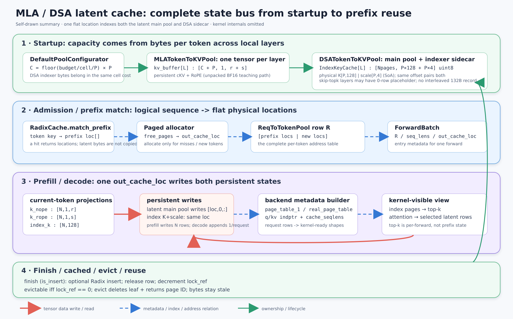
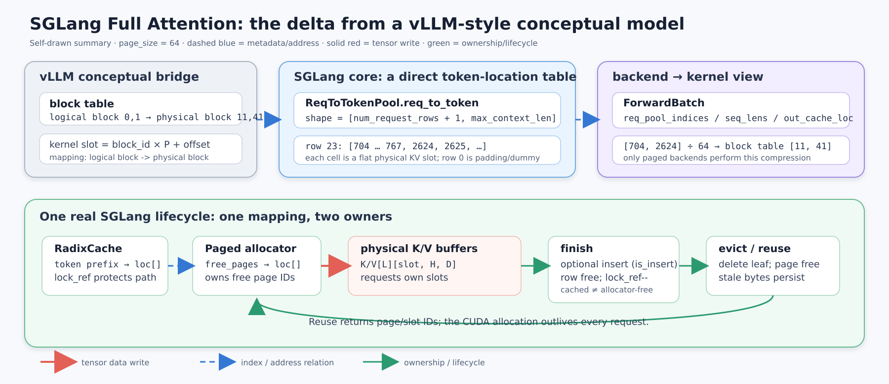
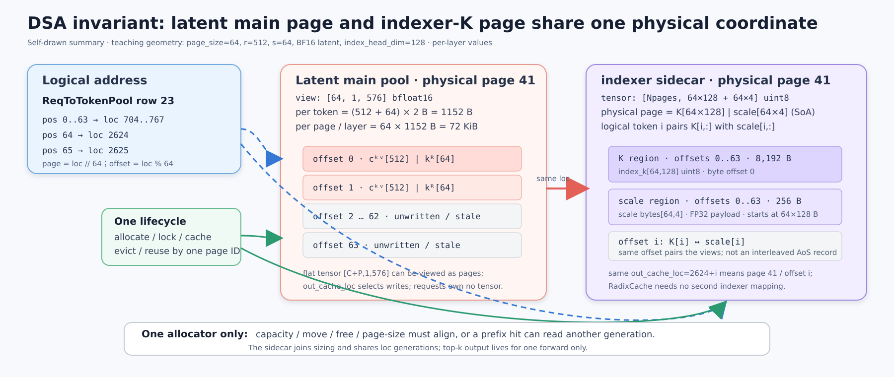

# Day 06｜正式 SGLang：Full Attention 差异闭环与 MLA / DSA Latent Cache

> 唯一源码基线：`tangpanyu/sglang`，branch `main`，commit `db017e34902b51e1fd1ac7ebbedaf720c75b374d`，snapshot resolved `2026-09-02`。
>
> 固定快照：[commit db017e34902b51e1fd1ac7ebbedaf720c75b374d](https://github.com/tangpanyu/sglang/commit/db017e34902b51e1fd1ac7ebbedaf720c75b374d)。本文所有源码链接都钉在这个完整 commit 上，不使用浮动 `main`，也不把其他仓库当作实现基线。
>
> 仓库事实边界：该快照存在正式 SGLang 的 `ReqToTokenPool`、token/page allocator、`RadixCache`、MHA/MLA/DSA pool、DSA indexer 与对应 backend；快照中没有专用的 `python/sglang/srt/models/glm5_next.py` 和 `python/sglang/srt/configs/glm5_next.py`。因此今天讲的是此 fork 内真实可闭环的 SGLang MLA/DeepSeek DSA 通用路径，不把尚未落入该 fork 的 GLM-5.3 model-specific glue 写成既有调用链。

## 本课定位与 3 小时时间盒

Day05 已经用 vLLM 建立了 Full Attention 的通用 page/block/KV 生命周期，今天保留它作为概念背景，但不再重复原理。前 30 分钟只完成正式 SGLang 的差异闭环；随后把主角切到 MLA latent cache，并把 DSA 看成“MLA 主状态 + 与它共址、同寿命的 indexer K sidecar”。

| 墙钟 | 模块 | 必须产出 |
|---:|---|---|
| 0～5 分钟 | 诊断 + 总图 | 能说出今天唯一新增的三个对象 |
| 5～35 分钟 | SGLang Full Attention 差异闭环 | 改正 block table、Radix ownership、cached/free 三个直觉 |
| 35～80 分钟 | MLA 心智模型与完整生命周期 | 说清 latent row 的 shape、字节数、写入和读取 |
| 80～110 分钟 | DSA sidecar 与 sparse read path | 说清两份 persistent state 为何共用一个 loc |
| 110～145 分钟 | 固定 commit 源码最短闭环 | 完成七站验证，不按文件泛读 |
| 145～165 分钟 | 正式 SGLang 开发 boundary | 知道改 layout、sidecar、metadata 分别落在哪里 |
| 165～180 分钟 | 手撕 + 自检 | 手写 metadata builder，并通过三个 invariant |

## 已掌握可跳过：5 分钟诊断

先口答，答不上哪项就读对应部分，不必机械从头看到尾。

- 如果给出 `req_pool_idx=23, token_pos=64, req_to_token[23,64]=2624, page_size=64`，你能在 10 秒内说出 physical page 是 41、page offset 是 0，并说明 SGLang 的表里存的是 flat slot 而不是 logical block ID，可以把 Full Attention 差异段压到 15 分钟。

- 如果你能解释为什么 MLA 长期缓存的是 `c_kv + k_rope`，而不是每个 head 展开的 K/V，并能写出 `[capacity + page_size, 1, kv_lora_rank + qk_rope_head_dim]`，可跳到“MLA 生命周期”。

- 如果你能解释 DSA prefix hit 复用的是 latent rows 与 indexer-K rows，而不是上一轮 query 的 top-k 结果，并能说明两者为什么必须共用 allocator 世代，可跳到源码第七站。

- 如果你会从 `ReqToTokenPool` 的逐 token flat locations 构造 `page_table_1`、真实 page table 和 `cache_seqlens`，可直接做手撕。

## 先给结论：今天只需建立一个统一模型

正式 SGLang 没有为 MLA/DSA 重新发明 request lifecycle：`RadixCache` 仍把 token prefix 映射到 physical locations，allocator 仍发放 slot/page，`ReqToTokenPool` 仍保存每个 request 的逐 token 物理位置，`ForwardBatch` 仍把本轮 request rows、lengths 和新写位置送到 backend。真正替换的是 physical row 的含义；MHA 的每层 K/V 两行变成 MLA 的一条 compressed latent row，而 DSA 又给同一 physical location 增加一条量化 indexer-K sidecar。backend 的职责是把同一 request row 临时翻译成当前 kernel 所需的 page table、indptr、lengths 和 top-k-address view。



读图先从上到下，而不是从左到右追某个 Python 函数。第一层是启动期物理内存：容量一旦确定，主 latent tensors 与 DSA sidecar tensors 都一次性创建；第二层是请求期地址关系：prefix hit 与新分配位置拼成 `ReqToTokenPool` 的一行；第三层是每轮 forward：当前 token 的投影结果沿红色实线写入同一 `out_cache_loc`，backend 再沿蓝色虚线把 request row 翻译为 kernel view；最下层是生命周期：finish 只转移 ownership，evict 才把 page ID 交回 allocator，但两种操作都不会销毁那块 CUDA tensor。

图中红色实线代表真实 tensor 数据读写，例如 `k_nope/k_rope` 写进 latent buffer、index key 写进 sidecar、attention 读取选中的 latent rows。蓝色虚线只是 metadata/index/address 关系，例如 request row 指向 flat locations、backend 从它构造 page table；它不表示复制 KV。绿色表示 ownership 或生命周期变化，例如 Radix 节点从 protected 变为 evictable，以及 eviction 将 page ID 归还 allocator。

## 一、先把六层状态分开

后面所有路径都坚持这六层术语；只要不跨层偷换概念，MLA/DSA 就不会显得神秘。

| 层次 | 正式 SGLang 对象 | MHA 中存什么 | MLA / DSA 中存什么 | 生命周期 |
|---|---|---|---|---|
| request state | `Req`、`req.kv.req_pool_idx`、`prefix_indices`、`last_node`、长度字段 | 当前请求身份、命中前缀和进度 | 完全相同；不直接拥有 tensor | 从 admission 到 finish/retract |
| logical mapping metadata | `ReqToTokenPool.req_to_token[R, pos]` | token position → flat K/V slot | token position → flat latent/indexer 共同坐标 | request row 被分配到释放 |
| allocator/cache metadata | allocator 的 `free_pages`；Radix node 的 key/value/`lock_ref` | 哪些 page 可重新分配；哪些 prefix 正被保护 | 完全相同的一套 loc ownership | server 常驻，条目反复变更 |
| physical GPU state storage | `MHATokenToKVPool` | 每层 K buffer + V buffer | `MLATokenToKVPool.kv_buffer`；DSA 再有 `IndexKeyCache.buffer` | server/model runner 常驻 |
| per-forward metadata | `ForwardBatch`，backend metadata | request rows、lengths、写 slot、page/indptr view | 另含 MLA/DSA page table、sparse lengths、top-k transform 所需字段 | 一轮 forward 或 CUDA-graph 静态 buffer |
| kernel-visible view | data pointer/view + index arrays + lengths | K/V pages、block table、query、lengths、write loc | latent pages、indexer pages、page tables、top-k locations、lengths、write loc | 一次 kernel 调用 |

最重要的所有权句子是：request 拥有的是“一行映射及对缓存路径的活动引用”，allocator 拥有“哪些 page ID 可再次发放”，RadixCache 拥有“哪些 token prefix 对应哪些 physical locations”，pool/model runner 才拥有 CUDA tensors；kernel 只是得到这些 tensors 的视图和索引，不拥有任何一层长期状态。

## 二、30 分钟闭环：Day05 到正式 SGLang，究竟差在哪

### 2.1 最大差异：核心表不是 logical-block table，而是逐 token flat-location table

Day05 的 vLLM 直觉是 `request logical block -> physical block id`，token slot 通常还要由 `block_id * block_size + offset` 展开。正式 SGLang 的 `ReqToTokenPool` 更直接：GPU tensor 的每一行对应一个 request slot，每一列对应该 request 的 token position，每个值已经是 physical KV pool 的 flat slot。

设 request row 为 $R$，序列位置为 $p$，page size 为 $P$，则核心地址关系是：

$$
\text{loc}(R,p)=\texttt{req\_to\_token}[R,p],\qquad
\text{page}=\left\lfloor\frac{\text{loc}}{P}\right\rfloor,\qquad
\text{offset}=\text{loc}\bmod P.
$$

当 allocator 保证同一 request 的每页 page-aligned 且页内连续时，需要 block table 的 backend 可以在本轮临时构造：

$$
\text{block\_table}[R,b]=\frac{\texttt{req\_to\_token}[R,bP]}{P}.
$$

因此不要把 `ReqToTokenPool` 叫成 SGLang 的 block table。它的信息更细：完整保存每个 token 的 flat location；block/page table 只是某个 backend 从它派生出的更紧凑 kernel view。`page_size=1` 时两者数值碰巧接近，也不能混为同一抽象。



上半图只画 metadata，没有发生 KV copy。中间蓝色卡片的 row 23 直接保存 `704..767, 2624..`；右侧 backend 为 page kernel 取每页首 loc 并除以 64，才得到 `[11, 41]`。下半图才出现红色真实写入：allocator 给出的 `out_cache_loc` 选择预分配 K/V tensor 的行。绿色回环表明 eviction/reuse 复用编号和字节区域，而不是重新 `torch.empty`。

### 2.2 第二个差异：SGLang Radix 节点直接保存 token segment 对应的 physical loc tensor

Radix node 的 key 是 token-id segment 与 namespace 信息，value 是同长度、page-aligned 的 physical KV indices。prefix match 返回的是可以直接放入 request row 的 loc tensor，不是“命中了一个逻辑块，稍后再查物理块”。如果命中 64 个 token，最重要的副作用不是复制 64 行 KV，而是把原有 64 个 loc 复用到新 request 的 mapping，并对终止 Radix 路径加锁。

`lock_ref` 属于 Radix tree path，而不是独立 physical page 的通用 refcount。活动 request 对命中路径加锁后，这些节点从 evictable 变为 protected；request finish 或换到新的缓存终点时减锁。节点的 locs 仍属于 Radix cache，allocator 不得同时把同一 page 当作 free。

### 2.3 第三个差异：在经典 SGLang Radix 路径中，cached 与 allocator-free 互斥

Day05 中如果形成了“free queue 里的 block 仍可保留 cache identity”的 vLLM 直觉，今天必须清掉。此 SGLang 路径里，一个 cached Radix node 即使 `lock_ref==0`、允许被驱逐，它的 pages 仍没有进入 allocator 的 `free_pages`；只有 `RadixCache.evict()` 删除叶节点并调用 allocator free 后，page ID 才重新可分配。

| 状态 | request row 指向 | Radix node 持有 loc | `lock_ref` | page 在 `free_pages` | 旧字节有效性 |
|---|---:|---:|---:|---:|---|
| allocator-free | 否 | 否 | 不适用 | 是 | stale，任何时候可覆盖 |
| private-live | 是 | 尚未全部进入树 | 不适用或只锁命中前缀 | 否 | 对当前 request 有效 |
| cached-protected | 是或被活动 request 引用 | 是 | `>0` | 否 | 有效，禁止 eviction |
| cached-evictable | 通常没有完成请求的 row | 是 | `0` | 否 | 有效，可被 Radix 驱逐 |
| evicted/released | 否 | 否 | 不适用 | 是 | 逻辑无效；物理位不清零 |

`free` 的含义是“allocator 可以把编号发给新 owner”，不是“显存 tensor 被释放给 CUDA”，也不是“字节被清零”。`cached` 的含义是“Radix 仍保存 key→loc 关系并承诺 loc 内容有效”。`evicted` 的含义是“cache identity 被删且 loc 已回 allocator”。`released` 通常描述 request 不再持有 request row/KV 生命周期；它并不必然意味着该 request 贡献的 page 数据消失，因为 finish 可以把它们转交给 Radix cache。

### 2.4 用一个请求走完 SGLang MHA 差异路径

固定 `page_size=64`。请求 A 的 70-token prompt 命中已有 prefix page 11，对应 flat locs `704..767`；allocator 给未命中的 6 个 token 发放 page 41 的前六个位置 `2624..2629`；request row 取 23。

| 时刻 | request state | `req_to_token[23]` 有效片段 | allocator/Radix | physical storage |
|---|---|---|---|---|
| match 后 | `prefix_indices=704..767`，`last_node` 被锁 | 尚未绑定或只待写 | page 11 cached-protected | page 11 K/V 已存在 |
| extend allocation 后 | `req_pool_idx=23` | `[704..767, 2624..2629]` | page 41 从 free 变 private-live | 未命中 6 行尚待写 |
| prefill 各层后 | 长度推进到 70 | 映射不变 | ownership 不变 | 每层 loc `2624..2629` 的 K/V 已写 |
| 第一次 decode allocation | 新 token position 70 | 再写 `req_to_token[23,70]=2630` | 仍在 page 41 内，不需新 page | 每层 loc 2630 随 forward 写入 |
| finish | request 即将释放 row 23 | row 内容可变成 stale metadata | 对齐部分插入/复用 Radix，重复副本与未对齐尾按规则 free，活动锁释放 | cached pages 继续常驻；free pages 等待覆盖 |
| 后续 eviction | request 已不存在 | row 23 已可给别的请求 | 删除 `lock_ref==0` 的叶，归还 page ID | tensor 不销毁，旧 K/V 变 stale |

prefill 中真正的数据路径是 `out_cache_loc -> K/V buffer rows`；`prefix_indices -> ReqToTokenPool row` 只是地址拼接。decode 中“追加”也不是对 Python list append，而是在 position 70 写入一个新 flat loc，并让每个 attention layer 把当前 token 的 K/V 写到该 loc 对应的本层 buffer。请求结束时被回收的是 `Req` 对 row、prefix lock 和 private tail 的 ownership；server 级 K/V tensors 一直存在。

## 三、MLA 开天眼：persistent state 从两份展开 K/V 变成一条 latent row

### 3.1 先回答“到底缓存什么”

标准 MHA/GQA 对每个历史 token、每个本地 layer 保存展开后的 $K_t\in\mathbb{R}^{H_{kv}\times D_k}$ 与 $V_t\in\mathbb{R}^{H_{kv}\times D_v}$。MLA 把可吸收的非 RoPE K/V 部分压到一个共享 latent $c_t^{KV}\in\mathbb{R}^{r}$，只把不能被同样吸收的 RoPE key 分量 $k_t^R\in\mathbb{R}^{s}$ 一起持久化。

$$
\text{persistent MLA row}_t = [c_t^{KV}\;|\;k_t^R]\in\mathbb{R}^{r+s}.
$$

这里的 `1` 个 KV head 是 storage interface 的表达，不代表模型只有一个 query head。SGLang 的 `RadixAttention` 仍可有很多本地 query heads，但 cache row 的物理 shape 是 `[1, r+s]`；每个 head 如何把 query 投到 latent space、如何把 latent attention result 展回 value space，属于模型权重吸收和投影，不要求缓存展开的 per-head K/V。

为什么可行，可以只记两个等价变换。若非 RoPE K 由 $W_h^{UK}c_t^{KV}$ 展开，则 score 可改写为：

$$
(q_h^C)^T W_h^{UK}c_t^{KV}=\left((W_h^{UK})^Tq_h^C\right)^T c_t^{KV}.
$$

若 V 由 $W_h^{UV}c_t^{KV}$ 展开，则加权和可改写为：

$$
\sum_t\alpha_{h,t}W_h^{UV}c_t^{KV}=W_h^{UV}\left(\sum_t\alpha_{h,t}c_t^{KV}\right).
$$

第一式把 K 的 up-projection 吸收到 query 一侧，第二式把 V 的 up-projection推迟到 attention reduce 之后。因此 persistent storage 不必保存每个 head 展开的 K/V。RoPE 分量仍随 token/position 变化并参与 score，所以 `k_rope` 必须跟 latent 一起缓存。

### 3.2 SGLang 的真实 physical layout

默认 MLA pool 为每个本地 attention layer 创建一个 tensor：

```text
kv_buffer[layer_local]
shape = [capacity + page_size, 1, kv_lora_rank + qk_rope_head_dim]
dtype = configured KV store dtype

row[loc, 0, :kv_lora_rank]  = c_kv / k_nope latent
row[loc, 0, kv_lora_rank:]  = k_rope
```

多出的 `page_size` 不是给某个真实 request 的额外容量，而是 padding/dummy page；与 `ReqToTokenPool` 的 dummy row/slot 思路一致，图捕获或 padding token 的无害写入可以落在那里。`get_key_buffer()` 返回整条 combined row；`get_value_buffer()` 只是前 `kv_lora_rank` 个元素的 view，因为 MLA 的 value-side latent 与 `c_kv` 是同一份物理数据，不存在独立 V tensor。

flat NHD-like tensor 与 page 并不冲突。若 `page_size=64`，backend 可以把 `[capacity+64,1,r+s]` view 为 `[num_pages,64,1,r+s]`；allocator/`ReqToTokenPool` 仍用 flat loc，paged kernel 才使用 page id 和 offset。

### 3.3 启动预分配与容量公式

忽略 padding page 和对齐小误差时，普通 MLA 的每 token cell cost 是：

$$
B_{\text{MLA/token}}=L_{\text{local}}\cdot(r+s)\cdot\operatorname{sizeof}(dtype).
$$

SGLang 先估算模型权重、运行时 slack、多模态 reservation 后剩余的 byte budget，再以 `available_bytes // cell_size` 求最大 token 数，最后向下对齐到 `page_size`。pipeline parallel 下只计算当前 rank 实际承载的 layer slice；因此 `layer_num/start_layer/end_layer` 是 physical allocation 的一部分，而不是只供日志使用。

用一组明确的教学配置计算，不冒充任何模型 config：`capacity=4096`、`page_size=64`、本 rank 有 4 个 MLA layers、`r=512`、`s=64`、BF16。

| 项目 | 计算 | 结果 |
|---|---:|---:|
| 一 token / layer | `(512+64)×2 B` | 1,152 B |
| 一 page / layer | `64×1,152 B` | 73,728 B = 72 KiB |
| 一个 layer tensor | `(4096+64)×576×2 B` | 4,792,320 B = 4.5703125 MiB |
| 四个 layer tensors | `4×4,792,320 B` | 19,169,280 B = 18.28125 MiB |

为建立数量级直觉，再取一个同样只是教学比较的 MHA geometry：`H_kv=8, D_k=D_v=128, BF16`。MHA 每 token/layer 是 `(8×128+8×128)×2=4096 B`，相对 1,152 B 的 MLA row 大约是 3.56 倍。这个比值只说明 layout 变化带来的存储量级，不是对任意模型压缩比的承诺；真实比值必须代入目标 config、TP/DCP 切分和 KV dtype。

### 3.4 MLA 的 ownership 与完整生命周期

| 阶段 | 谁做 | 改哪层状态 | 真正的数据移动 | invariant |
|---|---|---|---|---|
| startup | pool configurator + model runner | 决定 capacity、layer slice、dtype/layout | 创建每层 `kv_buffer` | 所有 layer 的 slot 0/每个 loc 语义一致 |
| prefix match | `RadixCache` | 返回 prefix locs、加锁节点 | 无 latent copy | 命中 loc 在 allocator 看来绝不能 free |
| extend allocation | allocation helper + allocator | 分配 request row、新 pages，拼入 `req_to_token` | 只写 index tensor | row 的 `[0:seq_len]` 都是有效 flat loc |
| prefill projection/write | model attention + backend/pool setter | 不改 ownership；填充物理状态 | `k_nope` 与 `k_rope` 写 `kv_buffer[layer][out_cache_loc]` | 每个可见新 loc 在所有相关 layer 已初始化 |
| prefill/decode read | metadata builder + backend | 构造 indptr/page table/lengths | kernel 按 view 读 latent rows | lengths 限制读取，padding/stale tail 不可见 |
| decode append | allocator +每层 attention | request row 增一 loc，长度推进 | 每层写一个新 latent row/请求 | mapping 先与本轮 write loc 一致，才可提交长度 |
| finish | release + `RadixCache` | cache ownership 接管对齐 prefix；释放 row/lock/private tail | 通常无 latent copy | cached loc 不进入 `free_pages` |
| evict/reuse | `RadixCache` + allocator | 删除 key→loc，page ID 重新 free | 下一 request 覆盖旧 row | 新 owner 写完前旧字节一律不可读 |

prefill 没有 cache hit 时，某些 backend 可直接对本轮 ragged K/V 计算 attention，同时仍把新 latent rows 写入 pool，供未来 decode/prefix reuse 使用；有 prefix 时，当前 suffix 与历史 latent pages 必须通过 backend metadata 合成一个正确可见的序列。这个选择影响 kernel view 和临时 workspace，不改变 persistent ownership。

decode 的“append/read”顺序可抽象为：allocator 为每个 request 解析本轮新 loc；`ForwardBatch.out_cache_loc` 把这些 loc 送到所有 layers；当前 layer 写自己的 combined latent row；attention backend 取得本层整个 preallocated buffer、当前 request 的 page/slot view 和有效长度，读取历史加当前可见 rows；下一 layer 对同一 loc 重复写本层状态。不同 layer 共用 loc 编号，但数据在不同 layer tensor 中。

### 3.5 MLA kernel 最终看见什么

不进入 kernel 内部，只列接口语义。以 paged MLA decode 为例，kernel-visible view 至少包含：当前 query 的 latent/nope 与 RoPE 分量；本层 combined `k_cache` pointer/view；由 `ReqToTokenPool` 派生的 block/page table；每个序列的有效 `cache_seqlens`；value head dimension `kv_lora_rank`；softmax scale；本轮写入位置 `out_cache_loc` 由前置 store 使用。实现可以再传 scheduler metadata、split count 或 workspace，但这些都不改变“table 选 page，length 截断有效行，buffer pointer 决定 payload layout”的三件事。

## 四、DSA 开天眼：不是另起一套 cache，而是给 MLA page 加同坐标 sidecar

### 4.1 三种东西必须分开

在这个快照里，DSA 的 persistent state 有两份，per-forward result 有一份：

| 名称 | 是否 persistent | 每 token / layer 的语义 | 物理对象 | 用途 |
|---|---:|---|---|---|
| MLA main latent | 是 | `c_kv + k_rope`，或特定 FP8 packed layout | `DSATokenToKVPool` 继承的 `kv_buffer` | sparse/dense attention 最终读取的内容 |
| indexer K + scale | 是 | 128-byte quantized index key + 4-byte scale | `IndexKeyCache.buffer` | 对历史 token 做低成本相关性打分 |
| top-k result | 否 | 当前 query 选出的候选位置，表示法由 backend transform 决定 | per-forward tensor/metadata | 告诉 sparse attention 读哪些 latent rows |

你可能把第二项口头叫作 KPool，但固定快照里的准确类名是 `IndexKeyCache`，暴露为 `index_k_with_scale_buffer`；并不存在一个通用名为 `KPool` 的核心类。文档后面统一称它为 indexer sidecar，避免与普通 attention 的 K buffer 混淆。

top-k 绝对不能被当成 prefix cache 内容。相同历史 prefix 在不同 decode query 下会选出不同候选；可复用的是历史 token 的 latent row 与 indexer key row，当前 query 的 score/top-k 必须重算。某些 layer 会复用前一层在同一 forward 得到的 top-k，这仍是 cross-layer 临时计算复用，不是跨请求或跨 query 的 persistent cache。

### 4.2 sidecar 的真实 shape、dtype 与容量约束

CUDA DSA 路径要求 `page_size=64`，indexer head dim 固定为 128。每个需要自己计算 top-k 的本地 layer 分配一个 `uint8` tensor：

```text
IndexKeyCache.buffer[layer_local]
physical shape = [num_pages, page_size * (128 + 128/128*4)] uint8
               = [num_pages, 64 * 132] uint8

logical view per page = [64 tokens, 132 bytes/token]
logical row           = [128-byte FP8 index key | 4-byte FP32 scale]
```

`num_pages=(index_buf_size + page_size + 1)//page_size`，与主池的 padding page 一起覆盖同一 slot/page 坐标范围。配置允许不计算本层 top-k、只复用上一层结果时，该层 sidecar 用 0-row placeholder 保持 layer list 对齐；这不是“页面被动态省掉”，而是启动时就知道该层永远不写 index K。

容量计算必须把 sidecar 计入每 token cell cost。全部四层都需要 indexer 时，沿用前面的 BF16 教学配置：

| 项目 | 计算 | 结果 |
|---|---:|---:|
| indexer 一 token / layer | `128 B + 4 B` | 132 B |
| indexer 一 page / layer | `64×132 B` | 8,448 B = 8.25 KiB |
| 65 pages / layer | `65×8,448 B` | 549,120 B ≈ 0.52368 MiB |
| 四层 sidecar | `4×549,120 B` | 2,196,480 B ≈ 2.09473 MiB |
| 主池 + sidecar | `18.28125 + 2.09473 MiB` | ≈ 20.37598 MiB |
| capacity sizing cell | `4×(1152+132) B` | 5,136 B/token，另加 padding page 开销 |

若 DSA 使用此快照支持的 scaled FP8 main-cache layout，主 row 的 byte width 不再简单写成 `(r+s)×1`：代码按 `r + (r/128)×4 + s×sizeof(BF16)` 计算，其中 latent 量化为 FP8、每 128 个 latent bytes 配一个 4-byte scale、RoPE 仍按 BF16 保存。代入 `r=512,s=64` 得 656 B/token/layer；再加 132 B 的 indexer sidecar是 788 B/token/layer。这个分支取决于 KV dtype 与 backend 兼容条件，不能把 656 当作所有 DSA 部署的固定 row size。



图中 page 41 在两个 tensors 里都有对应物理区域。`out_cache_loc=2624+i` 对主池解释成 flat row 2624+i，对 sidecar 解释成 page 41、offset i；蓝色虚线是同一个地址关系，红色实线表示当前 token 的两种投影分别写两块真实存储。最下方的绿色关系最关键：两块 tensor 不共享字节，但共享 allocator 的 page ID、ownership 世代、prefix cache identity 与 eviction 时刻。

### 4.3 为什么必须共用 loc，而不能给 indexer 再建一套 allocator

如果 main latent 用 allocator A、indexer K 用 allocator B，那么一次 prefix hit 必须携带两套映射、两套锁、两套 eviction 和原子提交协议；只要一边 page 被复用而另一边仍指向旧世代，top-k 便会按新请求的 index key 选位置，却去旧请求或另一世代的 latent page 读值。这个错误通常不会越界，最危险的表现反而是静默质量下降。

SGLang 的做法是让 `DSATokenToKVPool` 同时拥有 main `kv_buffer` 与 `IndexKeyCache`，二者接受同一 `forward_batch.out_cache_loc`。allocator 只管理一套 page IDs，Radix value 只保存一套 locs，pool 的 move 路径也要求 latent 与 indexer 一起移动。于是“某个 loc 当前属于哪个 token-prefix 世代”成为单一事实来源。

共享 loc 不等于共享容量计算。sidecar 虽然没有独立 allocator，仍占真实 GPU bytes，所以 pool configurator 必须把 indexer bytes 加进 `cell_size`；否则先按 main pool 算出过大的 capacity，再创建 sidecar 时就会超预算。runtime 的耦合 invariant 与启动期 sizing invariant 缺一不可。

### 4.4 DSA prefill：写两份 persistent state，top-k 只活当前 forward

对一个 extend batch，allocation 层先完成 prefix match、request row 和 `out_cache_loc`，这一步不知道 payload 是 MHA 还是 MLA/DSA。进入模型层后，每个当前 token 产生 `k_nope/k_rope`，写 main latent pool；凡是拥有本层 indexer 权重、会在未来自行计算 top-k 的 producer layer，还会产生 128-d key，完成 norm/RoPE/量化并用同一 loc 写 key+scale sidecar。prefill 可能选择 ragged 或 paged score path，可能在短序列上无需为当前 forward 运行 top-k，但 producer layer 仍必须填好当前 token 的 index K；显式 `skip_topk` 的 shared layer 没有自己的 indexer 权重，复用前层 top-k，因而其 0-row sidecar 不写也不读。

对每个 query token，indexer 从历史 sidecar 读 key rows，计算相关性并取 top-k。随后 `topk_transform` 把“score 矩阵的列号”翻成 downstream sparse attention 认可的地址：PAGED 方式会通过 size-1 page table 映射到 physical locations，RAGGED 方式会加上 flattened KV offsets。源码接口明确警告调用者不要假设返回值永远是原始 logits 的列索引；正确抽象是“backend-specific, kernel-consumable candidate locations”。

最后 sparse attention 根据 transformed top-k 去 main latent pool 读候选 rows。真实数据流是 `index K bytes -> scores -> top-k locations -> latent bytes`；page table、offsets、lengths 只是地址解释，不移动 latent 内容。

### 4.5 DSA decode：追加一行，再用当前 query 选择历史 latent

decode batch 每个 request 通常新增一个 token location。allocator 若当前 page 尚有空位就沿用该 page 的下一个 offset，否则拿一个新 page；`ReqToTokenPool[R, old_seq_len]` 写入新 loc。所有 DSA layers 对该 loc 分别写本层 latent row 与本层 indexer row，然后 backend 结合 request rows 和有效长度构造两种 table：`page_table_1` 保留逐 token flat locations，`real_page_table` 每 64 token 取 page ID，供 page-oriented indexer/attention path 使用。

kernel-visible DSA interface可以分两段记。indexer 得到当前 query/indexer weights、indexer buffer pointer、真实或 size-1 page table、sequence lengths/valid ranges，输出 transformed top-k；attention 得到 query latent/RoPE、main latent buffer pointer、top-k locations、稀疏有效长度与必要 scheduler metadata，读取被选 rows 并完成 attention。`out_cache_loc` 是本轮两份 persistent writes 的地址，`topk` 是本轮 reads 的地址，两者不要混淆。

### 4.6 prefix reuse 在 DSA 中成立的条件

DSA prefix cache 可以成立，因为对固定模型权重、RoPE 配置、KV dtype/layout、adapter/LoRA 和 cache namespace，历史 token 的 latent row 与 indexer key row都是 token prefix 的确定性函数。Radix hit 返回旧 locs 后，新 request 直接复用两块 storage 对应的同一坐标，不做数据复制。

复用的 key 不只应理解成裸 token IDs。此快照的 Radix key 还支持 `extra_key` 与 `cache_salt`；任何会改变 persistent row 语义的模型版本、adapter、量化/layout 或人为隔离域，都必须在上层保证不会落入同一 cache namespace。否则 token IDs 相同也可能错误复用。

成立的是 state reuse，不是 query computation reuse。历史 latent/indexer rows 可共享；当前 query、score、top-k、softmax/output 必须重算。一个 layer 复用前层 top-k 只说明模型/实现允许 cross-layer candidate reuse，也不改变这一结论。

### 4.7 小 batch：把所有对象同时摆上桌

继续用 `page_size=64`。A 的 row 是 23，70-token 序列命中 page 11 的 64-token prefix，未命中 6 token 用 page 41；B 的 row 是 31，无命中，10 token 用 page 52。为了讲地址，把 allocator 恰好给出的 pages 写成下面这些值；生产 allocator 的选择顺序不影响 invariant。

```text
req_to_token[23, 0:70] = [704..767, 2624..2629]
req_to_token[31, 0:10] = [3328..3337]

ForwardBatch.req_pool_indices = [23, 31]
ForwardBatch.seq_lens          = [70, 10]
ForwardBatch.out_cache_loc     = [2624..2629, 3328..3337]  # current extend only
```

`page_table_1` 是按 batch row gather 出来的逐 token flat loc table，形状可看作 `[2,max_k_len]`，尾部无效内容由 lengths 屏蔽；`real_page_table` 则是 page-oriented view，A 的有效 pages 是 `[11,41]`，B 是 `[52]`。对每个 layer，主池写 16 条 `[1,576]` BF16 rows，sidecar 在相同 locations 写 16 条逻辑 132-byte rows。由于 allocator 粒度是 page，本轮虽然只写 page 41 的 6 行、page 52 的 10 行，但两个 page 的 ownership 已完整交给对应 request；这不发生新的 CUDA allocation，只是占用预分配 pool 的两个 page IDs。

在教学 `topk=4` 下，A 某个 query 的 raw top-k 可能是 score columns `[0,25,51,68]`；PAGED transform 需要再通过 A 的 size-1 table 得到对应 physical locs `[704,729,755,2628]`。B 的同名 token 或下一步 query 会产生不同 top-k。这个例子只演示地址转换，不声称真实模型的 top-k 配置为 4。

| 生命周期点 | A/B request rows | main latent | indexer sidecar | per-forward top-k |
|---|---|---|---|---|
| allocation 后、模型前 | 已写 mapping | 新 loc 未初始化 | 新 loc 未初始化 | 不存在 |
| 当前 layer 写完 | 不变 | 该 layer 新 rows ready | 该 layer 新 rows ready | 可以计算 |
| forward 结束 | 保留给活跃请求 | persistent | persistent | 丢弃或只在本轮跨层传递 |
| request finish | row 23/31 可释放 | 对齐 prefix 可转给 Radix | 同 loc 一起转给 Radix | 不缓存 |
| Radix eviction | 无 request owner | page 归 allocator，bytes stale | 同 page 世代失效，bytes stale | 不存在 |

## 五、固定 commit 源码最短闭环：七站，不按文件顺序泛读

### 第 1 站｜先确认 SGLang 的 request row 到底存什么（5 分钟）

为什么现在看：后面所有 MLA/DSA metadata 都从这张表出发；如果把它误认成 block table，后面的 page transform 会全部错位。

前置条件：只需知道 request row 与 physical KV slot 是两个不同资源。

看完必须知道：row 0 为什么保留；`free_slots` 释放的是 request rows 而不是 KV pages；chunked prefill 为什么可以复用已有 row。

精确范围：[memory_pool.py：`ReqToTokenPool` 的 shape、alloc/free 与 aux hook，L257-L368](https://github.com/tangpanyu/sglang/blob/db017e34902b51e1fd1ac7ebbedaf720c75b374d/python/sglang/srt/mem_cache/memory_pool.py#L257-L368)。重点盯 `req_to_token`、`free_slots`、`req_generation`、`req.kv.holds_kv`。

调用与状态解释：allocation helper 调用 `alloc(reqs)`；输入是本批 `Req` 列表；它只改变 request state 与 logical mapping row 的 ownership，不分配 physical KV bytes；输出是 request row IDs；下一站拿这些 rows 与 allocator 给出的 `out_cache_loc` 写表。关键 invariant 是被复用的 row 必须已有 allocated KV，row 0 永远留给 padding/dummy。

读后自检：`ReqToTokenPool.free(req)` 后，为什么 physical latent page 可能仍然 cached？如果回答“因为这里释放的只是 row ID，page ownership 由 Radix/allocator 决定”，就过关。

### 第 2 站｜extend/decode 如何把 prefix loc 与新 loc 写成一行（6 分钟）

为什么现在看：这一步是 Scheduler 已知上层与 memory pool 的真正接缝，也是 MHA/MLA/DSA 共用的 allocation boundary。

前置条件：知道 `prefix_indices` 已是 physical locs，allocator 返回的也是 flat locs。

看完必须知道：extend 先拿 request rows，再按 page size 分配新位置，最后把 prefix 与新位置一次写进 table；decode 在当前序列末尾写一个新 loc。

精确范围：[allocation.py：extend allocation 与 mapping commit，L282-L389](https://github.com/tangpanyu/sglang/blob/db017e34902b51e1fd1ac7ebbedaf720c75b374d/python/sglang/srt/mem_cache/allocation.py#L282-L389)；[allocation.py：decode append，L521-L584](https://github.com/tangpanyu/sglang/blob/db017e34902b51e1fd1ac7ebbedaf720c75b374d/python/sglang/srt/mem_cache/allocation.py#L521-L584)。重点盯 `prefix_tensors`、`out_cache_loc`、`write_cache_indices`、`req_pool_indices`、`seq_lens_gpu`。

调用与状态解释：batch preparation 调用 `alloc_for_extend` 或 `alloc_for_decode`；输入是 `ScheduleBatch` 中的 prefix/length/request 状态；它改变 request row mapping、allocator page ownership 与 request 的 allocated/committed lengths，但还没有写任何 K/V/latent payload；输出 `out_cache_loc` 和 request row tensors；下一站由 `ForwardBatch`/attention layers 使用。关键 invariant 是 `req_to_token[R,0:visible_len]` 的每个值与相应 token 的 physical loc 一致，且 paged request 的页边界满足 allocator 对齐规则。

读后自检：为什么 `out_cache_loc` 只含本轮新 token，而 `req_to_token` 的 row 含完整历史？前者是 write set，后者是 read address space。

### 第 3 站｜prefix hit、finish、lock 与 eviction 的 ownership 闭环（6 分钟）

为什么现在看：这决定 cached/free/evicted 的精确定义，也决定 MLA 与 DSA 两份物理状态何时仍然可信。

前置条件：知道 Radix value 存 physical loc tensor，allocator `free` 只归还编号。

看完必须知道：match 先对 key 做 page alignment；finish 插入对齐部分、释放重复/尾部并减锁；evict 只选可驱逐叶并把它们的 locs 交回 allocator。

精确范围：[radix_cache.py：prefix match，L377-L435](https://github.com/tangpanyu/sglang/blob/db017e34902b51e1fd1ac7ebbedaf720c75b374d/python/sglang/srt/mem_cache/radix_cache.py#L377-L435)；[radix_cache.py：finished/unfinished request 缓存，L459-L584](https://github.com/tangpanyu/sglang/blob/db017e34902b51e1fd1ac7ebbedaf720c75b374d/python/sglang/srt/mem_cache/radix_cache.py#L459-L584)；[radix_cache.py：eviction 与 lock_ref，L593-L657](https://github.com/tangpanyu/sglang/blob/db017e34902b51e1fd1ac7ebbedaf720c75b374d/python/sglang/srt/mem_cache/radix_cache.py#L593-L657)；[common.py：request release 总入口，L254-L296](https://github.com/tangpanyu/sglang/blob/db017e34902b51e1fd1ac7ebbedaf720c75b374d/python/sglang/srt/mem_cache/common.py#L254-L296)。重点盯 `RadixKey.page_aligned`、node `value`、`cache_protected_len`、`inc/dec_lock_ref`、`free_segment`。

调用与状态解释：请求 prefix lookup 调 `match_prefix`，finish/release 调 `cache_finished_req`，内存紧张时 allocation path 触发 `evict`；输入分别是 token namespace、request row 中的 locs 和所需 token 数；它们改变 allocator/cache metadata 与 request lock/row ownership，通常不搬动 physical bytes；输出命中 locs或已驱逐 token 数；下一站继续 allocation/reuse。关键 invariant 是一个 cached loc 要么由 protected/evictable Radix node 持有，要么已从树删除后才可 allocator-free，绝不可两边同时拥有。

读后自检：finish 后 row 被 free，为何 node value 还能安全读？因为 node 已复制 loc metadata并接管对齐 pages 的 cache ownership；复制的是 indices，不是 latent bytes。

### 第 4 站｜容量先算 bytes/token，再选择 MLA 或 DSA pool（5 分钟）

为什么现在看：新 sidecar 最常见的 production bug 不是 kernel 越界，而是忘记计入 `cell_size`，导致启动容量系统性过大。

前置条件：会计算 `(dimension × dtype bytes × local layers)`。

看完必须知道：MLA 用 latent dimension 算 cell；DSA 再加 indexer 132 B/token/active-layer；最大 token 数向下 page-align；构建时 DSA 与 MLA 选择不同 pool 类。

精确范围：[pool_configurator.py：MHA/MLA/DSA cell size，L248-L295](https://github.com/tangpanyu/sglang/blob/db017e34902b51e1fd1ac7ebbedaf720c75b374d/python/sglang/srt/model_executor/pool_configurator.py#L248-L295)；[pool_configurator.py：DSA indexer overhead 与 token capacity，L364-L436](https://github.com/tangpanyu/sglang/blob/db017e34902b51e1fd1ac7ebbedaf720c75b374d/python/sglang/srt/model_executor/pool_configurator.py#L364-L436)；[kv_cache_configurator.py：构建 `DSATokenToKVPool`，L1489-L1540](https://github.com/tangpanyu/sglang/blob/db017e34902b51e1fd1ac7ebbedaf720c75b374d/python/sglang/srt/mem_cache/kv_cache_configurator.py#L1489-L1540)；[kv_cache_configurator.py：构建 `MLATokenToKVPool`，L1610-L1623](https://github.com/tangpanyu/sglang/blob/db017e34902b51e1fd1ac7ebbedaf720c75b374d/python/sglang/srt/mem_cache/kv_cache_configurator.py#L1610-L1623)。重点盯 `calculate_mla_kv_cache_dim`、`effective_num_layers`、`_compute_dsa_indexer_cell_size`、`max_total_num_tokens`。

调用与状态解释：model runner 初始化期间调用 configurator；输入是剩余 GPU byte budget、模型 dims、dtype、parallel layer slice 和 page size；它决定 physical GPU storage 的总容量，但不改变任何 request state；输出 `MemoryPoolConfig` 并构造具体 pool；下一站实际创建 tensors。关键 invariant 是所有以同一 loc 寻址的 persistent buffers 都必须以同一个可服务 capacity 为下界，且总 byte cost 全部进入预算。

读后自检：sidecar 没有独立 allocator，为什么仍必须进 `cell_size`？因为 allocator 数量决定地址 ownership，不决定物理 tensor 占用。

### 第 5 站｜MLA pool 的 row layout 与 write/read 门（6 分钟）

为什么现在看：这是“普通 K/V page 到底变成什么”的源码答案，也是 backend 与 storage 的稳定边界。

前置条件：知道 `loc` 是 flat physical slot，layer id 选择本地 tensor。

看完必须知道：每层只创建一个 combined buffer；value view 是前 `kv_lora_rank`；`set_mla_kv_buffer` 用同一 loc 写 no-RoPE latent 与 RoPE part；getter 可按 loc 拆回两部分。

精确范围：[memory_pool.py：`MLATokenToKVPool` 初始化、shape 与 K/V views，L3970-L4082](https://github.com/tangpanyu/sglang/blob/db017e34902b51e1fd1ac7ebbedaf720c75b374d/python/sglang/srt/mem_cache/memory_pool.py#L3970-L4082)；[memory_pool.py：MLA scatter、setter 与 getter，L4145-L4237](https://github.com/tangpanyu/sglang/blob/db017e34902b51e1fd1ac7ebbedaf720c75b374d/python/sglang/srt/mem_cache/memory_pool.py#L4145-L4237)。重点盯 `kv_cache_dim`、`kv_buffer`、`store_dtype`、`set_mla_kv_buffer`、`get_mla_kv_buffer`。

调用与状态解释：model/backend attention 调 pool setter；输入是 layer、`out_cache_loc`、`cache_k_nope`、`cache_k_rope`；它改变 physical GPU state storage，但不改变 mapping/allocator metadata；无业务返回值，副作用是本层 rows ready；下一站 backend 用整池 pointer/view 和 metadata 读取。关键 invariant 是 setter 接到的 loc space 与 pool 解释一致，且两段最后一维恰好覆盖物理 row layout。

读后自检：为什么 setter 不接 request ID？因为 request ID 已在上游翻译为 loc；storage boundary 只关心 layer、address 与 payload。

### 第 6 站｜模型产生 latent，backend 将 request row 翻成 kernel view（6 分钟）

为什么现在看：把“模型数学上的 latent”与“serving runtime 的 physical row”接起来，同时停在 kernel interface 之外。

前置条件：理解 $c_{kv}$ 与 $k_{rope}$ 的 combined row；知道 `ForwardBatch` 携带 `req_pool_indices/seq_lens/out_cache_loc`。

看完必须知道：模型投影输出按 `q_lora_rank` 与 `kv_lora_rank+rope_dim` 切分；DSA layer 可调用 indexer；attention 以 `k_nope` 同时充当 latent K/V 接口；FlashMLA backend从 request rows构造 block table并传 buffer view、lengths 和 scheduler metadata。

精确范围：[deepseek_v2.py：MLA/DSA projection、Indexer 与 `RadixAttention` shape，L1831-L1924](https://github.com/tangpanyu/sglang/blob/db017e34902b51e1fd1ac7ebbedaf720c75b374d/python/sglang/srt/models/deepseek_v2.py#L1831-L1924)；[forward_mla.py：latent split 与 indexer 调用，L317-L365](https://github.com/tangpanyu/sglang/blob/db017e34902b51e1fd1ac7ebbedaf720c75b374d/python/sglang/srt/models/deepseek_common/attention_forward_methods/forward_mla.py#L317-L365)；[forward_mla.py：`RadixAttention` 的 MLA 调用面，L672-L765](https://github.com/tangpanyu/sglang/blob/db017e34902b51e1fd1ac7ebbedaf720c75b374d/python/sglang/srt/models/deepseek_common/attention_forward_methods/forward_mla.py#L672-L765)；[flashmla_backend.py：decode metadata 的 block table 构造，L152-L194](https://github.com/tangpanyu/sglang/blob/db017e34902b51e1fd1ac7ebbedaf720c75b374d/python/sglang/srt/layers/attention/flashmla_backend.py#L152-L194)；[flashmla_backend.py：decode store 与 kernel-visible arguments，L418-L490](https://github.com/tangpanyu/sglang/blob/db017e34902b51e1fd1ac7ebbedaf720c75b374d/python/sglang/srt/layers/attention/flashmla_backend.py#L418-L490)。重点盯 `kv_a_proj_with_mqa`、`k_nope`、`k_pe`、`topk_indices`、`block_kv_indices`、`k_cache.view(...)`、`cache_seqlens`。

调用与状态解释：decoder layer 调模型 attention，后者调 `RadixAttention` 再分派 backend；输入是 hidden/query projections 与 `ForwardBatch`；模型阶段形成本轮 payload，backend setter 写 physical rows，metadata builder只创建 per-forward views，attention 调用返回当前 token outputs；下一站是后续 projection/layer。关键 invariant 是 storage dims、query absorbed dims、backend `head_dim_v` 和 buffer view 对同一 latent layout达成一致，且 kernel 的 table/lengths只暴露当前 request 的有效 rows。

读后自检：`block_kv_indices=[11,41]` 与 `out_cache_loc=[2630]` 分别控制什么？前者控制历史 read pages，后者控制当前 write row。

### 第 7 站｜DSA sidecar、metadata 与 top-k address transform（8 分钟）

为什么现在看：这是 DSA 相比普通 MLA 唯一真正新增的 persistent-state 闭环，必须确认 sidecar 的 layout、write loc、read table 和 transformed result 属于哪一层。

前置条件：知道 main latent pool 已由上一站完成；知道 top-k raw column 不一定是 physical loc。

看完必须知道：`DSATokenToKVPool` 把 sidecar 包在同一 pool owner 中；`IndexKeyCache` 的真实 shape 是 page-major bytes；`DSAMetadata` 同时保留 size-1 和真实 page table；indexer 用 `out_cache_loc` 存 K+scale，并把 top-k 变为 downstream 可消费的地址表示。

精确范围：[memory_pool.py：`DSATokenToKVPool` 与 lockstep move/read/write facade，L4421-L4567](https://github.com/tangpanyu/sglang/blob/db017e34902b51e1fd1ac7ebbedaf720c75b374d/python/sglang/srt/mem_cache/memory_pool.py#L4421-L4567)；[index_key_cache.py：sidecar shape、layer elision 与 store/read，L14-L114](https://github.com/tangpanyu/sglang/blob/db017e34902b51e1fd1ac7ebbedaf720c75b374d/python/sglang/srt/mem_cache/index_key_cache.py#L14-L114)；[dsa_backend.py：`DSAMetadata` 分层字段，L193-L255](https://github.com/tangpanyu/sglang/blob/db017e34902b51e1fd1ac7ebbedaf720c75b374d/python/sglang/srt/layers/attention/dsa_backend.py#L193-L255)；[dsa_backend.py：从 request rows gather `page_table_1`，L777-L801](https://github.com/tangpanyu/sglang/blob/db017e34902b51e1fd1ac7ebbedaf720c75b374d/python/sglang/srt/layers/attention/dsa_backend.py#L777-L801)；[dsa_backend.py：组装 `real_page_table` 与 sparse lengths，L1041-L1075](https://github.com/tangpanyu/sglang/blob/db017e34902b51e1fd1ac7ebbedaf720c75b374d/python/sglang/srt/layers/attention/dsa_backend.py#L1041-L1075)；[dsa_indexer.py：index K preparation/store 的同一 loc，L594-L644](https://github.com/tangpanyu/sglang/blob/db017e34902b51e1fd1ac7ebbedaf720c75b374d/python/sglang/srt/layers/attention/dsa/dsa_indexer.py#L594-L644)；[dsa_topk_backend.py：PAGED/RAGGED 枚举语义，L20-L25](https://github.com/tangpanyu/sglang/blob/db017e34902b51e1fd1ac7ebbedaf720c75b374d/python/sglang/srt/layers/attention/dsa/dsa_topk_backend.py#L20-L25) 与 [top-k transform 接口，L93-L189](https://github.com/tangpanyu/sglang/blob/db017e34902b51e1fd1ac7ebbedaf720c75b374d/python/sglang/srt/layers/attention/dsa/dsa_topk_backend.py#L93-L189)。重点盯 `page_size==64`、`index_head_dim==128`、`IndexKeyCache.buffer`、`real_page_table`、`page_table_1`、`out_cache_loc`、`TopkTransformMethod`。

调用与状态解释：模型 attention 调 Indexer，Indexer 通过全局/current pool facade 取得 sidecar；输入是当前 hidden/q-lora/positions、layer id 与 `ForwardBatch`；store 改 physical indexer state，DSA backend init 改 per-forward metadata，top-k transform只产生临时 kernel-visible locations；输出是当前 query 的候选地址，下一站由 sparse attention 读 main latent rows。关键 invariant 是 main latent 与 indexer sidecar 对每个可见 loc 属于同一 generation，而 top-k 返回值必须按 backend contract解释，不能被长期缓存或当作 raw score index。

读后自检：若 prefix hit 复用了 page 11，DSA backend 为什么不需要 RadixCache 再返回一份 indexer page table？因为 page 11 在 `DSATokenToKVPool` 的 main 和 sidecar 中共享同一坐标，原 loc mapping 足以派生两种 view。

### 本节有意跳过什么，以及为什么安全

- 跳过日志、异常分支、debug OOB 检查和 metrics，因为它们帮助诊断但不改变 ownership、mapping 或 physical layout。

- 跳过 connector、disaggregation、host offload/HiCache，因为它们增加跨设备拷贝与 host ownership；今天先闭环单 worker GPU resident 主路径，prefix→loc 与同址 sidecar invariant 不变。

- 跳过 speculative decoding、CUDA graph replay、DCP/CP、layer-split、HIP/NPU 与 unified-memory 分支，因为它们会扩展 loc space、静态 metadata buffer 或 layer ownership，却不会改变“先解析 loc，再按 pool layout读写”的核心 boundary；源码范围中看到这些分支时只确认它们没有绕开主 invariant。

- 跳过具体 attention/indexer kernel 内部，因为今天的目标是确认 kernel 已拿到哪些 buffer pointer/view、page/index table、length 和 write/read locations；线程、warp、指令级实现不影响 serving-state 第一轮框架。

- 跳过固定 fork 中不存在的 GLM-5.3 model-specific glue；把 DeepSeek DSA 的通用 pool/backend误写成已经接通 GLM 的 E2E 路径，会掩盖真正待补的 config、model dispatch、layer composition 与权重加载 boundary。

## 六、放回正式 SGLang：二次开发该切哪条边界

### 6.1 一张改造映射表

| 你要改什么 | 优先 boundary | 不该先动什么 | 必须连带验证 |
|---|---|---|---|
| 改 latent row layout/dtype | `MLATokenToKVPool`/子类的 create、get、set、move + 对应 backend buffer view | Scheduler/Radix token key | `cell_size`、padding page、所有 backend 的 read/write interpretation |
| 新增 per-token sidecar | 让主 pool owner持有 sidecar，并复用同一 loc；扩展 setter/getter/move | 再建一套 request mapping 或 allocator | sizing、finish/evict/reuse generation、offload/relocation（启用时） |
| 改 page size 或 page-major layout | allocator 对齐规则 + backend table translator + physical view | `Req` 生命周期 | `req_to_token[R,bP]//P` 合法、尾页、dummy page、kernel page size |
| 新增 per-forward metadata | backend `init_forward_metadata`/graph-state buffer | physical pool ownership | shape、dtype、有效长度、stale tail 不可读 |
| 改 sparse candidate 表示 | indexer `topk_transform` 与 sparse backend contract | Radix value | raw/logical/physical index语义、PAGED/RAGGED两条路径 |
| 改 prefix 隔离策略 | `RadixKey` 的 namespace/`extra_key`/`cache_salt` 生成处 | physical setter | 相同 token 不同模型/adapter/layout绝不误命中 |

最稳定的开发分层是：allocation 层只承诺 `out_cache_loc + complete request row`；pool 层只承诺 `layer + loc + payload <-> physical storage`；backend metadata 层只承诺把完整 row 翻译成 kernel view；kernel 只按 pointer/index/length/layout contract 读写。新 state 类型如果能落进这四个接口，通常不需要把 Scheduler 改成了解每一种模型状态的 shape。

### 6.2 一个 sidecar PR 的最小完整 checklist

- Capacity：`bytes/token` 包含 sidecar 的所有 active layers、scale/aux bytes 与 padding/alignment；显式 cap 后仍按 page 对齐。

- Address：sidecar 的 write/read/move 都接受与主池相同世代的 loc，flat↔page/offset 变换只有一个真相；不要让 backend 偷用 raw logical top-k 当 physical loc。

- Commit：一个 loc 在暴露给后续 read 或缓存前，主 payload 与 sidecar 都已 ready；异常/回滚不能只归还一边。

- Lifecycle：prefix hit、unfinished cache、finish、evict、reuse、可能的 relocate/offload 都让主池与 sidecar同步；free 后旧字节视为 stale，不靠清零保证正确性。

- Metadata：per-forward tensors 的有效范围完全由 lengths/indptr/mask 限定；CUDA-graph静态 buffer 的尾部不得被当作 persistent state。

- Correctness：同一 prompt 的 cold run 与 prefix-hit run输出等价；强制 eviction 后重算等价；反复 page reuse 下启用 generation/canary 检查无跨请求污染。

### 6.3 如果下周要做 kernel / E2E 优化，今天先钉住测量边界

以后评估 MLA/DSA kernel 是否值得优化时，把时间拆成 `allocation+metadata`、`latent/indexer store`、`indexer score+top-k transform`、`sparse latent read+attention` 四段，同时记录命中率、有效 context length、top-k 与 page occupancy。否则一个看似慢的 attention kernel 可能实际被 page-table materialization、重复 sidecar store 或小 batch launch 占掉，反之一个微基准很快的 kernel 也可能因 layout conversion 和 E2E extra bytes 表现堪忧。今天不进入 kernel 微架构，但这四段就是未来 profiling 和提 PR 时不混账的边界。

## 七、手撕 15 分钟：从逐 token loc 构造 DSA 两种 table，并检查双状态世代

### 题目

实现一个纯 Python metadata builder；它不分配/复制 latent 或 indexer buffer，只验证现有映射并生成 kernel-visible address tables。

```python
from dataclasses import dataclass

@dataclass
class DSAViews:
    page_table_1: list[list[int]]       # [B, max_seq_len], flat loc，右侧补 -1
    real_page_table: list[list[int]]    # [B, max_num_pages], page id，右侧补 -1
    cache_seqlens: list[int]

def build_dsa_views(
    rows: list[list[int]],
    seq_lens: list[int],
    page_size: int,
    latent_epoch: dict[int, int],
    index_epoch: dict[int, int],
    request_epoch: list[int],
) -> DSAViews:
    ...
```

### 约束

- `rows[i]` 给出第 i 个 request 的完整逐 token flat locations，至少有 `seq_lens[i]` 项；只处理有效前缀。

- 每个 request 的每个 physical page 必须从 offset 0 开始，页内 loc 必须严格连续；最后一页可以不满。

- 对每个有效 loc，`latent_epoch[loc] == index_epoch[loc] == request_epoch[i]`；缺项或世代不一致立即抛 `ValueError`。

- 不要求不同 requests 的 pages 连续，但同一时刻两个 requests 不得拥有同一有效 loc；发现别名立即抛 `ValueError`。

- `page_table_1` 保留 flat loc；`real_page_table` 每页只存一个 `loc // page_size`；两张表分别用 `-1` 补齐 batch 最大宽度。

- 时间复杂度 $O(\sum_i seq\_lens[i])$，除输出外额外空间不超过有效 loc 集合与结果表。

### 示例输入输出

```python
rows = [
    list(range(704, 768)) + list(range(2624, 2630)),
    list(range(3328, 3338)),
]
seq_lens = [70, 10]
page_size = 64
request_epoch = [7, 12]

latent_epoch = {loc: 7 for loc in rows[0]}
latent_epoch.update({loc: 12 for loc in rows[1]})
index_epoch = dict(latent_epoch)

# 期望：
# cache_seqlens   == [70, 10]
# real_page_table == [[11, 41], [52, -1]]
# page_table_1[0][:70] == rows[0]
# page_table_1[1][:10] == rows[1]
# 每行补齐到 70 列
```

### 验收点

- 把 `page_table_1` 误写成 page IDs、或把 `real_page_table` 误写成每 token 一项，均不通过。

- 将 `index_epoch[2624]` 改为 8 必须拒绝，证明不会把同 loc 的不同 sidecar 世代暴露给 kernel。

- 将 B 的首 loc 改成 3330 必须拒绝，因为新 page 首 token 的 offset 不是 0；将 A 最后一页保留 6 项则必须接受。

- 输入两个 requests 共享 loc 704 必须拒绝；表构造过程中不得修改输入 rows。

### 渐进 hint

1. 先遍历有效 loc，用一个全局 `seen` 做跨 request alias 和 epoch 检查，再处理 page chunks。

2. 每个 page chunk 的首 loc 应满足 `loc % page_size == 0`；第 j 项应为 `first+j`，chunk 长度是 `min(page_size, remaining)`。

3. `real_page_table[i]` 可由每个 chunk 的首 loc 整除 `page_size` 得到；最后统一按 batch 最大 token/page 宽度补 `-1`。

本课不放完整答案；提交实现时应同时附上至少四个负例测试，优先测 epoch mismatch、unaligned start、page hole 与 cross-request alias。

## 八、最后 5 分钟自检

不用看文档，沿下面总线说一遍：`Radix prefix locs + allocator new locs -> ReqToTokenPool row -> ForwardBatch -> latent/indexer stores -> backend page tables/lengths -> indexer top-k transform -> attention reads latent -> finish transfers ownership -> eviction returns page IDs`。若任何箭头被说成“复制 KV”，回到六层状态表判断它究竟是 metadata 关系还是真实数据移动。

再核对三个容易静默出错的 invariant：`cached page` 不在 allocator free set；一个可见 DSA loc 的 latent 与 indexer sidecar 是同一 generation；top-k result 属于 per-forward state，绝不作为 prefix persistent state。

## 验收标准

- 能用 A 的 `row 23 / page 11+41` 示例，独立画出 `ReqToTokenPool`、`out_cache_loc`、派生 block table、physical pool 与 Radix ownership，并准确区分 cached、protected、evictable、allocator-free、evicted。

- 能在 3 分钟内从 `L/r/s/dtype/page_size/capacity` 算出 MLA 与 DSA 主池/sidecar 字节数，并解释为什么两份 tensors 不共享字节却必须共享 loc 世代。

- 能从固定源码七站口述 prefill write、decode append/read、DSA top-k address transform、finish/evict/reuse 的最短调用链，且不把 per-forward metadata 当 persistent storage。

## 对正式 SGLang 的开发结论

在这个固定快照中，最值得守住的二次开发 boundary 是 `allocation 产出统一 flat loc -> pool 解释 payload layout -> backend 构造临时 kernel view -> Radix/allocator统一管理 loc 生命周期`。MLA 只替换每个 loc 的主 payload，DSA 只增加与主 payload 同址同寿命的 sidecar；因此新增 cache/state 优化时，优先改 pool、capacity accounting 与 backend metadata contract，不让 Scheduler 或 Radix 理解模型张量细节，也不为 sidecar复制一套 allocator。

## 下一篇预告

Day07 进入 Linear Attention recurrent state，以该固定 SGLang 快照中的 KDA 路径为主：token-wise KV pages 如何变成 per-sequence mutable state，prefill scan/chunked prefill 与 decode 原地更新如何共享 Mamba-style slot allocator，以及为什么 prefix reuse 必须引入 ReplaySSM/重放条件而不能照搬 Radix KV page sharing。
