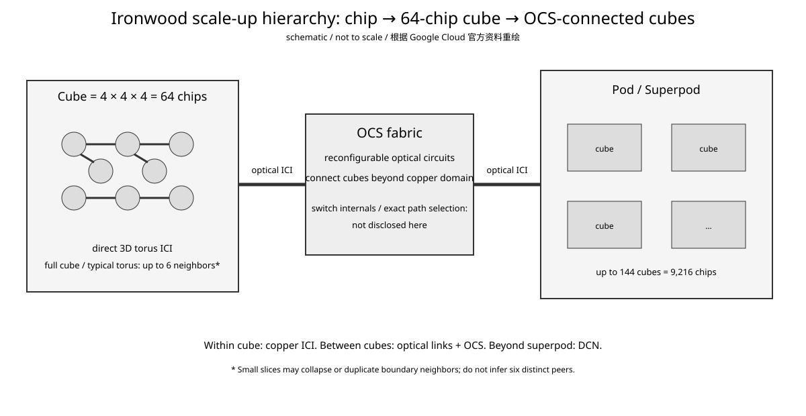

# Google TPU Day 7：ICI、64-chip Cube、3D Torus 与 OCS——Ironwood 怎么扩到 9,216 chips

- 日期：2026-09-04
- 预计学习时间：约 30 分钟
- 承接：Day 6 已建立 `local memory → on-package D2D → inter-chip ICI` 三层。今天只继续 ICI 这一层：先看 64-chip cube 内为什么是 3D torus，再看 OCS 为什么出现在 cube 之外。
- 状态与可信度：Ironwood/TPU7x 已在 Google Cloud 正式提供；64-chip cube、3D torus、每 chip 六个邻居、OCS 跨 cube、9,216-chip/144-cube superpod 均来自 Google Cloud 官方资料，可信度高。OCS 内部交换矩阵、路由算法与具体光链路物理实现没有在本文引用的一手资料中完整公开，标为 `not disclosed`。

## 今日目标

学完只要求形成一个闭环：**为什么 Google 不把 9,216 颗 TPU 做成一个巨大“全互连网络”，而是用 `3D torus cube + OCS` 分层；以及这种拓扑如何反过来决定 TP/DP/collective 的映射。**

## 1. 先固定系统尺度：Cube 是 Ironwood scale-up 的基本块

Google Cloud 官方把 `4×4×4 = 64 chips` 定义为一个 TPU cube。Ironwood 每个物理 host 连接 4 颗 TPU，因此一个 64-chip cube 对应 16 个 host。Google 当前 GKE 规划文档还公开列出了 `4×4×4`、`4×4×8`、`4×8×8`、`8×8×8`、`8×8×16`、`8×16×16` 等 Ironwood slice 拓扑。


**怎么看：**

- `A×B×C` 不是抽象 mesh 名字，而是 TPU slice 的物理三维拓扑尺寸。
- 一个 `4×4×4` cube 是 64 chips；更大的 slice 可以跨多个 cube。
- 因此 `8×8×8 = 512 chips` 可以理解成 8 个 cube 的规模，但逻辑 slice 仍暴露成一个三维拓扑。
- 这为 XLA/JAX mesh mapping 提供了一个非常具体的物理底座。

## 2. Cube 内：3D Torus 到底意味着什么

Google 官方说明 cube 内每颗 Ironwood chip 通过多个高速 ICI link 组成 direct 3D torus，每颗 chip 连接 6 个邻居，对应三个轴的正、负方向。


**怎么看：**

- 三个轴可以分别承载不同 parallel dimension，例如 data/model/expert parallelism；这不是硬性绑定，而是软件映射选择。
- torus 与普通 3D mesh 的关键差别是每个维度首尾 wrap-around，因此沿任一维切一条线天然得到 ring。
- 这就是为什么 JAX Pallas distributed tutorial 说 ring 很适合 TPU：torus 任一维的 slice 本来就是 ring。
- cube 内 ICI 使用 copper link；Cloud TPU architecture 文档明确区分了 cube 内 copper 与 cube 间 optical ICI。

## 3. 为什么不是 crossbar：从 degree 看成本

如果 64 颗 chip 做 fully connected，每颗需要面对另外 63 个直接 peer；3D torus 中每颗只维持 6 个直接邻居。

这不是说 torus 的 collective 一定更快，而是它把物理 wiring degree 固定住，使系统可以扩展。代价是非邻居通信必须经过 routing/hops。

Pallas distributed 文档也直接暴露了这个事实：sender 可以给同 pod 中没有 direct connection 的 receiver 发 remote DMA，TPU 内部 routing 会把数据逐跳送到目标；但文档明确不建议 kernel writer 随意这么做，因为无法控制 network contention。

因此 kernel 层的正确直觉不是：

```text
remote DMA = 任意 peer 都一样贵
```

而是：

```text
remote DMA API 允许任意 peer
physical topology 决定实际 path / contention
```

## 4. Cube 外：为什么需要 OCS

64-chip cube 内 direct 3D torus 已经固定了铜互连拓扑。要继续扩展，Google 没有把所有 cube 永久焊成一个不可变的大拓扑，而是让 cube 间 ICI 经过 **Optical Circuit Switch，OCS**。



**怎么看：**

- cube 内是直接 copper ICI；跨 cube 使用 optical ICI，并由 OCS 形成可重构光路。
- 官方给出的例子：256-chip pod = 4 cubes；9,216-chip superpod = 144 cubes。
- OCS 的价值不只是“光更快”，而是**拓扑可重构**：故障 cube/link 可以被 bypass，并把健康 cube 重新连成完整 circuit。
- 超过 superpod 的更大系统再通过标准 Data Center Network（DCN）连接，因此 OCS 仍属于 TPU scale-up domain，而 DCN 开始进入更远的 scale-out domain。

## 5. OCS 和 packet switch 的思维差别

这里要补一个容易混淆的网络概念。

典型 packet switch 会对 packet 做转发/排队，链路可以被不同 flow 细粒度复用；OCS 更接近“先配置一条光学 circuit，再让流量沿这个 circuit 通过”。因此 OCS 的核心能力是**重构物理连接关系**，而不是让每个 packet 动态选择输出端口。

Google 的 Ironwood 文档强调 OCS fabric manager 可以在故障时绕开 unhealthy cube/link，并重新建立只连接 healthy cubes 的 optical circuits。这是它用于大规模 TPU 的关键原因之一。

本文不进一步猜测 OCS reconfiguration latency、内部 MEMS/光学器件结构或 exact switching algorithm；这些细节在引用资料中 `not disclosed`。

## 6. Slice 为什么可以大于一个 Cube

Cloud TPU 的 `slice` 是一组通过 ICI 连在一起、供一个 workload 使用的 TPU chips。对于 3D topology，slice 由 `A×B×C` 指定。

当前 GKE 文档给出的 Ironwood例子包括：

| Topology | Chips | Hosts | Cubes |
|---|---:|---:|---:|
| `4×4×4` | 64 | 16 | 1 |
| `4×4×8` | 128 | 32 | 2 |
| `4×8×8` | 256 | 64 | 4 |
| `8×8×8` | 512 | 128 | 8 |
| `8×8×16` | 1024 | 256 | 16 |
| `8×16×16` | 2048 | 512 | 32 |

所以“cube”是物理 building block，“slice”是分配给 workload 的逻辑/物理拓扑资源；两者不是同义词。

## 7. Collective 为什么必须 topology-aware

Pallas 官方 all-gather 教程直接假设 ring topology：每轮从左邻居接收一个 shard，再把已有 shard 发给右邻居，经过 `N-1` 轮后所有 device 都得到完整 array。

这和 torus 的关系非常直接：沿 torus 任一轴取一维，就得到 ring。因此一个 3D mesh 可以把不同 collective 分配到不同轴，而不是所有流量都挤同一组 link。

对于大规模训练，可以把问题抽象成：

```text
logical mesh axes:
  data
  tensor
  expert / sequence

        ↓ mapping

physical TPU axes:
  X
  Y
  Z
```

最重要的不是给出一套永久正确的绑定，而是让**通信最重、最频繁的 parallel dimension 尽量映射到合适的物理邻接关系**。

## 8. 一个具体例子：Tensor Parallel All-Reduce

假设 TP group 沿一个 torus axis 排列。ring all-reduce 可以拆成 reduce-scatter + all-gather，每一步只和邻居交换 chunk。

粗略通信量心智模型为：

$$
V_{ring} \approx 2 \frac{N-1}{N} S
$$

其中 $S$ 是每个 device 上待 reduce 的 tensor size，$N$ 是 ring device 数。这个式子描述每个 device 的数据量级，不包含 hop contention、pipeline startup 和 OCS/cube boundary penalty。

如果 TP group 横跨不合适的物理轴甚至频繁跨 cube，API 仍然能工作，但 path 与 contention 可能恶化。因此 topology mapping 是模型并行设计的一部分，而不是 runtime 最后随便解决的细节。

## 9. NVIDIA 对照：NVSwitch fabric 与 TPU OCS 解决问题的层次不同

NVIDIA scale-up 系统常用 NVLink + NVSwitch 给 GPU 提供高带宽 fabric；大型集群再通过 InfiniBand/Ethernet scale-out。Ironwood 则是 `ICI torus + OCS` 构成 TPU 的大 scale-up domain，之后再进入 DCN。

可以这样定位：

| Google TPU | NVIDIA 对照 | 重点 |
|---|---|---|
| cube 内 direct ICI torus | direct NVLink / switch fabric 的近端通信域 | 高带宽 accelerator peer |
| OCS-connected cubes | 大规模 NVLink/NVSwitch fabric 的系统目标近似 | TPU 通过可重构光 circuit 扩大 ICI domain |
| DCN | InfiniBand / Ethernet scale-out | 更远层网络 |
| XLA/JAX mesh topology mapping | NCCL topology-aware collective + parallel mesh placement | 软件必须理解物理层次 |

这不是拓扑等价关系。NVSwitch 是 packet/switch fabric 架构，OCS 是可重构 optical circuit；不能因为都用于 scale-up 就把两者画成同一种 switch。

## 10. AI workload 映射：MoE 比 Dense TP 更容易把拓扑问题放大

Dense TP 的 collective pattern 通常比较规则，例如 all-reduce/reduce-scatter；MoE token dispatch 的 all-to-all 更容易产生跨多个 axis/cube 的流量。

因此 Ironwood 上 expert placement 的问题可以写成：

```text
谁和谁交换 token？
↓
expert group 映射到哪些 TPU mesh axes？
↓
是否跨 cube / OCS？
↓
是否和 TP/DP collective 争用同一 ICI links？
```

这也是为什么“9,216 chips aggregate bandwidth 很大”不能直接推出单个 MoE workload 的 communication 很快。实际性能取决于 mapping、routing、collective algorithm 和 contention。

## 容易混淆的点

1. **Cube = Slice？** 不是。cube 固定是 `4×4×4 = 64 chips` building block；slice 可以小于、等于或跨多个 cube。
2. **3D torus = 每颗 chip 直接连接所有 chip？** 不是。每颗 chip 有 6 个直接邻居，非邻居流量需要 routing。
3. **OCS = 普通 Ethernet switch？** 不是。这里的核心是可重构 optical circuit。
4. **9,216 chips 都在一个 copper torus？** 不是。cube 内 copper ICI；cube 间通过 optical links/OCS 扩展。
5. **remote DMA 能发任意 peer，所以 topology 不重要？** 恰好相反。Pallas 文档明确提醒非邻居 routing 的 contention 不受 kernel writer 控制。

## 结论

今天把 Ironwood scale-up 网络压成一句话：

```text
64-chip 4×4×4 direct 3D torus cube
        ↓ optical ICI
reconfigurable OCS connects cubes
        ↓
up to 144 cubes / 9,216 chips
        ↓
larger scale uses DCN
```

硬件用 torus 控制每颗 chip 的直接连接 degree，用 OCS 解决跨 cube 的规模与故障重构；软件则必须把 logical parallel mesh 映射到这个物理层次上。**Topology-aware collective 不是优化尾项，而是 TPU 大规模并行的基本约束。**

## 验收标准

1. 能解释 `cube`、`slice`、`pod/superpod` 三个概念为什么不是同义词。
2. 能解释为什么 3D torus 每颗 chip 只有 6 个直接邻居，但 remote DMA 仍可以到达非邻居。
3. 能说明 OCS 的核心价值是跨 cube 的可重构 optical circuit 与故障绕行，而不只是“使用光纤”。

**下一课：Google TPU Day 8 —— Host、PCIe 与 ICI/DCN 的边界：CPU 到 TPU 的控制/数据路径在哪里，为什么 host network 和 accelerator ICI 是两套不同问题。**

## 参考资料

1. Google Cloud, “From silicon to softmax: Inside the Ironwood AI stack”, 2025-11-06：https://cloud.google.com/blog/products/compute/inside-the-ironwood-tpu-codesigned-ai-stack/
2. Google Cloud Documentation, “TPU system architecture”, 2026-08 更新：https://docs.cloud.google.com/tpu/docs/system-architecture-tpu-vm
3. Google Kubernetes Engine Documentation, “Plan TPUs in GKE”, 2026-08/09 更新：https://docs.cloud.google.com/kubernetes-engine/docs/concepts/plan-tpus
4. JAX Documentation, “Distributed Computing in Pallas for TPUs”：https://docs.jax.dev/en/latest/pallas/tpu/distributed.html
5. Google Cloud Blog, “Training large models on Ironwood TPUs”, 2026-03-23：https://cloud.google.com/blog/products/compute/training-large-models-on-ironwood-tpus
