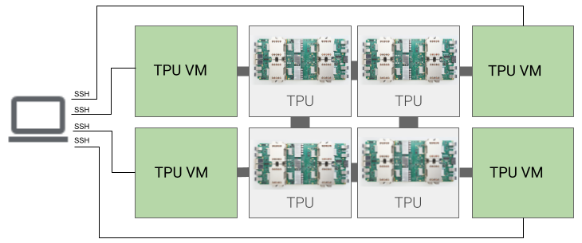
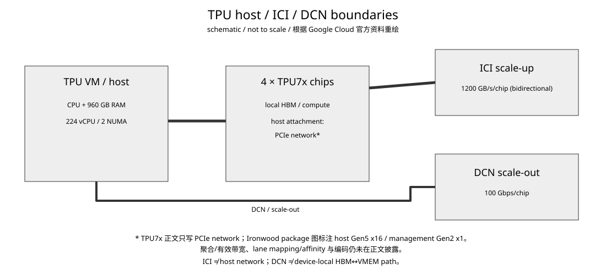
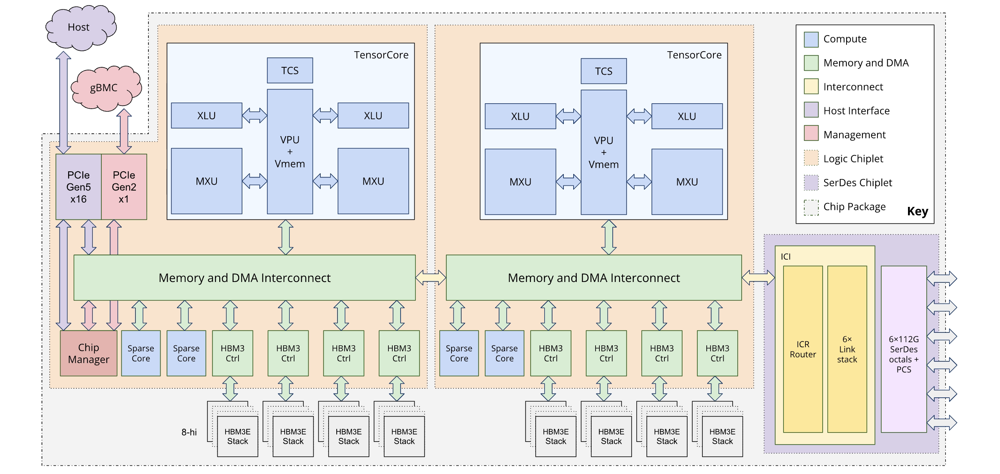
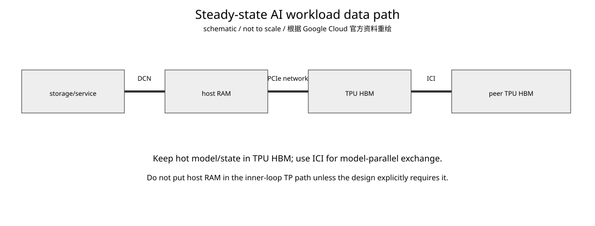

# Google TPU Day 8：Host、ICI 与 DCN 的边界——CPU 到 TPU 的数据到底走哪条路

- 日期：2026-09-18
- 资料复核：2026-09-18（TPU7x 与 TPU system architecture 页面按当前官方版本核对）
- 预计学习时间：约 30 分钟
- 承接：Day 7 已把 Ironwood scale-up 网络拆成 `64-chip cube → 3D torus ICI → OCS → superpod`。今天把 host 放回图里：TPU VM、CPU/NUMA、TPU HBM、ICI 和 DCN 分别负责什么。
- 状态与可信度：截至 2026-09-18 复核，TPU7x（Ironwood）已于 2026-03-31 GA；每 VM 4 chips、224 vCPU、960 GB host RAM、2 NUMA nodes、ICI 1200 GB/s/chip、DCN 100 Gbps/chip 均来自当前 Google Cloud 官方文档，可信度高。TPU7x 官方页面明确称每组四颗芯片通过 **PCIe network** 连接 CPU host；同代 Ironwood 官方 package 图还标出了主机侧 `PCIe Gen5 x16` 与管理侧 `PCIe Gen2 x1`。但 TPU7x 正文没有给出 host↔TPU 的聚合/有效带宽、链路映射（含 NUMA affinity）或编码细节，因此不把图示标签外推成完整 PCIe 配置。

## 今日目标

只解决三个问题：TPU VM/host 是什么；ICI 与 DCN 为什么是两张不同的网；训练/推理热数据路径为什么应该尽量留在 TPU HBM + ICI，而不是反复经过 host。

## 核心概念：先把四个域分开

先看 Google Cloud 官方的 TPU VM 架构图：它展示 SSH/host 与多个 TPU VM、TPU 设备之间的管理关系；图本身是通用 Cloud TPU 视图，不展开 TPU7x 的 PCIe 代际、链路宽度或可用带宽等具体参数。要核对 Ironwood package 级别的 `Gen5 x16 / Gen2 x1` 标签，可对照 [Day 01 保存的官方架构图](../google_tpu_day01_v2/assets/05_ironwood_architecture_official.png) 及其来源记录。



来源：[TPU architecture | Google Cloud Documentation](https://docs.cloud.google.com/tpu/docs/system-architecture-tpu-vm)，[原图静态文件](https://docs.cloud.google.com/static/tpu/docs/images/tpu-vm-architecture.png)。本地副本与许可记录见 `assets/REMOTE_IMAGES.md`。



**怎么看：**

- TPU VM 是运行 Linux、JAX/PyTorch、XLA/runtime 的 host 软件环境；Ironwood 一个 VM/host 对应 4 颗 TPU chips。
- TPU chip 有自己的 HBM；Pallas kernel 内部又把 HBM tile 搬进 VMEM 才计算，这是 device-local memory path。
- ICI 是 TPU chip 之间的 accelerator scale-up 网络，不是 CPU host network。
- DCN 是更远的数据中心网络；Google 对 multislice 的定义明确说 slice 内仍走 ICI，超出 ICI-connected slice 后使用 DCN。

## 1. TPU VM 不是“TPU 里的 CPU”

Google Cloud 把 TPU VM 定义为运行 Linux、物理连接 TPU 的 compute host VM。你可以 SSH 进去、运行任意代码，并查看 compiler/runtime log。

当前 TPU7x `tpu7x-standard-4t` 的官方规格是：

| 项目 | TPU7x 官方值 | 可信度 |
|---|---:|---|
| TPU chips / VM | 4 | Google Cloud，高 |
| vCPU / VM | 224 | Google Cloud，高 |
| host RAM / VM | 960 GB | Google Cloud，高 |
| NUMA nodes / VM | 2 | Google Cloud，高 |
| HBM / chip | 192 GiB | Google Cloud，高 |
| HBM bandwidth / chip | 7,380 GB/s | Google Cloud，高 |

因此至少存在两套 locality：

```text
CPU side:
  NUMA node 0 / node 1
  host DRAM

TPU side:
  chip-local HBM
  TensorCore-local VMEM/VREG
```

960 GB host RAM 与 4×192 GiB HBM 不能相加成一个统一 shared-memory pool。

## 2. Host↔TPU：先区分图示已知标签与正文未给出的运行参数

GPU 经验很容易让人条件反射地画：

```text
CPU ─PCIe─ GPU
```

TPU7x 官方页面在 memory hierarchy 中明确写明：每组四颗 TPU 芯片通过 **PCIe network** 连接 CPU host。Ironwood package 官方图给出两个接口标签：主机侧 `PCIe Gen5 x16`、管理侧 `PCIe Gen2 x1`。但 TPU7x 正文没有进一步给出 host↔TPU 的聚合/有效带宽、lane mapping/NUMA affinity 或链路编码。

把这两个证据层次放在同一张图上看最清楚：



来源：[TPU7x 官方页面](https://docs.cloud.google.com/tpu/docs/tpu7x)；图的本地副本与完整来源记录见 [Day 01 `REMOTE_IMAGES.md`](../google_tpu_day01_v2/assets/REMOTE_IMAGES.md)。图中接口标签是 package-level 资料，不等于 TPU7x 正文承诺的 aggregate/usable host↔TPU bandwidth。

因此本课只写：

```text
CPU/host RAM
     ↕
host↔TPU attachment (PCIe network; 图示 Gen5 x16 / Gen2 x1)
     ↕
TPU HBM
```

已确认的协议层是 `PCIe network`，而 Ironwood package 图已经给出 `Gen5 x16`（主机）与 `Gen2 x1`（管理）标签；聚合/有效带宽、链路映射/affinity 与编码仍是 `not disclosed in cited public docs`。这是刻意保留的证据边界，不把两个接口标签补成未经公布的完整拓扑或性能承诺。

## 3. ICI：accelerator scale-up data plane

Google 的 Ironwood 官方资料明确描述 TPU 之间可通过自定义 interconnect 做大规模 RDMA，让 accelerator 直接高带宽交换数据并绕过 host CPU 的 tensor 搬运。

TPU7x 当前官方双向 ICI 峰值是 **1200 GB/s per chip**。

所以 TP/EP collective 的心智模型应该是：

```text
TPU0 HBM
   ↕
ICI
   ↕
TPU1 HBM
```

而不是让每份 tensor 先回 host RAM，再由 CPU 转发。

Pallas 的 `make_async_remote_copy` 可作为这种 distributed-memory 思维的实现层例子：目标 TPU 最终获得自己的 local destination Ref，数据 movement 与 completion 由 accelerator communication mechanism 处理；它不改变 host attachment 与 ICI/DCN 的边界。

## 4. DCN：不是“慢一点的 ICI”

Google Cloud system architecture 对 multislice 的定义非常清楚：单 slice 内数据继续使用 ICI；多个 slices 之间超出 ICI connectivity 的传输使用 Data Center Network。

因此：

```text
ICI
  accelerator scale-up
  TP / EP / collective / remote transfer
  ICI-connected slice

DCN
  datacenter scale-out / services
  multislice / storage / farther communication
  beyond one ICI slice
```

TPU7x 官方规格给出 **100 Gbps DCN bandwidth per chip**。注意 ICI 是 `GB/s`，DCN 是 `Gbps`。

只做单位换算：

$$
100\ \mathrm{Gb/s} = 12.5\ \mathrm{GB/s}
$$

因此在只做单位换算的公开峰值层面是 1200 GB/s ICI 对 12.5 GB/s DCN，属于完全不同量级的资源；但两者的方向、聚合方式和有效带宽口径不同，官方没有给出可直接对齐的端到端定义，不能把它当成“96× 实测优势”。这个比较只用于建立层次感，不代表真实 workload 能达到峰值，也没有包含 latency、routing 和 contention。

## 5. 一次模型 step 到底在哪些层流动



**怎么看：**

- checkpoint、input、外部 service 数据属于 host/DCN 世界。
- 热权重、activation、KV/state 一旦进入 TPU HBM，steady-state compute 应尽量留在 accelerator domain。
- 跨 TPU shard/collective 使用 ICI；跨 slice 才进入 DCN。
- 如果 TP inner loop 每层都必须回 host RAM，host-device latency/bandwidth 就会进入关键路径。

所以以后看到“通信瓶颈”，先问：

> 这是 host-device transfer、ICI collective，还是 DCN scale-out？

不先确定 communication domain，讨论一个“通信带宽”数字没有意义。

## 6. NUMA：现在只需要知道为什么它存在

Ironwood 4-chip VM 有 2 个 NUMA nodes。这意味着 host CPU core 访问不同 host-memory region 的成本可能不同。

对 AI Infra 软件先记两个后果：

1. input preprocessing、network buffer、runtime thread placement 完全忽略 NUMA，可能制造额外 host traffic。
2. 大型 TPU kernel 的 steady-state FLOPs 不应该主要依赖 host NUMA；热路径仍应在 TPU HBM/VMEM 与 ICI。

本课不猜“哪两颗 TPU 属于哪个 NUMA node”，因为当前引用的 TPU7x 官方资料没有给出 affinity map。

## 7. NVIDIA 对照

你熟悉的 NVIDIA 服务器通常可以明确讨论：

```text
CPU DRAM
  ↕ PCIe / NVLink-C2C
GPU HBM
  ↕ NVLink / NVSwitch
peer GPU
  ↕ NIC / IB / Ethernet
remote node
```

TPU 今天建立的对应层次是：

| Google TPU | NVIDIA 粗对照 | 注意 |
|---|---|---|
| TPU VM / host RAM | CPU host / system RAM | host 软件与数据准备域 |
| host↔TPU attachment | PCIe / NVLink-C2C 的职责位置 | TPU7x 正文明确为 PCIe network；Ironwood 图示 host Gen5 x16 / management Gen2 x1，但聚合/有效带宽、映射与编码未披露 |
| ICI | NVLink/NVSwitch scale-up | accelerator peer 高带宽域 |
| DCN | IB/Ethernet scale-out | 更远网络 |
| TPU HBM | GPU HBM | device-local hot data |

到 NVIDIA 正式课程时，会把 PCIe、NVLink-C2C、NVLink/NVSwitch、GPU↔NIC、GPUDirect RDMA 分开，不再用一条“GPU 通信”概括。

## 8. AI workload 映射：Prefill / Decode

LLM request token 最初来自网络/host，但昂贵 attention/MLP 在 TPU 上执行。

Prefill 一次处理较多 token，算术强度较高；在输入规模、PCIe/host contention 等条件合适时，host→device token transfer 可能不是主要成本，但这只是 workload-dependent heuristic；模型并行产生的 ICI collective 往往更值得单独分析。

Decode 每 step 输入很小，却不断访问权重和 KV/state，因此更不能每一步把 KV 或中间 state 拉回 host，否则 host-device latency 会直接进入 token latency critical path。

合理的 steady-state 心智模型是：

```text
request/control
    host
      ↓
TPU HBM keeps model + hot state
      ↓
TensorCore compute
      ↕
ICI for model-parallel communication
      ↓
small result/control returns outward
```

后面讲 TPU 8i 的大 on-chip SRAM、KV cache 和 Collectives Acceleration Engine 时，这个“把热状态留在 accelerator domain”的逻辑会更明显。

## 易混淆点

1. TPU VM 不是 TPU device；一个 Ironwood VM 当前对应 4 TPU chips。
2. 960 GB host RAM 与每 chip 192 GiB HBM 属于不同 memory domain。
3. ICI 不是 DCN；ICI 是 scale-up，multislice 超出 ICI slice 后使用 DCN。
4. TPU7x 官方正文已把 host attachment 称为 PCIe network；Ironwood package 图示 host `Gen5 x16`、management `Gen2 x1`，但不能据此臆测聚合/有效带宽、映射或编码。
5. 100 Gbps 与 1200 GB/s 不能直接拿 100 和 1200 比。
6. RDMA 绕过 host CPU 指 tensor data path，不代表 CPU/runtime/control 消失。

## 结论

今天把 TPU 系统压成四层：

```text
host CPU / RAM / runtime
        ↓ PCIe network (图示 host Gen5 x16 / management Gen2 x1；聚合/有效带宽等细节未披露)
TPU-local HBM / VMEM / compute
        ↕ ICI
peer TPU chips in scale-up domain
        ↕ DCN when going beyond the ICI slice
other slices / datacenter services
```

ICI 与 DCN 的分离，本质上是 scale-up 与 scale-out 的分离。对 AI Infra 来说，关键不是背两个带宽数字，而是看到一次 tensor transfer 就能判断：属于哪个 domain、谁发起、经过哪些 memory、host 是否参与。

## 验收标准

1. 能画出 `host RAM → TPU HBM → ICI peer HBM`，并解释三个不同域。
2. 能解释为什么 `1200 GB/s ICI` 与 `100 Gbps DCN` 必须先统一单位，而且仍只是峰值层次比较。
3. 能区分官方正文确认的 `PCIe network`、Ironwood 图示的 `Gen5 x16 / Gen2 x1`，以及尚未披露的聚合/有效带宽、链路映射/affinity 和编码。

**后续课题（Day 9 规划，当前目录尚未提供正文）：TPU 8t vs TPU 8i——为什么第八代开始把 training 与 inference 做成两条硬件路线，以及 Boardfly、CAE、大 SRAM 分别在解决什么瓶颈。**

## 参考资料

1. Google Cloud, TPU system architecture, 2026-08 更新：https://docs.cloud.google.com/tpu/docs/system-architecture-tpu-vm
2. Google Cloud, TPU7x (Ironwood)：https://docs.cloud.google.com/tpu/docs/tpu7x
3. Google Cloud, TPU machines：https://docs.cloud.google.com/compute/docs/tpus/tpu-machines
4. Google Cloud, Plan TPUs in GKE：https://docs.cloud.google.com/kubernetes-engine/docs/concepts/plan-tpus
5. Google Cloud Blog, Inside the Ironwood TPU codesigned AI stack, 2025-11-06：https://cloud.google.com/blog/products/compute/inside-the-ironwood-tpu-codesigned-ai-stack/
6. JAX, Distributed Computing in Pallas for TPUs：https://docs.jax.dev/en/latest/pallas/tpu/distributed.html
7. Google Cloud TPU release notes：https://docs.cloud.google.com/tpu/docs/release-notes
