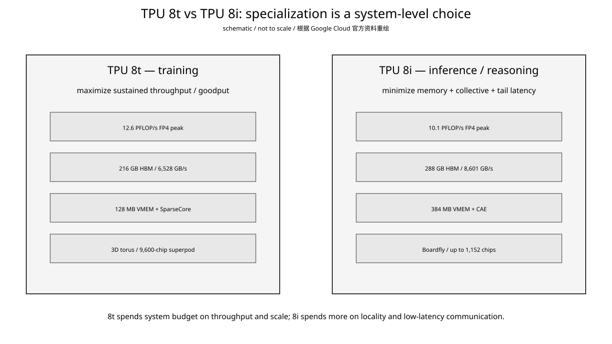
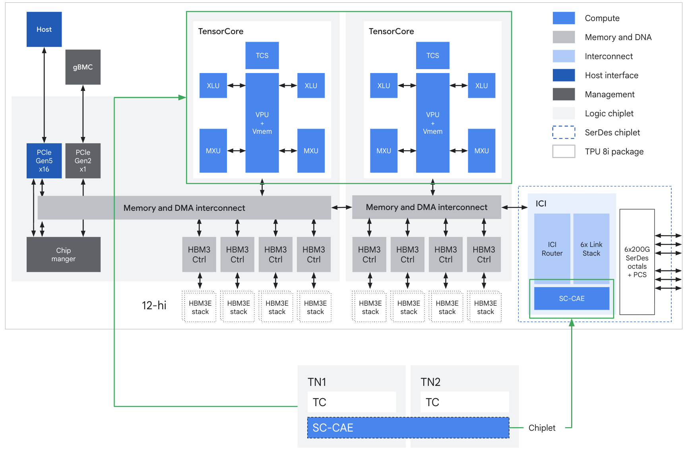
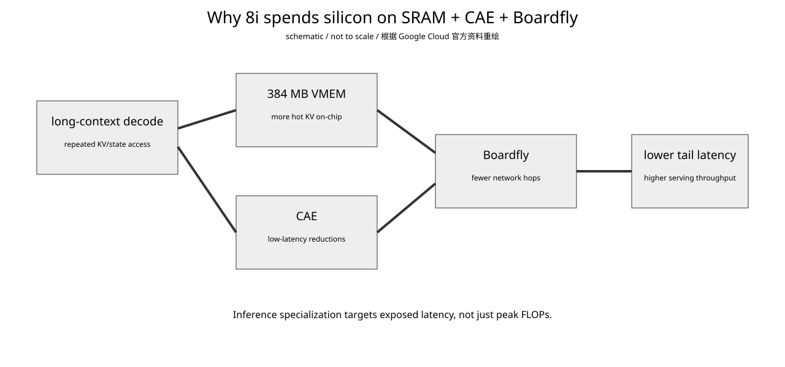
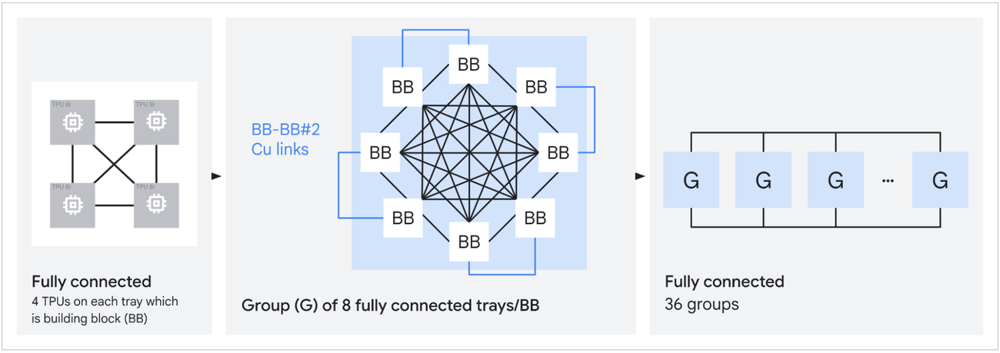
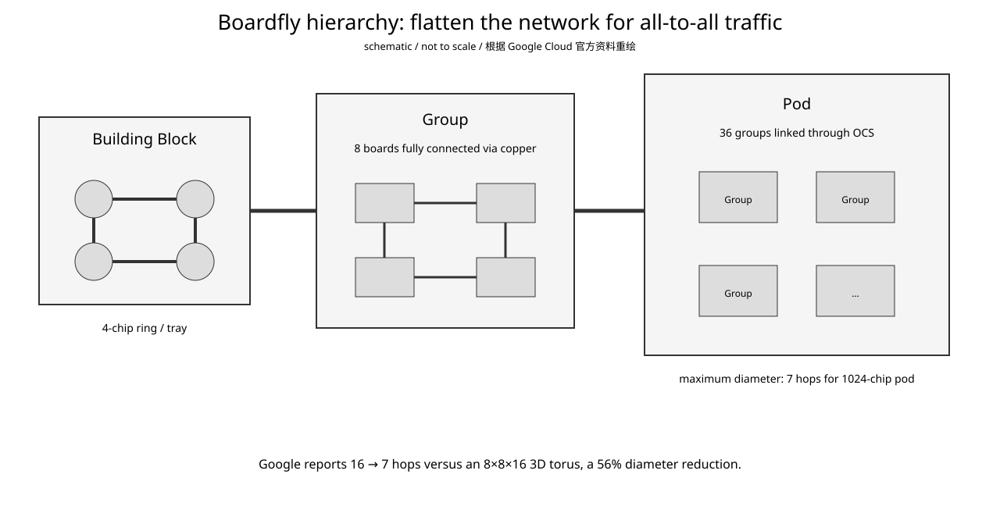
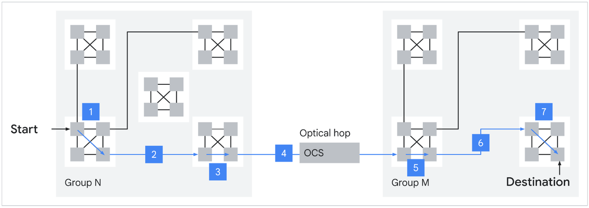

# Google TPU Day 9：TPU 8t vs TPU 8i——为什么训练和推理开始分成两套系统

- 日期：2026-09-18
- 资料复核：2026-09-18（架构指标来自 Google Cloud 2026-04-22 技术深潜；产品可用性以当前产品页为准）
- 预计学习时间：约 30 分钟
- 承接：Day 8 已把 `host → TPU HBM → ICI → DCN` 四个通信域分开。今天看第八代 TPU 为什么第一次明确拆成 8t 和 8i 两套系统：不是只换一个 TensorCore，而是同时重分配 memory、collective 和 network budget。
- 产品状态：截至 2026-09-18，Google Cloud 官方产品页仍把 TPU 8t 和 TPU 8i 标为 **Coming soon**；架构文章的公开指标不能写成已可租用产品的实测结果。
- 主要资料：Google Cloud 2026-04-22《Inside the eighth-generation TPU: An architecture deep dive》；当前 Google Cloud TPU 产品页。

## 今日目标

学完要能回答一句话：为什么 8t 的峰值 FP4 更高、规模更大，却不能因此说它一定比 8i 更适合 serving；以及为什么 8i 要同时增加 VMEM、加入 CAE、把 3D torus 换成 Boardfly。

## 1. 先看结论：这是 system specialization，不只是 ASIC SKU 分叉



**怎么看：**

- 8t 的主目标是 pre-training：持续把 MXU 喂满、扩大训练规模、提高 goodput。
- 8i 的主目标是 sampling/serving/reasoning：减少长上下文 decode 中暴露出来的 memory 与 collective latency。
- 8t 有更高 FP4 peak，但 8i 给了更多 HBM、更多 HBM bandwidth、3 倍 VMEM，以及不同的 collective/network 结构。
- 这说明 Google 的优化目标已经从单一“峰值 FLOPs”分裂成 throughput-oriented training 与 latency-oriented inference。

| Feature | TPU 8t | TPU 8i |
|---|---:|---:|
| Primary workload | Large-scale pre-training | Sampling / serving / reasoning |
| Network topology | 3D torus | Boardfly |
| Specialized feature | SparseCore + LLM Decoder Engine | CAE |
| HBM capacity | 216 GB | 288 GB |
| On-chip SRAM (VMEM) | 128 MB | 384 MB |
| Peak FP4 | 12.6 PFLOP/s | 10.1 PFLOP/s |
| HBM bandwidth | 6,528 GB/s | 8,601 GB/s |
| CPU header | Arm Axion | Arm Axion |

最值得注意的不是 12.6 vs 10.1，而是 **128 MB vs 384 MB、SparseCore vs CAE、3D torus vs Boardfly**。

## 2. TPU 8t：为什么训练仍然喜欢 3D torus

Google 把 8t 定位成大规模 pre-training 和 embedding-heavy workload 的机器，单个 superpod 可扩到 9,600 chips。

官方 TPU 8t ASIC block diagram：


**怎么看：**

- 8t 仍保留 SparseCore，因为 embedding / irregular access 对训练场景仍然重要。
- Google 特别强调 VPU/MXU overlap：量化、softmax、layernorm 等 vector work 尽量和 matrix multiply 重叠，目标是提高 provisioned FLOPs utilization。
- 原生 FP4 一方面提高 MXU throughput，一方面降低参数搬运量。
- 网络仍是 3D torus，因为大规模 dense training 有大量规则、可 pipeline 的 neighbor/ring-style collective，吞吐比单次 all-to-all tail latency 更重要。

8t 的思路可以压成：

```text
huge GEMM / embedding / collective stream
  ↓
keep MXU utilization high
  ↓
scale to thousands of chips
  ↓
optimize sustained throughput / goodput
```

Google 同时给 8t 配套 Virgo scale-out network、TPUDirect RDMA 和 TPUDirect Storage，说明训练系统优化的是“持续供给”：算力、embedding、网络、storage 都不能让芯片等数据。

## 3. TPU 8i：为什么 384 MB VMEM 比再堆一点 FLOPs 更值钱

官方 TPU 8i ASIC block diagram：



**怎么看：**

- 8i 仍有两个 TensorCore on-core dies，但 chiplet die 上加入一个 CAE。
- Google 明确说 CAE 替代了 Ironwood core dies 上的四个 SparseCore；这是 silicon budget reallocation。
- 8i VMEM 提高到 384 MB，是 8t 的 3 倍；HBM 也增加到 288 GB，带宽提高到 8,601 GB/s。
- 所以 8i 不是“削掉训练单元后的廉价 TPU”，而是把面积和系统资源重新花到 serving 更敏感的 locality 与 synchronization 上。

长上下文 decode 可以粗略写成：

$$
T_{token} \approx T_{memory} + T_{compute} + T_{collective} + T_{network} + T_{runtime}
$$

训练的大 GEMM 容易摊薄固定延迟；decode 每 step 工作量小且串行依赖强，memory/collective/network 等待更容易直接暴露到 token latency。

因此更大的 VMEM 做的是：

```text
larger hot working set
        ↓
less exposed HBM traffic / latency
        ↓
less core idle during long-context decode
```

不要把“384 MB VMEM 能放更大 KV cache”误读成“任意大型模型的完整长上下文 KV 都能永久装进 384 MB”；实际取决于模型 shape、batch、context、dtype 和分片。

## 4. CAE：为什么推理需要专用 collective engine



**怎么看：**

- 大 SRAM 解决 locality。
- CAE 解决 core 间 reduction/synchronization 的 exposed latency。
- Boardfly 解决 chip 间 all-to-all 的 hop/tail latency。
- 三项对应 decode critical path 的不同等待源。

Google 说 CAE 针对 autoregressive decode 与 chain-of-thought 中的 reduction/synchronization，官方声称可把 on-chip collective latency 降低 **5×**。

为什么可以拿 SparseCore budget 换 CAE？因为 8i 的目标不是 embedding-heavy pre-training，而是高并发 sampling/serving；短小而频繁的 synchronization/reduction 更可能落进 latency critical path。

专用加速器的核心 tradeoff 不是“多了一个新单元”，而是：**workload 变了，同一块 silicon area 的收益排序也变了。**

## 5. Boardfly：为什么 3D torus 到推理这里突然不够好了

Google 官方 Boardfly topology：



本地简化图：



**怎么看：**

- 最底层 building block 是 4-chip ring。
- 8 个 boards 再通过 copper 做成高连通 group。
- 36 个 groups 通过 OCS 连接成 pod。
- 目标不是全 pod 每颗 chip 直接互连，而是提高 radix、降低全局 network diameter。

Google 用 1024-chip 场景给了直观对照。

对于 `8×8×16` 3D torus：

$$
D_{torus} = \frac{8}{2} + \frac{8}{2} + \frac{16}{2} = 16
$$

Boardfly 对同规模 pod 把最大 diameter 降到 **7 hops**，Google 给出的降幅是 56%。

官方最大 hop 示意：



MoE token routing 更接近任意 source 找任意 expert，因此 hop count、contention 和 tail latency 比规则 ring collective 更敏感。Google 报告 Boardfly 对 communication-intensive workloads 可提供 **最高 50% latency improvement**；这是特定 workload claim，不代表所有 collective 恒定快 50%。

## 6. 为什么 8i pod 反而比 8t 小很多

8t：

```text
9,600 chips / superpod
3D torus
target: enormous training throughput
```

8i：

```text
up to 1,152 chips
Boardfly
target: low-diameter serving domain
```

训练 job 本身可能需要数千 chips，因此扩大一个高带宽 scale-up domain 很值。

Inference 更关心大量 latency-sensitive requests；若把 serving domain 无限扩大，network diameter 和 tail latency 会反噬单 token 延迟，因此 8i 选择相对小而扁平的高-radix topology。

## 7. NVIDIA 对照

这里不展开 NVIDIA 正课，只建立锚点。

NVIDIA 也在把 collective/data movement 的一部分从通用 SM 和软件层下沉到 NVLink/NVSwitch、NVLS/SHARP 类 collective acceleration，以及更专门的 memory/data-movement 结构。

但不要把 TPU 8i CAE 直接等同于 NVSwitch/NVLS：

```text
TPU 8i CAE
  chip 上的 collective/synchronization acceleration

Boardfly + ICI
  chip-to-chip low-diameter communication

NVIDIA NVLink/NVSwitch/NVLS
  另一套 scale-up fabric + collective acceleration
```

共同设计原则是：**collective latency 一旦进入模型关键路径，就不能只靠通用 compute core + 软件 library 去吞掉。**

## 8. AI workload 映射：MoE decode

假设一个 MoE 模型每 token 需要 router → expert dispatch → expert compute → combine/reduction → 下一 token。

8i 的三项改动正好压这条链：

```text
384 MB VMEM
  → router / KV / local hot state locality

Boardfly
  → expert dispatch fewer hops

CAE
  → combine / reduction / synchronization latency
```

这比单纯把 FP4 从 10.1 再提高到 12.6 PFLOP/s 更直接作用在 token critical path。

因此推理芯片不能只看 FLOPs 和 HBM bandwidth，还要看 on-chip working set、collective startup/synchronization、network diameter、tail latency、batch 和 concurrency。

## 易混淆点

1. TPU 8t/8i 截至 2026-09-06 仍不是 GA，官方页是 `Coming soon`。
2. 8i FP4 peak 更低不代表“阉割版”；它把资源分给 VMEM、HBM bandwidth、CAE 和 Boardfly。
3. 384 MB VMEM 只能说明扩大 on-chip KV working set，不能脱离模型 shape 宣称完整 KV 永远全放下。
4. Boardfly 不是全 pod fully connected，而是 hierarchical high-radix topology。
5. 16→7 hops 是 Google 对 1024-chip `8×8×16` torus 与 Boardfly 的特定比较。
6. CAE 不是网络交换机；CAE 在 chip 上，Boardfly/ICI 才是 chip 间网络层。
7. 推理不只是 memory-bound；reasoning/MoE decode 还可能被 synchronization、all-to-all 和 tail network latency 卡住。

## 结论

第八代 TPU 的核心不是“同一芯片做两个 SKU”，而是 Google 正式承认训练与推理的 operational intensity 已经分裂：

```text
TPU 8t
  FLOPs utilization
  embeddings
  giant scale
  sustained throughput
  3D torus

TPU 8i
  KV / state locality
  frequent collectives
  MoE all-to-all
  low tail latency
  Boardfly + CAE + 3× VMEM
```

以后看任何 inference accelerator，都应该问：**为了 token critical path，它把 silicon 和 network budget 从哪里挪到了哪里？**

## 验收标准

1. 能具体说出 8t/8i 至少三处硬件/系统差异及其 workload 原因。
2. 能解释 Boardfly 为什么对 MoE/all-to-all 比 3D torus 更有吸引力，并说清 16→7 hops 的适用条件。
3. 能解释 384 MB VMEM + CAE + Boardfly 是三层不同优化，而不是同一个“通信优化”。

**下一课：Google TPU Day 10 —— SparseCore、CAE 与专用旁路单元：Google 为什么不断把 embedding、collective、decoder 辅助工作从 TensorCore 主路径剥离出去。**

## 参考资料

1. Google Cloud, “Tensor Processing Units (TPUs)”, 2026-09-06 检索：https://cloud.google.com/tpu
2. Google Cloud Blog, “Inside the eighth-generation TPU: An architecture deep dive”, 2026-04-22：https://cloud.google.com/blog/products/compute/tpu-8t-and-tpu-8i-technical-deep-dive
3. Google Cloud Blog, “AI infrastructure at Next ’26”, 2026：https://cloud.google.com/blog/products/compute/ai-infrastructure-at-next26
4. Google Cloud Blog, “Welcome to Google Cloud Next ’26”, 2026：https://cloud.google.com/blog/topics/google-cloud-next/welcome-to-google-cloud-next26
5. Google Cloud TPU release notes：https://docs.cloud.google.com/tpu/docs/release-notes
6. Kim et al., “Technology-Driven, Highly-Scalable Dragonfly Topology”, Google-hosted paper：https://static.googleusercontent.com/media/research.google.com/en//pubs/archive/34926.pdf
