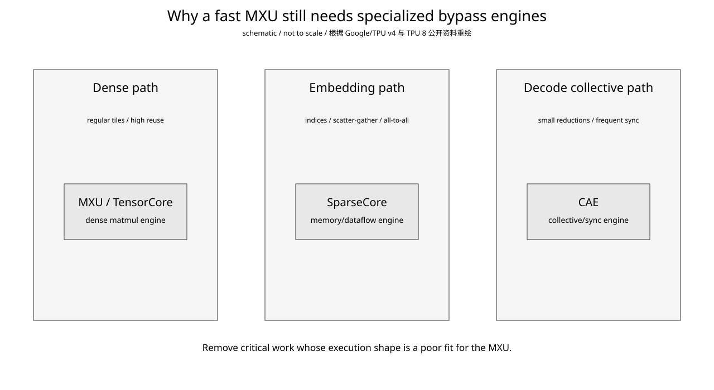
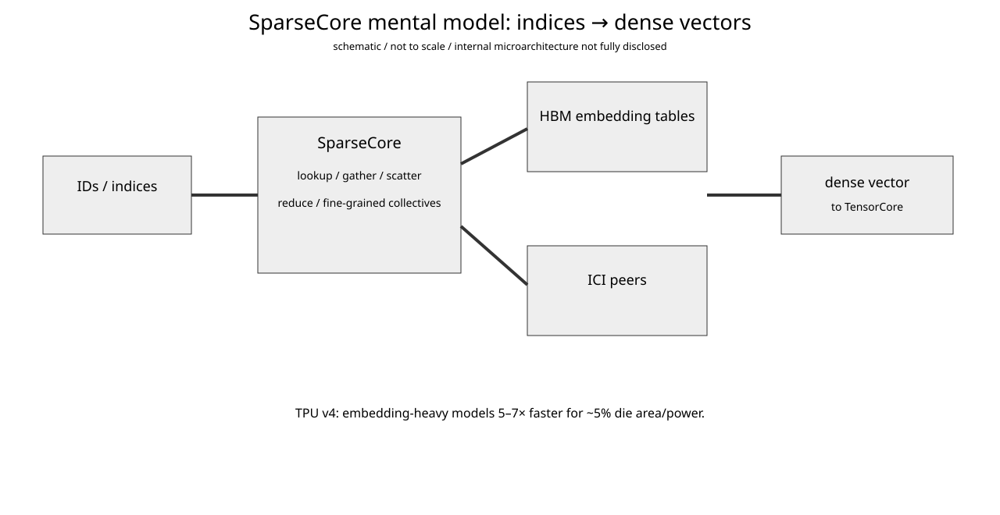
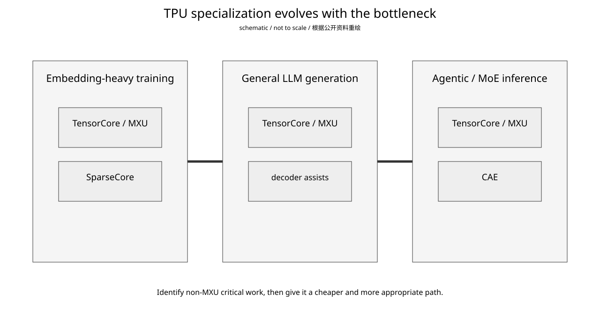

# Google TPU Day 10：SparseCore、CAE 与“旁路专用单元”——为什么不能让 MXU 什么都干

- 日期：2026-09-18
- 资料复核：2026-09-18（SparseCore/CAE 职责与公开指标按 Google Cloud 当前资料核对）
- 预计学习时间：约 30 分钟
- 承接：Day 9 已看到 TPU 8t/8i 的 system specialization：8t 保留 SparseCore，8i 则用更大的 VMEM、CAE 和 Boardfly 去压 inference critical path。今天不再比较规格，而是回答更底层的问题：**为什么一颗已经有高吞吐 MXU/TensorCore 的 TPU，还要不断在旁边加 SparseCore、decoder assist、CAE 这类专用单元？**
- 证据主线：TPU v4 ISCA 2023 论文、Google Cloud 2026 TPU 8 technical deep dive、JAX TPU Embedding 开源项目。

## 今日目标

今天只建立一个可迁移的 accelerator 设计判断：当某类工作的重要性很高，但它的执行形态与主矩阵引擎严重不匹配时，最合理的做法往往不是继续增强主核心，而是把这类工作剥离到一个更便宜、更合适、能并行工作的旁路引擎。

学完后要能把 SparseCore 和 CAE 看成同一种设计方法的两个不同时代实例。

## 1. MXU 很快，但“快”有适用条件



**怎么看：**

- MXU 擅长规则 tile、连续/可预测的数据流和大量 multiply-accumulate。
- embedding lookup 几乎是反面：给一串 IDs，到大表里做间接寻址，再 gather/scatter，还经常跨 shard。
- autoregressive decode 的小 collective 又是另一种反面：计算量不大，但 reduction/synchronization 启动频繁，而且 latency 直接暴露在下一 token 前。
- 因此把这些工作“也交给 MXU”并不代表资源复用，反而可能让昂贵的 dense compute pipeline 等待不擅长的工作。

最简单的 roofline 直觉仍然有效：

$$
AI = \frac{\text{operations}}{\text{bytes moved}}
$$

Dense GEMM 的 arithmetic intensity 可以很高；embedding lookup 往往 operation 少、indirect bytes 多；小 collective 甚至主要不是算术问题，而是 synchronization / movement latency。

## 2. SparseCore 到底在解决什么：不是“稀疏矩阵乘”

SparseCore 最容易被名字误导。Google 在 TPU 8t 的官方描述里给出的核心问题是 embedding lookup 的 **irregular memory access**，并伴随 data-dependent all-gather 等 collective；SparseCore 把这类工作从 MXU 主路径卸载出去。

JAX TPU Embedding 的公开 README 也把 SparseCore 定义为专门面向 irregular、sparse memory access/computation 的 tiled processor，典型 workload 是 recommendation model 中的大规模 embedding lookup。

因此更正确的心智模型是：

```text
SparseCore ≠ sparse Tensor Core

SparseCore ≈
  indirect address / lookup dataflow
  + gather / scatter / reduction
  + fine-grained distributed data movement
```

至于它内部到底有多少 tile、怎样发 HBM transaction、router 怎么组织，Google 没有在当前这些软件/产品资料里完整公开；今天不靠二手推断去补 floorplan。

## 3. 一个 embedding lookup 为什么会把 dense core 卡死

假设巨大 embedding table：

$$
E \in \mathbb{R}^{N \times D}
$$

输入是一批离散 ID：

$$
i_0, i_1, \ldots, i_k
$$

forward 主要做：

$$
y = \mathrm{reduce}(E[i_0], E[i_1], \ldots, E[i_k])
$$

如果 table 被 sharding 到多个 TPU，一次 batch 可能变成：

```text
IDs
 ↓
figure out owner shard
 ↓
all-to-all / remote gather
 ↓
HBM indirect reads
 ↓
local reduce
 ↓
dense embedding vector
 ↓
TensorCore MLP / attention
```

其中真正的乘加很少，地址生成、远程数据移动和 memory bandwidth 占比很高。



**怎么看：**

- SparseCore 的输入首先是 indices，而不是规则 GEMM tile。
- 它围绕 HBM embedding table 和 ICI peer 做 data movement。
- 最终输出重新变成 dense vector，再进入 TensorCore 擅长的阶段。
- 它的价值不是“把同一段代码跑快”，而是改变谁负责哪一段 dataflow。

## 4. 为什么约 5% 面积/功耗能换来 embedding-heavy 模型 5–7×

TPU v4 ISCA 2023 论文给出一个非常典型的 domain-specific accelerator ROI：SparseCore 对依赖 embeddings 的模型带来 **5–7×** 加速，同时大约只占 **5% die area 和 power**。

这不是说 SparseCore 自己“单位面积快 100 倍”，而是原系统存在严重 Amdahl bottleneck。

假设：

$$
T = T_{dense} + T_e
$$

继续把 MXU 翻倍，只会继续压已经较短的 $T_{dense}$；如果 SparseCore 显著压低 embedding 时间 $T_e$，整体 speedup 反而巨大。

所以 accelerator 的正确问题常常不是“哪个 execution unit FLOPs/W 最高”，而是“哪段剩余时间正在让最贵的 execution unit 空等”。

## 5. “旁路”还意味着 overlap

如果 embedding 与 dense compute 串行共享主路径：

```text
lookup
  ↓
wait
  ↓
MXU compute
```

剥离后，系统有机会变成：

```text
SparseCore: next embedding lookup  ─────────→
TensorCore:        current dense compute ───→
```

真正获得的是 **functional overlap**。

这和 CUDA kernel 中 cp.async/TMA 的设计思想有相似处：不是同一层实现，但都是尽量让“搬/等/同步”和“算”由不同资源并行推进。

## 6. CAE：同一个原则，但 bottleneck 变了

到了 TPU 8i，Google 做了明显的 silicon reallocation。官方明确写道：每个 8i chip 有两个 Tensor Core on-core dies，并在 chiplet die 上放一个 CAE；这个 CAE **replacing four SparseCores**，针对 autoregressive decoding / chain-of-thought 中的 reduction 和 synchronization，Google 给出的 on-chip collective latency 改善是 **5×**。

所以：

```text
旧 bottleneck:
embedding / irregular gather
        ↓
SparseCore

新 bottleneck:
small/frequent collective + synchronization
        ↓
CAE
```

这不是 SparseCore 被证明没用，而是 8i 面向的 workload priority 变了；8t 仍保留 SparseCore。

## 7. SparseCore 和 CAE 的共同结构



| | SparseCore | CAE |
|---|---|---|
| 主 bottleneck | irregular embedding access | reduction / synchronization |
| 算术密度 | 低 | 低 |
| 对 MXU 匹配度 | 差 | 差 |
| 主要资源 | address/data movement | collective/sync path |
| 常见等待 | HBM/ICI irregular traffic | collective startup / dependency |
| 目的 | 让 dense core 少等 embedding | 让 dense core 少等 collective |
| 典型 workload | recommendation / embedding-heavy training | autoregressive reasoning / serving |

抽象后的模板是：

```text
profile workload
 ↓
find high-frequency non-MXU critical section
 ↓
check stable semantics
 ↓
build specialized path
 ↓
overlap it with main compute
 ↓
return dense/result state to TensorCore
```

## 8. 为什么不是把所有东西都做成专用硬件

specialization 也有成本：silicon area、power、compiler/runtime 支持、同步与一致性设计、verification，以及 workload 变化后 stranded silicon 的风险。

因此最值得硬化的工作通常满足：

```text
frequent
× expensive on critical path
× structurally stable
× poor fit for general unit
× can be isolated behind a clean interface
```

embedding lookup 满足；autoregressive collective 现在也越来越满足。

## 9. 软件工程师真正该关心的四件事

第一，**谁决定 op 映射到专用 engine**。JAX TPU Embedding 把 embedding 配置、input preprocessing 和 SparseCore execution 暴露给软件栈；TPU 8 deep dive 也明确把 Pallas/Mosaic 作为触达低层硬件性能的重要入口。

第二，**layout/sharding 是否匹配**。embedding table 如何 shard、IDs 如何 preprocess，会决定 SparseCore dataflow；CAE 同样要求 collective pattern 能映射到支持路径。

第三，**是否真的 overlap**。如果 TensorCore 仍在等，问题可能在 SparseCore、ICI/HBM、dependency schedule 或 input pipeline，不能看到“用了专用 engine”就认定 bottleneck 消失。

第四，**主核心利用率和 E2E 是否改善**。最终指标是 `TensorCore idle ↓ / critical path ↓ / E2E throughput or latency ↑`，不是旁路单元自身 utilization。

## 10. NVIDIA 对照：不要只盯 Tensor Core

NVIDIA 系统里同样有大量“把非主算术工作移出去”的机制：copy/data movement engine、TMA、NIC/DMA/RDMA、NVSwitch/NVLS/SHARP 类 collective offload 等。

它们和 SparseCore/CAE 不一一对应，但设计问题完全一致：**哪些工作继续占 SM 最划算，哪些应该让专门硬件承担？**

进入 NVIDIA 平台后，我们会用官方文档、论文、SASS/CUTLASS 和专利来判断每条旁路在哪里、谁发命令、谁搬数据、谁负责 completion。

## 11. AI workload 映射：MoE decode

一层 MoE decode 可以粗略写成：

```text
router
 ↓
token dispatch
 ↓
expert GEMM
 ↓
combine/reduction
 ↓
next layer
```

真正适合 MXU 的主要是 expert GEMM；router metadata、token movement、all-to-all、reduction、synchronization 算力并不大，却可能卡住整个 token dependency chain。

现代 inference accelerator 因而越来越像：

```text
main matrix engine
+
large local memory
+
data movement engines
+
collective engines
+
low-diameter scale-up fabric
```

而不是无限堆更多 matrix FLOPs。

## 易混淆点

1. SparseCore 不是稀疏矩阵 Tensor Core；公开主用途是 embedding/irregular access/data-dependent gather/collective。
2. SparseCore 5–7× 不是所有 TPU workload 都快 5–7×，而是 embedding-heavy models。
3. 5% area/power 不等于完整 microarchitecture 已公开。
4. CAE 替换部分 SparseCore 不说明 embedding 不重要；8t 仍保留 SparseCore。
5. CAE 不是 Boardfly；CAE 在 chip 上，Boardfly/ICI 是 chip 间网络。
6. 专用 engine 不是越多越好，必须有稳定且高价值的 critical-path workload。
7. hardware offload 后软件更重要，而不是更不重要：sharding/layout/compiler mapping/overlap 决定 E2E 收益。

## 论文阅读导航：只读 5 分钟

### TPU v4 ISCA 2023

为什么现在看：这是 Google 公开解释 SparseCore ROI 最权威的一手论文。

只看：

- Abstract：找到 `SparseCores ... 5x–7x ... 5% of die area and power`。
- SparseCore/embedding performance 对应的小节或图：只确认“没有 SparseCore 时 embedding-heavy workload 为什么重新落回 memory/system bottleneck”。

看完必须知道：SparseCore 的价值来自消除系统 bottleneck，而不是增加 peak arithmetic throughput。

论文入口：https://arxiv.org/abs/2304.01433

## 结论

今天真正需要记住的只有一条：**主矩阵核心越强，越需要把不适合矩阵核心的工作移出去。**

SparseCore 把 irregular embedding dataflow 移出去；CAE 把 latency-sensitive collective/synchronization 移出去；Boardfly 再把远端 communication hop 压下去。

TPU 的演进不是：

```text
MXU → 更大的 MXU → 再更大的 MXU
```

而更接近：

```text
fast MXU
+
memory/data-movement/collective specialization
+
compiler/runtime 把 workload 拆到正确的 engine
```

## 验收标准

1. 能解释为什么 embedding lookup 的执行形态和 dense GEMM 根本不同，以及 SparseCore 为什么不是“另一个 Tensor Core”。
2. 能用 Amdahl's Law 解释“约 5% area/power 的 SparseCore 为什么可能给 embedding-heavy model 带来 5–7× 收益”。
3. 能把 SparseCore → CAE 的变化解释成 silicon budget 随 workload bottleneck 迁移，而不是简单代际升级。

**下一课：Google TPU Day 11 —— XLA/JAX/Pallas/Pathways 如何把同一个模型拆到 TensorCore、SparseCore/CAE、ICI 和多 host：把 Google 的软件栈和前十天硬件重新串成一条执行链。**

## 参考资料

1. Google Cloud Blog, “Inside the eighth-generation TPU: An architecture deep dive”, 2026-04-22：https://cloud.google.com/blog/products/compute/tpu-8t-and-tpu-8i-technical-deep-dive
2. Norman P. Jouppi et al., “TPU v4: An Optically Reconfigurable Supercomputer for Machine Learning with Hardware Support for Embeddings”, ISCA 2023 / arXiv:2304.01433：https://arxiv.org/abs/2304.01433
3. jax-ml/jax-tpu-embedding, “JAX TPU Embedding (JAX SparseCore)”：https://github.com/jax-ml/jax-tpu-embedding
4. Google Cloud Blog, “Updates to AI Hypercomputer software stack”：https://cloud.google.com/blog/products/compute/updates-to-ai-hypercomputer-software-stack/
5. Google Cloud, Tensor Processing Units：https://cloud.google.com/tpu
