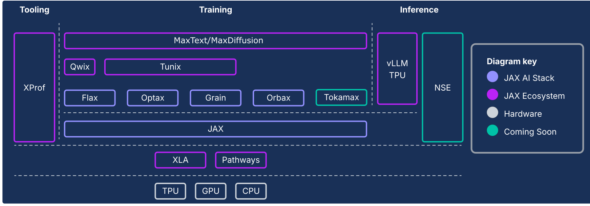
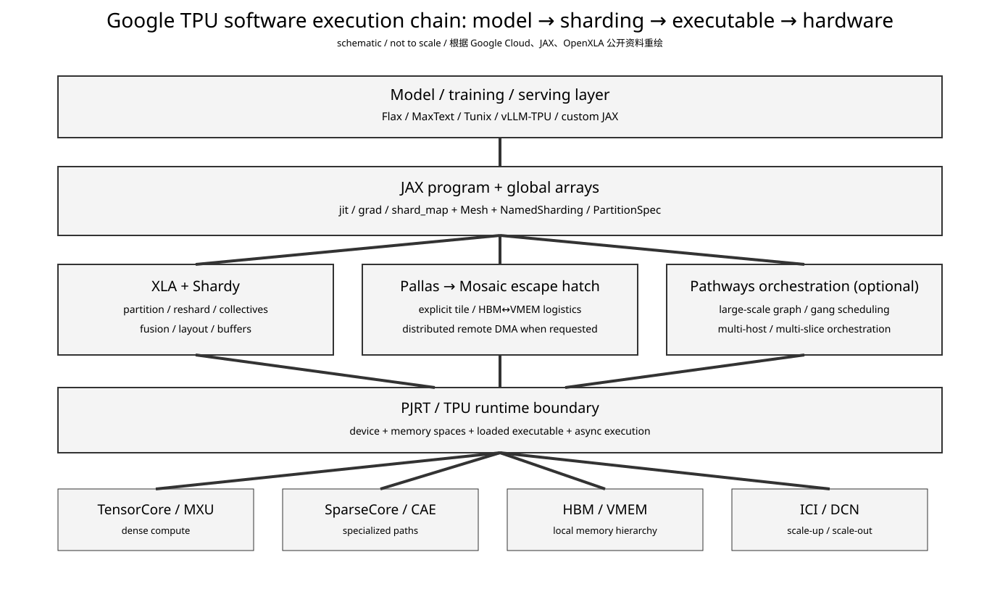
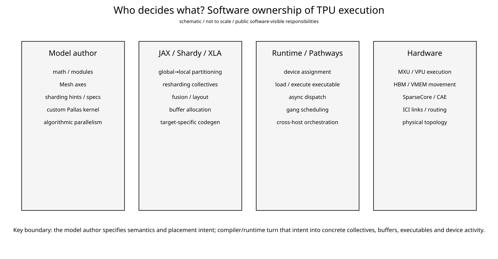
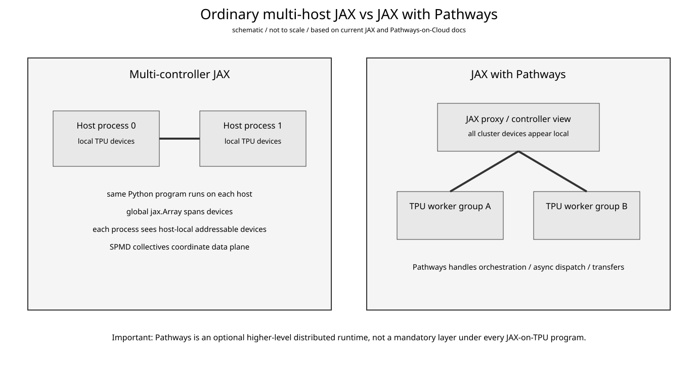

# Google TPU Day 11：从 JAX 一行代码到 TPU 集群——XLA、Shardy、Pallas、PJRT 与 Pathways 到底谁管哪一层

- 日期：2026-09-18
- 资料复核：2026-09-18（JAX/Pathways/PJRT 文档与软件栈图按当前官方页面核对）
- 预计学习时间：约 30 分钟
- 承接：前十天已经把 TensorCore/MXU、HBM/VMEM、ICI/OCS/DCN、SparseCore/CAE、8t/8i specialization 分开看过。今天把这些硬件重新接回软件：**同一个 JAX 模型是怎样变成局部 executable、collective、远程数据移动以及多 host 执行的。**
- 当前软件状态：Google Cloud 当前 JAX AI stack 文档把 JAX、XLA、Pathways、Pallas、Tokamax、Qwix、Orbax、Grain、MaxText/Tunix/vLLM/XProf 放进同一可组合栈；JAX 当前 partitioning 主线已迁到 Shardy；OpenXLA 2026-06 的 PJRT 文档继续把 PJRT 定义为 framework 与 device backend 之间的统一 Device API。
- 这一课最重要的修正：**Pathways 不是所有 JAX-on-TPU 程序必经的一层。** 普通 multi-host JAX 可以直接通过 JAX/XLA/PJRT 做 SPMD；Pathways 是更高一层的大规模 orchestration/runtime 选择。

## 今日目标

今天只解决五个边界：

1. `Mesh / NamedSharding / PartitionSpec` 到底描述什么。
2. Shardy/XLA 什么时候插入 collective、什么时候做 fusion/layout/buffer planning。
3. Pallas/Mosaic 是在绕开 XLA，还是嵌回 XLA。
4. PJRT 为什么更像 CUDA Runtime/Driver 的“device API 边界”，但又不完全等价。
5. Pathways 在普通 multi-host JAX 之上额外解决了什么。

## 1. 先看 Google 官方软件栈：不是一根直线

Google Cloud 当前官方 JAX AI stack 图：



**怎么看：**

- JAX 是模型与 program transformation 的核心层。
- XLA 位于基础设施层，负责把高层数值程序编译到 TPU/GPU/CPU。
- Pathways 和 XLA 并列出现在 infrastructure，而不是画成 `JAX → XLA → Pathways → TPU` 的固定流水线。
- MaxText/Tunix/vLLM 是更上层应用；Pallas/Tokamax 是向下获取硬件控制的 escape hatch。

Google 官方另一张图甚至直接把抽象级别画成连续谱：


**怎么看：**

```text
NumPy + jit
  ↓ more control
jit + sharding hints
  ↓
shard_map + collectives
  ↓
Pallas kernels
  ↓
FFI
```

越往下，编译器替你决定的越少；你承担的 layout、communication、kernel correctness 越多。

## 2. 整条执行链先压成一张图



这张图里最重要的是三个并行分支：

```text
JAX program
   ├─ XLA/Shardy：绝大多数普通算子和 distributed partition
   ├─ Pallas/Mosaic：需要自定义 kernel/data movement 的局部
   └─ Pathways：需要更大规模 orchestration 时的可选 runtime
```

它们最后都必须落回“设备、内存、可执行程序、通信”这些 concrete resource。

## 3. `Mesh + PartitionSpec`：它不是 topology，而是全局数组的布局合同

JAX 当前文档给了一个很关键的定义：

> `Sharding` 描述一个数组的元素怎样存放在不同 physical device memories 中。

例如：

```python
mesh = Mesh(devices.reshape(8, 4), ("data", "model"))
sharding = NamedSharding(mesh, P("data", "model"))
```

这表达的是：

```text
global tensor dimension 0
  → shard over mesh axis "data"

global tensor dimension 1
  → shard over mesh axis "model"
```

它没有直接说：

```text
packet must travel through ICI link X
router chooses path Y
```

也没有说：

```text
this all-reduce must use ring
```

所以正确分层是：

```text
Mesh / PartitionSpec
    logical placement + sharding intent
             ↓
partitioner/compiler/runtime
    turn intent into reshard + collectives
             ↓
physical topology
    actual device/link execution
```

这和 CUDA 里你写一个 tensor parallel layout 后，NCCL 最终怎么选 channel/ring/tree 的层次区别很像。

## 4. 2026 年要把 GSPMD 更新成 Shardy 心智模型

你如果看旧 TPU/JAX 材料，会不断看到 GSPMD。

但 JAX 当前 migration 文档明确说，Shardy 是 Google DeepMind Model Scaling 团队与 XLA 团队共同开发的新 partitioning system，用来替代 GSPMD 和 PartIR；迁移计划在 **2026 年 3 月完成后，Shardy 成为 JAX 的唯一 partitioner**。

所以现在更合适的心智模型是：

```text
JAX sharding annotations
        ↓
Shardy
  propagate / decide sharding
  insert or avoid resharding
  materialize collectives
        ↓
XLA backend optimization/codegen
```

这不代表 GSPMD 论文没用了。GSPMD 仍然是理解 SPMD partitioning 思想的经典资料，但读当前代码/文档时，不应该再把它当成唯一的 active user-facing partitioner。

## 5. 一个 `x @ w` 怎么变成多 TPU collective

假设：

```text
x: [B, K]
w: [K, N]

mesh axis:
  tp = 8
```

如果 `w` 沿 $N$ 分到 8 个 TPU：

$$
W = [W_0, W_1, \ldots, W_7]
$$

每个 device 本地可以做：

$$
Y_i = X W_i
$$

最终得到的是 column-sharded output：

$$
Y = [Y_0, Y_1, \ldots, Y_7]
$$

如果下一层允许继续按这个 sharding 消费，那么可能无需立刻 gather。

但如果下一层要求 replicated $Y$，partitioner 必须引入 reshard：

```text
local matmul
   ↓
collective / all-gather
   ↓
replicated Y
```

所以 communication 不是“模型里有 TP，所以固定发生一次 NCCL-like op”，而是由：

```text
producer sharding
vs
consumer sharding
```

的 contract 决定。

这也是 JAX 文档为什么提醒：输入的 physical distribution 和 `shard_map` 期望的 logical distribution 不一致时，会先发生 potentially expensive reshard。

## 6. XLA 负责的不只是“把 Python 编成机器码”



把 XLA 看成 `nvcc` 会太窄。

在 TPU stack 里它至少承担：

```text
graph-level optimization
operator fusion
layout decisions
buffer allocation / memory planning
SPMD partition result lowering
target code generation
```

Google 2026 TPU 8 deep dive 甚至明确说：

> XLA 在幕后处理 Boardfly topology 与 CAE synchronization 的复杂翻译。

这句话的工程意义不是“XLA 知道所有物理电路细节”，而是高层 JAX/PyTorch 代码不需要自己手写 Boardfly routing/CAE synchronization protocol。

用户表达的是 math + sharding intent，compiler/backend 把它落成支持该硬件的 executable。

## 7. Pallas/Mosaic：不是“脱离 XLA”，而是局部夺回控制权

Day 5 已经讲过 Pallas，这里只补它在整条链中的位置。

Google 官方描述是：

```text
Pallas
  developer controls algorithmic structure
  + memory logistics

Mosaic
  lowers Pallas to optimized TPU machine code
  + tiling
  + software pipeline
  + HBM↔SRAM overlap
```

而 Pallas kernel 本身仍然是 JAX-traceable，可以嵌进 `jit/vmap/grad`。

所以更准确的理解是：

```text
big JAX graph
 ├─ ordinary region → XLA generated code
 ├─ custom attention → Pallas/Mosaic kernel
 └─ ordinary region → XLA generated code
```

而不是：

```text
用了 Pallas
=
整个程序退出 XLA/JAX runtime
```

Google 在 TPU 8 文档里还明确说 Pallas/Mosaic 用于榨出 TPU 8i CAE 与 TPU 8t SparseCore 的性能。

这说明专用硬件不只靠“编译器自动识别”一种路径，低层 kernel/programming interface 也是重要出口。

## 8. 自动 collective 与 Pallas remote DMA 不要混在一起

这是最容易混的两层。

### 普通 JAX sharding

你写：

```text
Mesh
PartitionSpec
jit / shard_map
```

Shardy/XLA 根据 producer/consumer layout 生成需要的 collective。

你控制的是：

```text
what distribution should mean
```

### Pallas distributed kernel

你可以显式写：

```python
pltpu.make_async_remote_copy(...)
```

JAX 当前 Pallas TPU 文档说明：TPU 只能直接读本地数据；remote copy descriptor 显式指定 local `src_ref`、remote `dst_ref`、send/recv semaphore 和 target device。

这时你已经在控制：

```text
which buffer
which peer
when DMA starts
what semaphore completes it
```

所以这是更低一层的 explicit communication。

对你熟悉的 NVIDIA 世界，可以粗略类比：

```text
high-level tensor sharding
  ↔ framework/compiler collective planning

explicit Pallas remote DMA
  ↔ kernel/runtime-level explicit data movement
```

不是严格 API 对应，但 abstraction boundary 很接近。

## 9. PJRT：真正的 framework ↔ device runtime 接缝

OpenXLA 2026-06 的当前文档把 PJRT 定义为一个 framework-independent、hardware-independent **Device API**。

它的目标是：

```text
JAX / TF / framework
        ↓
      PJRT
        ↓
device-specific implementation
        ↓
TPU / GPU / ...
```

PJRT 暴露的对象很值得记：

```text
PjRtClient
  owns devices + memory spaces

PjRtDevice
  device identity / global-local location

PjRtMemorySpace
  memory placement

PjRtBuffer
  data buffer

PjRtLoadedExecutable
  compiled executable ready to run
```

然后 runtime 走 `Execute / ExecuteSharded / ExecutePortable` 一类接口。

因此如果要从 CUDA 经验找一个参照：

```text
PJRT ≈
  framework-facing device/runtime abstraction
```

它同时包含 compiler executable、device、memory space 与 async future 等概念，所以并不等同于单独的 CUDA Runtime API 或 Driver API。

## 10. 普通 multi-host JAX：不是一个 Python 主进程遥控所有 TPU



当前 JAX multi-controller 文档里，典型 multi-host 模式是：

```text
host 0:
  Python process
  local addressable TPUs

host 1:
  Python process
  local addressable TPUs

...
```

每个 process 运行同一段 program；global `jax.Array` 的 sharding 描述整个 cluster 的数组，但每个 process 通常只直接 address 自己 local 的 shards/devices。

所以：

```text
global logical program
≠
one CPU process physically owns every device
```

这是 SPMD multi-controller。

## 11. Pathways 到底额外解决什么

Pathways 论文把自己定义成 **large-scale orchestration layer for accelerators**。

它的几个关键词是：

```text
sharded dataflow graph
asynchronous operators / futures
gang scheduling
device interconnect-aware transfers
single-controller style control plane
```

MLSys 2022 论文报告，在 2048 TPU 的 SPMD workload 上 Pathways 可以做到接近 100% accelerator utilization，同时还能表达 16-stage pipeline 和跨两个 accelerator islands/DCN 的执行。

这类 runtime 的价值不是替代 MXU compiler，而是管理更大的 execution graph：

```text
which accelerator group runs which subprogram
when it is scheduled
how dependencies cross groups
how data transfers are coordinated
how failures / large-scale orchestration are handled
```

## 12. 2026 的 Pathways-on-Cloud 让这个区别更直观

Google Cloud 当前的“Port JAX workloads to Pathways”文档有一个特别值得看的细节：

JAX with Pathways 使用一个 `proxy` backend，而且：

```text
jax.process_index() == 0
jax.devices()
jax.local_devices()
```

在 Pathways 视图里都会看到整个 job 的 TPU devices。

这和普通 multi-controller JAX 的“每个 process 只直接 address local devices”形成明显对比。

所以可以把两者理解成：

```text
普通 JAX:
many controllers
same SPMD program
each owns local devices

JAX + Pathways:
unified/proxy controller view
Pathways distributes/orchestrates work
cluster devices appear as one logical resource set
```

再次强调：**不是所有 JAX 程序都必须上 Pathways。**

## 13. TensorCore、SparseCore、CAE 到底谁选

这里需要避免一个过度简化：

```text
JAX op name
→ compiler看名字
→ 自动扔到 CAE/SparseCore
```

真实的软件链至少有三种来源：

### 普通 compiler mapping

XLA/backend 识别并优化标准 op/collective。

### 专用 library

例如 JAX TPU Embedding 把 SparseCore 可用的 embedding semantics、table/sharding/input preprocessing 暴露成库。

### Pallas/Mosaic custom path

TPU 8 官方资料明确说 Pallas/Mosaic 提供第一等支持，让开发者触达 TPU 8t SparseCore 和 8i CAE 的性能。

因此软件 engineer 真正需要看的不是“有没有这个 hardware block”，而是：

```text
what semantic/API exposes it
what shape/layout/sharding constraints
what compiler lowering recognizes it
what profiler proves it is actually used
```

这个思路到 NVIDIA 会完全复用。

## 14. 一个 MoE layer 从模型到硬件的完整例子

假设 MaxText/JAX 里有一个 MoE layer：

```text
tokens
 ↓
router
 ↓
expert dispatch
 ↓
expert GEMM
 ↓
combine
```

你定义：

```text
mesh axes:
  data
  tensor
  expert
```

然后 execution chain 可能是：

```text
JAX global arrays
  ↓ Mesh / PartitionSpec
Shardy
  ↓
expert dimension gets distributed
  ↓
dispatch requires reshard / all-to-all
  ↓
XLA lowers communication
  ↓
local expert GEMM
  ↓
TensorCore / MXU
  ↓
combine reduction
  ↓
TPU 8i backend may exploit CAE-supported path
  ↓
physical peer movement uses ICI / Boardfly
```

如果某段 all-to-all/attention 是 XLA 不容易优化的新算法：

```text
replace only that region
  ↓
Pallas kernel
  ↓
Mosaic
  ↓
explicit HBM↔VMEM / remote-DMA scheduling
```

如果整个 job 扩到非常多 TPU groups / hosts：

```text
Pathways
  ↓
orchestrates executable groups + transfers
```

所以一个“模型并行”配置真正跨了五层：

```text
model semantics
→ logical sharding
→ compiler partition
→ runtime scheduling
→ physical network
```

## 15. 对 AI Infra 最重要的 debugging 顺序

以后 TPU E2E 慢，不要第一反应钻 Pallas。

先按层定位：

```text
1. model / sharding
   是否产生了不必要的 reshard？

2. XLA/Shardy
   collective 是否被插在错误边界？
   fusion/layout 是否合理？

3. runtime
   host/device dispatch 是否有 bubble？

4. memory
   HBM↔VMEM pipeline 是否暴露？

5. communication
   ICI/DCN 是否成为 critical path？

6. custom kernel
   Pallas 才是最后真正需要手工控制的地方
```

Google Cloud 的 XProf/TPU metrics 能看到 FLOPs、HBM bandwidth、ICI traffic 等，就是为了让你先做 attribution，而不是看到 TPU 利用率低就立即写 kernel。

## 16. NVIDIA 对照：后面会重点补这一块

你熟悉的 NVIDIA kernel 链大概是：

```text
PyTorch / framework
→ compiler / library
→ CUDA Runtime / Driver
→ kernel + NCCL
→ SM / HBM / NVLink
```

Google TPU 今天的关键不同，是把：

```text
global array sharding
compiler partitioning
custom-kernel escape hatch
distributed runtime
```

在 JAX/XLA/Pallas/Pathways 体系里做得非常显式。

进入 NVIDIA 正课后，我们不会重新讲 CUDA thread/block，而会重点补对应的 system boundary：

```text
framework sharding
→ NCCL topology
→ CUDA/driver
→ GPU fabric
→ NVLink/NVSwitch
→ NIC/RDMA
```

这样你就能判断：NVIDIA 哪些事情是 compiler 管，哪些是 runtime/library 管，哪些才是硬件 fabric 自己解决。

## 易混淆点

1. **Pathways 是 JAX 必经 runtime？** 不是。普通 multi-host JAX/XLA/PJRT 可以直接运行；Pathways 是更高层的大规模 orchestration 选择。
2. **Mesh 就是 TPU 物理拓扑？** 不是。Mesh 是 logical device mesh；physical topology 是另一层。
3. **PartitionSpec 指定 collective algorithm？** 不直接指定。它描述数据分布，compiler/partitioner根据 producer-consumer contract 生成 communication。
4. **现在还应该把 JAX partitioner 一律叫 GSPMD？** 旧论文原理可以继续看，但当前 JAX partitioning 主线已经迁到 Shardy。
5. **Pallas 绕开 XLA 整个系统？** 不是。Pallas kernel 是 JAX-traceable，Mosaic 编译局部 kernel，再嵌回整个 execution graph。
6. **PJRT = CUDA Driver？** 只能粗略类比“framework-device runtime boundary”；PJRT同时抽象 device、memory、executable、async future，边界更综合。
7. **用了 SparseCore/CAE 就一定快？** 不一定。必须满足软件语义/layout/sharding，并用 profiler 证明 E2E critical path 真的下降。

## 论文阅读导航：Pathways 只读 5–8 分钟

### Pathways: Asynchronous Distributed Dataflow for ML，MLSys 2022

为什么现在看：前十天你已经知道 ICI/DCN 是两层物理网络；这篇论文正好解释“软件 runtime 如何在数千 TPU 和多个 accelerator islands 之上组织 executable 与 transfer”。

只看两处：

1. Abstract：只抓 `sharded dataflow graph`、`asynchronous operators`、`gang-schedules`、`dedicated interconnects`。
2. 找论文中的 system architecture / execution model 图与对应章节，只看 control plane 与 data plane 如何分离，不读 RPC、fault handling 的实现细节。

看完必须知道：

> Pathways 不是 kernel compiler；它是把多个已编译/可编译的 accelerator computations 组织成更大的异步 distributed execution graph。

Google Research：https://research.google/pubs/pathways-asynchronous-distributed-dataflow-for-ml/

## 结论

前十天的 TPU 可以终于串成一条完整软件链：

```text
Model
 ↓
JAX array program
 ↓
Mesh / Sharding
 ↓
Shardy + XLA
 ↓
collectives + local executables
 ↓
PJRT / runtime
 ↓
TensorCore / SparseCore / CAE / HBM
 ↓
ICI / DCN when communication is required
```

需要更强 kernel control 时，在局部插入：

```text
Pallas → Mosaic
```

需要跨更多 host / accelerator groups 做更复杂 orchestration 时，再在更高层引入：

```text
Pathways
```

所以 Google TPU 软件栈真正值得学的不是某一个 API，而是**每一层只承担一类决策，而且每一层都保留一个向下夺回控制权的出口。**

## 验收标准

1. 能画出 `JAX → Shardy/XLA → PJRT → TPU` 主链，并说明 Pallas 和 Pathways分别从哪个方向插入。
2. 能解释 `Mesh/PartitionSpec`、compiler-generated collective、Pallas explicit remote DMA 三者为什么不是同一层。
3. 能明确区分普通 multi-controller JAX 与 JAX+Pathways，并说明 Pathways为什么不是所有 JAX workload 的必经层。

**下一课：Google TPU Day 12 —— Google TPU 总复盘：从单 TensorCore、HBM/VMEM、ICI/OCS/Boardfly 到 XLA/Pathways，把整个 accelerator system 压成一张可迁移到 NVIDIA/AMD 的统一地图；复盘完成后正式切 NVIDIA。**

## 参考资料

1. Google Cloud, “Building production AI on Cloud TPUs with JAX”, current docs：https://docs.cloud.google.com/tpu/docs/jax-ai-stack
2. Google Cloud, “Inside the Ironwood TPU codesigned AI stack”：https://cloud.google.com/blog/products/compute/inside-the-ironwood-tpu-codesigned-ai-stack
3. Google Cloud, “Inside the eighth-generation TPU: An architecture deep dive”, 2026-04-22：https://cloud.google.com/blog/products/compute/tpu-8t-and-tpu-8i-technical-deep-dive
4. JAX, “Distributed arrays and automatic parallelization”：https://docs.jax.dev/en/latest/sharded-computation.html
5. JAX, “Shardy JAX Migration”：https://docs.jax.dev/en/latest/shardy_jax_migration.html
6. JAX, “Introduction to multi-controller JAX”：https://docs.jax.dev/en/latest/multi_process.html
7. JAX, “Distributed Computing in Pallas for TPUs”：https://docs.jax.dev/en/latest/pallas/tpu/distributed.html
8. OpenXLA, “PJRT - Uniform Device API”, updated 2026-06-26：https://openxla.org/xla/pjrt
9. OpenXLA, “PJRT C++ Device API Overview”：https://openxla.org/xla/pjrt/cpp_api_overview
10. Google Research, Barham et al., “Pathways: Asynchronous Distributed Dataflow for ML”, MLSys 2022：https://research.google/pubs/pathways-asynchronous-distributed-dataflow-for-ml/
11. Google Cloud, “Port JAX workloads to Pathways”, current docs：https://docs.cloud.google.com/ai-hypercomputer/docs/workloads/pathways-on-cloud/porting-jax-workloads
12. Google Cloud, “TPU architecture”, updated 2026-08-26：https://docs.cloud.google.com/tpu/docs/system-architecture-tpu-vm
