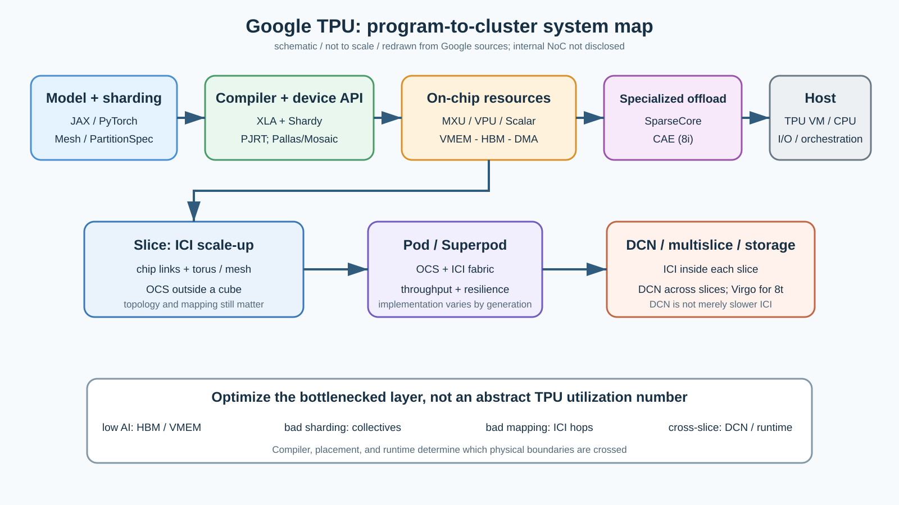
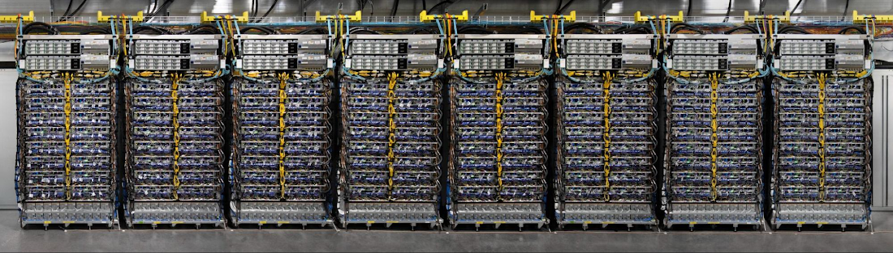
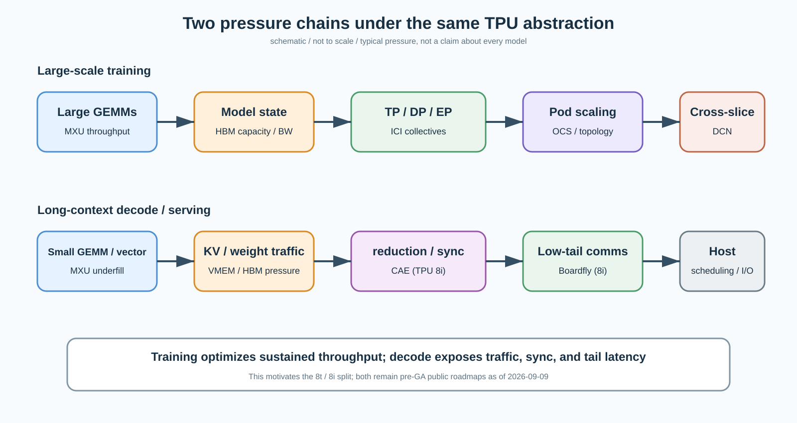
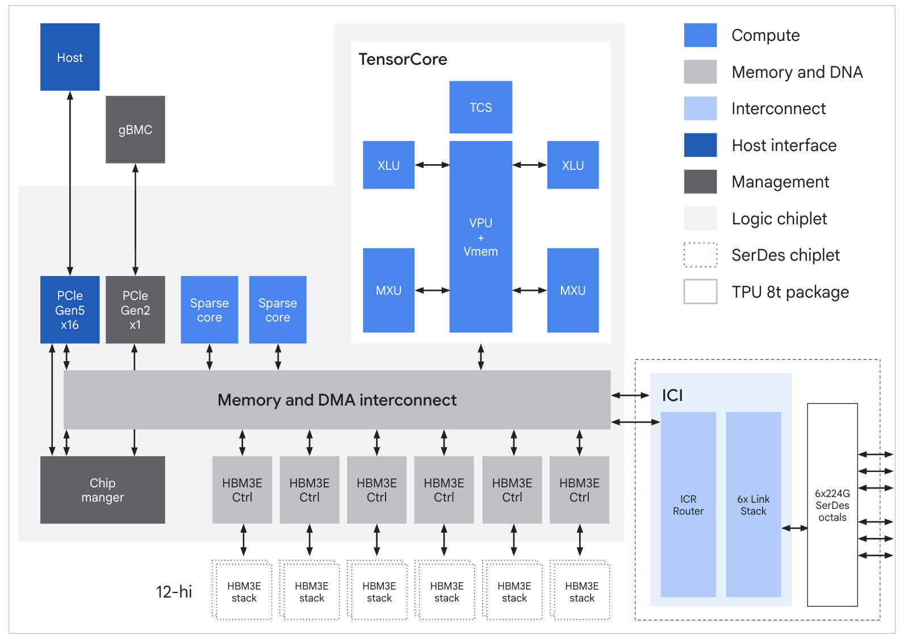
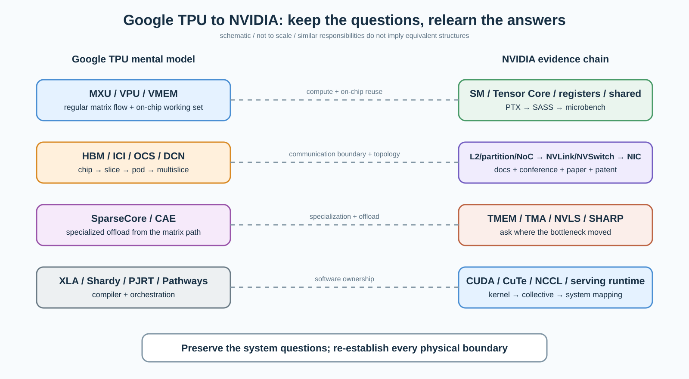

# Day 12｜Google TPU 总复盘：从一条算子到一座 AI 超级计算机

日期：2026-09-18

资料复核：2026-09-18（TPU architecture 页面更新至 2026-09-16；TPU 8t/8i 产品状态按当前产品页核对）

预计学习时间：约 30 分钟

承接：Day 11 已经把 JAX、Shardy/XLA、PJRT、Pallas/Mosaic 与 Pathways 分层。今天不再新增一串组件，而是回答 Google 主线最后一个问题：**当一个模型真正跑起来时，计算、存储、通信和软件分别在哪一层接力，性能问题又应该在哪一层定位？**

## 今日目标

学完后你应该能够：

1. 用一张图说明 `模型 → compiler/runtime → chip → slice → pod/multislice` 的完整数据路径。
2. 区分 MXU 算力不足、HBM/VMEM 搬运、ICI collective、拓扑映射和 DCN 跨 slice 五类瓶颈。
3. 解释 TPU 为什么从“矩阵芯片”演化为包含 SparseCore、OCS、Pathways、CAE 和 Boardfly 的系统。
4. 带着同一组问题进入 NVIDIA，而不是把 TPU 名词机械翻译成 CUDA 名词。

## 先看总图：TPU 不是一块更大的矩阵乘芯片



怎么看：从左上开始，模型只表达计算和逻辑分片意图；XLA/Shardy 决定 fusion、layout、reshard 与 collective，PJRT 把可执行程序交给设备。单芯片内，MXU/VPU/Scalar、VMEM、HBM 和 DMA 共同完成一次 tile 的生产与消费；跨芯片后，问题变成 ICI 拓扑和集合通信；跨出 slice 才进入 DCN。性能优化的第一步永远是定位**哪条物理边界正在被反复穿越**。

这十二课真正建立的不是一张 TPU 芯片框图，而是下面这个判断：

> TPU 的产品单位虽然叫 chip 或 slice，但它的设计单位越来越接近“compiler + accelerator + memory + interconnect + host + datacenter fabric”。

Google 的优势也不只是 MXU。规则化矩阵数据流很早就确立了；之后几代的主要工作，是不断减少 MXU 等数据、等同步、等网络、等 host 的时间。

## 第一层：单芯片不是 MXU，而是一条数据供给链

以公开资料较完整的 TPU v4 为锚点，每颗 chip 有两个 TensorCore；每个 TensorCore 包含四个 MXU、Vector Unit 和 Scalar Unit。v4 还提供统一的 32 GiB HBM 地址空间、Common Memory 的 load/store 模型、DMA 和对转置/置换带宽的增强。这些事实比“275 TFLOP/s”更重要，因为它们说明矩阵计算两侧必须有足够的数据搬运与非矩阵处理能力。

可以把一次典型 fused block 粗略拆成：

$$
T_{block} \approx \max(T_{MXU}, T_{VPU}, T_{VMEM\leftrightarrow HBM}, T_{sync})
$$

这不是 Google 公布的硬件时序公式，而是软件工程上的瓶颈模型。只要其中一个阶段无法被覆盖，增加 MXU 峰值就不会按比例增加端到端吞吐。

### MXU 负责什么

MXU 适合规则化、复用充分的矩阵乘。它对应模型中 GEMM 占主导的主路径，但不能自动解决 softmax、normalization、quantization、indexing、scatter/gather 或同步。

### VPU、Scalar 与 VMEM 为什么同样关键

VPU/Scalar 消费矩阵乘前后的标量和向量工作；VMEM 是软件可感知的片上工作集边界。Pallas kernel 的 block 过大，可能装不进 VMEM；block 太小，又会增加 HBM 流量或降低 MXU 利用。这里与 GPU 上 shared memory/register tiling 有相似的优化问题，但**存储层级、编程模型和编译器控制边界并不等价**。

### HBM 决定“能否喂饱”与“能否放下”

HBM 容量约束模型状态和 batch，带宽约束权重、KV cache、activation 与稀疏访问的搬运。TPU7x 的公开 Cloud TPU 规格是每 chip 192 GiB HBM、约 7.38 TB/s HBM 带宽；这让大模型和大 batch 更容易驻留，但官方仍明确提醒 memory-bound vector operations 和低效访问会被 HBM 限制。

因此看到低利用率时，不能直接问“MXU 怎么没跑满”，而应先问：

- 当前算子的算术强度够不够？
- tile 是否在 VMEM 中实现了预期复用？
- fusion 是减少了 HBM 往返，还是制造了过大的片上工作集？
- VPU/Scalar 工作是否暴露在 MXU 关键路径上？

## 第二层：专用单元的本质是把不规则工作移出主路径

SparseCore 是最清楚的例子。Embedding lookup、稀疏更新和数据相关的 gather/scatter 很难像 dense GEMM 一样规则供数。TPU v4 论文报告，SparseCore 对 embedding-heavy 模型带来约 5–7× 加速，而面积和功耗约占系统的 5%。这说明它不是“再加一种算力”，而是用很小的硅预算消除一个会拖住整个训练 step 的非规则阶段。

TPU 8i 的 CAE 延续了同一逻辑，只是目标换成 autoregressive serving 中的小粒度 collective、reduction 和 synchronization。Google 公开材料称 CAE 可将片上 collective latency 降低约 5×。截至 2026-09-18，TPU 8i 仍不应被写成已 GA 的 Cloud TPU 产品；这里引用的是 Google 已公布的设计方向和指标，不代表可租用量产实例上的独立验证。

统一看，专用旁路单元的判断标准不是“这个算子 FLOPs 多不多”，而是：

$$
\text{是否值得旁路} \sim \frac{\text{它阻塞主流水线的时间} \times \text{出现频率}}{\text{面积、功耗与软件复杂度}}
$$

这个公式同样是工程抽象，不是芯片厂商的定量模型。它解释了为什么一些 FLOPs 很低的 reduction、embedding 或同步，反而值得获得专用硬件。

## 第三层：ICI 不是“网卡”，而是 slice 内的计算结构

TPU chip 通过 ICI 组成规则拓扑。v4、v5p 与 TPU7x 的大规模形态以 3D mesh/torus 为主；chip 有近邻链路，软件将模型分片映射到逻辑 mesh，再由编译器生成 collective。ICI 的意义不只是搬数据：它决定 tensor/model/data/expert parallel 可以用什么成本组合。

下面这张官方照片展示 TPU v4 Pod 的一个物理片段。它值得看，不是为了数机柜，而是提醒你：论文里的 torus 节点最终是机架、铜缆、光链路、供电和散热共同支撑的物理系统。



怎么看：照片中的机柜不是一个“无限带宽 device”。同一 cube 内外的链路介质和路径不同；大 slice 还要面对光链路/OCS 故障与重路由。Cloud TPU 文档明确说明，ICI resiliency 可以绕开 OCS 或光学 ICI 故障，但代价是临时 ICI 性能下降——可用性和峰值拓扑并不是同一个指标。

### OCS 为什么是体系结构的一部分

TPU v4 Pod 用 Optical Circuit Switch 将 cube 之间的光链路重构成不同 slice。OCS 不承担每个 packet 的常规电子交换；它更接近可重构的物理电路连接层。其价值是让昂贵的大规模 accelerator fabric 能够被切片、调度并在故障下重构。

对软件而言，关键后果有三点：

1. 用户看到的 slice 不是随意抽出的同构 chip 集合，而是有物理拓扑的资源。
2. 相同 chip 数，不同 shape 或 twisted topology 会有不同直径与 bisection bandwidth。
3. collective 性能既取决于算法，也取决于逻辑 mesh 是否和物理 topology 对齐。

例如官方 TPU v4 文档给出，某些 4×4×8 twisted torus 相对非 twisted 形态有约 70% 的理论 bisection bandwidth 提升。这不是单个 kernel 能修复的差异，而是资源选择与分片映射问题。

## 第四层：Host、ICI 与 DCN 必须保持三条边界

Day 8 最重要的修正，现在可以压成三句话：

- Host/TPU VM 负责程序控制、数据输入、I/O 与一部分 orchestration；它不是 TensorCore 的远端 shared memory。
- ICI 负责同一 slice 内的 accelerator-to-accelerator 通信，是模型并行主路径的一部分。
- Multislice 超出 ICI connectivity 后通过 DCN 连接；官方文档明确写明 slice 内仍走 ICI，slice 间才走 DCN。

TPU7x 官方文档现在明确写出每四 chip 连接一个 CPU host，并将 host path 标为 PCIe；这是已公开的 TPU7x 事实。它不能被外推成所有代际、所有内部产品都采用完全相同的 host attachment。

DCN 也不是“带宽更低的 ICI”。它的交换、拥塞、路由、租户隔离、故障域和软件栈都不同。一旦一次训练 step 经常穿越 slice 边界，问题已经从单一 accelerator topology 进入 data-center network 和 orchestration。

## 第五层：软件栈不是一条只有一个 runtime 的直线

最容易记错的版本是：`JAX → XLA → Pathways → TPU`。更准确的职责图是：

| 层 | 它拥有的决策 | 它不自动保证什么 |
|---|---|---|
| JAX / framework | array program、autodiff、transform、logical sharding API | 物理链路最优映射 |
| Shardy / XLA | 分片传播、reshard、collective、fusion、layout 与 lowering | 每个自定义 kernel 的最佳手工 schedule |
| Pallas / Mosaic | 局部 kernel 的 block、scratch、data movement 与低层控制 | 整个多 host 作业的调度 |
| PJRT | framework/compiler 与具体 device backend 的统一设备接口 | 等同于 Pathways |
| Pathways | 更大规模、异步、多 accelerator group 的 orchestration | 所有普通 multi-host JAX 程序的必经层 |

这张表的 state owner 很重要：`Mesh / PartitionSpec` 是逻辑意图；reshard 与 collective 是编译后的实现；物理 topology 决定真实代价；Pathways 则在更高层管理程序和资源。任何一层都不能单独“自动优化全系统”。

## 第六层：训练与 decode 为什么终于分叉



怎么看：训练更容易通过大 batch、大 GEMM 和稳定流水获得高平均吞吐，因此持续受 HBM 容量、ICI 带宽、bisection 和大规模韧性约束。Decode 的每一步工作更小，KV/权重搬运、reduction、同步和 tail latency 更容易暴露；它需要的不只是更多峰值 FLOPs，而是让“小而频繁”的路径更短。

TPU 8t 与 8i 的公开设计可以视为这个分叉的实体化：

- 8t 保留 SparseCore 和 3D torus，强调大规模 pre-training、embedding-heavy workload、FP4、Virgo scale-out 与超大 superpod。
- 8i 增大片上 SRAM，加入 CAE，并用 Boardfly 降低面向 serving 的网络直径和延迟。

下面是 Google 官方公开的 TPU 8t ASIC block diagram。它比早期“TensorCore + HBM + ICI”图多出一个特别值得注意的层次：逻辑 chiplet、SerDes chiplet、Memory and DMA Interconnect，以及独立的 ICI router/link stack 被显式画了出来。



怎么看：图中能确认公开模块及接口关系，但不能据此推断未标出的 NoC 微结构、仲裁策略或 floorplan。它同时展示 host 的 PCIe Gen5 x16 主接口和管理侧 gBMC/PCIe Gen2 x1 路径；这类控制面与数据面分离，在下一平台研究 NVIDIA package 与管理路径时仍会反复出现。

截至 2026-09-18，Google Cloud 官方公开页仍把 8t/8i 视为“Coming soon/尚未 GA”的路线，而 TPU7x 是当前可用的最新 Cloud TPU。课程可以讨论 8t/8i 已公开结构，但不能把发布指标写成独立 microbenchmark 已验证结果。

## 一个完整工程例子：MoE layer 到底会穿过哪些层

假设一个 JAX MoE layer 被切到多个 TPU chip：

1. JAX 代码和 `PartitionSpec` 描述参数、token 与 expert 轴的逻辑分片。
2. Shardy/XLA 传播分片，必要时插入 all-gather、all-to-all 或 reduce-scatter，并决定部分 fusion/layout。
3. 每个 chip 上，router、top-k、dispatch 等向量/不规则工作与 expert GEMM 形成交替；MXU 只负责其中规则的 dense 部分。
4. token dispatch 穿过 ICI；其代价取决于 expert placement、slice shape、链路 hop、消息粒度和拥塞。
5. embedding-heavy 或数据相关 gather 可能由 SparseCore 承担部分压力；但这不等于所有 MoE all-to-all 都“由 SparseCore 免费完成”。
6. 如果作业跨 slice，数据路径进入 DCN；此时只调 tile 或 VMEM 已经解决不了主要通信成本。
7. Pathways 可以参与更大规模资源与程序 orchestration，但不能抹掉底层 topology 的物理代价。

这个例子给出一个可复用的调试顺序：

```text
先看 HLO / sharding / collective 是否符合预期
→ 再看单 chip MXU、VPU、HBM 与 fusion
→ 再看 ICI 消息量、拓扑映射和 overlap
→ 最后确认是否跨 slice 进入 DCN 与更高层调度
```

如果反过来一上来就看单个 GEMM kernel，可能会优化一个只占 step 很小比例的局部。

## Google TPU 的稳定内核与变化外壳

从 v2 到 TPU7x，Google 的训练 TPU 保留了几个稳定设计原则：规则化 TensorCore、HBM、专用 ICI、编译器主导的 SPMD，以及从 chip 扩展到 pod 的系统协同。2026 年 Google 团队对多代训练 supercomputer 的回顾也强调了这种架构稳定性，同时把 HBM、峰值节点性能、OCS、故障恢复与能源效率的持续扩展视为主线。

真正变化很快的是外围预算与系统目标：

| 变化 | 它在修什么 |
|---|---|
| HBM 容量/带宽快速增长 | 更大模型状态与更高供数需求 |
| ICI/拓扑/OCS 演进 | collective、切片、韧性与规模 |
| SparseCore | embedding/稀疏不规则访问 |
| 更大的 VMEM/SRAM | 更大片上工作集、KV 与小粒度复用 |
| CAE | decode 中 reduction/synchronization 延迟 |
| Boardfly | serving 场景的 hop 与 tail latency |
| Virgo / DCN 扩展 | 超出单 pod/slice 的训练规模 |
| Shardy/Pallas/Pathways | 分片表达、局部 kernel 控制与大规模 orchestration |

因此，理解 TPU 的正确颗粒度不是“每代有几个 MXU”，而是：**工作负载的瓶颈如何逼着系统重新分配硅面积、片上 SRAM、网络端口、交换层级与软件控制权。**

## NVIDIA 对照：下一阶段保留问题，替换证据链



怎么看：左边的 TPU 知识不会作废，它提供的是一组跨平台问题；右边不是一一对应翻译，而是下一阶段要沿真实 NVIDIA 数据路径重新求证的对象。特别是 GPU 内 NoC、L2/memory partition、package/D2D、NVLink/NVSwitch、GPU↔NIC 与 NCCL topology，不能靠熟悉 SM/kernel 自动补齐。

Google 主线给我们的系统模板是：

```text
片上复用边界
→ device memory 边界
→ chip 间 scale-up 边界
→ switch/fabric 边界
→ host 与 NIC 边界
→ scale-out / orchestration 边界
```

进入 NVIDIA 后会把证据链加深为：

```text
官方 architecture / programming model
→ PTX / SASS / CUTLASS / 实际量产行为
→ Hot Chips / GTC / SC 与体系结构论文
→ patent（可能实施例，不单独证明量产实现）
→ Nsight / microbenchmark 交叉验证
```

你熟悉的 tile、register、shared memory、MMA/WGMMA、TMA、pipeline、occupancy 和 ILP/TLP 会快速校准；课程的主要增量放在 SM 之外的数据路径与通信层级。

## 易混淆点

### 1. TensorCore 不是 NVIDIA Tensor Core 的同义词

Google 文档中的 TensorCore 是一组包含 MXU、Vector Unit 和 Scalar Unit 的更大计算结构；NVIDIA Tensor Core 通常指 SM 内的矩阵执行单元。名称相近，层级不同。

### 2. Logical mesh 不是物理网络图

`Mesh`/`PartitionSpec` 描述程序如何分片，不能直接证明 chip 在机架中的物理邻接。映射质量会影响 collective 是否走更长路径。

### 3. ICI、OCS 与 DCN 不是三档带宽缓存

ICI 是 accelerator fabric，OCS 重构其中跨 cube 的光学电路，DCN 则承担超出 slice 的数据中心通信。三者的职责、控制和故障域不同。

### 4. 峰值 FLOPs 不能预测 serving latency

Decode 常由内存流量、小矩阵、reduction、同步、网络 hop 和 host 调度共同决定；这也是 8i 把预算投向 SRAM、CAE、Boardfly 和更多 host orchestration 的原因。

### 5. 公布结构不等于完整微架构

Google 公开了功能块、拓扑与系统指标，但许多 router、NoC、仲裁、cache、一致性和 backend lowering 细节仍未披露。课程中自绘图只表达有证据的语义关系，不把框图位置当 floorplan。

## 结论

Google TPU 的核心不是“systolic array 比 GPU 简单”，而是围绕规则矩阵计算建立一套从 compiler 到 datacenter 的受控数据路径。MXU 提供峰值，VMEM/HBM 负责供数，SparseCore/CAE 移走不规则或同步瓶颈，ICI/OCS 把 chip 组织成可调度的 slice，DCN 与 Pathways 把边界继续推向更大系统。

当模型从大规模训练转向长上下文、高并发 decode，瓶颈从平均计算吞吐转向片上容量、搬运、小粒度同步和 tail latency，TPU 8t/8i 的分叉因此不是营销命名，而是系统预算目标不同。

Google 主线到此收尾。接下来研究 NVIDIA 时，不再从 CUDA 入门，而是用 TPU 已建立的系统坐标系，追问每一层真实的数据拥有者、物理边界、通信路径和软件可见后果。

## 验收标准

1. 不看图，能口述 `JAX → Shardy/XLA → PJRT → chip → ICI slice → OCS/Pod → DCN multislice`，并说明 Pallas 与 Pathways分别从哪里插入。
2. 给出一个低 MFU 的 MoE 或 decode workload，能先区分 MXU、HBM/VMEM、ICI、topology 与 DCN 五类候选瓶颈，而不是立刻归因于 kernel。
3. 能用一句话解释 SparseCore 与 CAE 的共同设计原则，并说明为什么 TPU 8t/8i 的训练/推理分叉合理。

下一课预告：**NVIDIA Day 1——先画完整平台总图：CPU、GPU、HBM、PCIe、NVLink、NVSwitch、NIC 与数据中心网络分别属于哪一个通信域。**

## 参考资料

1. Google Cloud, [TPU architecture](https://docs.cloud.google.com/tpu/docs/system-architecture-tpu-vm), last updated 2026-08-26. 单/多 host、slice/multislice、ICI/OCS/DCN 与 SparseCore 定义。
2. Google Cloud, [TPU7x (Ironwood)](https://docs.cloud.google.com/tpu/docs/tpu7x), last updated 2026-08-26. TPU7x 已公开规格、TensorCore/SparseCore、HBM、ICI、host/PCIe 与 topology。
3. Google Cloud, [TPU v4](https://docs.cloud.google.com/tpu/docs/v4). TPU v4 TensorCore、HBM、ICI、topology 与 twisted torus 资料。
4. Norman P. Jouppi et al., [TPU v4: An Optically Reconfigurable Supercomputer for Machine Learning with Hardware Support for Embeddings](https://research.google/pubs/tpu-v4-an-optically-reconfigurable-supercomputer-for-machine-learning-with-hardware-support-for-embeddings/), ISCA 2023. OCS、SparseCore、系统性能与韧性。
5. Google Cloud Blog, [TPU v4 enables performance, energy and CO2e efficiency gains](https://cloud.google.com/blog/topics/systems/tpu-v4-enables-performance-energy-and-co2e-efficiency-gains), 2023-04-05. 官方 TPU v4 Pod 照片来源。
6. Google Cloud Blog, [TPU 8t and TPU 8i technical deep dive](https://cloud.google.com/blog/products/compute/tpu-8t-and-tpu-8i-technical-deep-dive), 2026-04-22. 8t/8i、CAE、Boardfly、Virgo、SRAM 与官方 block diagram。
7. JAX documentation, [Pallas: a JAX kernel language](https://docs.jax.dev/en/latest/pallas/index.html). Pallas 与 Mosaic 的编程边界。
8. OpenXLA, [Shardy](https://openxla.org/shardy/). 分片表示、传播与 compiler partitioning。
9. OpenXLA, [PJRT integration overview](https://openxla.org/xla/pjrt_integration). Framework/compiler 与 device backend 的统一接口。
10. Paul Barham et al., [Pathways: Asynchronous Distributed Dataflow for ML](https://research.google/pubs/pathways-asynchronous-distributed-dataflow-for-ml/), MLSys 2022. 大规模异步 orchestration。
11. Norman P. Jouppi et al., [Google's Training Supercomputers from TPU v2 to Ironwood](https://arxiv.org/abs/2606.15870), 2026. 多代训练 TPU 的架构稳定性、扩展、韧性与能效回顾。
12. Google Cloud, [Tensor Processing Units (TPUs)](https://cloud.google.com/tpu), accessed 2026-09-18. 当前产品状态：TPU7x 为 Generally available，TPU 8t/8i 为 Coming soon。
