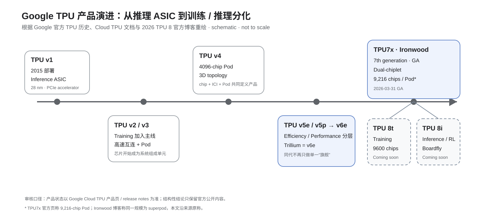
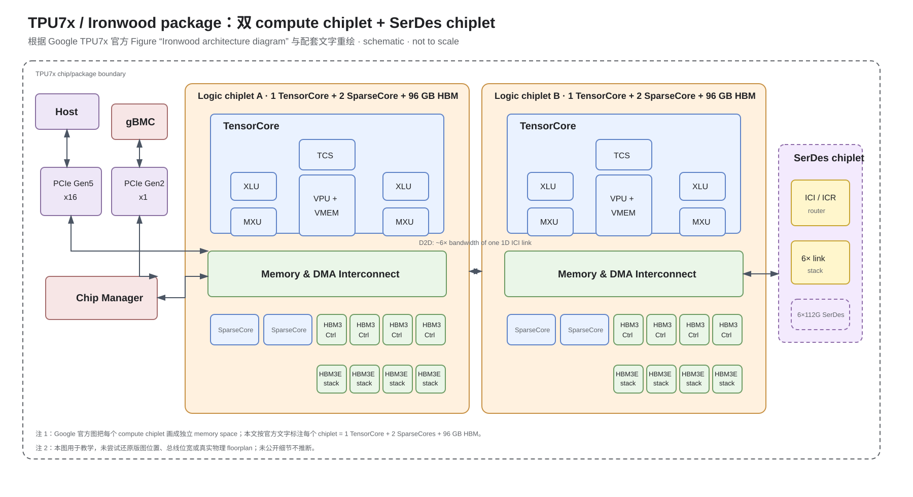
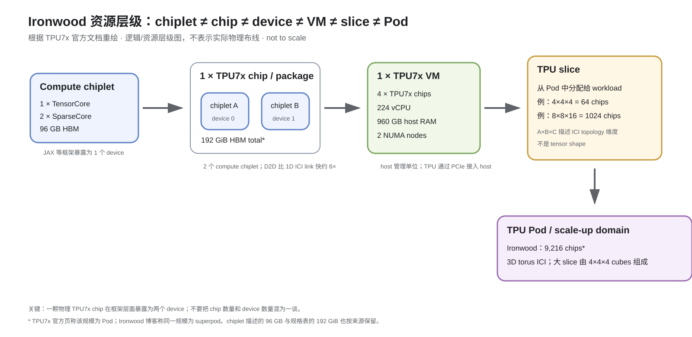
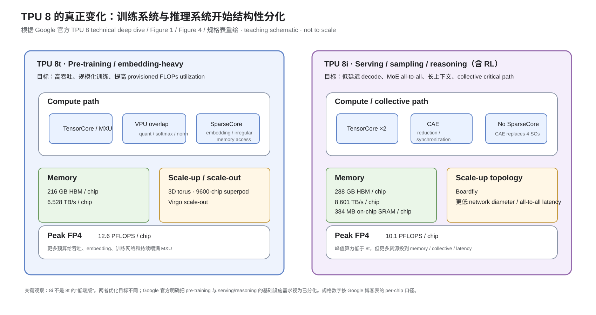

# Google TPU Day 1：先建立芯片、Package、VM、Slice、Pod 的完整地图

- 日期：2026-08-26
- 预计学习时间：50～60 分钟
- 今日范围：产品线、代际、当前进度、`die/chiplet → package → host → slice → pod`
- 今日不展开：MXU/VPU/XLU/SparseCore 的执行细节、VMEM/HBM 数据路径、ICI/Boardfly/Virgo 拓扑细节、XLA/Pallas 软件栈。后面逐天拆。

## 与前一版的关系

前一版的问题不是信息量不够，而是**没有先建立空间层级**。TPU 资料里同时出现 `TensorCore`、`chiplet`、`chip`、`device`、`VM`、`slice`、`Pod`，如果这些词没有先固定下来，后面即使记住 HBM 带宽、MXU、Boardfly，也容易把不同层级的概念混在一起。

所以今天只解决三件事：

1. Google TPU 的代际到底经历了什么结构性变化？
2. Ironwood 一颗 `TPU7x chip` 内部是什么组成？为什么一个 chip 在 JAX 里会暴露成两个 device？
3. 一颗 chip 怎么一路扩到 VM、slice 和 Pod？

## 今日目标

学完后，你应该能做到：

- 不背参数表，也能讲清 TPU v1 → Ironwood → TPU 8 的演进主线；
- 准确区分 `chiplet / chip / device / VM / slice / Pod`；
- 看 Ironwood 官方架构图时，知道 Host、PCIe、TensorCore、SparseCore、HBM、SerDes chiplet、ICI 分别处在哪一层；
- 理解为什么 Google 到 TPU 8 开始明确拆成 training-oriented `8t` 与 inference-oriented `8i`。

---

## 1. TPU 的演进不是“每代多一点 FLOPS”

先看整条产品路线。



**怎么看这张图：**

- 第一处变化是 `v1 → v2/v3`：TPU 从 inference ASIC 变成训练基础设施的一部分。
- 第二处变化是 `v4/v5`：单颗芯片不再是主要产品单位，`chip + ICI + Pod` 才是完整系统。
- 第三处变化是 `v5e/v5p` 之后的产品分层，以及 TPU 8 正式拆成 `8t / 8i` 两套不同优化目标。
- 这是一张教学时间线，不表示不同代际之间存在严格的硬件继承箭头。

### 1.1 TPU v1：一开始就是数据中心专用推理 ASIC

Google 2017 年公开的第一代 TPU是 28 nm、700 MHz、约 40 W，通过 PCIe Gen3 x16 接入现有服务器。官方资料给出的核心设计是一个 `65,536` 个 8-bit MAC 的矩阵乘单元，以及大约 `28 MiB` 的软件管理片上存储。

今天不用研究 systolic array，只记住一个架构思想：

> Google 从第一代开始就没有试图复制 GPU，而是从数据中心神经网络 workload 反推一个 domain-specific accelerator。

这也是后面所有 TPU 设计的起点。

官方背景：

- [An in-depth look at Google’s first TPU](https://cloud.google.com/blog/products/ai-machine-learning/an-in-depth-look-at-googles-first-tensor-processing-unit-tpu)
- [In-Datacenter Performance Analysis of a Tensor Processing Unit, ISCA 2017](https://research.google/pubs/in-datacenter-performance-analysis-of-a-tensor-processing-unit/)

### 1.2 TPU v2/v3：从“推理卡”变成训练系统

v2 开始，TPU 支持训练，同时 Google 把高速互连和 Pod 作为产品能力向外提供。

这里出现一个对后面非常重要的变化：

```text
只看单颗 accelerator
        ↓
看 accelerator + interconnect
        ↓
看 accelerator + topology + compiler/runtime
```

TPU 之后越来越不像“一张卡”，而像一台专门为 ML 构建的分布式机器。

### 1.3 TPU v4/v5：系统尺度正式成为架构的一部分

以 TPU v4 为例，完整 Pod 可以达到 4096 chips。Google 文档直接用 `4×4×4`、`8×8×16` 之类的 topology 描述 slice，而不仅仅给单芯片算力。

到了 v5，又出现了明显的产品分层：

- `v5e`：强调 cost efficiency，训练和推理都覆盖；
- `v5p`：强调大规模训练性能和扩展能力。

因此，从这一代开始，理解 TPU 不应该只问：

> “一颗芯片多少 TFLOPS？”

还应该问：

> “它的系统优化目标是什么？单 Pod 多大？互连怎么组织？它希望跑什么 workload？”

### 1.4 TPU v6e / Trillium

Trillium 的 API/技术名是 `v6e`。它已经 GA。

今天只记住：`Pod size` 不是“整套系统最多只能到这么大”。v6e 单 Pod 是 256 chips，但 Google 可以通过更上层的网络和 Multislice 扩展到多个 Pod。

也就是说：

- Pod size 是一个 scale-up/system organization 参数；
- 不是整个训练集群的硬上限。

### 1.5 TPU7x / Ironwood

截至 2026-08-26，Google Cloud 当前真正 GA 的最新 TPU 是：

`TPU7x / Ironwood`

Google Cloud TPU 产品页当前状态：

- Ironwood：**Generally available**
- TPU 8t：**Coming soon**
- TPU 8i：**Coming soon**

官方产品页：

- [Tensor Processing Units (TPUs) | Google Cloud](https://cloud.google.com/tpu)

Google Cloud release notes 记录 Ironwood：

- 2025-11-24：Preview
- 2026-03-31：GA

这里以后要形成一个习惯：**架构发布、Preview、GA、量产是四种不同状态，不混写。**

---

## 2. 今天最关键的一张图：Ironwood package 里面到底是什么

Google 官方 TPU7x 文档有一张非常好的 `Ironwood architecture diagram`。当前执行环境没法可靠把 Google 静态原图直接落盘，所以这里没有只留一个外链，而是严格依据官方图和官方文字重绘了一张解释版 SVG。



**怎么看这张图：**

- 最外层虚线表示一个 `TPU7x chip/package` 的教学边界，不是 die floorplan。
- 中间有两个独立 compute/logic chiplet。Google 官方明确写：**每个 chiplet = 1 TensorCore + 2 SparseCores + 96 GB HBM**。
- 两个 chiplet 有独立 memory space，通过高速 D2D 互连；官方称 D2D 带宽约为一个 1D ICI link 的 6 倍。
- 右侧还有独立的 SerDes chiplet，承担 ICI / SerDes 相关功能。
- 图中模块位置只是为了教学，不代表真实物理版图。

官方原图与文字：

- [TPU7x (Ironwood) official documentation](https://docs.cloud.google.com/tpu/docs/tpu7x)
- 官方图名：`Ironwood architecture diagram`

### 2.1 一颗 TPU7x chip 不是一个 monolithic compute die

TPU7x 官方规格：

| 项目 | TPU7x |
|---|---:|
| TensorCores / chip | 2 |
| SparseCores / chip | 4 |
| HBM / chip | 192 GiB |
| HBM bandwidth / chip | 7380 GB/s |
| BF16 peak / chip | 2307 TFLOPS |
| FP8 peak / chip | 4614 TFLOPS |
| ICI bidirectional bandwidth / chip | 1200 GB/s |

但真正重要的是拆法：

$$
1\ \text{TPU7x chip}
=
2\ \text{compute chiplets}
+
\text{SerDes / I/O related logic}
+
\text{HBM}
$$

其中每个 compute chiplet：

$$
1\ \text{chiplet}
=
1\ \text{TensorCore}
+
2\ \text{SparseCores}
+
96\ \text{GB HBM}
$$

这说明 Ironwood 的 chiplet 化不是“封装层面的透明实现细节”，因为它会直接暴露到 programming model。

### 2.2 `TensorCore` 不是 NVIDIA Tensor Core

这是最容易混的词。

NVIDIA 语境：

```text
SM
├── CUDA cores
├── Tensor Cores
├── load/store
├── SFU
└── registers/shared memory
```

Google TPU 文档中的 `TensorCore` 粒度大得多，它本身包含：

- `MXU`
- `VPU`
- `VMEM`
- `XLU`
- `TCS`
- 其他控制/数据通路

所以更准确的类比是：

> TPU `TensorCore` 更像一个大的 compute subsystem，而不是 GPU SM 里面某一种 execution unit。

Day 2 会专门把 TensorCore 拆开。

### 2.3 SparseCore 是独立于 TensorCore 的专用单元

Ironwood 每个 chiplet 有两个 SparseCore。

它不是“稀疏 Tensor Core”的意思。Google 主要把 SparseCore 用于 embedding、稀疏/不规则内存访问以及相关 collectives。

今天暂时不研究执行机制，只需要把它放对位置：

```text
compute chiplet
├── TensorCore
├── SparseCore ×2
└── HBM / Memory & DMA path
```

---

## 3. 为什么一颗 Ironwood chip 在 JAX 里会变成两个 device

这是今天一定要搞清的点。



**怎么看这张图：**

- 左到右表示资源/软件暴露层级，不表示实际物理连线。
- Google 官方明确写：Ironwood 两个 chiplet 各自拥有独立 memory space。
- JAX 等框架把每个 chiplet 暴露成一个独立 `device`。
- 因此**一个物理 TPU7x chip = 两个 JAX-visible devices**。

也就是说：

$$
1\ \text{TPU7x chip}
=
2\ \text{compute chiplets}
=
2\ \text{framework devices}
$$

这和 v4/v5p 的 MegaCore programming model 不一样。

### 3.1 为什么要这么暴露

Google 给出的制造层理由是 dual-chiplet 能提高 cost-effectiveness 和 manufacturing efficiency。

但一旦每个 chiplet 有独立 memory space，软件就必须知道：

- tensor 在哪个 chiplet；
- collective 是 chiplet 内/跨 chiplet/跨 chip；
- sharding 怎么安排。

所以 chiplet 化最终会一路影响到：

```text
physical package
    ↓
framework device model
    ↓
tensor sharding
    ↓
collective hierarchy
    ↓
performance tuning
```

这就是为什么 chiplet 不能只当成封装知识。

### 3.2 D2D 与 ICI 是两层网络

官方 Ironwood performance guide 建议：

- 优先在两个 on-chip chiplets 之间做 tensor parallelism；
- 利用层次化 collectives；
- 因为 on-chip D2D 明显快于跨 chip 的 ICI。

可以先建立：

```text
chiplet A
   ⇅  D2D
chiplet B
================   package boundary
   ⇅  ICI
other TPU chips
```

这不是完整 topology，只是区分两层通信代价。

Day 5 再把它扩成 ICI / cube / OCS / Pod。

---

## 4. VM、slice、Pod：从芯片到系统

### 4.1 VM：host 管理单位

TPU7x 官方文档写得非常明确：

一个 TPU7x VM 包含：

- 4 个 TPU7x chips；
- 224 vCPU；
- 960 GB host RAM；
- 2 个 NUMA nodes。

因此你可以先把 VM 理解成：

> 一个 CPU host 软件环境，加上它管理的一组 TPU chips。

TPU 并不是脱离 host CPU 独立工作的黑盒。runtime、数据准备、storage/network control path 仍然要经过 host 系统。

### 4.2 Slice：用户真正申请到的 TPU topology

Google Cloud 不要求每个 workload 都占整个 Pod。通常用户拿到的是一个 slice。

Ironwood 官方支持的部分 slice：

| Topology | Chips |
|---|---:|
| `2×2×1` | 4 |
| `2×2×2` | 8 |
| `2×4×4` | 32 |
| `4×4×4` | 64 |
| `8×8×8` | 512 |
| `8×8×16` | 1024 |
| `8×16×16` | 2048 |

这里的 `A×B×C` 是 ICI topology 维度，不是 tensor shape。

Google 还规定：

- 大于 64 chips 的 slice，由一个或多个 `4×4×4` cube 组成；
- TPU7x 使用 3D torus interconnect；
- 一个 Pod 最多 9216 chips。

### 4.3 Pod：一个大的 scale-up 域

把概念压缩成：

```text
chiplet
  ↓
TPU7x chip/package
  ↓
4-chip VM
  ↓
slice
  ↓
Pod
  ↓
multi-pod / DCN scale-out
```

后面学 TPU 互连时必须不断区分两个词：

- `scale-up`：低延迟、高带宽 accelerator fabric 内扩展；
- `scale-out`：通过数据中心网络跨更大范围扩展。

TPU 的 ICI / Pod 主要属于前者。

---

## 5. TPU 8：为什么 Google 开始把 training 与 inference 分成两套硬件

这一节先只看“资源预算怎么变”，不深入内部执行。



**怎么看这张图：**

- 左边 8t 的资源分配明显围绕训练吞吐、embedding、规模化网络展开。
- 右边 8i 的峰值 FP4 反而更低，但 HBM 容量、HBM 带宽、片上 SRAM 和 collective 相关资源更激进。
- `CAE replaces 4 SCs` 来自 Google 官方 TPU 8i Figure 4 与配套文字。
- 图中的 Memory / Network 框只是教学归类，不表示 die 内真实物理位置。

官方来源：

- [Inside the eighth-generation TPU: An architecture deep dive](https://cloud.google.com/blog/products/compute/tpu-8t-and-tpu-8i-technical-deep-dive)
- Figure 1：TPU 8t ASIC block diagram
- Figure 4：TPU 8i ASIC block diagram
- Figure 5：Boardfly hierarchical topology

### 5.1 TPU 8t

Google 官方定位：

- large-scale pre-training；
- embedding-heavy workloads；
- 9600 chips / superpod；
- 3D torus；
- SparseCore；
- 216 GB HBM；
- 6.528 TB/s HBM；
- 12.6 PFLOPS FP4。

核心目标是：

> 尽量保持高吞吐，让大规模训练中的 MXU、VPU、embedding 和通信流水持续工作。

### 5.2 TPU 8i

Google 官方定位：

- sampling；
- serving；
- reasoning；
- reinforcement learning；
- 288 GB HBM；
- 8.601 TB/s HBM；
- 384 MB on-chip SRAM；
- 10.1 PFLOPS FP4；
- CAE；
- Boardfly。

注意：

$$
\text{FP4 peak}_{8i}
<
\text{FP4 peak}_{8t}
$$

但 8i 并不是“低端版 8t”。

它拿面积/功耗预算换了：

- 更大 SRAM；
- 更高 HBM 带宽；
- 更大的 HBM 容量；
- collective acceleration；
- 更适合 all-to-all / MoE 的 topology。

所以以后看 inference accelerator 时，第一反应不应该是：

> “PFLOPS 比谁高？”

而应该是：

> “它在 memory wall、collective latency、KV/state、tail latency 上花了多少硬件预算？”

---

## 6. 一个具体 workload 映射：同一个 MoE LLM 为什么可能用不同 TPU

假设同一个大型 MoE 模型经历三个阶段。

### 6.1 Pre-training

核心问题：

- 大 GEMM；
- embedding；
- 高 MFU；
- 大规模 collective；
- 数千/数万 accelerator 同时保持高利用率。

TPU 8t 的设计明显更贴近这个目标。

### 6.2 RL / rollout

这时系统同时包含：

- sampling / generation；
- reward / verifier；
- policy update / training。

Google 把 TPU 8i 明确定位到 RL，说明它认为 rollout / reasoning 这类高比例 sampling workload 的硬件瓶颈和传统 pre-training 已经明显不同。

### 6.3 Online decode

decode 的特点：

- `M` 小；
- token-by-token 串行；
- weight / KV cache 访存占比高；
- TP collective latency直接进入每 token critical path；
- MoE routing 造成 all-to-all 特征。

所以 8i 更大 HBM、更高 HBM bandwidth、更大 SRAM、CAE 和 Boardfly 才会有价值。

这也解释了一个非常重要的趋势：

> AI accelerator 架构正在从“训练时代主要优化矩阵吞吐”，转向“针对 serving 的 memory + state + network latency 重新分配晶体管预算”。

---

## 7. 容易混淆的六个点

### 7.1 `chip` 等于 `device`？

Ironwood 不等于。

```text
1 TPU7x physical chip
=
2 compute chiplets
=
2 framework-visible devices
```

### 7.2 `TensorCore` 等于 NVIDIA Tensor Core？

不等于。Google 的 `TensorCore` 是更大的 compute subsystem。

### 7.3 Ironwood 是“推理 TPU”，所以不能训练？

不对。Google 官方 TPU7x 文档明确支持 large-scale dense / MoE、pre-training、sampling 和 decode-heavy inference。它只是优化重点明显向 inference 时代移动。

### 7.4 Pod size 就是整套集群上限？

不是。Pod 是一个 scale-up/system domain。更大的训练可以继续通过数据中心网络跨 Pod 扩。

### 7.5 `4×4×4` 是 tensor shape？

不是。它描述 TPU slice 的 ICI topology。

### 7.6 TPU 8 已经发布，所以已经 GA？

不是。截至今天：

- Ironwood：GA；
- TPU 8t / 8i：官方已发布，仍为 `Coming soon`。

---

## 8. 今天真正应该带走的架构地图

以后看任何 TPU 文档，先把信息塞到下面这几个层次里：

| 层次 | 应该问什么 |
|---|---|
| Workload | training / inference / RL / MoE，目标函数是什么？ |
| Compute subsystem | TensorCore / SparseCore / CAE 干什么？ |
| Chiplet | 独立 memory space 吗？是一个 framework device 吗？ |
| Package | 几个 compute chiplet？HBM / SerDes / host interface 怎么组织？ |
| Host / VM | 一个 host 管几颗 TPU？NUMA / PCIe 怎么组织？ |
| Slice | workload 实际拿到什么 topology？ |
| Pod / scale-up | ICI 怎么连，能扩多大？ |
| Scale-out | Pod 之间靠什么网络继续扩？ |
| Software | XLA/JAX/Pallas/Pathways 怎样感知这些层级？ |

今天只需要把前七层的边界建立起来。

Day 2 才进入最核心的 compute microarchitecture。

---

## 今日结论

Google TPU 的产品定义已经从“一颗矩阵加速 ASIC”扩展成：

```text
compute chiplet
    ↓
package + HBM + SerDes
    ↓
host / VM
    ↓
slice
    ↓
Pod / ICI
    ↓
data-center scale-out
    ↓
compiler/runtime
```

Ironwood 是非常适合当学习入口的一代，因为它同时暴露了：

- dual-chiplet；
- framework device model；
- HBM；
- ICI；
- Pod；
- 真实 GA 软件环境。

而 TPU 8 则告诉我们下一阶段的趋势：

> training 与 inference 的硬件最优点正在真正分叉。

## 验收标准

1. 能解释 `chiplet → chip/package → device → VM → slice → Pod`，并指出哪些是物理层概念、哪些是软件/资源层概念。
2. 能对着 Ironwood package 图说出两个 compute chiplet、TensorCore、SparseCore、HBM、SerDes/ICI 各自的位置和职责层级。
3. 能解释为什么 8i 的 FP4 峰值低于 8t，却不能据此说 8i 更弱。

**下一课：Google TPU Day 2 —— TensorCore 内部：MXU、VPU、XLU、TCS、SparseCore，以及 TPU 执行模型和 GPU SM 的根本差异。**

---

## 参考资料

1. [TPU7x (Ironwood) | Google Cloud Documentation](https://docs.cloud.google.com/tpu/docs/tpu7x)  
   必读：`System architecture`、`Dual-chiplet architecture`、`Supported configurations`。今天关于 Ironwood package、chiplet、device、VM、slice、Pod 的第一事实来源。

2. [Cloud TPU performance guide](https://docs.cloud.google.com/tpu/docs/performance-guide)  
   必读：`Performance recommendations for the Ironwood dual-chiplet architecture`。重点看 hierarchical collectives、D2D 与 ICI 的层次关系。

3. [Tensor Processing Units (TPUs) | Google Cloud](https://cloud.google.com/tpu)  
   用于确认当前产品状态：Ironwood GA；TPU 8t / 8i Coming soon。

4. [Inside the eighth-generation TPU: An architecture deep dive](https://cloud.google.com/blog/products/compute/tpu-8t-and-tpu-8i-technical-deep-dive)  
   今天重点看：`TPU 8: Specialized by design`、Figure 1、Figure 4、Figure 5，以及最后的 TPU 8t / 8i 规格表。

5. [An in-depth look at Google’s first TPU](https://cloud.google.com/blog/products/ai-machine-learning/an-in-depth-look-at-googles-first-tensor-processing-unit-tpu)  
   用于理解 v1 为什么从 inference ASIC 起步，以及 Google 早期 workload-driven ASIC 的设计思路。

6. [In-Datacenter Performance Analysis of a Tensor Processing Unit](https://research.google/pubs/in-datacenter-performance-analysis-of-a-tensor-processing-unit/)  
   TPU v1 的正式 ISCA 论文。后面讲 systolic array / memory hierarchy 时还会回来读。

7. [TPU architecture | Google Cloud Documentation](https://docs.cloud.google.com/tpu/docs/system-architecture-tpu-vm)  
   用于统一 Cloud TPU 中 VM、slice、ICI resiliency 等系统级概念。

---

## 图示说明与审核

本学习包中的 SVG 都是“教学解释版”，不是 Google 原图，也不声称还原真实 floorplan。所有图均依据上述官方资料重绘，并经过三轮审核：

1. **事实审核**：模块、数量、规格、连接关系逐项对照官方资料；
2. **架构语义审核**：避免把逻辑层级误画成物理布线，尤其区分 `chiplet/chip/device/VM/slice/Pod`；
3. **可读性审核**：SVG 实际渲染成 PNG 检查文字遮挡、越界、箭头歧义和缩放可读性。

详细修改记录见 `assets/AUDIT.md`。
