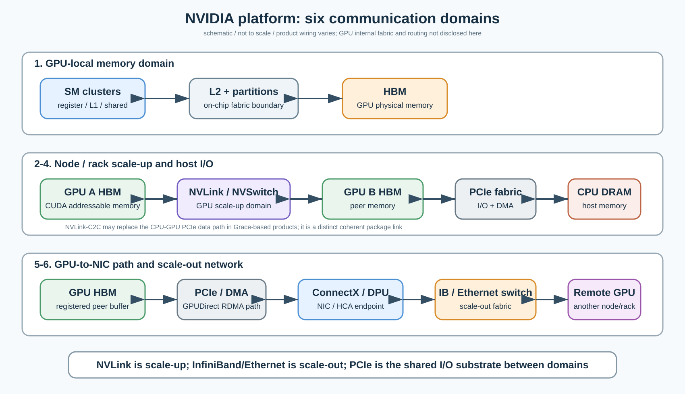
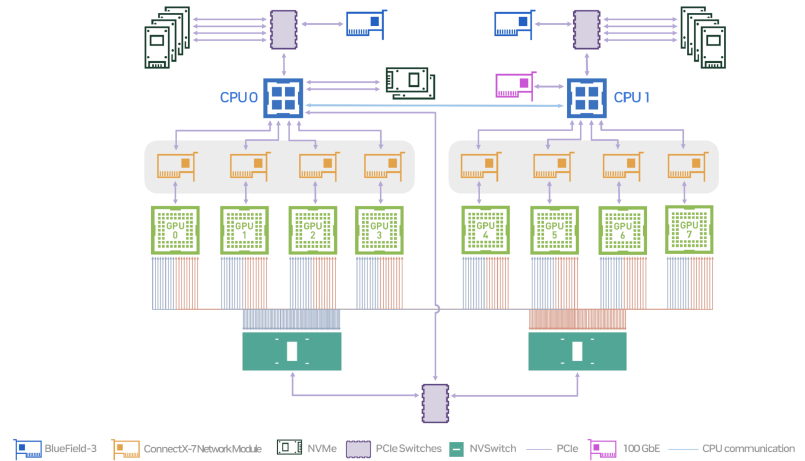
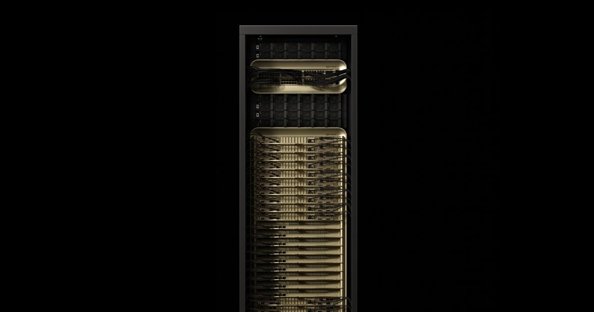
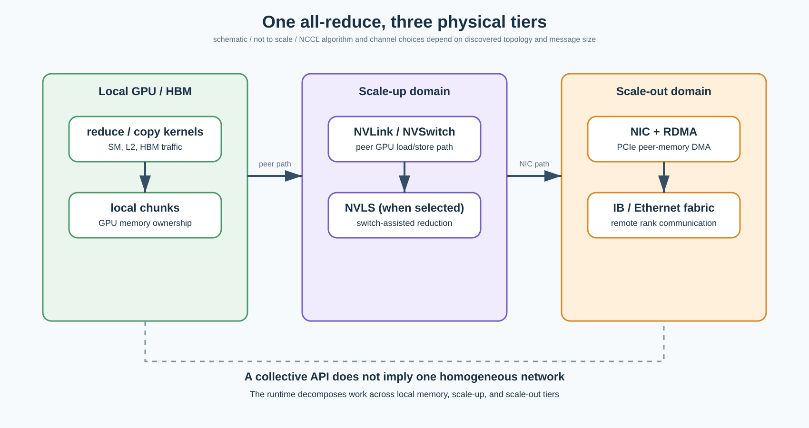

# Day 13｜NVIDIA 平台总图：一块 GPU 到底通过哪些网络连到整个 AI 集群

日期：2026-09-18

资料复核：2026-09-18（DGX B200 User Guide、GB200 NVL72、NVLink/NCCL 文档按当前官方页面核对）

预计学习时间：约 30 分钟

承接：Google TPU 主线已经用 `chip → ICI slice → OCS/Pod → DCN` 建立了 accelerator-system 坐标系。今天正式进入 NVIDIA，但不从 CUDA、warp 或 shared memory 复习，而是先回答一个系统问题：**当 tensor 从一个 SM 出发，最终到达另一台机器的 GPU 时，它依次穿过哪些完全不同的通信域？**

## 今日目标

1. 区分 GPU 内部、GPU↔GPU scale-up、CPU↔GPU、GPU↔NIC、NIC↔switch、跨节点 scale-out 六个边界。
2. 明白 NVLink、NVSwitch、PCIe、NVLink-C2C、InfiniBand/Ethernet 不是同一层的“快慢网线”。
3. 能看懂 DGX B200 官方 topology 图，并指出 PCIe fabric 与 NVLink fabric 为什么同时存在。
4. 用一条分层 all-reduce 路径，把 CUDA kernel、NCCL、NVLS、GPUDirect RDMA 与 NIC 串起来。

## 进入主题前：你熟悉的 kernel 只占系统图左上角

你已经熟悉的路径大致是：

```text
thread / warp
→ register
→ shared memory / L1
→ L2
→ HBM
```

但 AI Infra 里一次 TP all-reduce、EP all-to-all 或远程 KV transfer，可能继续走：

```text
HBM
→ GPU I/O endpoint
→ NVLink / PCIe
→ NVSwitch or NIC
→ InfiniBand / Ethernet switch fabric
→ remote NIC
→ remote GPU HBM
```

这两段不是两个无关世界。前半段决定本地生产和消费速度，后半段决定数据能否及时到达下一 rank。所谓“通信算子慢”，可能瓶颈落在 HBM 读写、GPU 内部 fabric、NVLink、PCIe、NIC 注入、交换网络或远端同步中的任何一处。

## 第一张总图：先分通信域，再谈协议和带宽



怎么看：第一行是单 GPU 内部的数据供给链；第二行同时画出 GPU↔GPU 的 NVLink scale-up 路径与 CPU↔GPU 的 PCIe I/O 路径；第三行则是 GPU memory 经 PCIe peer-memory DMA 到 NIC，再进入 InfiniBand/Ethernet scale-out fabric。图中的框是职责边界，不代表任何特定产品的 floorplan；GPU 内 NoC/router 的实现细节也没有在这里假定。

### 域 1：GPU-local memory domain

SM 发出的 global load/store 经过片上路径访问 L2 与 HBM。对 CUDA kernel 来说，地址像是统一的 global memory；对硬件来说，请求仍要被映射到 L2 slice、memory partition 和 HBM controller。这一层将是 Day 14–17 的重点：GPC/TPC/SM 的层级、L2/memory partition 以及片上 fabric 到底在哪里形成边界。

今天只保留一个判断：**HBM bandwidth 不是从每个 SM 到任意地址都无条件均匀可得的抽象水龙头。** 请求分布、partition 映射、L2 命中、读写混合和片上路由都会影响可见带宽。

### 域 2：GPU↔GPU direct scale-up

NVLink 是面向 CPU/GPU 与 GPU/GPU 的高速互连；在当前数据中心系统里，它最核心的角色是建立低延迟、高带宽的 GPU scale-up domain。GPU peer access 允许一个 GPU 访问另一个 GPU 的 memory，但“能发起 load/store”不等于延迟和本地 HBM 相同，也不等于所有 GPU 天然全连接。

小规模产品可能由 GPU 的 NVLink ports 直接连接；更多 GPU 则需要 NVSwitch 构造 switch fabric。NVLink 是 endpoint link/protocol，NVSwitch 是交换结构，二者不能合并成一个名词。

### 域 3：NVSwitch fabric

NVSwitch 的作用不是给 CPU 外设做枚举，也不是替代整个 data-center network。它连接一个 NVLink domain 内的 GPU endpoints，让 GPU 间路径拥有高 aggregate bandwidth 和更规则的连接性。Blackwell 的 NVLink Switch System 还可被 NCCL 的 NVLS 路径用于 switch-assisted collective reduction；这将在专门章节结合 programming behavior、NCCL 源码/论文与可能的专利实现细讲。

这里先记住：

```text
NVLink = endpoint 之间的高速互连能力
NVSwitch = 扩展和交换这些 NVLink 连接的 fabric
NVLS = 软件可选用的 NVLink Switch collective 路径
```

三者有关，但不是同一对象。

### 域 4：CPU↔GPU host I/O

传统 x86 DGX/HGX 系统通常通过 PCIe hierarchy 连接 CPU、GPU、NIC、NVMe 和其他 I/O 设备。PCIe 负责 enumeration、configuration、MMIO、DMA 与通用 I/O 语义；即使 GPU 之间另有 NVLink/NVSwitch，高性能系统仍然需要 PCIe。

这解释了一个常见疑问：**已经有 NVLink，为什么 topology 图里还有 PCIe switch？**

因为两张 fabric 服务的主要职责不同：NVLink/NVSwitch 优化 accelerator scale-up；PCIe 把 GPU 接入 host 与 I/O 世界。一个 tensor 进行 GPU↔GPU collective 时可走 NVLink；CPU 提交、页表/内存管理、NIC/NVMe DMA 或 host staging 则依赖 PCIe 体系。

Grace Hopper / Grace Blackwell 又引入 NVLink-C2C。它是 coherent chip-to-chip interconnect，用于 Grace CPU 与 GPU 在 superchip/package-local 范围内连接；不能把它简单理解为“另一根外接 NVLink cable”，也不能把某个 Grace 产品的 coherent memory 语义外推到普通 PCIe GPU。

### 域 5：GPU↔NIC

NIC/HCA 是 scale-out network 的 endpoint。以 ConnectX 为例，NIC 既连接 PCIe 一侧，也连接 InfiniBand 或 Ethernet 端口。GPUDirect RDMA 让 HCA 读写 GPU peer-memory buffer，不必先把 payload 复制到 host memory；CPU 仍参与初始化、内存注册、queue/doorbell 管理等控制工作，但不再需要逐字节搬运数据。

所以“bypass CPU”更准确的意思是：

> 数据平面避免 GPU→host buffer→NIC 的额外 staging copy，而不是整次通信完全没有 CPU、driver、IOMMU、页表或控制面参与。

### 域 6：NIC↔switch↔remote NIC

出了 NIC 才进入真正的 scale-out network。NVIDIA 平台可使用 Quantum InfiniBand 或 Spectrum-X Ethernet；两者都能承载 RDMA，但 congestion control、routing、collective offload、运维生态与部署方式不同。

这条网络面对的是跨服务器、跨 rack 甚至更大集群的 failure domain 和 oversubscription。它与 NVSwitch 最大的区别不是一个“更慢”，而是规模、协议、交换层级、路由、故障和租户模型全都不同。

## 用一台 DGX B200 看清两张 fabric

下面是 NVIDIA DGX B200 官方 topology 图。它是今天最值得认真看的原图。



怎么看：八颗 B200 GPU 在下方，通过两颗 NVSwitch 形成 GPU scale-up fabric；每颗 GPU 同时还有 PCIe 路径，向上连接 PCIe switches、两颗 CPU、ConnectX-7 network modules、BlueField-3、NVMe 与管理网络。注意官方图给 GPU-NIC 画的是 PCIe affinity，而不是把 NIC 接进 NVSwitch。

DGX B200 官方文档截至 2026-09-10 列出的系统构成包括：8×B200（合计 1,440 GB HBM）、2×Xeon 8570、2×第五代 NVLink switch、8×ConnectX-7 cluster network cards，以及 2×BlueField-3 DPU 用于 storage/in-band management。文档同时列出每个 cluster port 可运行最高 400 Gbps InfiniBand 或多档 Ethernet。

这里真正重要的不是背数字，而是 topology affinity：

- GPU 0–3 更靠近 CPU0 的 PCIe root complex，GPU 4–7 更靠近 CPU1。
- 每个 ConnectX device 在官方 mapping 中对应特定 GPU affinity。
- 八颗 GPU 的高带宽 peer 路径主要由 NVSwitch fabric 提供。
- NIC、NVMe、CPU DRAM 和 GPU 仍由 PCIe hierarchy 组织。

所以 `nvidia-smi topo -m` 与 NCCL topology discovery 不是形式主义。即使节点内所有 GPU 看起来“型号一样”，CPU socket、PCIe switch、NIC affinity 与 NVLink hop 仍会改变数据路径。

## 从 8-GPU server 到 72-GPU rack：scale-up domain 在扩张



怎么看：这不是一台传统 8U GPU server，而是 rack-scale liquid-cooled system。NVIDIA 官方把 36 Grace CPU 与 72 Blackwell GPU 组织成 72-GPU NVLink domain；这说明“node 内/节点间”已经不再可靠等同于“scale-up/scale-out”。更稳定的划分方式是看它是否仍处于同一个 NVLink memory fabric/domain。

NVIDIA 官方 GB200 NVL72 页面给出：第五代 NVLink 为每 GPU 提供 1.8 TB/s GPU-to-GPU interconnect，整个 72-GPU NVLink Switch System 提供 130 TB/s aggregate communication bandwidth。产品页将 72 GPU domain 描述成一个巨大的 GPU，但软件工程上仍应理解为**拥有多份 HBM、多个 GPU execution context 与非本地通信代价的 scale-up system**，而不是 72 个 die 变成真正 UMA 单芯片。

GB200 Grace Blackwell Superchip 内部则是 1 Grace CPU + 2 Blackwell GPU，经 NVLink-C2C 连接；多个 superchip 再通过 NVLink Switch 扩成 rack-scale GPU domain；若继续扩到多个 rack，仍需 Quantum-X800 InfiniBand 或 Spectrum-X800 Ethernet 等 scale-out fabric。

因此层级应写成：

```text
GPU HBM
→ package/superchip-local NVLink-C2C（Grace-based SKU）
→ rack-local NVLink + NVSwitch scale-up domain
→ NIC / HCA
→ InfiniBand or Ethernet scale-out domain
```

而不是：

```text
GPU → NVLink → 网络
```

后者把三套协议、两类 switch 和多个 address/control boundary 都抹平了。

## PCIe、CXL 与 NVLink-C2C：今天只划职责边界

这一课不展开完整 coherent memory model，但先避免三个误区。

| 互连 | 今天要记住的职责 | 不应直接推断 |
|---|---|---|
| PCIe | 通用 I/O、枚举、MMIO、DMA、连接 GPU/NIC/NVMe/host | 所有设备间自动 cache coherent |
| CXL | 在 PCIe PHY 基础上增加 I/O、cache、memory 协议族 | 当前任意 NVIDIA GPU 都通过 CXL.mem 暴露 HBM |
| NVLink-C2C | NVIDIA 面向 package/chip-to-chip 的高带宽 coherent interconnect | 与 rack-scale NVLink/NVSwitch 完全相同的拓扑和协议角色 |

在 x86 + B200 的 DGX 图中，CPU↔GPU 主路径仍按 PCIe hierarchy 理解；在 Grace Blackwell 中，CPU↔GPU 关系由 NVLink-C2C 重写。产品形态不同，不能用一个抽象拓扑覆盖。

## 一次 all-reduce 为什么会跨三层物理网络



怎么看：NCCL 暴露的是一个 collective API，但 runtime 不会面对“一个均匀网络”。本地 reduction/copy 先消耗 SM、L2 与 HBM；同一 NVLink domain 内可经 NVLink/NVSwitch，某些系统和算法可选择 NVLS；跨节点部分则要经过 PCIe peer-memory path、NIC 与 InfiniBand/Ethernet。消息大小、rank placement 和 topology 决定分层与 channel 选择。

以两个 DGX B200 节点上的 TP all-reduce 为例，可以形成下面的教学骨架：

1. CUDA/NCCL kernel 从各 GPU HBM 读取局部 chunk，执行 reduce/copy 或协议打包。
2. 节点内 chunk 经 NVLink/NVSwitch 在 8 GPU scale-up domain 内交换。
3. 需要跨节点的 chunk 被映射到与 GPU affinity 较好的 ConnectX endpoint。
4. HCA 通过 GPUDirect RDMA 访问 GPU buffer，payload 经 PCIe 数据路径进入 NIC。
5. NIC 将流量注入 InfiniBand/Ethernet switch fabric，到达远端 NIC。
6. 远端 HCA 写入目标 GPU memory，随后继续节点内 reduce/broadcast 阶段。

具体 NCCL 可能采用 ring、tree、CollNet、NVLS 或多 channel 混合，步骤不会永远按这六项串行执行；它们常被切 chunk、流水和 overlap。这里的意义是确定 state owner：

| 对象 | 主要 owner |
|---|---|
| tensor/chunk 地址与 kernel work | CUDA/NCCL device code |
| rank 与 communicator | NCCL/runtime |
| GPU/NIC/NVLink/PCIe topology | driver + NCCL discovery |
| RDMA queue、memory registration | verbs/DOCA-OFED/driver stack |
| switch routing/congestion | IB/Ethernet fabric control plane |

## AI Infra 映射：Prefill、decode、TP、EP 分别怕什么

### Tensor Parallel

TP 在每层频繁产生 all-reduce 或 reduce-scatter，通常要求低延迟、高带宽 scale-up。把 TP group 放进同一 NVLink domain 往往比跨 scale-out fabric 更自然，但 group size、模型 shape 和并行组合仍可能迫使 TP 跨节点。

### Expert Parallel / MoE

EP 的 token dispatch 是 all-to-all 式流量，负载随路由动态变化。它不只怕 aggregate bandwidth，还怕 incast、负载不均和尾延迟。NIC affinity、rail 选择、跨 rack placement 和网络 congestion 都会显著影响 TPOT。

### Prefill

长 prompt prefill 更容易产生大 GEMM 和较大消息，吞吐与 bandwidth utilization 更重要；大消息适合更深流水，但也更容易消耗 fabric bisection bandwidth。

### Decode

Decode 每步 tensor 更小、同步频率更高。若 collective latency 无法被其他工作覆盖，NVLink/NVSwitch hop、NIC injection、协议启动与 host/runtime jitter 都会直接进入 TPOT。此时“网络峰值 400/800 Gbps”远不足以预测性能。

### KV cache / disaggregated serving

远程 KV cache transfer 是最直观的跨域案例：GPU HBM 中的 KV 必须经过 GPU↔NIC 和 scale-out fabric，到另一 GPU HBM。若走 host staging，会额外穿越 host DRAM；若使用 GPUDirect RDMA，可移除这次 payload staging，但 memory registration、buffer lifecycle、flow control 和失败恢复仍由软件承担。

## Google TPU 对照：不要把名词强行配对

| Google TPU | NVIDIA 中职责最接近的对象 | 关键差异 |
|---|---|---|
| ICI | NVLink/NVSwitch scale-up domain | topology、load/store/collective 语义、产品边界不同 |
| OCS | 没有简单一一对应 | OCS 重构光电路；NVSwitch 做 packet-switched scale-up fabric |
| TPU host attachment | PCIe 或 NVLink-C2C，取决于 NVIDIA SKU | NVIDIA 同时存在 x86 PCIe 与 Grace coherent superchip 路径 |
| DCN | InfiniBand/Ethernet scale-out | NVIDIA 同时拥有 NIC、switch 与通信软件栈 |
| XLA collective lowering | NCCL/runtime + CUDA kernels | compiler/runtime ownership 分界不同 |

从 Google 迁移过来的真正资产不是名词，而是这组问题：数据属于谁、跨了哪层 memory boundary、由谁发起 DMA、在哪个 switch domain 内、是否跨故障域、runtime 能看到多少 topology。

## 论文阅读导航：今天只读一张经验结论

推荐材料：Ang Li 等人的 *Evaluating Modern GPU Interconnect: PCIe, NVLink, NV-SLI, NVSwitch and GPUDirect*（2019）。

为什么现在看：这篇论文虽基于较老的 P100/V100/DGX-2，但它最有价值的结论并不过时——GPU communication 会出现由 NVLink topology、routing 与 PCIe chipset 引起的 NUMA effect，“同型号 GPU”不代表“任意 GPU pair 等价”。

只看：论文开头的 system topology 对照图与总结 NUMA effects 的结论部分，控制在 5 分钟。不要记旧代带宽数字，也不要把 DGX-2 的 routing 直接套到 B200。

看完要知道：**为什么现代 NCCL 必须发现 topology，为什么 rank placement 是性能变量。**

## 专利证据说明

今天没有使用专利来证明量产互连结构。原因是 DGX B200 wiring、GB200 NVL72 domain、GPUDirect RDMA 行为已经有官方产品文档和可见软件接口，证据强度足够。

后续讲 NVSwitch routing、NVLS、memory ordering、DSM/TMEM/TMA 等官方文档没有展开的机制时，会加入专利，但统一标注申请日、公开日、family/assignee，并区分：

```text
official production behavior
vs.
patent evidence / implementation not confirmed
```

## 易混淆点

### 1. NVLink 不是 data-center network

NVLink 服务 scale-up；InfiniBand/Ethernet 服务 scale-out。GB200 NVL72 把 scale-up 扩到 rack，不等于它取消了 rack 外网络。

### 2. NVSwitch 不是更快的 PCIe switch

PCIe switch 属通用 I/O hierarchy；NVSwitch 构造 NVLink GPU fabric。两者在 DGX B200 官方图中同时存在，且连接对象和职责不同。

### 3. GPUDirect RDMA 不是 NIC 接在 NVLink 上

典型独立 NIC 通过 PCIe peer-memory path 访问 GPU HBM。GPUDirect 描述的是避免 host staging 的 DMA/peer-memory 能力，不是把 NIC 变成 NVLink endpoint。

### 4. “72 GPU 像一个 GPU”不是单一 UMA 芯片

这是强调 rack-scale NVLink domain 的产品叙事。每 GPU 仍有本地 HBM、执行资源与远端访问代价；并行程序仍必须管理 placement、sharding 和 collective。

### 5. Node boundary 不再等于 scale-up boundary

传统 DGX 常把 8 GPU scale-up domain 放在一台 server；GB200 NVL72 把 72 GPU domain 扩到 rack。讨论通信时优先说 NVLink domain、PCIe domain 与 scale-out domain。

### 6. 峰值 link bandwidth 不是 collective bandwidth

collective 还受 HBM traffic、protocol overhead、message size、topology、channel 数、contention、reduction work 与同步影响。单个产品表里的 TB/s 或 Gbps 不能直接代入端到端 TPOT。

## 结论

NVIDIA 平台并不是“GPU + 一张网卡”，而是多套重叠 fabric：GPU 内部 fabric 把 SM 接到 L2/HBM；NVLink/NVSwitch 组织 scale-up GPU memory domain；PCIe 把 CPU、GPU、NIC 与 storage 接进通用 I/O 世界；GPUDirect RDMA 让 NIC 直接 DMA GPU buffer；InfiniBand/Ethernet 再完成跨节点 scale-out。

对 AI Infra 工程师最有用的第一原则是：

> 先确认数据跨越的是哪一个 domain，再讨论 kernel、copy engine、DMA、collective algorithm 或网络带宽。

你现有的 kernel 基础覆盖了本地生产/消费这一端；后续 NVIDIA 主线会从 GPC/TPC/SM 向外走，补上 L2/memory partition、片上 NoC、NVLink/NVSwitch、NIC/RDMA 与 NCCL 的连续数据路径。

## 验收标准

1. 能解释 DGX B200 为什么同时有 NVSwitch 和 PCIe switch，并分别指出 GPU peer traffic、host/NIC traffic 的主要路径。
2. 能口述远程 GPU all-reduce chunk 从本地 HBM 到远端 HBM 经过的五个以上物理/软件边界。
3. 能纠正“GPUDirect RDMA 就是 NIC 走 NVLink”和“GB200 NVL72 是 72 GPU 真正 UMA”这两个说法。

下一课预告：**Day 14：GPC、TPC、SM、L2 与 memory partition——NVIDIA GPU 的真实层级在哪里结束，哪些只是逻辑分组。**

## 参考资料

1. NVIDIA, [DGX B200 User Guide: Introduction and System Topology](https://docs.nvidia.com/dgx/dgxb200-user-guide/introduction-to-dgxb200.html), accessed 2026-09-10. 系统组件、PCIe/NVSwitch 拓扑、ConnectX affinity 与官方拓扑图。
2. NVIDIA, [DGX H100/H200 User Guide](https://docs.nvidia.com/dgx/dgxh100-user-guide/introduction-to-dgxh100.html), last updated 2026-01-26. Hopper 8-GPU 节点、NVSwitch 与 ConnectX-7 对照。
3. NVIDIA, [GB200 NVL72](https://www.nvidia.com/en-us/data-center/gb200-nvl72/), accessed 2026-09-10. 36 Grace CPU、72 Blackwell GPU、第五代 NVLink、NVLink-C2C 与 rack-scale domain。
4. NVIDIA, [NVIDIA GPUDirect RDMA User Manual](https://networking-docs.nvidia.com/gpudirectrdma), last updated 2025-06-05. HCA peer-memory access 与避免 host-memory staging。
5. NVIDIA, [NCCL User Guide](https://docs.nvidia.com/deeplearning/nccl/user-guide/docs/), accessed 2026-09-10. Communicator、collective、NVLS 与 topology 相关配置。
6. NVIDIA, [CUDA C++ Programming Guide: Peer-to-Peer Memory Access](https://docs.nvidia.com/cuda/cuda-c-programming-guide/index.html#peer-to-peer-memory-access), accessed 2026-09-10. GPU peer access 的软件语义。
7. NVIDIA, [NVLink and NVLink Switch](https://www.nvidia.com/en-us/data-center/nvlink/), accessed 2026-09-10. Scale-up interconnect 与 NVLink Switch System。
8. NVIDIA, [NVLink-C2C](https://www.nvidia.com/en-us/data-center/nvlink-c2c/), accessed 2026-09-10. Grace-based superchip 的 coherent chip-to-chip link。
9. Ang Li et al., [Evaluating Modern GPU Interconnect: PCIe, NVLink, NV-SLI, NVSwitch and GPUDirect](https://arxiv.org/abs/1903.04611), IEEE TPDS 2020. 多 GPU interconnect NUMA effect 与 topology-sensitive performance。
