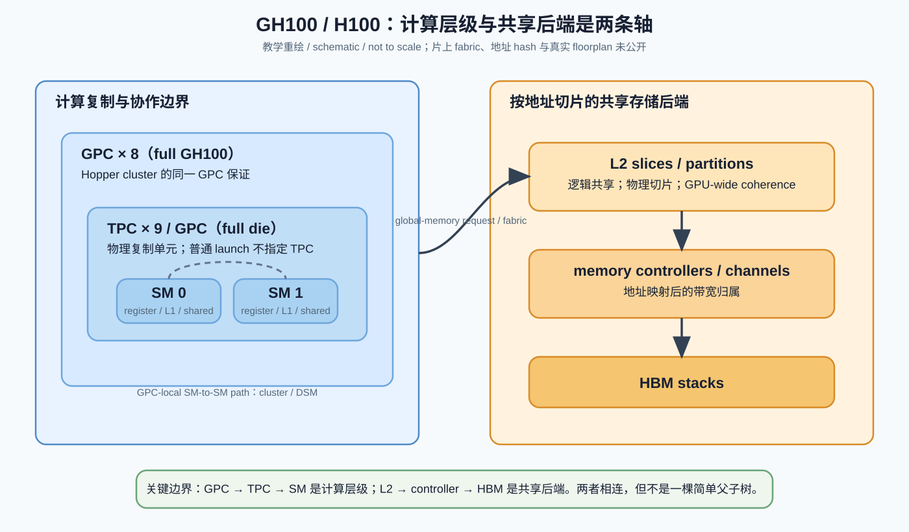
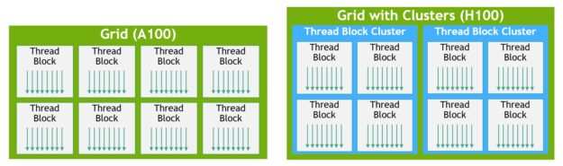
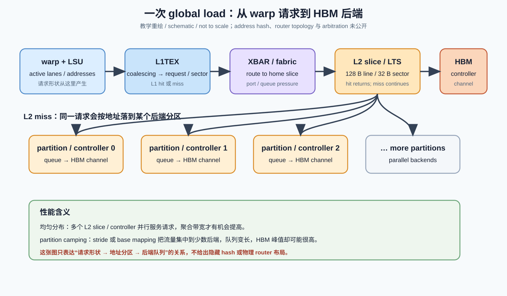

# NVIDIA Day 2（总课程 Day 14）：GPC、TPC、SM、L2 与 memory partition——真实层级和边界


日期：2026-09-18
资料复核：2026-09-18（Hopper 官方博客、CUDA Programming Guide 与 H100 白皮书）


预计学习时间：约 30 分钟


承接：上一课把 CPU、GPU、NVLink/NVSwitch、PCIe、NIC 与数据中心网络分成了不同通信域；今天把镜头推进单颗 GPU，回答“一个 thread block 从 SM 出发，究竟经过哪些层级才能到达 HBM”。


## 今日目标


- 能把 GPC、TPC、SM、L2 slice、memory controller 与 HBM 放进一张不自相矛盾的图。
- 能区分“物理复制层级”“CUDA 调度/协作层级”和“地址映射后的 memory partition”，不再把它们都叫 core。
- 能解释为什么 Hopper thread-block cluster 必须落在同一 GPC，以及这条约束对 DSM、TMA multicast 和 cluster shape 意味着什么。
- 能看到官方资料没有公开到哪里：现代片上 fabric 的具体 router、hop、仲裁和 floorplan 不能从一张方框图反推出来。


## 先给结论：这不是一棵对称的树


最容易记错的版本是：


```text
GPU
└── GPC
    └── TPC
        └── SM
            └── L2
                └── HBM
```


错在 L2 和 HBM memory controller 并不是某个 SM、TPC 或 GPC 私有的“下一层”。对 GH100/H100 更可靠的心智模型是两组横向资源，通过片上互联相接：


```text
compute side                         memory side
GPC → TPC → SM → L1/shared    ⇄    L2 slices → memory controllers → HBM
                  │
                  └─ GPC-local SM-to-SM path for Hopper cluster/DSM
```


GPC/TPC/SM 描述计算资源怎样成组复制；L2 slice/controller/HBM 描述地址怎样落到共享存储后端。两边之间必须经过片上互联与地址/请求路由，但 NVIDIA 没有公开 GH100 的完整 router topology、每跳延迟、仲裁规则或量产 floorplan。


怎么看：先忽略颜色和小方框，只看两条事实。第一，GPC 是计算侧的大复制块；第二，L2 与 HBM controller 画在 GPC 之外，说明它们是全 GPU 共享的后端资源，而不是“某个 SM 的下一级缓存”。这张图是逻辑框图，不应被当作精确 floorplan。





怎么看：左侧是调度与局部性边界，右侧是地址映射与存储后端。箭头故意画成多对多：任意 GPC 发出的 global-memory 请求理论上可以按地址落到不同 L2/controller 位置，而不是永远访问“离自己最近”的一块 HBM。


## 1. SM：kernel 真正驻留与执行的基本单元


你熟悉的 warp scheduler、register file、Tensor Core、LSU、SFU、L1/shared memory 都在 SM 这一层讨论。CUDA thread block 被分配到一个 SM；该 block 的寄存器和 shared-memory allocation 也在这个 SM 上驻留，通常一直执行到完成。


因此，SM 是以下问题的正确边界：


- 一个 CTA 能否驻留：看 registers、shared memory、warps、block slots 等 SM 资源。
- warp 是否能发射：看 scheduler、scoreboard、execution pipelines 与依赖。
- local shared-memory load/store：目标是本 SM 的 shared memory。
- L1/shared carve-out：它是 SM-local 资源，不是全 GPU cache。


但 SM 不是 global-memory 请求的终点。L1 miss、绕过 L1 的访问、writeback，以及 TMA 面向 global memory 的搬运，都必须离开 SM，进入 GPC/片上互联，再到 L2 与 HBM 后端。


一个实用判断：当优化手段只改变 tile、register、shared-memory layout、warp pipeline 时，你主要在 SM 内；当现象和地址分布、L2 命中、HBM channel、跨 SM 共享或 MIG 切分有关时，问题已经越过 SM。


## 2. TPC：重要的物理复制单元，但不是常用 CUDA 编程对象


在 GH100 的官方完整实现中，一个 TPC 含 2 个 SM；每个 GPC 含 9 个 TPC，因此完整芯片是 8 GPC × 9 TPC/GPC × 2 SM/TPC = 144 SM。


H100 SXM5 量产配置并没有启用完整的 144 SM，而是 8 GPC、66 TPC、132 SM。这里要区分“full GH100 die configuration”和“shipping product enabled configuration”。同一 die 上的冗余、良率和 SKU 配置会让 TPC/SM 数量与完整逻辑图不同。


对纯 CUDA compute 来说，TPC 通常不直接作为 launch API 的放置目标。你不能用普通 kernel launch 说“把这个 CTA 放到 TPC 3”。因此 TPC 对软件工程师更像：


- 理解物理层级与重复结构时的重要中间层。
- 解释为什么 SM 经常成对出现、为什么部分资源/前端可能在更高层共享的线索。
- 阅读白皮书、SASS/microbench、性能 counter 和专利结构图时的坐标系。


不要把 TPC 当成“两个 SM 合成的更大 SM”。两个 SM 的 register file、shared memory、warp scheduling 和 block residency 仍然各自独立。


## 3. GPC：从图上的分组，变成 Hopper 可见的局部性域


在传统 CUDA 心智模型里，GPC 常常只是白皮书上的框。Hopper 改变了这一点：thread-block cluster 把 GPC 的物理邻近关系部分暴露给软件。


CUDA Programming Guide 对 compute capability 9.0+ 的关键保证是：一个 cluster 的所有 thread blocks 会同时调度，并位于同一 GPC。它们可以用 cluster-wide synchronization，并通过 distributed shared memory 访问 cluster 内其他 block 所在 SM 的 shared memory。


这意味着 GPC 不是“更大的 SM”，而是：


- 一组物理上相近的 SM。
- cluster 协同执行的放置上界。
- Hopper 专用 SM-to-SM 通路的局部性范围。
- 某些调度、MMU/互联与工作分发资源的组织边界。


软件获得的是“同一 GPC”保证，不是具体 GPC 编号、物理坐标或恒定 hop 数。portable cluster size 最大为 8 个 blocks；设备或 MIG 实例过小时上限会缩小。把 cluster size 设成 8，也不等价于“占满一个 GPC 的全部 SM”，因为一个 H100 GPC 可拥有远多于 8 个 SM，且量产 SKU 的启用分布并不需要对软件公开为规则。





怎么看：左边的普通 grid 只保证 block 在单个 SM 内执行，block 之间没有放置与同时驻留保证；右边增加 cluster 后，多个 block 被共同放到一个 GPC 内。新增的不是“更多线程”，而是一条可编程的空间局部性和并发保证。


## 4. L2：全 GPU 一致的共享层，但内部是切片化的


A100 白皮书给出了一组非常有用、也最容易被过度泛化的公开细节：


- A100 有 40 MB L2，位于 GPC 之外，是所有 GPC/SM 的共享资源。
- L2 被分成两个高层 partition，以提高带宽并降低访问延迟。
- 每个高层 partition 含 40 个 512 KB L2 slices，因此总计 80 slices、40 MB。
- 每个 memory controller 关联 8 个 512 KB slices。
- hardware cache coherence 对整个 GPU 维持 CUDA programming model。


这里的重点不是背 80，而是理解“逻辑统一、物理切片”。CUDA 地址空间看见统一 global memory 与 coherent L2 行为，但某个 cache line 实际会由地址映射落入特定 L2 slice/后端。于是并发访问即使总字节数相同，也可能因为地址分布不同而产生不同的 partition 利用率。


H100 官方资料确认：完整 GH100 有 12 个 512-bit memory controllers、60 MB L2；H100 SXM5 启用 10 个 512-bit controllers、50 MB L2，并连接 5 个 HBM3 stacks。60/12 与 50/10 都是 5 MB/controller 的表面比例，但 NVIDIA 没有在公开 H100 白皮书中给出与 A100 同等详细的全部 slice、hash 与 router 实现。这个比例可以作为结构线索，不能被写成已确认的逐 slice floorplan。


## 5. memory partition 到底指什么


“memory partition”在 GPU 资料里至少有三种相邻含义，必须看上下文：


1. 物理后端分区：一组 L2 slices、memory controller/channel 及相关请求队列，是地址映射后的带宽归属。
2. 白皮书中的 L2 高层 partition：例如 A100 把 40 MB L2 描述为两个大 partition，每个再含多个 slices。
3. MIG 的资源切分：一个 GPU instance 获得 GPC/SM、L2 slice、memory controller/HBM capacity 等成套资源隔离。


所以“一个 memory partition 等于一个 HBM stack”通常太粗；“一个 L2 slice 等于一个 memory partition”又可能太细。最稳妥的表达是先说明本文粒度，例如“这里的 partition 指与一组 controller/channel 关联的 L2 后端”，再讨论计数。





怎么看：合并/coalescing 决定请求形状，地址映射决定请求落到哪个 L2/controller 后端。相同 global load 指令，不同 stride 和 base alignment 可能形成完全不同的 partition 压力；这也是“HBM 总带宽很高，kernel 却吃不满”的常见根源之一。


## 6. 一次 global load 穿过哪些边界


用一条普通 load 建立路径，不追求未公开的 cycle 级细节：


1. warp 发出内存指令，LSU 根据 active lanes 形成请求；coalescing 与 sector 行为决定送出的事务形状。
2. 请求在 SM 的 L1/texture/shared 组合存储层查找，具体是否使用 L1 取决于指令、cache policy 与架构行为。
3. 未在本地满足的请求离开 SM，经 GPC 内部接口/MMU 与片上 fabric 送往 L2。
4. 物理地址的映射/hash 选择 L2 slice 与 memory-controller 后端。
5. L2 hit 在片上返回；L2 miss 才访问对应 HBM channel/rank/bank。
6. 返回数据沿互联回到请求 SM，唤醒依赖该数据的 warp；scoreboard 只看到依赖何时可解除，并不告诉你请求具体经过了几个 router hop。


这条路径说明三个不同的“并行度”：


- SM 端 memory-level parallelism：同时挂起多少独立请求。
- fabric/L2 端分布：请求是否均匀利用多个 slices/partitions。
- HBM 端 bank/channel parallelism：后端是否有足够并发隐藏 DRAM latency。


只提高 occupancy 不保证三者一起提高。大量 warps 如果重复打到少数 partition，可能只制造更长队列。


## 7. 为什么 cluster 必须限制在同一 GPC


如果 cluster 可以任意跨 GPC，硬件需要在更大范围同时解决：


- 所有 CTA 的 gang scheduling 与死锁规避。
- cluster barrier 的到达/唤醒传播。
- remote shared-memory address translation。
- DSM load/store/atomic 的路由、排序与错误隔离。
- TMA multicast 与 transaction barrier 的完成追踪。
- 更远路径上的带宽占用和尾延迟。


把 cluster 限定在单一 GPC，等于用物理邻近换取可预测的协同域。NVIDIA 官方 Hopper 资料明确说，GPC 内有 dedicated SM-to-SM network；DSMEM 让 cluster 内 SM 之间不必把交换数据先写入 global memory，再经 L2/HBM 读回。


注意：这条专用路径不表示所有 ordinary global-memory traffic 都绕开 L2，也不表示任意两个 SM 都能直接读对方 shared memory。它由 cluster membership、地址语义与硬件支持限定。


## 8. 专利如何补图，但不能把图变成“量产事实”


NVIDIA 专利 US20230315655A1《Fast data synchronization in processors and memory》的美国申请/优先权日均为 2022-03-10，公开日为 2023-10-05，申请人为 NVIDIA Corporation；其 family 还关联 DSM、TMA、multicast 与 async transaction barrier 相关申请。


该专利的一种 embodiment 描述：


- 每个 micro-GPU partition 包含若干 GPC 与其 SM。
- GPC 通过 crossbar 类互联访问 L2。
- GPC 内 MMU/互联连接 SM，并可承载 SM-to-SM 消息。
- memory request 与 SM-to-SM communication 可能共享或复用某些互联层次。


这与量产可见证据能交叉到的部分是：CUDA 明确保证 cluster 位于单一 GPC；官方 Hopper 资料明确存在 GPC-local dedicated SM-to-SM network；A100 官方白皮书明确 L2 位于 GPC 外且切片化。


但专利中的 crossbar 形态、packet 字段、barrier cache、micro-GPU 连接方式不能单独证明 H100/B200 的最终物理实现。因此本课标注为：


`patent evidence / implementation not confirmed`


专利在这里的价值是解释设计约束：为什么 GPC-local 协同需要独立于长 global-memory 路径的机制；不是让我们从 Figure 2 猜出 Hopper floorplan。


## 9. AI workload 映射：三个常见场景


### 9.1 GEMM 主循环


高效 GEMM 大部分复用发生在 register、shared memory 与 Tensor Core 管线内。只要 tile 能被本 SM 消费，GPC/TPC 对单 CTA 的 inner loop 通常不是第一优化旋钮。


但是输入 tile 仍从 global memory 经 L2/HBM 到达 SM。若多个 CTA 读取相同权重块，L2 reuse、TMA multicast 或 cluster-level data sharing 才可能把“SM 外部”变成性能关键。


### 9.2 Split-K 或跨 CTA reduction


普通 CTA 之间不能依赖同时驻留，常见做法是把 partial sums 写到 global memory，再由另一个 kernel 或 atomic/reduction 阶段合并。Hopper cluster/DSM 允许在同一 GPC 的受控 CTA 集合中交换或归约，但代价是 cluster 同时驻留、shared memory 占用、barrier 与 remote access latency。


因此问题不是“DSMEM 一定更快”，而是：


```text
绕 L2/global 的额外流量与 kernel 边界
vs
cluster 放置约束 + remote DSM + 同步开销
```


### 9.3 MoE expert kernel


MoE 的跨 GPU all-to-all 不在 GPC 层解决；那属于 NVLink/NVSwitch 或 NIC/network。进入单 GPU 后，token reorder、expert GEMM 与 combine kernel 才落到 SM/L2/HBM 层。


这提醒我们别把“通信”混成一个词：GPC-local DSM、GPU 内 L2 traffic、GPU-GPU NVLink 与节点间 network 是四条不同路径。


## 10. MIG 是观察物理边界的一扇窗口


A100/H100 的 MIG 文档与白皮书表明，GPU instance 不只是分配若干 SM；它还配套隔离 L2 cache slices、memory controllers、HBM capacity/bandwidth、crossbar ports 等资源。MIG 能提供更确定的 QoS，恰恰说明 GPU 内部并非只有一个不可分的共享 L2/HBM 池。


但 MIG 也不能直接告诉你普通非 MIG 模式下的每条请求路由。它证明资源可按硬件边界切分，不等于公开了所有地址 hash、bank 选择和动态仲裁。


## 11. 和 Google TPU 的最小对照


Google TPU 的软件叙事更常把 locality 表达为 XLA/Shardy 的 mesh、sharding 与 collective，再落到 HBM、ICI、OCS/DCN；单芯片内部类似 GPC/TPC/L2 slice 的可编程边界公开较少。


NVIDIA Hopper 的独特之处是把一个中间硬件层级——GPC——通过 thread-block cluster、DSMEM、cluster barrier 与 TMA multicast 部分暴露给 kernel programmer。它仍不是完整 floorplan API，却比传统“CTA 只能在单 SM 内协作”多了一层软件可见局部性。


## 12. 易混淆点


- GPC 不是 CUDA core 的集合名称那么简单；Hopper cluster 让它成为软件可见的协同边界。
- TPC 不是 thread processing “线程组”，也不是可由普通 kernel launch 指定的放置单位。
- SM 的 L1/shared 是本地资源；L2 在 GPC 外，是全 GPU coherent shared cache。
- L2 逻辑共享不等于物理单体；它由 slices/partitions 组成。
- memory partition、L2 partition、MIG partition 不是同一个粒度。
- full die 的 144 SM 不等于 H100 SXM5 量产启用的 132 SM。
- “crossbar”是公开资料与专利常用的逻辑描述，不能据此断言现代芯片采用一个巨大、完全无阻塞的单级 crossbar。
- cluster 保证同一 GPC与同时调度，不保证固定 GPC 编号、恒定 hop 或占满全部 GPC。
- DSM 是 cluster 内 remote shared memory，不是 GPU 全局共享内存的新名字。


## 13. 论文/会议阅读导航（5 分钟）


为什么现在看：今天需要的不是 SM 算术细节，而是“为什么要新增 cluster/DSM 这一层”。


看什么：Hot Chips 34 的 NVIDIA Hopper 演讲，优先看第 28–30 页，尤其是 SM-to-SM network、Data + Barrier，以及 cluster performance 三张图。


看完要知道什么：Hopper 的设计目标是把数据局部性与异步执行一起扩展到多个 SM；cluster、DSMEM、TMA 和 transaction barrier 是一组协同机制，而不是四个互不相关的 feature。


跳过什么：HBM PHY、电路、时钟与未影响软件模型的物理实现细节。


## 14. 结论


把 NVIDIA GPU 想成“很多 SM + 一块 HBM”还不够。更可用的模型是：


```text
计算复制层：GPC → TPC → SM
局部存储层：register / shared / L1（SM-local）
共享后端层：L2 slices → memory controllers → HBM
连接层：GPC 内局部互联 + GPC↔L2/HBM 片上 fabric
软件可见协同：CTA@SM，cluster@单一 GPC，grid@全 GPU
```


今天真正需要带走的边界只有两个：


1. GPC/TPC/SM 是计算与局部性层级；L2/controller/HBM 是另一个按地址切片的共享后端，二者不是一棵简单父子树。
2. Hopper 把 GPC 从白皮书名词变成 cluster 的软件可见范围，但并没有公开现代片上 fabric 的完整实现。


## 验收标准


- 看到“132 SM”时，能解释它是 H100 SXM5 启用配置，而完整 GH100 逻辑实现是 144 SM。
- 能口述一次 L1 miss 从 SM 到 L2/HBM 的路径，并指出地址分布为什么会造成 partition camping。
- 能解释“cluster 在一个 GPC 内”提供了什么保证，又没有提供什么保证。


下一课预告：Day 15 将继续沿这条路径深入 L1/shared、L2 slice、memory controller 与片上 fabric，重点分析 coalescing、sector、地址映射和 HBM partition 如何共同决定实际带宽。


## 参考资料


1. NVIDIA, “NVIDIA Hopper Architecture In-Depth,” 2022-03-22（本课访问：2026-09-15）：https://developer.nvidia.com/blog/nvidia-hopper-architecture-in-depth/
2. NVIDIA, “NVIDIA H100 Tensor Core GPU Architecture Whitepaper,” v1.04：https://resources.nvidia.com/en-us-hopper-architecture/nvidia-h100-tensor-c
3. NVIDIA, “CUDA Programming Guide — Programming Model / Thread Block Clusters”（本课访问：2026-09-15）：https://docs.nvidia.com/cuda/cuda-programming-guide/01-introduction/programming-model.html
4. NVIDIA, “NVIDIA A100 Tensor Core GPU Architecture Whitepaper,” 2020：https://images.nvidia.com/aem-dam/en-zz/Solutions/data-center/nvidia-ampere-architecture-whitepaper.pdf
5. Jack Choquette, “NVIDIA Hopper GPU: Scaling Performance,” Hot Chips 34, 2022：https://hc34.hotchips.org/assets/program/conference/day1/GPU%20HPC/HC2022.NVIDIA.Choquette.vfinal01.pdf
6. NVIDIA Corporation, US20230315655A1, “Fast data synchronization in processors and memory,” filed/priority 2022-03-10, published 2023-10-05：https://patents.google.com/patent/US20230315655A1/en
7. Yannan Nellie Wu et al., “Dissecting the NVIDIA Hopper Architecture through Microbenchmarking and Multiple Level Analysis,” arXiv:2501.12084, 2025：https://arxiv.org/abs/2501.12084
