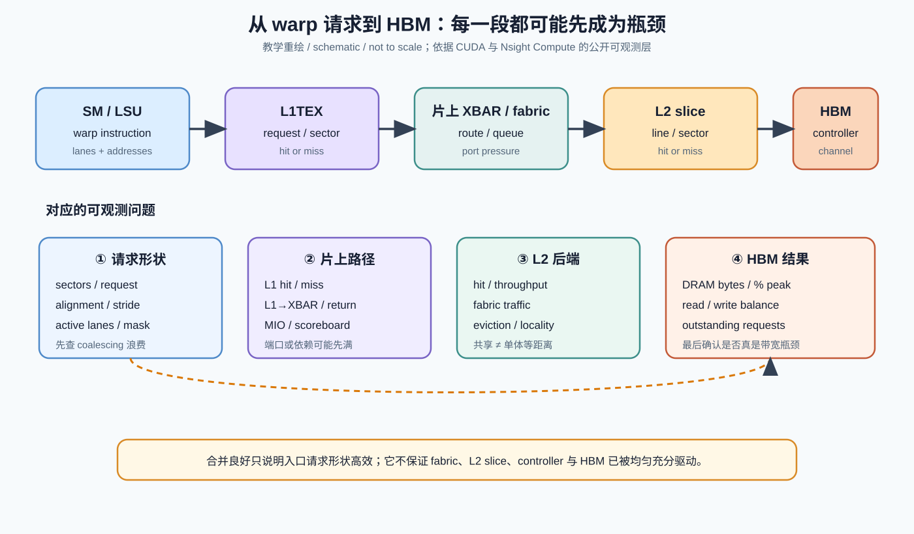
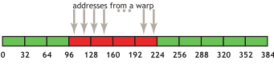
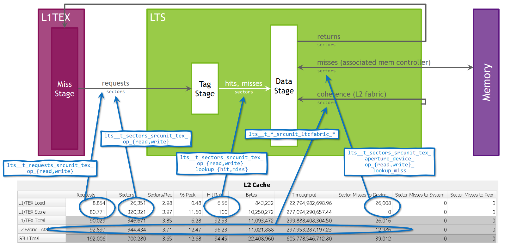
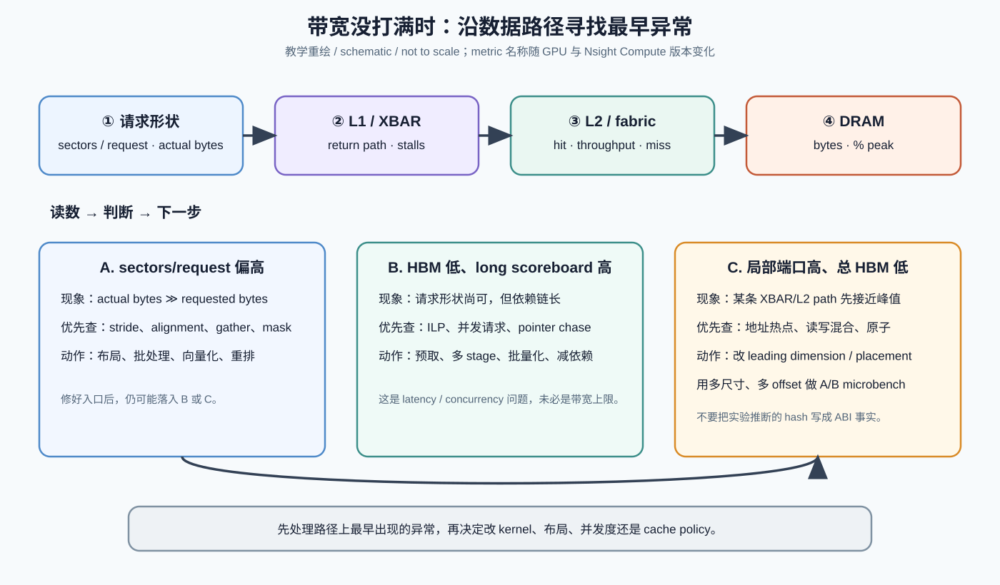

# NVIDIA Day 3 / 总课程 Day 15：L1/shared、L2 slice、memory controller 与片上 fabric

> 日期：2026-09-17  
> 预计学习时间：约 30 分钟  
> 承接：上一课建立了 GPC → TPC → SM 与共享 L2/memory partition 的边界；今天只追一笔数据从 warp 离开 SM，直到 L2/HBM，并解释为什么“访问已经 coalesced”仍可能打不满 HBM。

## 今日目标

学完后，你应该能把 `global load 很慢` 拆成四类问题：入口 sector 浪费、L1/XBAR 端口压力、L2 locality/fabric 压力、HBM 并发或分区利用不足，而不是把它们统称为 memory-bound。

你还应该能读懂 Nsight Compute 的 Memory Workload Analysis：知道 request、sector、cache line、hit、miss、throughput 和 `% peak` 各自回答什么问题，以及它们不能证明什么。

## 先给结论：coalescing 只解决第一公里

一个 warp 发出 32 个地址，不会直接变成“32 次 HBM 读取”。L1TEX 先按地址覆盖范围把线程访问合并为一个或多个 request，并以 32 B sector 为传输/统计粒度；L1 miss 再穿过片上互联到负责该地址的 L2 slice，L2 miss 才继续进入关联的 memory controller 与 HBM。

因此，下列两句话可以同时成立：

- warp 的 32 个线程连续读取 32 个 `float`，只需要四个 32 B sector，入口合并完全理想；
- 整个 kernel 仍然只达到很低的 HBM 带宽，因为 outstanding request 不够、访问依赖串行、L2/XBAR 某端口先饱和，或地址分布没有均匀驱动后端。

这正是今天最重要的心智模型：**coalescing 是请求形状问题；HBM 饱和是整条数据路径的并发与均衡问题。**

## 1. 请求怎样从 SM 走到 HBM（约 7 分钟）



怎么看：图的上半部分是数据路径，下半部分是每一段可观测的症状。箭头没有表示 Hopper/Blackwell 的真实 NoC 拓扑；NVIDIA 没有公开 route、地址 hash、队列深度和完整 floorplan，因此这些细节必须标为 `not disclosed`。

### 1.1 SM/LSU 产生的是带线程掩码的一组地址

你已经熟悉 warp memory instruction，但需要把它放回系统路径：LSU 面对的不是一个抽象“128 B load”，而是 active lanes、每 lane 访问宽度、地址分布、cache operator 和依赖关系的组合。相同的有效字节数，可以形成完全不同的 sector 数量与返回包数量。

对 compute capability 6.0 及以上设备，NVIDIA 官方 Best Practices Guide 把规则概括为：warp 的并发访问被合并成覆盖全部地址所需的最少 32 B transaction。32 个线程各读一个连续、对齐的 4 B 值，理想情况是四个 32 B transaction；连续但错开一个 32 B 边界，可能变成五个。



怎么看：绿色是线程实际需要的 4 B word，红框表示需要取回的 32 B segment。关键不是“线程编号连续”，而是活跃线程的地址集合覆盖了多少个 sector；mask、stride 和 alignment 都会改变答案。

### 1.2 L1/shared 是同一片 SM-local 容量的两个逻辑角色

在近代 NVIDIA 数据中心 GPU 上，L1 data cache 与 shared memory 使用统一的片上存储资源，但两者不是同一种编程语义。shared memory 由程序显式寻址、显式同步；L1 由硬件根据 global/local/texture 等访问维护缓存行为。容量可配置或按架构固定分配，不代表一次 global load 会“先写 shared memory”。

L1TEX 是理解 counter 的更好入口：它服务 global/local/texture/surface 等数据访问，并把 miss 变成送往 L2 的 sector 请求。Nsight Compute 还把 shared-memory bank 行为放在同一个相关分析区域，但 shared bank conflict 与 global-load coalescing 是两件事。

### 1.3 片上 XBAR/fabric 的职责是路由，而不是替你增加 HBM 带宽

L1 miss 必须到达负责该地址的 L2 资源。NVIDIA 的 profiler 文档明确提供 `L1-to-XBAR`、`XBAR-to-L1 return` 一类利用率，并且在适用 GPU 上单列 `L2 Fabric Total`；这证明软件可见的性能路径中确实存在 L1、互联端口、L2 partition 之间的不同流量阶段。

但这些 counter **不能**还原量产芯片的完整 NoC。我们可以说某条路径或端口接近峰值，不能仅凭名称画出 router 数、拓扑或仲裁算法。

### 1.4 L2 是共享但切片化的后端

L2 对所有 SM 共享，不等于它是一整块等距离 SRAM。官方 Nsight Compute 的 GA100 模型把 L2 表示为 LTS tag/data stage，并显示 L1TEX 请求、关联 memory controller 的 miss、返回流量以及跨 L2 fabric 的 coherence 流量。



怎么看：这不是 GA100 floorplan，而是 profiler counter model。每个 L2 request 最多覆盖同一条 128 B cache line 中的四个 32 B sector；L2 的工作与带宽统计以 sector 为重要粒度。图中还出现 `associated mem controller` 和 `L2 fabric`，说明“L2 命中率”之外还存在 slice/port/fabric 层面的约束。

对软件而言，最安全的模型是：一个物理地址会被路由到某个 home L2 slice/partition，miss 再走向相应 memory backend；具体地址位如何 hash、跨代是否变化，不属于 CUDA ABI，也没有在公开文档中稳定承诺。

## 2. request、sector、cache line：三个尺度不要混（约 5 分钟）

### 2.1 request 是一次被合并后的访问工作

Nsight Compute 的 L2 表中，`Requests` 表示向 L2 发出的请求数；每个 request 最多访问同一条 128 B cache line 的四个 sector。它不是源代码里的 load 指令数，也不是 DRAM transaction 数。

### 2.2 sector 是 32 B 的流量粒度

L1 和 L2 的 `Bytes` 通常可以理解为 sector 数乘 32 B。对 32 个活跃线程各读一个对齐 `float` 的 warp load，L1 `Sectors/Req` 的理想值是 4；各线程落在不同 sector 时，这个值可能接近 32。

注意“越小越好”也有语境。如果 warp 中只有少量 lane 活跃，sector 数小可能只是工作少，不代表吞吐高；统一地址广播也可能得到很小的 sector 数，但计算是否有效要另看。

### 2.3 cache line 是 tag 与局部性的组织尺度

一个 L2 request 可以触及 128 B line 中的一到四个 sector。sector 化的意义是：硬件不必因为使用 32 B 就在所有层搬满 128 B，但 tag、replacement 和相邻 sector 局部性仍以更大的 line 结构发生。

因此，两个 kernel 都是四 sectors/request，仍可能有不同的 L2 命中率、eviction、reuse distance 和 HBM 流量。

## 3. 为什么“完全合并”仍然打不满 HBM（约 7 分钟）

### 3.1 outstanding request 不足：带宽问题其实是延迟隐藏问题

如果每个 warp 的下一次 load 依赖上一次返回，例如 pointer chasing 或串行 KV-page metadata traversal，单次访问可以完美合并，但同时在途请求数太少。此时 DRAM `% peak` 不高，`long scoreboard` 却很高。

应对方向不是继续改 alignment，而是增加独立请求：批量处理更多序列、提高 ILP、使用多 stage pipeline、预取下一块 metadata，或重新组织数据结构减少依赖链。

### 3.2 L2 命中很高：HBM 低不是坏事

如果 workload 的热点数据被 L2 服务，device-memory throughput 低可能是成功。判断 kernel 是否“没有利用 HBM”之前，先看 L2 hit rate、L2 throughput 与实际 runtime；只看 DRAM 带宽会把缓存收益误判为瓶颈。

反过来，过高 L2 hit rate 也不自动等于快：如果请求本身很散，L2 sector/port 或返回路径仍可能先饱和。

### 3.3 某条片上端口先到峰值

Nsight Compute 明确提醒：多个 link 共享同一 port 时，单条 link 看起来低于峰值，port 本身仍可能已经满。散乱 read 可能压满 XBAR-to-L1 return path；散乱 write/atomic/reduction 可能压满 L1-to-XBAR path。此时总 HBM 利用率可以并不高。

### 3.4 地址分布与后端 partition 不均

为了并行扩展，L2 与 memory controllers 都是分区化资源。即使每个 warp 内访问连续，很多 CTA 若以某种周期性 stride 访问，也可能持续把压力集中在一部分 home slice/backend。

这里必须保持证据纪律：NVIDIA 没有把 Hopper/Blackwell 的地址到 L2/controller hash 作为编程接口公开。你可以通过改变 allocation、base offset、leading dimension、page size 与 problem size观察性能周期，再结合 counter 判断是否存在 partition/fabric 热点；不能把某次 microbenchmark 推出的位映射永久写死到生产代码。

### 3.5 读写、原子与部分写具有不同后端成本

相同字节数的 read、write、atomic/reduction 不等价。官方 Nsight Compute 文档还指出，带 ECC 时，L2 中对 sector 的部分修改可能引入相应的 DRAM sector load，增加 L2 sector miss。优化时必须分开观察 read/write/atomic，而不是只看合计 GB/s。

## 4. 一套够用的 Nsight Compute 定位顺序（约 5 分钟）



怎么看：顺序是从最靠近发起端的异常往后查。越早出现异常，后面的“低利用率”越可能只是上游喂不饱的结果。具体 metric 名会随 GPU 与 Nsight Compute 版本变化，优先用 Memory Workload Analysis 表格/图，并用 `ncu --query-metrics` 确认目标机器上的名字。

建议固定做四步：

1. 看 requested bytes 与 actual bytes、L1 sectors/request，先确认有没有明显 sector 浪费。
2. 看 L1 hit/miss、L1→XBAR、return port，以及 `long scoreboard` / `mio throttle`，区分延迟依赖与端口拥塞。
3. 看 L2 request/sector、hit rate、throughput、miss destination；适用架构再看 L2 fabric traffic。
4. 最后看 device-memory read/write bytes 与 `% peak`，确认 HBM 是否真的成为最窄处。

一个常见误诊是：看到 `long scoreboard` 就说 memory bandwidth bound。NVIDIA 官方 profiler 文档明确说，等待 L1TEX dependency 说明 memory latency 影响发射，但不必然意味着 memory bandwidth 已饱和；当带宽未满时，应优先考虑 ILP、unrolling 或 pipelining。

## 5. AI workload 映射：decode 的 KV gather（约 4 分钟）

考虑 paged KV cache 的 decode attention。每个序列的逻辑 token 被页表映射到非连续物理 block，warp 可能读取连续的 head dimension，但不同 CTA/sequence 的 block 在地址空间中离散。

第一层问题是 warp 内部：head dimension 是否连续、向量宽度是否合适、尾部 mask 是否制造额外 sector。第二层是 cache：同一 KV block 是否会被多个 query head 或 request 复用，L2 能否留住热点 metadata。第三层是并发：每条序列的依赖链较长时，batch 是否提供足够多的独立 miss。第四层才是后端：大量 block 的物理地址是否让 L2/controller/fabric 流量足够均衡。

所以 decode kernel 的调优可能出现这种轨迹：

```text
把 32 个散乱 lane 变成连续 vector load
→ sectors/request 显著改善
→ HBM 仍未饱和，long scoreboard 仍高
→ 增加并行 sequence / prefetch page metadata
→ L2 或 return path 开始接近峰值
→ 再决定是否改变 KV block layout 或 cache policy
```

这比一句“decode 是 memory-bound”更接近工程现实。

## 6. 论文阅读导航：只看 6 分钟

阅读 Luo 等人的 2025 Hopper microbenchmark 论文，只看 **Section IV-A 的 Figure 2、Table IV 与对应三段解释**。

为什么现在看：官方文档告诉我们 L2 有 partition/fabric，但没有给出物理距离与延迟分组；这篇论文用 fine-grained pointer chase 展示 A100 与 H800 的 near/far L2 hit/miss 分组，补足“共享 L2 不等于等距离”的直觉。

看什么：作者在 H800 PCIe 上报告 near hit 约 258 cycles、far hit 约 414 cycles，并把差异解释为双 partition L2 与 SM 到 partition 的距离不同；他们也明确说明传统平均 pointer chase 会掩盖这种分组。

看完要知道什么：**平均 L2 latency 不是一个普适常数。** 但这些数字和 near/far 解释是论文的测量与模型，不是 NVIDIA 对所有 H100/H200/B200 的公开保证，不能跨 SKU 机械套用。

论文的 Section IV-B 还报告其 H800 实验中 L2 throughput 明显高于 A100，并在全局内存测试中达到约 91% 理论带宽；这说明打满 HBM 的 microbenchmark 需要专门构造足够多、足够宽、足够独立的访问，不能把普通 kernel 的低带宽直接归因于硬件峰值不足。

## 7. 专利证据：能证明“可分区设计意图”，不能证明地址 hash

NVIDIA 的 `US20230289189A1 Distributed Shared Memory` 申请号为 `US17/691,690`，优先权/申请日 2022-03-10，公开日 2023-09-14，assignee 为 NVIDIA Corporation；同族授权文本为 `US12248788B2`，2025-03-11 公开授权。

该专利在背景/embodiment 中描述了 Ampere 风格 GPU 可切成多个 micro-GPU，并把 processing resources 与包括 local L2 cache memory 在内的 memory resources 一并分区。这与 A100/H100 官方 MIG 资料中“计算、cache、memory bandwidth 隔离”的产品行为方向一致。

但它没有给我们一个可依赖的 Hopper/Blackwell 地址 hash，也不能单独确认某个 SKU 的真实 floorplan。结论标记为：`patent evidence / implementation not confirmed`。我们只用它支持“L2/memory 后端是可物理分区的资源集合”这一设计意图；量产行为仍以官方 MIG 文档、Nsight counter 与实机 microbenchmark 为准。

## 8. 与 Google TPU 的最小对照

Google TPU 的教材模型更容易显式说成 `MXU/VPU ↔ VMEM ↔ HBM`，并把 ICI 作为独立互联层；NVIDIA GPU 则把大量通用 load/store、纹理、local spill、shared-memory 操作汇入 L1TEX/LSU 相关路径，再通过共享、切片化的 L2 后端连接 HBM。

对软件工程师的差别是：TPU 更依赖 compiler 对显式 scratchpad/数据搬运的规划；NVIDIA 则同时给你 hardware cache、shared memory、cache operator、TMA/cp.async 与丰富 counter。选择更多，但也更容易把“缓存命中”“合并”“片上 fabric”和“HBM 带宽”混为一谈。

## 易混淆点

- **L1/shared unified ≠ global load 经过 shared memory。** 统一的是物理资源池，语义和寻址路径不同。
- **L2 shared ≠ 单体、等距离。** 它对软件共享，但实现可以切片、分 partition，并存在不同端口/路径。
- **四 sectors/request ≠ 已打满 HBM。** 它只说明 32-bit contiguous warp load 的入口形状理想。
- **DRAM `% peak` 低 ≠ 必须优化 HBM。** 可能是 L2 命中、依赖链、发射不足或片上端口先限速。
- **高 L2 hit rate ≠ 一定快。** request rate、sector efficiency、return path 与 consumer dependency 仍会限速。
- **microbenchmark 推出的地址周期 ≠ CUDA ABI。** 驱动、SKU、MIG、page placement、代际都可能改变观察结果。
- **memory-bound 不是一个层级。** 应说清楚是 L1/shared、L1↔XBAR、L2、fabric、DRAM latency 还是 DRAM bandwidth。

## 结论

NVIDIA GPU 的 global-memory 性能不是一根从 SM 直通 HBM 的管子，而是一条由请求合并、SM-local L1TEX、片上互联、切片化 L2、memory controller 与 HBM 串成的路径。

最实用的优化顺序是：先检查 sector 浪费，再看端口与依赖，再看 L2 locality/fabric，最后确认 DRAM 是否真的饱和。这个顺序能避免把所有低带宽都归咎于 coalescing，也能避免在 HBM 根本没成为瓶颈时盲目追求更高 GB/s。

## 验收标准

1. 你能解释为什么 32 个连续 `float` load 理想情况下是四个 32 B sector，同时又不能据此断言 HBM 已饱和。
2. 给你一份 Nsight Compute 报告，你能按 `L1 sectors/request → XBAR/return → L2 hit/throughput/fabric → DRAM % peak` 的顺序定位最早异常。
3. 你能明确区分官方可观测行为、论文 microbenchmark 推断和专利 embodiment，不把 near/far latency 或地址映射写成跨代硬件事实。

## 下一课预告

Day 16 将快速校准 SM 内执行路径：warp scheduler、issue、scoreboard、LSU、Tensor Core 与异步搬运如何协作；熟悉内容会压缩，重点放在这些前端机制怎样决定今天这条 memory path 能否被持续喂满。

## 参考资料

1. NVIDIA, [CUDA C++ Best Practices Guide 13.4 — Coalesced Access to Global Memory](https://docs.nvidia.com/cuda/cuda-c-best-practices-guide/index.html#coalesced-access-to-global-memory), 访问日期 2026-09-17。
2. NVIDIA, [Nsight Compute Profiling Guide 13.3 — Memory Tables](https://docs.nvidia.com/nsight-compute/ProfilingGuide/index.html#memory-tables), 更新于 2026-07-15，访问日期 2026-09-17。
3. NVIDIA, [Nsight Compute Compute Triage Guide — Memory Analysis Fundamentals](https://docs.nvidia.com/nsight-compute/ComputeTriage/index.html), 访问日期 2026-09-17。
4. NVIDIA, [CUDA Programming Guide](https://docs.nvidia.com/cuda/cuda-programming-guide/index.html), L2 Cache 相关章节，访问日期 2026-09-17。
5. NVIDIA, [NVIDIA Hopper Architecture In-Depth](https://developer.nvidia.com/blog/nvidia-hopper-architecture-in-depth/), 2022-03-22，访问日期 2026-09-17。
6. Weile Luo et al., [Dissecting the NVIDIA Hopper Architecture through Microbenchmarking and Multiple Level Analysis](https://arxiv.org/html/2501.12084v1), arXiv:2501.12084v1, 2025-01-21。
7. NVIDIA Corporation, [US20230289189A1 — Distributed Shared Memory](https://patents.google.com/patent/US20230289189A1/en), 申请日 2022-03-10，公开日 2023-09-14。
