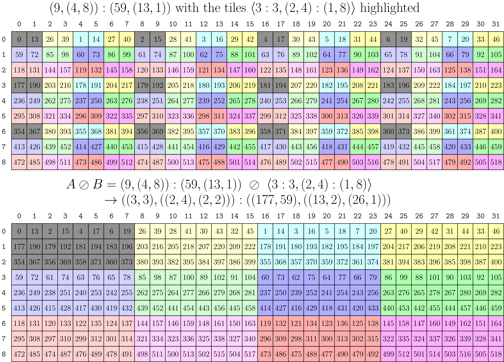

# CuTe Layout Algebra

CuTe 提供一套 “`Layout` algebra”，用于支持以不同方式组合 layouts。这个 algebra 包括：

* `Layout` 的函数复合；
* `Layout` “product” 概念，用于根据一个 layout 复制另一个 layout；
* `Layout` “divide” 概念，用于根据一个 layout 拆分另一个 layout。

从简单 layouts 构建复杂 layouts 的常用工具依赖 `Layout` product。把某些 layout（例如数据 layout）按另一些 layout（例如线程 layout）partition 的常用工具依赖 `Layout` divide。所有这些工具都依赖 `Layout` 的函数复合。

本节会逐步构建 `Layout` algebra 的工具，并详细解释其中一些核心操作。

## Coalesce

上一节将 `Layout` 总结为：

> Layouts 是从 integers 到 integers 的函数。

`coalesce` 操作是对这类函数的 “simplify”。如果只关心输入 integers，那么可以操作 `Layout` 的 shape 和 mode 数量，而不改变它作为函数的行为。`coalesce` 唯一不能改变的是 `Layout` 的 `size`。

更具体地说，可以在 [`coalesce` unit test](https://github.com/NVIDIA/cutlass/tree/main/test/unit/cute/core/coalesce.cpp) 中找到被检查的 post-conditions。这里重现如下：

```cpp
// @post size(@a result) == size(@a layout)
// @post depth(@a result) <= 1
// @post for all i, 0 <= i < size(@a layout), @a result(i) == @a layout(i)
Layout coalesce(Layout const& layout)
```

例如：

```cpp
auto layout = Layout<Shape <_2,Shape <_1,_6>>,
                     Stride<_1,Stride<_6,_2>>>{};
auto result = coalesce(layout);    // _12:_1
```

可以看到结果 mode 更少，也更“简单”。如果 coordinate mapping 和 index mapping 是动态执行的，这甚至可以省掉一些操作。

那么如何得到这个结果？

* 我们已经看到，像 `(_2,_4):(_1,_2)` 这样的 column-major `Layout` 对 1-D coordinates 的行为与 `_8:_1` 完全相同。
* size 为 static-1 的 modes 总会产生 static-0 的 natural coordinate。因此不管 stride 是什么，它们都可以忽略。

进一步概括，考虑只有两个 integral modes 的 layout：`s0:d0` 和 `s1:d1`。将 coalescing 这个 layout 的结果记作 `s0:d0 ++ s1:d1`。那么有四种情况：

1. `s0:d0 ++ _1:d1 => s0:d0`。忽略 size 为 static-1 的 modes。
2. `_1:d0 ++ s1:d1 => s1:d1`。忽略 size 为 static-1 的 modes。
3. `s0:d0 ++ s1:s0*d0 => s0*s1:d0`。如果第二个 mode 的 stride 是第一个 mode 的 size 与 stride 的乘积，则两者可以合并。
4. `s0:d0 ++ s1:d1 => (s0,s1):(d0,d1)`。否则无法处理，必须分开保留。

就这些。我们可以 flatten 任意 layout，然后按顺序对每对相邻 modes 应用上面的二元操作，以 “coalesce” layout 的 modes。

### By-mode Coalesce

有时我们当然会关心 `Layout` 的 shape，但仍想 coalesce。例如，我有一个 2-D `Layout`，希望结果仍保持 2-D。

因此，`coalesce` 有一个接受额外参数的 overload：

```cpp
// Apply coalesce at the terminals of trg_profile
Layout coalesce(Layout const& layout, IntTuple const& trg_profile)
```

可以这样使用：

```cpp
auto a = Layout<Shape <_2,Shape <_1,_6>>,
                Stride<_1,Stride<_6,_2>>>{};
auto result = coalesce(a, Step<_1,_1>{});   // (_2,_6):(_1,_2)
// Identical to
auto same_r = make_layout(coalesce(layout<0>(a)),
                          coalesce(layout<1>(a)));
```

这个函数会递归进入 `Step<_1,_1>{}`，当看到 integer 而不是 tuple 时，对对应 sublayout 应用 `coalesce`。其中的值并不重要，它们只是 flags。

> 这种主题会反复出现：先定义一个把 `Layout` 当成从 integers 到 integers 的 “1-D” 函数的操作，然后再泛化到任意 shape 的 layout 上使用。

## Composition

`Layout` 的函数复合是 CuTe 的核心，几乎所有更高层操作都会用到它。

再次从 “`Layout` 只是从 integers 到 integers 的函数” 这个观察出发，可以定义产生另一个 `Layout` 的函数复合。先看一个例子。

```text
Functional composition, R := A o B
R(c) := (A o B)(c) := A(B(c))

Example
A = (6,2):(8,2)
B = (4,3):(3,1)

R( 0) = A(B( 0)) = A(B(0,0)) = A( 0) = A(0,0) =  0
R( 1) = A(B( 1)) = A(B(1,0)) = A( 3) = A(3,0) = 24
R( 2) = A(B( 2)) = A(B(2,0)) = A( 6) = A(0,1) =  2
R( 3) = A(B( 3)) = A(B(3,0)) = A( 9) = A(3,1) = 26
R( 4) = A(B( 4)) = A(B(0,1)) = A( 1) = A(1,0) =  8
R( 5) = A(B( 5)) = A(B(1,1)) = A( 4) = A(4,0) = 32
R( 6) = A(B( 6)) = A(B(2,1)) = A( 7) = A(1,1) = 10
R( 7) = A(B( 7)) = A(B(3,1)) = A(10) = A(4,1) = 34
R( 8) = A(B( 8)) = A(B(0,2)) = A( 2) = A(2,0) = 16
R( 9) = A(B( 9)) = A(B(1,2)) = A( 5) = A(5,0) = 40
R(10) = A(B(10)) = A(B(2,2)) = A( 8) = A(2,1) = 18
R(11) = A(B(11)) = A(B(3,2)) = A(11) = A(5,1) = 42
```

一个很关键的观察是，上面定义的函数 `R(c) = k` 可以写成另一个 `Layout`：

```text
R = ((2,2),3):((24,2),8)
```

并且：

```text
compatible(B, R)
```

也就是说，`B` 的每个 coordinate 也都可以用作 `R` 的 coordinate。这是函数复合的预期性质，因为 `B` 定义了 `R` 的 *domain*。

你可以在 [`composition` unit test](https://github.com/NVIDIA/cutlass/tree/main/test/unit/cute/core/composition.cpp) 中看到很多示例和被检查的 post-conditions。post-conditions 正是上面描述的内容。

```cpp
// @post compatible(@a layout_b, @a result)
// @post for all i, 0 <= i < size(@a layout_b), @a result(i) == @a layout_a(@a layout_b(i)))
Layout composition(LayoutA const& layout_a, LayoutB const& layout_b)
```

### 计算 Composition

先观察几点：

* `B = (B_0, B_1, ...)`。一个 layout 可以表示为其 sublayouts 的 concatenation。

* `A o B = A o (B_0, B_1, ...) = (A o B_0, A o B_1, ...)`。当 `B` 是 injective 时，composition 对 concatenation 左分配。

基于这些，我们可以不失一般性地假设 `B = s:d` 是一个具有 integral shape 和 stride 的 layout。也可以假设 `A` 是 flattened、coalesced layout。

当 `A` 是 integral，即 `A = a:b` 时，结果很直接：`R = A o B = a:b o s:d = s:(b*d)`。这里 composition 结果 `R` 是 `A` 中前 `s` 个元素，并按 `d` 取 stride。

当 `A` 是 multimodal 时，需要更小心。用文字描述，`A o B = A o s:d`，其中 `s` 和 `d` 是 integral，意味着我们要：

1. 确定一个 layout，它产生 `A` 中每第 `d` 个元素。

这个中间 layout 的 shape 可以从左开始逐步从 `A` 的 shape 中“除掉”前 `d` 个元素来计算。

例如：

* `(6,2) / 2 => (3,2)`
* `(6,2) / 3 => (2,2)`
* `(6,2) / 6 => (1,2)`
* `(6,2) / 12 => (1,1)`
* `(3,6,2,8) / 3 => (1,6,2,8)`
* `(3,6,2,8) / 6 => (1,3,2,8)`
* `(3,6,2,8) / 9 => (1,2,2,8)`
* `(3,6,2,8) / 72 => (1,1,1,4)`

为了计算 strided layout 的 strides，会使用上述操作的 residues 来缩放 `A` 的 strides。例如，最后一个例子 `(3,6,2,8):(w,x,y,z) / 72`，strides 为 `(w,x,y,z)`，会产生 `(72*w,24*x,4*x,2*z)` 作为 strided layout 的 strides。

你可能已经注意到，我们只能用某些值除 shape 并得到有意义结果。这称为 **stride divisibility condition**，CuTe 会在可能时静态检查它。

2. 保留新 strided `A` 的前 `s` 个元素，使结果具有与 `B` compatible 的 shape。这可以从左开始对 `A` 的 shape “mod out” 前 `s` 个元素来计算。

例如：

* `(6,2) % 2 => (2,1)`
* `(6,2) % 3 => (3,1)`
* `(6,2) % 6 => (6,1)`
* `(6,2) % 12 => (6,2)`
* `(3,6,2,8) % 6 => (3,2,1,1)`
* `(3,6,2,8) % 9 => (3,3,1,1)`
* `(1,2,2,8) % 2 => (1,2,1,1)`
* `(1,2,2,8) % 16 => (1,2,2,4)`

该操作会使结果具有与 `B` compatible 的 shape。

同样，这个操作必须满足 **shape divisibility condition** 才能得到有意义结果，CuTe 会在可能时静态检查。

基于上面例子，可以构造 composition：

```text
(3,6,2,8):(w,x,y,z) o 16:9 = (1,2,2,4):(9*w,3*x,y,z)
```

#### 示例 1：计算 Composition 的完整示例

下面给出一个更复杂的 composition 示例，其中两个 operand layouts 都是 multi-modal，用来说明上面介绍的概念。

```text
Functional composition, R := A o B
R(c) := (A o B)(c) := A(B(c))

Example
A = (6,2):(8,2)
B = (4,3):(3,1)

1. Using the left-distributive and concatenation properties for layouts we write the composition as,

R = A o B
  = (6,2):(8,2) o (4,3):(3,1)
  = ((6,2):(8,2) o 4:3, (6,2):(8,2) o 3:1)

---
1. Compute `(6,2):(8,2) o 4:3`

- First, we compute the strided layout,

(6,2):(8,2) / 3 = (6/3,2):(8*3,2) = (2,2):(24,2)

- Next, we keep the shape compatible,

(2,2):(24,2) % 4 = (2,2):(24,2)

---
2. Compute `(6,2):(8,2) o 3:1`

- First, we compute the strided layout

(6,2):(8,2) / 1 = (6,2):(8,2)

- Next, we keep the shape compatible,

(6,2):(8,2) % 3 = (3,1):(8,2)

---

Putting this together and coalescing each mode, we obtain the result

R = A o B
  = ((2, 2), 3): ((24, 2), 8)
```

#### 示例 2：把 layout reshape 成 matrix

`20:2 o (5,4):(4,1)`。Composition 形式。

它描述的是把 layout `20:2` 按 row-major 顺序解释成一个 5x4 matrix。

1. `= 20:2 o (5:4,4:1)`。将 layout `(5,4):(4,1)` 看成 sublayouts 的 concatenation。

2. `= (20:2 o 5:4, 20:2 o 4:1)`。左分配律。

   * `20:2 o 5:4 => 5:8`。简单情形。
   * `20:2 o 4:1 => 4:2`。简单情形。

3. `= (5:8, 4:2)`。Composed Layout 表示为 sublayouts 的 concatenation。

4. `= (5,4):(8,2)`。最终 composed layout。

#### 示例 3：把 layout reshape 成 matrix

`(10,2):(16,4) o (5,4):(1,5)`

它描述的是把 layout `(10,2):(16,4)` 按 column-major 顺序解释成一个 5x4 matrix。

1. `= (10,2):(16,4) o (5:1,4:5)`。将 layout `(5,4):(1,5)` 看成 sublayouts 的 concatenation。

2. `= ((10,2):(16,4) o 5:1, (10,2):(16,4) o 4:5)`。左分配律。

   * `(10,2):(16,4) o 5:1 => (5,1):(16,4)`。Mod out shape `5`。
   * `(10,2):(16,4) o 4:5 => (2,2):(80,4)`。Div out stride `5`。

3. `= ((5,1):(16,4), (2,2):(80,4))`。Composed Layout 表示为 sublayouts 的 concatenation。

4. `= (5:16, (2,2):(80,4))`。By-mode coalesce。

5. `= (5,(2,2))):(16,(80,4))`。最终 composed layout。

如果使用 compile-time shapes 和 strides，CuTe 会得到完全这个结果。下面 C++ 代码会打印 `(_5,(_2,_2)):(_16,(_80,_4))`。

```cpp
Layout a = make_layout(make_shape (Int<10>{}, Int<2>{}),
                       make_stride(Int<16>{}, Int<4>{}));
Layout b = make_layout(make_shape (Int< 5>{}, Int<4>{}),
                       make_stride(Int< 1>{}, Int<5>{}));
Layout c = composition(a, b);
print(c);
```

如果使用 dynamic integers，下面 C++ 代码会打印 `((5,1),(2,2)):((16,4),(80,4))`。

```cpp
Layout a = make_layout(make_shape (10, 2),
                       make_stride(16, 4));
Layout b = make_layout(make_shape ( 5, 4),
                       make_stride( 1, 5));
Layout c = composition(a, b);
print(c);
```

结果看起来可能不同，但数学上相同。shape 中的 1 不影响 layout 作为从 1-D coordinates 到 integers 的数学函数，也不影响它作为从 2-D coordinates 到 integers 的函数。在 dynamic 情况下，CuTe 无法 coalesce dynamic size-1 modes 来“简化” layout，因为包含它们的 tuples 具有 static rank 和 type。

### By-mode Composition

类似 by-mode `coalesce`，并且为了构建通用 tiling 操作，有时我们确实关心 `A` layout 的 shape，但仍想对各个 modes 分别应用 `composition`。例如，我有一个 2-D `Layout`，希望 columns 方向的元素采用某个 sublayout，rows 方向的元素采用另一个 sublayout。

因此，当第二个参数 `B` 是 `Tiler` 时，`composition` 也能工作。一般来说，tiler 是一个 layout 或 tuple-of-layouts（注意这是对 `IntTuple` 的泛化），可以这样使用：

```cpp
// (12,(4,8)):(59,(13,1))
auto a = make_layout(make_shape (12,make_shape ( 4,8)),
                     make_stride(59,make_stride(13,1)));
// <3:4, 8:2>
auto tiler = make_tile(Layout<_3,_4>{},  // Apply 3:4 to mode-0
                       Layout<_8,_2>{}); // Apply 8:2 to mode-1

// (_3,(2,4)):(236,(26,1))
auto result = composition(a, tiler);
// Identical to
auto same_r = make_layout(composition(layout<0>(a), get<0>(tiler)),
                          composition(layout<1>(a), get<1>(tiler)));
```

我们常用 `<LayoutA, LayoutB, ...>` 记法区分 `Tiler`，不同于前面用的 sublayouts concatenation 记法 `(LayoutA, LayoutB, ...)`。

上面代码中的 `result` 可以画成原始 layout 中高亮的 3x8 sublayout。


为方便起见，CuTe 也把 `Shape` 解释为 tiler。`Shape` 会被解释为 stride-1 layouts 的 tuple：

```cpp
// (12,(4,8)):(59,(13,1))
auto a = make_layout(make_shape (12,make_shape ( 4,8)),
                     make_stride(59,make_stride(13,1)));
// (3, 8)
auto tiler = make_shape(Int<3>{}, Int<8>{});
// Equivalent to <3:1, 8:1>
// auto tiler = make_tile(Layout<_3,_1>{},  // Apply 3:1 to mode-0
//                        Layout<_8,_1>{}); // Apply 8:1 to mode-1

// (_3,(4,2)):(59,(13,1))
auto result = composition(a, tiler);
```

其中 `result` 可以画成原始 layout 中高亮的 3x8 sublayout。


## Composition Tilers

总结一下，`Tiler` 是以下对象之一：

1. 一个 `Layout`。
2. 一个由 `Tiler`s 组成的 tuple。
3. 一个 `Shape`，它会被解释为 stride-1 `Layout`s 的 tiler。

以上任意对象都可以作为 `composition` 的第二个参数。对于情况 1，不管 layouts 的 ranks 如何，我们都把 `composition` 看作两个从 integers 到 integers 的函数之间的复合。对于情况 2 和 3，`composition` 会对 `A` 与 `B` 的对应 modes 成对执行，直到遇到情况 1。

这使得 composition 既能按 mode 应用，以取回 tensor 指定 modes 的任意 sublayouts，例如“给我这个 MxNxL tensor 的 3x5x8 subblock”；也能把整个 data tile 像 1-D vector 一样 reshape 和 reorder，例如“用这个奇怪元素顺序把 8x16 data block 重排成 32x4 block”。在后续示例中，为 threadblocks tiling 时会经常看到 by-mode 情况；当我们想应用 MMAs 中线程和值的任意 partitioning patterns 时，会看到 1-D reshape 和 reorder。

## Complement

在进入 “product” 和 “divide” 之前，还需要一个操作。可以把 `composition` 理解为 layout `B` 在另一个 layout `A` 中“选择”某些 coordinates。那么没有被“选中”的 coordinates 怎么办？为了实现通用 tiling，我们希望既能选择任意元素，也就是 tile，又能描述这些 tiles 的 layout，也就是 leftovers 或 “rest”。

一个 layout 的 `complement` 会尝试找到另一个表示 “rest” 的 layout，也就是原 layout 没有触及的元素。

你可以在 [`complement` unit test](https://github.com/NVIDIA/cutlass/tree/main/test/unit/cute/core/complement.cpp) 中看到很多示例和被检查的 post-conditions。其中包括：

```cpp
// @post cosize(make_layout(@a layout_a, @a result))) >= size(@a cotarget)
// @post cosize(@a result) >= round_up(size(@a cotarget), cosize(@a layout_a))
// @post for all i, 1 <= i < size(@a result),
//         @a result(i-1) < @a result(i)
// @post for all i, 1 <= i < size(@a result),
//         for all j, 0 <= j < size(@a layout_a),
//           @a result(i) != @a layout_a(j)
Layout complement(LayoutA const& layout_a, Shape const& cotarget)
```

也就是说，layout `A` 关于 Shape（IntTuple）`M` 的 complement `R` 满足：

1. `R` 的 size（和 cosize）由 `size(M)` *bounded*。
2. `R` 是 *ordered*，即 `R` 的 strides 为正且递增。这意味着 `R` 是唯一的。
3. `A` 和 `R` 的 codomains *disjoint*。`R` 试图“补全” `A` 的 codomain。

上面的 `cotarget` 参数最常见是一个 integer，因为上面只使用了 `size(cotarget)`。不过，有时指定具有 static properties 的 integer 很有用。例如，`28` 是 dynamic integer，而 `(_4,7)` 是 size 为 `28` 的 shape，并且静态已知可被 `_4` 整除。二者数学上会产生相同 `complement`，但额外信息可被 `complement` 用于尽量保留结果的 staticness。

### Complement Examples

`complement` 在 static shapes 和 strides 上最有效，因此下面所有 integers 都视为 static。关于 dynamic shapes/strides 以及 IntTuple `cotarget` 的类似示例，可见 [unit test](https://github.com/NVIDIA/cutlass/tree/main/test/unit/cute/core/complement.cpp)。

* `complement(4:1, 24)` 是 `6:4`。注意 `(4,6):(1,4)` 的 cosize 是 `24`。layout `4:1` 实际上用 `6:4` 重复了 6 次。

* `complement(6:4, 24)` 是 `4:1`。注意 `(6,4):(4,1)` 的 cosize 是 `24`。`6:4` 中的 “hole” 被 `4:1` 填充。

* `complement((4,6):(1,4), 24)` 是 `1:0`。不需要 append 任何东西。

* `complement(4:2, 24)` 是 `(2,3):(1,8)`。注意 `(4,(2,3)):(2,(1,8))` 的 cosize 是 `24`。`4:2` 中的 “hole” 先由 `2:1` 填充，然后所有内容用 `3:8` 重复 3 次。

* `complement((2,4):(1,6), 24)` 是 `3:2`。注意 `((2,4),3):((1,6),2)` 的 cosize 是 `24`，并产生 unique indices。

* `complement((2,2):(1,6), 24)` 是 `(3,2):(2,12)`。注意 `((2,2),(3,2)):((1,6),(2,12))` 的 cosize 是 `24`，并产生 unique indices。


作为可视化，上图展示最后一个例子的 codomain。原始 layout `(2,2):(1,6)` 的 image 被标成灰色。complement 实际上会“重复”原始 layout（以其他颜色显示），使结果的 codomain size 为 `24`。complement `(3,2):(2,12)` 可以看作 “repetition 的 layout”。

## Division（Tiling）

现在可以定义一个 `Layout` 被另一个 `Layout` 除。将 layout 拆成组件的函数可作为 tiling 和 partitioning layouts 的基础。

本节定义 `logical_divide(Layout, Layout)`。它同样把所有 `Layout` 看成从 integers 到 integers 的 1-D 函数，再用这个定义创建 multidimensional `Layout` divides。

非正式地说，`logical_divide(A, B)` 会把 layout `A` 拆成两个 modes：第一个 mode 中是 `B` 指向的所有元素，第二个 mode 中是 `B` 没有指向的所有元素。

形式上写作：

$$A \oslash B := A \circ (B,B^*)$$

实现为：

```cpp
template <class LShape, class LStride,
          class TShape, class TStride>
auto logical_divide(Layout<LShape,LStride> const& layout,
                    Layout<TShape,TStride> const& tiler)
{
  return composition(layout, make_layout(tiler, complement(tiler, size(layout))));
}
```

注意，它只用 concatenation、composition 和 complement 定义。

第一句话 “第一个 mode 中是 `B` 指向的所有元素” 显然就是 composition：`A o B`。

第二句话 “第二个 mode 中是 `B` 没有指向的所有元素” 听起来就是 complement：`B*`，范围到 `A` 的 size。正如 `complement` 一节看到的，它可以描述为 “`B` 的重复的 layout”。如果 `B` 是 “tiler”，那么 `B*` 就是 tiles 的 layout。

### Logical Divide 1-D Example

考虑用 tiler `B = 4:2` tile 1-D layout `A = (4,2,3):(2,1,8)`。非正式地说，我们有一个 24 元素 1-D vector，它的存储顺序由 `A` 定义；我们想提取 stride 为 2 的 4 元素 tiles。

按照上面实现，这分三步计算：

* `B = 4:2` 在 `size(A) = 24` 下的 complement 是 `B* = (2,3):(1,8)`。
* Concatenation 得到 `(B,B*) = (4,(2,3)):(2,(1,8))`。
* `A = (4,2,3):(2,1,8)` 与 `(B,B*)` 的 composition 是 `((2,2),(2,3)):((4,1),(2,8))`。


上图把 `A` 画成 1-D layout，其中 `B` 指向的元素高亮为灰色。layout `B` 描述我们的 data “tile”，`A` 中有六个这样的 tiles，并用不同颜色显示。divide 后，结果第一个 mode 是 data tile，第二个 mode 遍历每个 tile。

### Logical Divide 2-D Example

使用上面定义的 `Tiler` 概念，可以立刻泛化到 multidimensional tiling。下面例子只是用 `Tiler` 对 2-D layout 的 cols 和 rows 按 mode 应用 `layout_divide`。

类似上面的 2-D composition 示例，考虑 2-D layout `A = (9,(4,8)):(59,(13,1))`，希望沿 columns（mode-0）应用 `3:3`，沿 rows（mode-1）应用 `(2,4):(1,8)`。这意味着 tiler 可以写成 `B = <3:3, (2,4):(1,8)>`。



上图把 `A` 画成 2-D layout，其中 `B` 指向的元素高亮为灰色。layout `B` 描述 data “tile”，`A` 中有十二个这样的 tiles，并用不同颜色显示。divide 后，结果中每个 mode 的第一个 mode 是 data tile，第二个 mode 遍历每个 tile。从这个意义上说，这个操作可以看作一种 `gather` 操作，或只是对 rows 和 cols 的 permutation。

注意，结果中每个 mode 的第一个 mode 是 sublayout `(3,(2,4)):(177,(13,2))`，这正是如果应用 `composition` 而不是 `logical_divide` 时会得到的结果。

### Zipped、Tiled、Flat Divides

在上面的图片中，tiles 被高亮显示，所以很容易看出来。但实际使用它们仍可能很别扭。如何 slice 出第 `3` 个 tile、第 `7` 个 tile，或第 `(1,2)` 个 tile，以便继续处理？

这就是 `logical_divide` 的便利变体。假设有一个 `Layout` 和某个 shape 的 `Tiler`，那么每个操作都会应用 `logical_divide`，但可能把 modes 重排成更方便的形式。

```text
Layout Shape : (M, N, L, ...)
Tiler Shape  : <TileM, TileN>

logical_divide : ((TileM,RestM), (TileN,RestN), L, ...)
zipped_divide  : ((TileM,TileN), (RestM,RestN,L,...))
tiled_divide   : ((TileM,TileN), RestM, RestN, L, ...)
flat_divide    : (TileM, TileN, RestM, RestN, L, ...)
```

例如，`zipped_divide` 函数会应用 `logical_divide`，然后把 “subtiles” 收集到一个 mode，把 “rest” 收集到另一个 mode。

```cpp
// A: shape is (9,32)
auto layout_a = make_layout(make_shape (Int< 9>{}, make_shape (Int< 4>{}, Int<8>{})),
                            make_stride(Int<59>{}, make_stride(Int<13>{}, Int<1>{})));
// B: shape is (3,8)
auto tiler = make_tile(Layout<_3,_3>{},           // Apply     3:3     to mode-0
                       Layout<Shape <_2,_4>,      // Apply (2,4):(1,8) to mode-1
                              Stride<_1,_8>>{});

// ((TileM,RestM), (TileN,RestN)) with shape ((3,3), (8,4))
auto ld = logical_divide(layout_a, tiler);
// ((TileM,TileN), (RestM,RestN)) with shape ((3,8), (3,4))
auto zd = zipped_divide(layout_a, tiler);
```

那么，第 `3` 个 tile 的 offset 是 `zd(0,3)`，第 `7` 个 tile 的 offset 是 `zd(0,7)`，第 `(1,2)` 个 tile 的 offset 是 `zd(0,make_coord(1,2))`。tile 本身总是 layout `layout<0>(zd)`。事实上，总有：

```text
layout<0>(zipped_divide(a, b)) == composition(a, b)
```

`logical_divide` 会保留 modes 的 *semantics*，同时 permute 这些 modes 内部的元素。layout `A` 的 `M`-mode 仍然是结果的 `M`-mode，layout `A` 的 `N`-mode 仍然是结果的 `N`-mode。

但 `zipped_divide` 不是这样。`zipped_divide` 结果中的 mode-0 是 `Tile` 本身，不管 `Tiler` rank 如何；mode-1 是这些 tiles 的 layout。把它们画成 2-D layouts 并不总有意义，因为 `M`-mode 现在更准确地说是 “tile-mode”，`N`-mode 更准确地说是 “rest-mode”。不过，仍然可以把结果 layout 画成下面这样的 2-D 图。


为清晰起见，图中保留了之前图片中每个 tile 的颜色。显然，跨 tiles 迭代现在等价于沿这个 layout 的一行迭代；在 tile 内迭代元素等价于沿这个 layout 的一列迭代。正如 `Tensor` 小节会看到的，这对 tile 内或跨 data tiles 的 partitioning 非常有用。

## Product（Tiling）

最后定义一个 Layout 被另一个 Layout product。本节定义 `logical_product(Layout, Layout)`，它同样把所有 `Layout` 看成从 integers 到 integers 的 1-D 函数，然后用这个定义创建 multidimensional `Layout` products。

非正式地说，`logical_product(A, B)` 产生一个 two mode layout，其中第一个 mode 是 layout `A`，第二个 mode 是 layout `B`，但 `B` 的每个元素都替换为 layout `A` 的一个 “unique replication”。

形式上写作：

$$A \otimes B := (A, A^* \circ B)$$

CuTe 中实现为：

```cpp
template <class LShape, class LStride,
          class TShape, class TStride>
auto logical_product(Layout<LShape,LStride> const& layout,
                     Layout<TShape,TStride> const& tiler)
{
  return make_layout(layout, composition(complement(layout, size(layout)*cosize(tiler)), tiler));
}
```

注意，它同样只用 concatenation、composition 和 complement 定义。

“第一个 mode 是 layout `A`” 显然只是 `A` 的拷贝。

“第二个 mode 是 layout `B`，但每个元素替换为 layout `A` 的 unique replication”。layout `A` 的 “unique replication” 听起来就是 complement：`A*`，范围到 `B` 的 cosize。正如 `complement` 一节看到的，它可以描述为 “`A` 的重复的 layout”。如果 `A` 是 “tile”，那么 `A*` 就是可供 `B` 使用的 repetitions 的 layout。

### Logical Product 1-D Example

考虑根据 `B = 6:1` 复制 1-D layout `A = (2,2):(4,1)`。非正式地说，我们有一个由 `A` 定义的 4 元素 1-D layout，希望复制它 6 次。

按照上面实现，这分三步计算：

* `A = (2,2):(4,1)` 在 `6*4 = 24` 下的 complement 是 `A* = (2,3):(2,8)`。
* `A* = (2,3):(2,8)` 与 `B = 6:1` 的 composition 仍是 `(2,3):(2,8)`。
* Concatenation 得到 `(A,A* o B) = ((2,2),(2,3)):((4,1),(2,8))`。


上图把 `A` 和 `B` 画成 1-D layouts。layout `B` 描述 `A` 的 repetitions 数量和顺序，并用颜色区分。product 后，结果第一个 mode 是 data tile，第二个 mode 遍历每个 tile。

注意，这个结果与 1-D Logical Divide 示例的结果相同。

当然，我们可以通过改变 `B` 来改变 product 中 tiles 的数量和顺序。


例如，上图中 `B = (4,2):(2,1)`，有 8 个 repeated tiles 而不是 6 个，并且 tiles 顺序不同。

### Logical Product 2-D Example

可以使用前面开发的 by-mode `tiler` 策略来写 multidimensional products。


上图展示了用 `tiler` 按 mode 应用 `logical_product`。尽管这 **不是推荐方法**，结果是一个 rank-2 layout：一个 2x5 row-major block 被 tile 到 3x4 column-major arrangement 上。

**不推荐这种方法** 的原因是：上面表达式中的 `tiler B` 非常不直观。事实上，它要求你完全了解 `A` 的 shape 和 strides 才能构造。我们更希望用一种让 `A` 和 `B` 相互独立、且更直观的方式表达 “按 Layout `B` tile Layout `A`”。

#### Blocked 和 Raked Products

`blocked_product(LayoutA, LayoutB)` 和 `raked_product(LayoutA, LayoutB)` 是建立在 1-D `logical_product` 之上的 rank-sensitive transformations。它们让我们能表达最常想表达、更直观的 `Layout` products。

这些函数实现中的一个关键观察来自 `logical_product` 的 compatibility post-conditions：

```text
// @post rank(result) == 2
// @post compatible(layout_a, layout<0>(result))
// @post compatible(layout_b, layout<1>(result))
```

因为 `A` 总是 compatible with 结果的 mode-0，`B` 总是 compatible with 结果的 mode-1，如果我们让 `A` 和 `B` 具有相同 rank，那么 product 之后就可以把相同意义的 modes “reassociate”。也就是说，`A` 中的 “column” mode 可以与 `B` 中的 “column” mode 结合，`A` 中的 “row” mode 可以与 `B` 中的 “row” mode 结合，依此类推。

这正是 `blocked_product` 和 `raked_product` 所做的事情，也是它们被称为 rank-sensitive 的原因。不同于其他接受 `Layout` 参数的 CuTe 函数，它们关心参数的 top-level rank，这样每个 mode 可以在 `logical_product` 之后 reassociate。


上图展示了与 `tiler` 方法相同的结果，但参数直观得多：一个 2x5 row-major layout 作为 tile 被安排在 3x4 column-major arrangement 中。还要注意，`blocked_product` 顺便为我们 coalesce 了 mode-0。

类似地，`raked_product` 对 modes 的组合方式略有不同。结果中的 “column” mode 不是由 `A` 的 “column” mode 后接 `B` 的 “column” mode 构造，而是由 `B` 的 “column” mode 后接 `A` 的 “column” mode 构造。


这会使 “tile” `A` 与 “layout-of-tiles” `B` 交错或 “raked”，而不是以 blocks 形式出现。其他资料也称这为 “cyclic distribution”。

### Zipped 和 Tiled Products

类似 `zipped_divide` 和 `tiled_divide`，`zipped_product` 和 `tiled_product` 只是重排 by-mode `logical_product` 产生的 modes。

```text
Layout Shape : (M, N, L, ...)
Tiler Shape  : <TileM, TileN>

logical_product : ((M,TileM), (N,TileN), L, ...)
zipped_product  : ((M,N), (TileM,TileN,L,...))
tiled_product   : ((M,N), TileM, TileN, L, ...)
flat_product    : (M, N, TileM, TileN, L, ...)
```

## Copyright

Copyright (c) 2017 - 2026 NVIDIA CORPORATION & AFFILIATES. All rights reserved.
SPDX-License-Identifier: BSD-3-Clause

```text
  Redistribution and use in source and binary forms, with or without
  modification, are permitted provided that the following conditions are met:

  1. Redistributions of source code must retain the above copyright notice, this
  list of conditions and the following disclaimer.

  2. Redistributions in binary form must reproduce the above copyright notice,
  this list of conditions and the following disclaimer in the documentation
  and/or other materials provided with the distribution.

  3. Neither the name of the copyright holder nor the names of its
  contributors may be used to endorse or promote products derived from
  this software without specific prior written permission.

  THIS SOFTWARE IS PROVIDED BY THE COPYRIGHT HOLDERS AND CONTRIBUTORS "AS IS"
  AND ANY EXPRESS OR IMPLIED WARRANTIES, INCLUDING, BUT NOT LIMITED TO, THE
  IMPLIED WARRANTIES OF MERCHANTABILITY AND FITNESS FOR A PARTICULAR PURPOSE ARE
  DISCLAIMED. IN NO EVENT SHALL THE COPYRIGHT HOLDER OR CONTRIBUTORS BE LIABLE
  FOR ANY DIRECT, INDIRECT, INCIDENTAL, SPECIAL, EXEMPLARY, OR CONSEQUENTIAL
  DAMAGES (INCLUDING, BUT NOT LIMITED TO, PROCUREMENT OF SUBSTITUTE GOODS OR
  SERVICES; LOSS OF USE, DATA, OR PROFITS; OR BUSINESS INTERRUPTION) HOWEVER
  CAUSED AND ON ANY THEORY OF LIABILITY, WHETHER IN CONTRACT, STRICT LIABILITY,
  OR TORT (INCLUDING NEGLIGENCE OR OTHERWISE) ARISING IN ANY WAY OUT OF THE USE
  OF THIS SOFTWARE, EVEN IF ADVISED OF THE POSSIBILITY OF SUCH DAMAGE.
```
