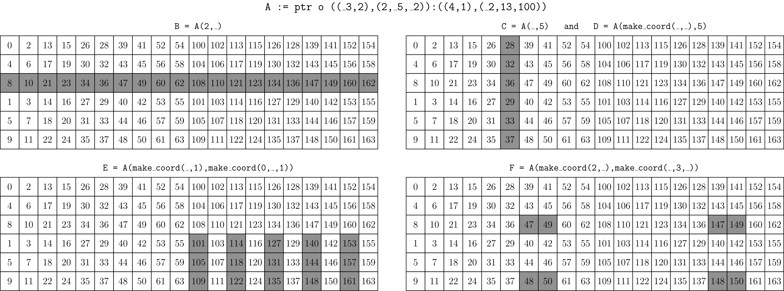
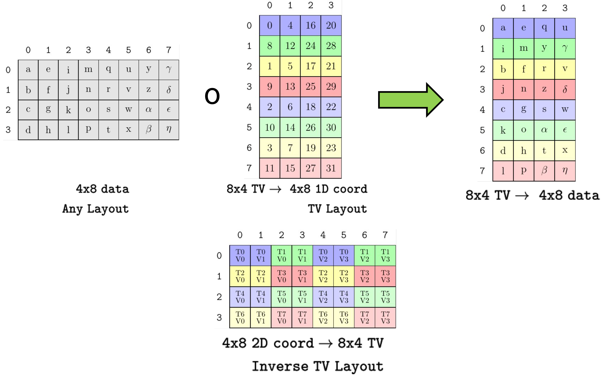

# CuTe Tensors

本文档描述 `Tensor`，也就是 CuTe 的核心容器。它应用了前面介绍过的 `Layout` 概念。

从根本上说，`Tensor` 表示一个多维数组。`Tensor` 抽象掉数组元素如何组织、数组元素如何存储等细节。这让用户可以以通用方式编写访问多维数组的算法，并且可以基于 `Tensor` traits 对算法进行特化。例如，可以根据 `Tensor` 的 rank dispatch，可以检查数据的 `Layout`，也可以验证数据类型。

一个 `Tensor` 由两个模板参数表示：`Engine` 和 `Layout`。关于 `Layout` 的说明，请参考 [`Layout` 小节](./01_layout.md)。`Tensor` 呈现与 `Layout` 相同的 shape 和访问 operators，并使用 `Layout` 计算结果来 offset 和 dereference `Engine` 持有的 random-access iterator。也就是说，数据布局由 `Layout` 提供，实际数据由 iterator 提供。这类数据可以位于任何内存中，例如 global memory、shared memory、register memory，甚至可以即时转换或生成。

## 基本操作

CuTe `Tensor` 提供类似容器的元素访问操作。

* `.data()`：该 `Tensor` 持有的 iterator。

* `.size()`：该 `Tensor` 的总逻辑 size。

* `.operator[](Coord)`：访问逻辑 coordinate `Coord` 对应的元素。

* `.operator()(Coord)`：访问逻辑 coordinate `Coord` 对应的元素。

* `.operator()(Coords...)`：访问逻辑 coordinate `make_coord(Coords...)` 对应的元素。

CuTe `Tensor` 提供与 `Layout` 类似的一组核心层次化操作。

* `rank<I...>(Tensor)`：`Tensor` 第 `I...` 个 mode 的 rank。

* `depth<I...>(Tensor)`：`Tensor` 第 `I...` 个 mode 的 depth。

* `shape<I...>(Tensor)`：`Tensor` 第 `I...` 个 mode 的 shape。

* `size<I...>(Tensor)`：`Tensor` 第 `I...` 个 mode 的 size。

* `layout<I...>(Tensor)`：`Tensor` 第 `I...` 个 mode 的 layout。

* `tensor<I...>(Tensor)`：`Tensor` 第 `I...` 个 mode 对应的 subtensor。

## Tensor Engines

`Engine` 概念是 iterator 或数据数组的 wrapper。它使用一个简化版 `std::array` 接口来呈现 iterator。

```c++
using iterator     =  // The iterator type
using value_type   =  // The iterator value-type
using reference    =  // The iterator reference-type
iterator begin()      // The iterator
```

通常，用户不需要自己构造 `Engine`。构造 `Tensor` 时，会构造合适的 engine，通常是 `ArrayEngine<T,N>`、`ViewEngine<Iter>` 或 `ConstViewEngine<Iter>`。

### Tagged Iterators

任何 random-access iterator 都可以用来构造 `Tensor`，但用户也可以给任意 iterator “打标签”标记 memory space。例如，标记这个 iterator 访问 global memory 或 shared memory。调用 `make_gmem_ptr(g)` 或 `make_gmem_ptr<T>(g)` 可以将 `g` 标记为 global memory iterator；调用 `make_smem_ptr(s)` 或 `make_smem_ptr<T>(s)` 可以将 `s` 标记为 shared memory iterator。

标记 memory 让 CuTe 的 `Tensor` 算法可以针对特定 memory 类型使用最快实现。当使用 `Tensor` 调用非常具体的操作时，它也允许这些 operators 验证 tags 是否符合预期。例如，某些优化 copy 操作要求 copy source 是 global memory，destination 是 shared memory。Tagging 让 CuTe 能够 dispatch 到这些 copy 操作，或验证参数是否满足这些操作要求。

## Tensor 创建

`Tensor` 可以是 owning 或 nonowning。

“Owning” `Tensor` 表现类似 `std::array`。复制 `Tensor` 时，会深拷贝其元素；`Tensor` 析构函数会释放元素数组。

“Nonowning” `Tensor` 表现类似 raw pointer。复制 `Tensor` 不会复制元素，销毁 `Tensor` 也不会释放元素数组。

这对通用 `Tensor` 算法的开发者有影响。例如，函数的输入 `Tensor` 参数应该通过 reference 或 const reference 传递，因为按值传递 `Tensor` 可能会也可能不会深拷贝其元素。

### Nonowning Tensors

`Tensor` 通常是已有 memory 的 nonowning view。通过调用 `make_tensor` 并传入两个参数可以创建 nonowning `Tensor`：一个 random-access iterator，以及一个 `Layout` 或用于构造 `Layout` 的参数。

下面是创建已有 memory 的 nonowning views 的一些示例。

```cpp
float* A = ...;

// Untagged pointers
Tensor tensor_8   = make_tensor(A, make_layout(Int<8>{}));  // Construct with Layout
Tensor tensor_8s  = make_tensor(A, Int<8>{});               // Construct with Shape
Tensor tensor_8d2 = make_tensor(A, 8, 2);                   // Construct with Shape and Stride

// Global memory (static or dynamic layouts)
Tensor gmem_8s     = make_tensor(make_gmem_ptr(A), Int<8>{});
Tensor gmem_8d     = make_tensor(make_gmem_ptr(A), 8);
Tensor gmem_8sx16d = make_tensor(make_gmem_ptr(A), make_shape(Int<8>{},16));
Tensor gmem_8dx16s = make_tensor(make_gmem_ptr(A), make_shape (      8  ,Int<16>{}),
                                                   make_stride(Int<16>{},Int< 1>{}));

// Shared memory (static or dynamic layouts)
Layout smem_layout = make_layout(make_shape(Int<4>{},Int<8>{}));
__shared__ float smem[decltype(cosize(smem_layout))::value];   // (static-only allocation)
Tensor smem_4x8_col = make_tensor(make_smem_ptr(smem), smem_layout);
Tensor smem_4x8_row = make_tensor(make_smem_ptr(smem), shape(smem_layout), LayoutRight{});
```

如上所示，用户通过识别 memory space 来包装 pointer：例如 global memory 使用 `make_gmem_ptr` 或 `make_gmem_ptr<T>`，shared memory 使用 `make_smem_ptr` 或 `make_smem_ptr<T>`。查看已有 memory 的 `Tensor` 可以具有 static 或 dynamic `Layout`。

对上述所有 tensors 调用 `print` 会显示：

```text
tensor_8     : ptr[32b](0x7f42efc00000) o _8:_1
tensor_8s    : ptr[32b](0x7f42efc00000) o _8:_1
tensor_8d2   : ptr[32b](0x7f42efc00000) o 8:2
gmem_8s      : gmem_ptr[32b](0x7f42efc00000) o _8:_1
gmem_8d      : gmem_ptr[32b](0x7f42efc00000) o 8:_1
gmem_8sx16d  : gmem_ptr[32b](0x7f42efc00000) o (_8,16):(_1,_8)
gmem_8dx16s  : gmem_ptr[32b](0x7f42efc00000) o (8,_16):(_16,_1)
smem_4x8_col : smem_ptr[32b](0x7f4316000000) o (_4,_8):(_1,_4)
smem_4x8_row : smem_ptr[32b](0x7f4316000000) o (_4,_8):(_8,_1)
```

输出会展示 pointer 类型、memory space tags、pointer 的 `value_type` 宽度、raw pointer address，以及关联的 `Layout`。

### Owning Tensors

`Tensor` 也可以是 owning memory array。Owning `Tensor` 通过调用 `make_tensor<T>` 创建，其中 `T` 是数组每个元素的类型，另一个参数是 `Layout` 或用于构造 `Layout` 的参数。数组分配类似 `std::array<T,N>`；因此 owning `Tensor` 必须使用具有 static shapes 和 static strides 的 `Layout` 构造。CuTe 不在 `Tensor` 中执行动态 memory allocation，因为这在 CUDA kernels 中既不常见也不高效。

下面是创建 owning `Tensor` 的一些示例。

```c++
// Register memory (static layouts only)
Tensor rmem_4x8_col = make_tensor<float>(Shape<_4,_8>{});
Tensor rmem_4x8_row = make_tensor<float>(Shape<_4,_8>{},
                                         LayoutRight{});
Tensor rmem_4x8_pad = make_tensor<float>(Shape <_4, _8>{},
                                         Stride<_32,_2>{});
Tensor rmem_4x8_like = make_tensor_like(rmem_4x8_pad);
```

`make_tensor_like` 函数会创建一个位于 register memory 的 owning Tensor，它具有与输入 `Tensor` 参数相同的 value type 和 shape，并尝试使用同样的 strides 顺序。

对上述每个 tensor 调用 `print` 会产生类似输出：

```text
rmem_4x8_col  : ptr[32b](0x7fff48929460) o (_4,_8):(_1,_4)
rmem_4x8_row  : ptr[32b](0x7fff489294e0) o (_4,_8):(_8,_1)
rmem_4x8_pad  : ptr[32b](0x7fff489295e0) o (_4,_8):(_32,_2)
rmem_4x8_like : ptr[32b](0x7fff48929560) o (_4,_8):(_8,_1)
```

可以看到每个 pointer address 都是唯一的，这表明每个 `Tensor` 都是一个独立的 array-like allocation。

## 访问 Tensor

用户可以通过 `operator()` 和 `operator[]` 访问 `Tensor` 元素，它们接受逻辑 coordinates 的 `IntTuple`。

当用户访问 `Tensor` 时，`Tensor` 使用其 `Layout` 将逻辑 coordinate 映射到 iterator 可访问的 offset。可以从 `Tensor` 的 `operator[]` 实现中看到这一点：

```c++
template <class Coord>
decltype(auto) operator[](Coord const& coord) {
  return data()[layout()(coord)];
}
```

例如，我们可以使用 natural coordinates、variadic `operator()` 或类似容器的 `operator[]` 读写 `Tensor`。

```c++
Tensor A = make_tensor<float>(Shape <Shape < _4,_5>,Int<13>>{},
                              Stride<Stride<_12,_1>,    _64>{});
float* b_ptr = ...;
Tensor B = make_tensor(b_ptr, make_shape(13, 20));

// Fill A via natural coordinates op[]
for (int m0 = 0; m0 < size<0,0>(A); ++m0)
  for (int m1 = 0; m1 < size<0,1>(A); ++m1)
    for (int n = 0; n < size<1>(A); ++n)
      A[make_coord(make_coord(m0,m1),n)] = n + 2 * m0;

// Transpose A into B using variadic op()
for (int m = 0; m < size<0>(A); ++m)
  for (int n = 0; n < size<1>(A); ++n)
    B(n,m) = A(m,n);

// Copy B to A as if they are arrays
for (int i = 0; i < A.size(); ++i)
  A[i] = B[i];
```

## Tiling Tensor

许多 [`Layout` algebra operations](https://github.com/NVIDIA/cutlass/blob/main/media/docs/cpp/cute/02_layout_algebra.md) 也可以应用到 `Tensor`。

```cpp
   composition(Tensor, Tiler)
logical_divide(Tensor, Tiler)
 zipped_divide(Tensor, Tiler)
  tiled_divide(Tensor, Tiler)
   flat_divide(Tensor, Tiler)
```

这些操作允许从 `Tensor` 中“分解出”任意 subtensors。这在 threadgroups tiling、MMAs tiling，以及为 threads 重排数据 tiles 时非常常见。

注意，`_product` 操作没有为 `Tensor` 实现，因为它们通常会产生 codomain sizes 增大的 layouts，这意味着 `Tensor` 将需要访问相对于原边界不可预测地远的元素。`Layout` 可以用于 products，但 `Tensor` 不可以。

## Slicing Tensor

用 coordinate 访问 `Tensor` 会返回该 tensor 的一个元素，而 slicing `Tensor` 会返回 sliced mode(s) 中所有元素构成的 subtensor。

Slice 通过同一个 `operator()` 完成，它也用于访问单个元素。传入 `_`（underscore character，`cute::Underscore` 类型的实例）与 Fortran 或 Matlab 中的 `:`（colon character）效果相同：保留 tensor 的这个 mode，就像没有对它使用 coordinate 一样。

Slicing 一个 tensor 会执行两个操作：

* 在 partial coordinate 上求值 `Layout`，并把结果 offset 累加到 iterator 中。新的 iterator 指向新 tensor 的起始位置。
* coordinate 中 `_` 元素对应的 `Layout` modes 用于构造新的 layout。

新的 iterator 和新的 layout 合起来构造新 tensor。

```cpp
// ((_3,2),(2,_5,_2)):((4,1),(_2,13,100))
Tensor A = make_tensor(ptr, make_shape (make_shape (Int<3>{},2), make_shape (       2,Int<5>{},Int<2>{})),
                            make_stride(make_stride(       4,1), make_stride(Int<2>{},      13,     100)));

// ((2,_5,_2)):((_2,13,100))
Tensor B = A(2,_);

// ((_3,_2)):((4,1))
Tensor C = A(_,5);

// (_3,2):(4,1)
Tensor D = A(make_coord(_,_),5);

// (_3,_5):(4,13)
Tensor E = A(make_coord(_,1),make_coord(0,_,1));

// (2,2,_2):(1,_2,100)
Tensor F = A(make_coord(2,_),make_coord(_,3,_));
```



上图中，一个 `Tensor` 以多种方式被 sliced，slice 生成的 subtensors 在原始 tensor 中被高亮显示。注意 tensor `C` 和 `D` 包含相同元素，但由于使用 `_` 与使用 `make_coord(_,_)` 的差异，它们具有不同的 ranks 和 shapes。在每种情况下，结果的 rank 等于 slicing coordinate 中 `Underscore` 的数量。

## Partitioning Tensor

为了实现 `Tensor` 的通用 partitioning，我们先应用 composition 或 tiling，然后再 slicing。这可以用很多方式完成，但我们发现三种方式特别有用：inner-partitioning、outer-partitioning 和 TV-layout-partitioning。

### Inner 和 outer partitioning

看一个 tiled 示例，观察如何以有用方式 slice 它。

```cpp
Tensor A = make_tensor(ptr, make_shape(8,24));  // (8,24)
auto tiler = Shape<_4,_8>{};                    // (_4,_8)

Tensor tiled_a = zipped_divide(A, tiler);       // ((_4,_8),(2,3))
```

假设我们想把这些 4x8 data tiles 中的一个分给每个 threadgroup。那么可以使用 threadgroup coordinate 索引第二个 mode。

```cpp
Tensor cta_a = tiled_a(make_coord(_,_), make_coord(blockIdx.x, blockIdx.y));  // (_4,_8)
```

我们称其为 *inner-partition*，因为它保留内部 “tile” mode。这种模式很常见：应用 tiler，然后通过索引 remainder mode slice 出对应 tile。它已经被包装成函数 `inner_partition(Tensor, Tiler, Coord)`。你经常会看到 `local_tile(Tensor, Tiler, Coord)`，它只是 `inner_partition` 的另一个名字。`local_tile` partitioner 很常在 threadgroup 层级使用，用于把 tensors partition 成跨 threadgroups 的 tiles。

另一种情况，假设我们有 32 个线程，想让每个线程获得这些 4x8 data tiles 中的一个元素。那么可以用 thread 索引第一个 mode。

```cpp
Tensor thr_a = tiled_a(threadIdx.x, make_coord(_,_)); // (2,3)
```

我们称其为 *outer-partition*，因为它保留外部 “rest” mode。这种模式也很常见：应用 tiler，然后通过索引 tile mode slice 进入 tile。它已经被包装成函数 `outer_partition(Tensor, Tiler, Coord)`。有时你会看到 `local_partition(Tensor, Layout, Idx)`，它是 `outer_partition` 的 rank-sensitive wrapper：先用 `Layout` 的 inverse 把 `Idx` 转成 `Coord`，再构造一个 top-level shape 与 `Layout` 相同的 `Tiler`。这允许用户指定 row-major、column-major 或任意给定 shape 的线程 layout，用于 partition tensor。

要了解这些 partitioning patterns 如何使用，请参见 [introductory GEMM tutorial](./0x_gemm_tutorial.md)。

### Thread-Value partitioning

另一种常见 partitioning 策略称为 thread-value partitioning。在这种模式中，我们构造一个 `Layout`，它表示所有 threads（或任何 parallel agent）以及每个 thread 将接收的所有 values 到目标数据 coordinates 的映射。通过 `composition`，目标数据 layout 会根据我们的 TV-layout 转换；随后只需用 thread index slice 结果中的 thread-mode。

```cpp
// Construct a TV-layout that maps 8 thread indices and 4 value indices
//   to 1D coordinates within a 4x8 tensor
// (T8,V4) -> (M4,N8)
auto tv_layout = Layout<Shape <Shape <_2,_4>,Shape <_2, _2>>,
                        Stride<Stride<_8,_1>,Stride<_4,_16>>>{}; // (8,4)

// Construct a 4x8 tensor with any layout
Tensor A = make_tensor<float>(Shape<_4,_8>{}, LayoutRight{});    // (4,8)
// Compose A with the tv_layout to transform its shape and order
Tensor tv = composition(A, tv_layout);                           // (8,4)
// Slice so each thread has 4 values in the shape and order that the tv_layout prescribes
Tensor  v = tv(threadIdx.x, _);                                  // (4)
```



上图是上述代码的可视化表示。任意 4x8 数据 layout 与一个具体的 8x4 TV-layout 复合，后者表示一种 partitioning pattern。复合结果在右侧，其中每个 thread 的 values 沿每一行排列。底部 layout 描绘 inverse TV layout，展示 4x8 逻辑 coordinates 将映射到哪个 thread id 和 value id。

要了解这些 partitioning patterns 如何构造和使用，请参见 [building MMA Traits tutorial](./0t_mma_atom.md)。

## 示例

### 从 global memory 复制 subtile 到 registers

下面的示例从 global memory 中复制一个矩阵的 rows（可具有任意 `Layout`）到 register memory，然后对 register memory 中的 row 执行某个算法 `do_something`。

```c++
Tensor gmem = make_tensor(ptr, make_shape(Int<8>{}, 16));  // (_8,16)
Tensor rmem = make_tensor_like(gmem(_, 0));                // (_8)
for (int j = 0; j < size<1>(gmem); ++j) {
  copy(gmem(_, j), rmem);
  do_something(rmem);
}
```

这段代码不需要知道 `gmem` 的 `Layout`，只需要知道它是 rank-2，并且第一个 mode 具有 static size。下面代码在编译期检查这两个条件。

```c++
CUTE_STATIC_ASSERT_V(rank(gmem) == Int<2>{});
CUTE_STATIC_ASSERT_V(is_static<decltype(shape<0>(gmem))>{});
```

使用 [`Layout` algebra section](./02_layout_algebra.md) 中详述的 tiling 工具扩展这个例子，可以几乎用同样代码复制 tensor 的任意 subtile。

```c++
Tensor gmem = make_tensor(ptr, make_shape(24, 16));         // (24,16)

auto tiler         = Shape<_8,_4>{};                        // 8x4 tiler
//auto tiler       = Tile<Layout<_8,_3>, Layout<_4,_2>>{};  // 8x4 tiler with stride-3 and stride-2
Tensor gmem_tiled  = zipped_divide(gmem, tiler);            // ((_8,_4),Rest)
Tensor rmem        = make_tensor_like(gmem_tiled(_, 0));    // ((_8,_4))
for (int j = 0; j < size<1>(gmem_tiled); ++j) {
  copy(gmem_tiled(_, j), rmem);
  do_something(rmem);
}
```

这会把一个 static shaped `Tiler` 应用于 global memory `Tensor`，创建一个与该 tile shape 兼容的 register `Tensor`，然后遍历每个 tile，把它复制到 memory 中并执行 `do_something`。

## 总结

* `Tensor` 被定义为一个 `Engine` 和一个 `Layout`。

  * `Engine` 是一个可 offset、可 dereference 的 iterator。
  * `Layout` 定义 tensor 的逻辑 domain，并将 coordinates 映射到 offsets。

* 使用和 tiling `Layout` 相同的方法 tiling 一个 `Tensor`。

* Slice 一个 `Tensor` 可以取回 subtensors。

* Partitioning 是 tiling 或 composition 后再 slicing。

## Copyright

Copyright (c) 2017 - 2026 NVIDIA CORPORATION & AFFILIATES. All rights reserved.
SPDX-License-Identifier: BSD-3-Clause

```text
  Redistribution and use in source and binary forms, with or without
  modification, are permitted provided that the following conditions are met:

  1. Redistributions of source code must retain the above copyright notice, this
  list of conditions and the following disclaimer.

  2. Redistributions in binary form must reproduce the above copyright notice,
  this list of conditions and the following disclaimer in the documentation
  and/or other materials provided with the distribution.

  3. Neither the name of the copyright holder nor the names of its
  contributors may be used to endorse or promote products derived from
  this software without specific prior written permission.

  THIS SOFTWARE IS PROVIDED BY THE COPYRIGHT HOLDERS AND CONTRIBUTORS "AS IS"
  AND ANY EXPRESS OR IMPLIED WARRANTIES, INCLUDING, BUT NOT LIMITED TO, THE
  IMPLIED WARRANTIES OF MERCHANTABILITY AND FITNESS FOR A PARTICULAR PURPOSE ARE
  DISCLAIMED. IN NO EVENT SHALL THE COPYRIGHT HOLDER OR CONTRIBUTORS BE LIABLE
  FOR ANY DIRECT, INDIRECT, INCIDENTAL, SPECIAL, EXEMPLARY, OR CONSEQUENTIAL
  DAMAGES (INCLUDING, BUT NOT LIMITED TO, PROCUREMENT OF SUBSTITUTE GOODS OR
  SERVICES; LOSS OF USE, DATA, OR PROFITS; OR BUSINESS INTERRUPTION) HOWEVER
  CAUSED AND ON ANY THEORY OF LIABILITY, WHETHER IN CONTRACT, STRICT LIABILITY,
  OR TORT (INCLUDING NEGLIGENCE OR OTHERWISE) ARISING IN ANY WAY OUT OF THE USE
  OF THIS SOFTWARE, EVEN IF ADVISED OF THE POSSIBILITY OF SUCH DAMAGE.
```
