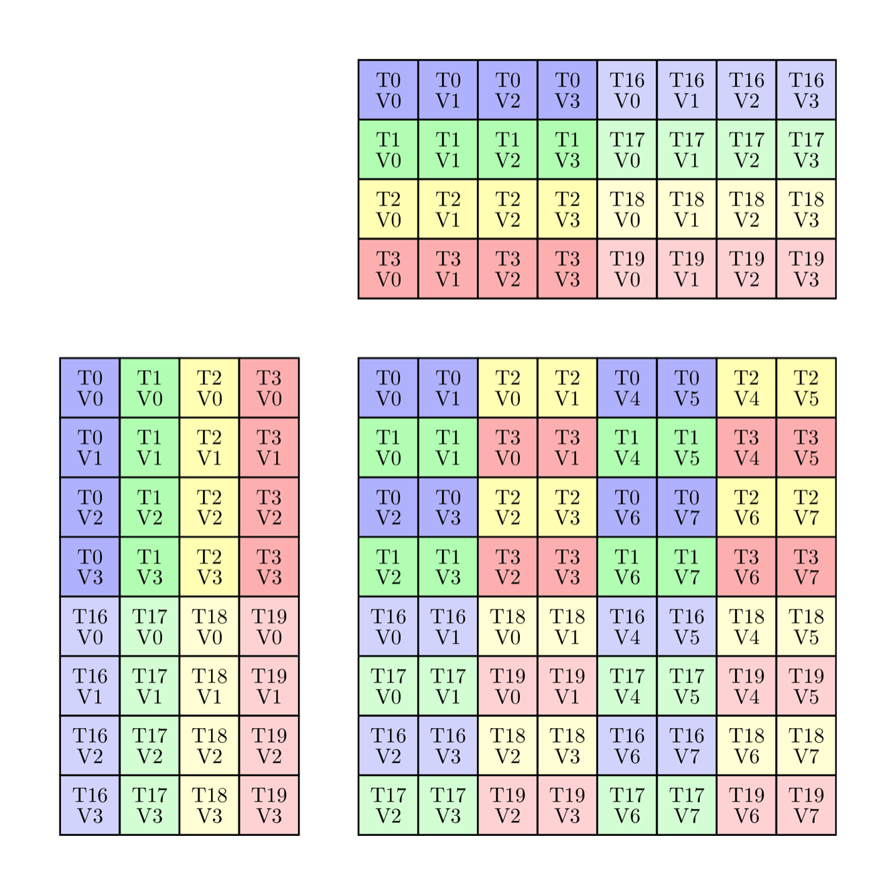
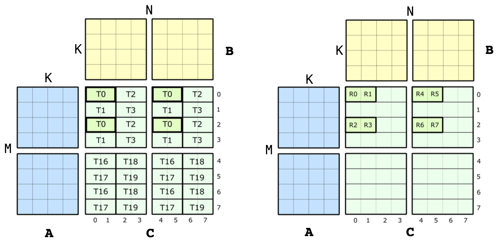
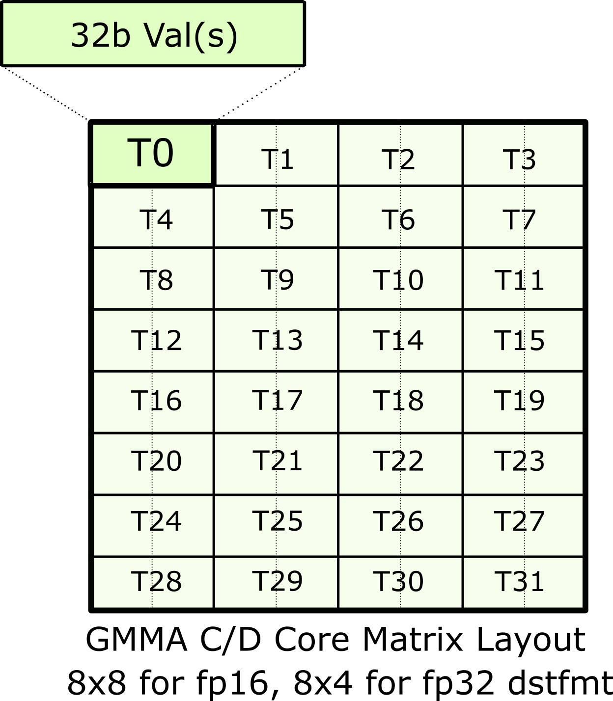
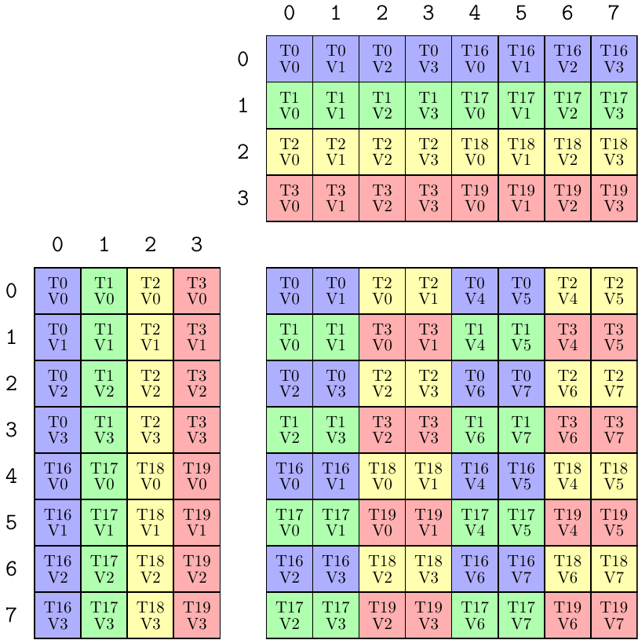
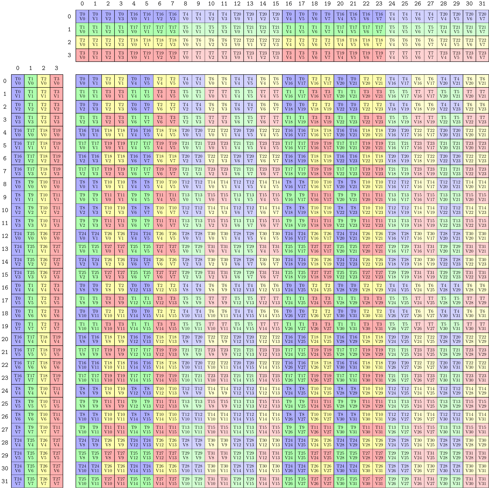

# CuTe 对矩阵乘加指令的支持

本文详细解释 CuTe 如何支持 NVIDIA GPU 的 Matrix Multiply-Accumulate（MMA，矩阵乘加）硬件指令。

MMA 是架构相关的。不同代 GPU 架构会引入不同集合的 MMA 指令。不过，CuTe 的 `Layout` 等特性让我们可以在通用 CUDA C++ 代码中暴露并使用这些 MMA。CuTe 分几步完成这件事。

1. 将每个 MMA 的 PTX 指令包装到一个 “Operation” struct 中。

2. 对每个 Operation struct，定义一个 “Traits” struct，用来描述使用该 Operation 所需的全部元信息。

3. 将二者组合起来，一个 “Atom” 就是 PTX Operation struct 与元信息 Traits struct 的组合。Atom 提供方法来为该 Operation 构造 `cute::Tensor` “fragment”，并在已有 `cute::Tensor` 上使用该 Operation。

4. 将一个或多个 Atom 组合起来，一个 “TiledMMA” 提供构建更复杂分区模式的工具：它会创建 Atom 的布局和交错方式。

## CuTe MMA Atoms

CuTe 将每个 MMA 以一对 struct 的形式暴露给通用 CUDA C++ 代码：
一个 “Operation” struct，以及一个以 Operation struct 类型为模板参数的 `MMA_Traits` struct。

“Operation” struct 暴露特定操作对应的 PTX 指令。它定义该指令期望的参数和接口。Operation struct 的软件依赖很少：它们不使用 layout、tensor 或非标准数值类型，只描述指令的物理输入和输出。不同 struct 有不同名称，用来说明 MMA 指令做什么。命名规则会在后面解释。

对应的 `MMA_Traits` struct 特化定义 Operation 的元信息，例如逻辑计算类型、操作的逻辑 shape，以及操作内部线程和值的 `Layout`。`MMA_Traits` struct 以 Operation 作为模板参数。CuTe 会为它支持的每个 Operation 类型特化 `MMA_Traits`。

这两个类型合起来构成一个 “Atom”。Atom 将线程和数据布局的复杂性从 PTX 指令调用点解耦出来。Atom 的 Traits struct 暴露单个 MMA operation 相关的信息，而不管这个 operation 工作在什么硬件粒度上。

CuTe MMA atom 暴露单个 MMA operation 的语义。不论该 MMA 在硬件上以什么层级执行，这一点都成立。CuTe 支持多种硬件层级上的 MMA atom，包括：

* 单线程，例如 fused multiply-add（FMA）指令；

* quadpair（Volta）；

* 单个 warp（Ampere）；

* warpgroup（Hopper）。

### Operation structs

#### 文件位置

CuTe 在 [`include/cute/arch`](https://github.com/NVIDIA/cutlass/tree/main/include/cute/arch) 目录下提供 Operation structs，对应头文件名以 `mma` 开头。

#### Operation struct 的名称

CuTe Operation struct 的名称主要编码它包装的 PTX 指令。名称通常包含：

* 首个支持它的架构；

* 它接受的 M、N、K 维度；

* 它处理的类型；

* A 和 B 输入的排列方式。

例如，下面 Volta 小节会提到 [`include/cute/arch/mma_sm70.hpp`](https://github.com/NVIDIA/cutlass/tree/main/include/cute/arch/mma_sm70.hpp) 中定义的 `SM70_8x8x4_F32F16F16F32_NT` Operation struct。

* “SM70” 指 Volta。

* “8x8x4” 指 M = 8、N = 8、K = 4，也就是 quadpair 执行的 MMA operation 的维度。这在 PTX 中体现为 `.m8n8k4.`。

* “F32F16F16F32” 指四个矩阵操作数 A、B、C、D 的元素类型。MMA 计算 $D = C + A * B$，因此从左到右读类型：D 是 F32（`float`），A 是 F16（half），B 是 F16（half），C 是 F32（`float`）。这在 PTX 指令名中体现为 `.f32.f16.f16.f32`。

* “NT” 表示 PTX 指令设计为 A 输入是 M-major（not transposed，column-major），B 输入是 N-major（transposed，row-major）。这在 PTX 指令名中体现为 `.col.row.`。

#### 内容

一个 Operation struct 包含以下成员。

##### 类型别名

Operation struct 有四个 public 类型别名：`DRegisters`、`ARegisters`、`BRegisters` 和 `CRegisters`。例如，[`include/cute/arch/mma_sm70.hpp`](https://github.com/NVIDIA/cutlass/tree/main/include/cute/arch/mma_sm70.hpp) 中定义的 `SM70_8x8x4_F32F16F16F32_NT` Operation struct 将它们定义如下。

```c++
using DRegisters = float[8];
using ARegisters = uint32_t[2];
using BRegisters = uint32_t[2];
using CRegisters = float[8];
```

这说明每个线程会向 PTX 指令传入每个矩阵 A、B、C、D 的多少个值。对这个 Operation 来说，每个线程为 C 和 D 分别传入 8 个 F32 值，因此是 `float[8]`；为 A 和 B 分别传入 4 个 F16 值，因此是 `uint32_t[2]`，因为指令会把两个 16-bit F16 值打包到每个 32-bit `uint32_t` 值中。

##### `fma` static member device function

Operation struct 定义一个 public 的 `static void fma` 函数。它带有 `CUTE_HOST_DEVICE` 宏，该宏会添加 `__host__ __device__` 标注。不同 Operation 会根据 PTX MMA 指令定义带不同参数数量的 `fma`。实现会用宏保护 PTX 指令的使用；如果在宏未定义时调用 `fma`，会触发 `assert`。这样，即使 PTX 指令不可用，使用该 Operation 作为 Atom 的测试和示例仍然可以编译。

### Traits

#### 文件位置

CuTe 在 [`include/cute/atom`](https://github.com/NVIDIA/cutlass/tree/main/include/cute/atom) 目录下提供 Traits structs，对应头文件名以 `mma_traits` 开头。

#### 内容

一个 `MMA_Traits` 特化定义以下 public 类型别名。

* `ValTypeD`：D 矩阵的逻辑计算类型

* `ValTypeA`：A 矩阵的逻辑计算类型

* `ValTypeB`：B 矩阵的逻辑计算类型

* `ValTypeC`：C 矩阵的逻辑计算类型

* `Shape_MNK`：MMA operation 的逻辑 MxNxK shape

* `ThrID`：单个 MMA operation 内部的逻辑线程映射，用来指定 thread、quadpair、warp 或 warpgroup 视图

* `ALayout`：将 `(thread,value)` 对映射到 MxK A 矩阵坐标

* `BLayout`：将 `(thread,value)` 对映射到 NxK B 矩阵坐标

* `CLayout`：将 `(thread,value)` 对映射到 MxN C 矩阵坐标

#### 示例

`SM70_8x8x4_F32F16F16F32_NT` Operation 的 `MMA_Traits` 特化位于 [`include/cute/atom/mma_traits_sm70.hpp`](https://github.com/NVIDIA/cutlass/tree/main/include/cute/atom/mma_traits_sm70.hpp) 头文件中。它看起来如下。

```c++
template <>
struct MMA_Traits<SM70_8x8x4_F32F16F16F32_NT>
{
  using ValTypeD = float;
  using ValTypeA = half_t;
  using ValTypeB = half_t;
  using ValTypeC = float;

  using Shape_MNK = Shape<_8,_8,_4>;
  using ThrID   = SM70_QuadPair;
  using ALayout = SM70_8x4_Col;
  using BLayout = SM70_8x4_Col;
  using CLayout = SM70_8x8_32b;
};
```

下一节会详细解释这些类型别名。

## Volta

本节和后续小节展示如何构造 MMA atoms 的示例。我们不会试图解释所有 GPU 架构和所有 MMA，而是用选定示例说明开发新 atom 的过程。

Volta 架构实现了一条 HMMA 指令：由一组 8 个线程组成的 quadpair（QP）协作共享数据并执行 8x8x4 的矩阵乘加，累加类型可以是 fp32 或 fp16。由于一个 warp 有 32 个线程，因此一个 warp 会在 4 个 QP 上执行 MMA，对应 tile size 为 16x16x4。

我们先看如何把 HMMA 指令的线程和数据分区 ISA 语义编码到 Traits struct 中。HMMA NT 指令具有如下线程-数据布局：



### Types

上面的 HMMA NT 使用以下类型：

```cpp
  using ValTypeD = float;
  using ValTypeA = half_t;
  using ValTypeB = half_t;
  using ValTypeC = float;
```

`MMA_Traits` 的其余部分都会以这些类型为单位来描述。

### Shape

上面的 HMMA NT shape 为 8x8x4：

```cpp
  // Logical shape of the MMA
  using Shape_MNK = Shape <_8,_8,_4>;
```

### Thread ID

如果一个 warp 中的 32 个线程被逻辑编号为 [0 ... 31]，那么上图包含线程 [0,1,2,3]U[16,17,18,19]。这些线程组成第 0 个 quadpair。我们可以写一个线程映射，将 MMA 的 8 个逻辑线程 id [0,1,2,3,4,5,6,7] 映射到一个 warp 的 quadpair 线程索引 [0,1,2,3]U[16,17,18,19]。这个 layout function 有 4 个元素 stride 为 1，并有 2 组这样的元素 stride 为 16。因此，我们可以写出表示 quadpair 的 layout：

```cpp
  // Mapping from (logical thread id) -> (thread idx)
  using ThrID = Layout<Shape <_4, _2>,
                       Stride<_1,_16>>;
```

再次强调，这个 layout function 将 MMA operation 的逻辑线程 id [0,8) 映射到 warp 中的 quadpair 线程索引 [0,4)U[16,20)。

### Accumulator Mapping

现在看 QP 内 8 个线程如何精确映射到 A、B、C 矩阵。对 C 和 D 矩阵，下图将上面的图进一步拆开。左边展示整个 QP 级视图，右边展示只有 thread 0 拥有的值。



我们要在 CuTe 中编码的是这个单条指令级视图的元信息。具体来说，这张图中的 QP 级视图对应 [SM70_F32F16F16F32](https://github.com/NVIDIA/cutlass/tree/main/include/cute/arch/mma_sm70.hpp) 的四个 MMA traits。这些 struct 包含 `Element` 类型、`Shape_MNK`，以及我们上面构造的 `ThrID` 映射。现在看 `CLayout` 的定义，也就是 accumulator 的线程-数据布局。`CLayout` 的作用是构造 `(logical_thr_id, logical_val_id)` 与 C 矩阵中 `(m, n)` 坐标之间的映射，后续可以用它构建更复杂的 layout 和 operation，例如 16x16x4 WMMA。

我们可以从上图开始构造 `CLayout`。和任何 CuTe layout 一样，它是一对 `Shape` 与对应的 `Stride`。先只看 shape。我们知道 HMMA 使用 8 个线程，每个线程拥有 8 个值。因此，映射的 shape 必须在两个 mode 上大小都是 8。于是有：

```cpp
  // (T8,V8) -> (m,n)
  using CLayout = Layout<Shape <_8, _8>,
                         Stride<_?, _?>;  // Stride to be filled in below
```

不要把它和 C 矩阵的逻辑 8x8 shape 混淆。这里是 8 个 threads 乘以 8 个 values。现在我们要把它们映射到 (m,n) 坐标。由于 CuTe layout 返回的是 index 而不是坐标，我们选择对 (m,n) 坐标使用 column-major 编码：

```text
(logical_thr_id, logical_val_id) -> (m, n) == m + n * M
```

有了这个约定后，可以开始思考如何构造 `CLayout` 中的 strides。先看线程之间的 stride。注意：

* `(T0,V0)` 位于 `(m,n) = (0,0) = 0`
* `(T1,V0)` 位于 `(m,n) = (1,0) = 1`
* `(T2,V0)` 位于 `(m,n) = (0,2) = 16`
* `(T3,V0)` 位于 `(m,n) = (1,2) = 17`
* `(T4,V0)` 位于 `(m,n) = (4,0) = 4`
* `(T5,V0)` 位于 `(m,n) = (5,0) = 5`
* `(T6,V0)` 位于 `(m,n) = (4,2) = 20`
* `(T7,V0)` 位于 `(m,n) = (5,2) = 21`

其中 `T4`、`T5`、`T6`、`T7` 是 MMA 的第 4、5、6、7 个逻辑线程 id，对应 warp 的线程索引 16、17、18、19，这已经记录在 `ThrID` 映射中。

我们注意到，这个模式可以转写成 layout。8 个线程的位置可以表示为：

```cpp
  using CLayout = Layout<Shape <Shape <_2,  _2, _2>, _8>,
                         Stride<Stride<_1, _16, _4>, _?>;
```

用完全相同的方法，可以构造沿 `logical value id` mode 的 stride。

* `(T0,V0)` 位于 `(m,n) = (0,0) = 0`
* `(T0,V1)` 位于 `(m,n) = (0,1) = 8`
* `(T0,V2)` 位于 `(m,n) = (2,0) = 2`
* `(T0,V3)` 位于 `(m,n) = (2,1) = 10`
* `(T0,V4)` 位于 `(m,n) = (0,4) = 32`
* `(T0,V5)` 位于 `(m,n) = (0,5) = 40`
* `(T0,V6)` 位于 `(m,n) = (2,4) = 34`
* `(T0,V7)` 位于 `(m,n) = (2,5) = 42`

这个模式同样可以转写成 layout。8 个 values 的位置可以表示为：

```cpp
  // (T8,V8) -> (m,n)
  using CLayout = Layout<Shape <Shape <_2, _2,_2>, Shape <_2,_2, _2>>,
                         Stride<Stride<_1,_16,_4>, Stride<_8,_2,_32>>>;
```

这样就完成了。我们可以验证这个 layout 中每个 `(tid,vid)` 坐标都能可靠地映射到正确的编码后 `(m,n)` 坐标。

如果 accumulator 是 F16，layout 就简单很多。每一行 accumulator `(m, :)` 都由单个线程持有，因此 layout 为：

```cpp
  using CLayout = Layout<Shape <_8,_8>,
                         Stride<_1,_8>>;
```

### A and B Layout Mapping

A 和 B 矩阵 layout 取决于 source 是否转置。下图展示了 NT 和 TN 转置情况下，A 和 B 矩阵的 thread ID 到 data ownership 的映射。


先看 A 矩阵的 TN layout，也就是图中右侧。同样有 8 个逻辑线程，但这一次每个线程只拥有 4 个元素。因此 `ALayout` 的 shape 是 `Shape<_8, _4>`。至于 stride，我们同样需要 `(m, k) == m + k * M` 这样的映射。沿 `M` mode 向下看，从 `(T0, V0)` 到 `(T1, V0)`，对全部 8 个线程来说 stride 是 1。对于 `K` mode，横向移动时，从 `(T0, V0)` 到 `(T0, V1)`，对全部 4 个 values 来说 stride 是 8。因此 A layout 是：

```cpp
  // (T8,V4) -> (m,k)
  using ALayout = Layout<Shape <_8,_4>,
                         Stride<_1,_8>>;
```

TN HMMA 中 source B layout 的构造方式类似，只是为了方便，我们希望把它写成 `(N,K)` 而不是 `(K,N)`。对于 stride，沿 `N` mode 横向移动时，从 `(T0, V0)` 到 `(T1, V0)`，这使所有 8 个线程的 stride 为 1。沿 `K` mode 向下移动时，从 `(T0, V0)` 到 `(T0, V1)`，这使所有 4 个 values 的 stride 为 8。因此 B layout 与 A 相同：

```cpp
  // (T8,V4) -> (n,k)
  using BLayout = Layout<Shape <_8,_4>,
                         Stride<_1,_8>>;
```

NT 情况下的 layout 更复杂一些，也就是图中左侧。沿 `A` 的 `M` mode 向下看，先看到 `T0` 的四个值，然后看到 `T4` 的四个值。这表示先对 4 个 values 有 stride 1，然后从 `T0` 到 `T4` 有 stride 4。因此沿 `M` mode 有两个 sub-strides。对于 `K` mode，横向移动时只递增 `thr_id`，保持 `val_id` 不变，所以对 4 个 threads 来说 stride 为 8。这得到 A layout：

```cpp
  // (T8,V4) -> (m,k)
  using ALayout = Layout<Shape <Shape <_4,_2>,_4>,
                         Stride<Stride<_8,_4>,_1>>;
```

按照 `(N,K)` 顺序表示 B 时，layout 相同。

```cpp
  // (T8,V4) -> (n,k)
  using BLayout = Layout<Shape <Shape <_4,_2>,_4>,
                         Stride<Stride<_8,_4>,_1>>;
```

对于 NN 和 TT 转置，它们只是目前看到的 A 和 B 两种 layout 的组合。

## Hopper

现在可以看 Hopper 架构首次引入的更大的 GMMA operation（Group MMA）。这些 MMA 指令以 128 个线程（4 个 warps）为粒度执行，这 128 个线程整体称为一个 warpgroup。

### Thread ID

在 Hopper GMMA 中，thread ID 基于简单的一维连续 layout 分配，因此 `thrID` 很直接：

```cpp
using ThrID = Layout<_128, _1>;
```

### Accumulator Mapping

GMMA 中 accumulator 的映射是层次化的：从 core matrix 的概念开始，再构建整个 C matrix tile 的 layout。先看 core matrix。这里我们只考虑 fp16 accumulator，但 fp32 accumulator 的扩展也会像后面看到的那样很直接。

每个 core matrix 的 layout 如下图所示。



和 Volta 示例一样，thread ID 只是逻辑 ID，它们属于 warpgroup 中四个 warps 的哪一个并不重要。

然后 GMMA 会先沿 M mode 垂直方向 tile 这个 core matrix，再沿 N mode 重复这一列 core matrices，构造完整 MxN tile。这个 tiling 如下图所示。


有了这张图，就可以开始为 `SM90_64x128x16_F16F16F16F16_TN` atom 构建 `CLayout`。和之前一样，我们要构造 `(logical_thr_id, logical_val_id) -> (m, n)` 坐标空间之间的映射。

首先跟踪前几个线程和值。可以立刻看到，它们沿 `N` mode 按成对 values 和四个 threads 排列。因此得到：

```cpp
// (T128,V4) -> (M64,N8)
using CLayout = Layout<Shape <Shape <  _4, ...>, Shape < _2, ...>>,
                       Stride<Stride<_128, ...>, Stride<_64, ...>>>;
```

为了补全第一个 8x8 core matrix，这四个线程沿 `M` mode 向下重复八次：

```cpp
// (T128,V4) -> (M64,N8)
using CLayout = Layout<Shape <Shape <  _4, _8, ...>, Shape < _2, ...>>,
                       Stride<Stride<_128, _1, ...>, Stride<_64, ...>>>;
```

然后，当进入下一个 core matrix 时，我们再次回绕到 `T0`，但这一次到 `(T0, V2)`。

```cpp
// (T128,V4) -> (M64,N8)
using CLayout = Layout<Shape <Shape <  _4, _8, ...>, Shape < _2, _2>>,
                       Stride<Stride<_128, _1, ...>, Stride<_64, _8>>>;
```

最后，整个模式重复四次，每个 warp 一次，沿 `M` mode 向下从 `(m,n) = (16,0) = 16` 开始。同一个 warp 的四个 core matrices 会堆叠在一起。因此 `thrID` 最后一个 sub-mode 的 size 是 4（因为有四个 warps），stride 是 `16`（把我们带到坐标 `(16,0) = 16`）。

```cpp
// (T128,V4) -> (M64,N8)
using CLayout = Layout<Shape <Shape <  _4, _8,  _4>, Shape < _2, _2>>,
                       Stride<Stride<_128, _1, _16>, Stride<_64, _8>>>;
```

这就是 64x8 accumulator 的完整 `CLayout`。GMMA 指令包含多个 64xN 变体，其中 `N = [16,32,64,128,256]`。这些变体会重复这个 64x8 模式，让每个线程获得更多 values。由于下一个重复从 `(m,n) = (0,8) = 512` 开始，因此在 `CLayout` 中很容易表达。例如，64x128 的 `CLayout` 是：

```cpp
// (T128,V64) -> (M64,N128)
using CLayout = Layout<Shape <Shape <  _4, _8,  _4>, Shape < _2, _2,  _16>>,
                       Stride<Stride<_128, _1, _16>, Stride<_64, _8, _512>>>;
```

这里可以看到 16 份 64x8 tile 的拷贝。

### A and B Layout Mapping

直接从 shared memory 消费 A 和 B source 的 GMMA atoms 有些特殊。GMMA Descriptor 是基于 shared memory 中整个 A 和/或 B data tile 构造的，而不是按线程分区构造。也就是说，每个线程都能看到整个 data tile，并且 tile 不会被重排，这样 descriptor 才能基于它构造出来。用 `ALayout` 可以表达为：

```cpp
// (T128,V64x16) -> (M64,K16)
using ALayout = Layout<Shape <_128, Shape <_64,_16>>,
                       Stride<  _0, Stride< _1,_64>>>;
```

也就是说，所有线程都映射到 `(m,k) = (0,0) = 0` 元素，而 values 以及 values 的 shape 保持不变。GMMA Descriptor Constructor 随后可以检查这份数据的 `(M,K)` layout，并创建合适的 GMMA Descriptor；如果数据 layout 对 GMMA 无效，则生成错误信息。

## `TiledMMA`s

我们可以通过组合和交错多个 atoms 来构造更复杂的模式。

从 `SM70_8x8x4_F32F16F16F32_NT` 开始。

```cpp
MMA_Atom mma = MMA_Atom<SM70_8x8x4_F32F16F16F32_NT>{};
print_latex(mma);
```



上面的代码等价于：

```cpp
    TiledMMA mma = make_tiled_mma(SM70_8x8x4_F32F16F16F32_NT{},
                                  Layout<Shape<_1,_1,_1>>{},   // Layout of Atoms
                                  Tile<_8,_8,_4>{});           // Tiler
    print_latex(mma);
```

因为它只是单个 atom，并且具有自然的 8x8x4 tile size。

我们可以使用四个这样的 quadpair MMA 创建一个类似 WMMA 的对象：

```cpp
    TiledMMA mma = make_tiled_mma(SM70_8x8x4_F32F16F16F32_NT{},
                                  Layout<Shape <_2,_2>,
                                         Stride<_2,_1>>{});   // 2x2 n-major layout of Atoms
    print_latex(mma);
```


这个 `TiledMMA` 会在线程维度上复制 `MMA_Atom`。从 `C` 矩阵中可以看到之前没有使用过的 `T4`、`T8` 和 `T12` 线程。`C` 矩阵的每个象限都是 atom 分区模式的一个副本，对应一个新的 quadpair；这种复制遵循 `(2,2):(2,1)` layout。

上面现在表示的是一个 16x16x4 MMA，但我们可以立刻把这个 “tile size” 扩展到 32x32x4：

```cpp
    TiledMMA mma = make_tiled_mma(SM70_8x8x4_F32F16F16F32_NT{},
                                  Layout<Shape <_2,_2>,
                                         Stride<_2,_1>>{},  // 2x2 n-major layout of Atoms
                                  Tile<_32,_32,_4>{});      // 32x32x4 tiler
    print_latex(mma);
```



这个 `TiledMMA` 会在 values 维度上复制前一个 `TiledMMA`，而不是在线程维度上复制。可以在 `C` 矩阵中看到之前没有使用过的 `T0V8`、`T16V8` 和 `T8V8` values。`C` 矩阵的每个象限都是前一个 `TiledMMA` 分区模式在新 values 集合上的副本。

继续看，可以发现 `T0` 会从 `A` 矩阵接收 8 个值。这些读取发生在如下坐标：

```text
T0V0 => ( 0,0)
T0V1 => ( 1,0)
T0V2 => ( 2,0)
T0V3 => ( 3,0)
T0V4 => (16,0)
T0V5 => (17,0)
T0V6 => (18,0)
T0V7 => (19,0)
```

这些坐标是分散的，但我们可能希望它们彼此相邻。也就是说，我们希望对 `M` mode 做 permutation，从而创建另一个有效的 `TiledMMA`。

```cpp
    TiledMMA mma = make_tiled_mma(SM70_8x8x4_F32F16F16F32_NT{},
                                  Layout<Shape <_2,_2>,
                                         Stride<_2,_1>>{},       // 2x2 n-major layout of Atoms
                                  Tile<Layout<Shape <_4,_4,_2>,
                                              Stride<_1,_8,_4>>, // Permutation on M, size 32
                                       _32,                      // Permutation on N, size 32 identity
                                       _4>{});                   // Permutation on K, size 4 identity
    print_latex(mma);
```


这个 layout `(4,4,2):(1,8,4)` 应该按 scatter permutation 来读：它告诉原图中的 m-coords 在新图中应该去哪里。

```text
old m-coord:  0  1  2  3  4  5  6  7  8  9 10 11 12 13 14 15 16 17 18 19 20 21 22 23 24 25 26 27 28 29 30 31
new m-coord:  0  1  2  3  8  9 10 11 16 17 18 19 24 25 26 27  4  5  6  7 12 13 14 15 20 21 22 23 28 29 30 31
```

这只对 M-mode 做 permutation，也相应影响 `A` 和 `C`，并让所有线程对 `A` 矩阵的访问在 m-coordinates 上连续。这在设计 shared memory 或 register layout 时很方便。例如，上图中的 MMA instructions 现在实际上在逻辑 m-coordinates 上交错。当然，N-mode 和 K-mode 上的 permutation 也是合法的。

如需了解这些 `TiledMMA` 如何用于 partition data tensors，请参见 [`0x_gemm_tutorial.md`](./0x_gemm_tutorial.md)。

## 补充理解：几个容易混淆的点

这一节不是原文内容，而是对上面 MMA Atom / TiledMMA 机制的补充说明。

### 1. `CLayout` 描述的不是 C 矩阵本身

`CLayout` 描述的是：

```text
(logical_thread_id, logical_value_id) -> C tile 中的 (m,n)
```

也就是“某个 MMA 指令内部，哪个线程的哪个 accumulator register value 对应 C tile 的哪个元素”。它不是普通矩阵 C 的 row-major / column-major storage layout。

以 Volta `SM70_8x8x4_F32F16F16F32_NT` 为例，文档中出现多个 `CLayout`，它们不是多个最终版本，而是同一个最终 `CLayout` 的逐步构造：

```cpp
// 1. 只说明输入空间是 8 threads x 8 values 描述的是总共8个线程，每个线程8个数据
Layout<Shape <_8, _8>, Stride<_?, _?>>

// 2. 填好 thread 维度
Layout<Shape <Shape <_2, _2, _2>, _8>,
       Stride<Stride<_1,_16,_4>, _?>>

// 3. 填好 thread 和 value 两个维度，最终版本
Layout<Shape <Shape <_2, _2,_2>, Shape <_2,_2, _2>>,
       Stride<Stride<_1,_16,_4>, Stride<_8,_2,_32>>>
```

这里 `(m,n)` 被编码成 column-major index：

```text
encoded(m,n) = m + n * 8
```

F32 accumulator 的映射复杂，是因为一个 thread 的 8 个 accumulator values 分散在 C tile 的多个位置。比如 `T0` 持有：

```text
(T0,V0) -> (0,0)
(T0,V1) -> (0,1)
(T0,V2) -> (2,0)
(T0,V3) -> (2,1)
(T0,V4) -> (0,4)
(T0,V5) -> (0,5)
(T0,V6) -> (2,4)
(T0,V7) -> (2,5)
```

如果 accumulator 是 F16，Volta 的布局简单很多：

```cpp
using CLayout = Layout<Shape <_8,_8>,
                       Stride<_1,_8>>;
```

因为此时：

```text
CLayout(t,v) = t + 8v = m + n * 8
=> m = t, n = v
```

也就是每个 logical thread 持有 C tile 的一整行 accumulator。

### 2. A/B layout 的坐标语义固定是 `(m,k)` 和 `(n,k)`

CuTe 中，GEMM operand 的逻辑坐标约定是：

```text
A: (M,K)
B: (N,K)
C: (M,N)
```

所以：

```text
ALayout: (thread,value) -> (m,k)
BLayout: (thread,value) -> (n,k)
CLayout: (thread,value) -> (m,n)
```

`NT`、`TN`、`NN`、`TT` 不改变这些坐标名字。它们改变的是 thread/value 到这些坐标的具体映射方式，也就是 operand orientation。

例如，TN 的 A layout 是：

```cpp
// (T8,V4) -> (m,k)
using ALayout = Layout<Shape <_8,_4>,
                       Stride<_1,_8>>;
```

而 NT 的 A layout 仍然输出 `(m,k)`，但映射模式不同：

```cpp
// (T8,V4) -> (m,k)
using ALayout = Layout<Shape <Shape <_4,_2>,_4>,
                       Stride<Stride<_8,_4>,_1>>;
```

可以把 BLAS flags 与 CuTe major 关系记成：

```text
NT:
  A: M-major  (m,k):(1,ldA)
  B: N-major  (n,k):(1,ldB)

TN:
  A: K-major  (m,k):(ldA,1)
  B: K-major  (n,k):(ldB,1)

NN:
  A: M-major
  B: K-major

TT:
  A: K-major
  B: N-major
```

### 3. Hopper GMMA 的 64x8 是 CLayout 的基本 slice

文档在构造 `SM90_64x128x16_F16F16F16F16_TN` 的 `CLayout` 时，先讲 64x8，是因为 GMMA 的 accumulator layout 以 64x8 作为基本 pattern。

CUTLASS 代码中真实定义是：

```cpp
template<int N>
using CLayout_64xN =
  Layout<Shape <Shape <  _4,_8, _4>, Shape < _2,_2,Int<N/8>>>,
         Stride<Stride<_128,_1,_16>, Stride<_64,_8,   _512>>>;

using CLayout_64x128 = CLayout_64xN<128>;
```

所以：

```text
64x128 = 16 个 64x8 accumulator slice 沿 N 方向重复
```

`_512` 来自一个 64x8 slice 的元素数：

```text
64 * 8 = 512
```

因此 `SM90_64x128x16` 的最终 `CLayout` 可以理解为：

```cpp
Layout<
  Shape <Shape <_4,_8,_4>, Shape <_2,_2,_16>>,
  Stride<Stride<_128,_1,_16>, Stride<_64,_8,_512>>
>
```

当前 CUTLASS 代码里已经不使用文档中的精确名字 `SM90_64x128x16_F16F16F16F16_TN`。代码里是 `SM90_64x128x16_F16F16F16_SS/RS<tnspA, tnspB, ...>` 这种形式，其中 `tnspA/tnspB` 表示 A/B 的 major。无论 SS/RS 或 A/B major 如何，C accumulator layout 都是 `GMMA::CLayout_64x128`。

### 4. GMMA 的 A/B layout 不表达 shared memory swizzle

文档中 GMMA A layout 的概念形式是：

```cpp
// (T128,V64x16) -> (M64,K16)
using ALayout = Layout<Shape <_128, Shape <_64,_16>>,
                       Stride<  _0, Stride< _1,_64>>>;
```

这里 thread 维度 stride 为 `_0`，含义是：

```text
所有 128 个线程都看到同一个 shared memory tile descriptor。
```

这不是 Volta/Ampere 那种每个 thread 各自持有一段 A register fragment 的模型。GMMA A/B operand 来自 shared memory descriptor。

这段 `ALayout` 没有表达 swizzle。Swizzle 属于 shared memory tensor layout / GMMA descriptor construction，例如 CUTLASS 中的 `GMMA::smem_desc<tnspA>`、`Layout_MN_SW32_Atom`、`Layout_K_SW128_Atom` 等。可以分成两层：

```text
ALayout / BLayout:
  描述 MMA atom 语义上需要什么 A/B tile。

SMEM layout / descriptor:
  描述这个 A/B tile 在 shared memory 中实际如何排列、是否 swizzle、swizzle 类型是否合法。
```

### 5. `TiledMMA` 的第三个参数是 MNK 逻辑 permutation

下面这段：

```cpp
TiledMMA mma = make_tiled_mma(SM70_8x8x4_F32F16F16F32_NT{},
                              Layout<Shape <_2,_2>,
                                     Stride<_2,_1>>{},
                              Tile<Layout<Shape <_4,_4,_2>,
                                          Stride<_1,_8,_4>>,
                                   _32,
                                   _4>{});
```

第二个参数：

```cpp
Layout<Shape <_2,_2>, Stride<_2,_1>>{}
```

表示把 `SM70_8x8x4` atom 按 2x2 复制，得到一个使用 4 个 quadpairs 的 16x16x4 TiledMMA。每个 atom 仍然是 8 个 logical threads，因此总共是 32 个 warp lanes。

第三个参数：

```cpp
Tile<PermM, PermN, PermK>
```

不是 shared memory tile，也不是只给 A 用。它是整个 MMA tile 的 MNK 三个逻辑轴的 permutation：

```text
PermM = (4,4,2):(1,8,4)
PermN = 32:1 identity
PermK = 4:1 identity
```

它在 `TiledMMA` 的 partition 阶段应用：

```text
C 使用 PermM 和 PermN
A 使用 PermM 和 PermK
B 使用 PermN 和 PermK
```

所以 M permutation 同时影响 A 和 C，不影响 B；N permutation 同时影响 B 和 C；K permutation 同时影响 A 和 B。

### 6. 这个 permutation 不改变 HMMA 的物理 quadpair

对 SM70 HMMA atom，硬件层参与计算的 lanes 仍然是一个 quadpair：

```text
0,1,2,3,16,17,18,19
```

这个由 atom 的 `ThrID` 决定，不会被 `Tile` permutation 改变。

`Tile` permutation 改变的是这些 lanes 的 fragment 对应 tensor 的哪些逻辑坐标。文档中的 M permutation 是 scatter：

```text
old m-coord:  0  1  2  3  4  5  6  7  8  9 10 11 12 13 14 15 16 17 18 19 ...
new m-coord:  0  1  2  3  8  9 10 11 16 17 18 19 24 25 26 27  4  5  6  7 ...
```

因此：

```text
old 0,1,2,3      -> new 0,1,2,3
old 16,17,18,19  -> new 4,5,6,7
```

这正好把 quadpair 中 `0,1,2,3,16,17,18,19` 原本分散的 M 访问，在新的逻辑 M 视图中变成连续的 `0..7`。

所以不是：

```text
8 个线程做 8x8x4 变成 4 个线程做 8x8x4
```

而是：

```text
仍然是 8 个 logical threads / quadpair 执行一个 8x8x4 atom；
只是这些 lanes 的 A/C logical M 坐标被重编号。
```

### 7. permutation 发生在 fragment partition / load 之前

这个 `Tile` permutation 不是计算完成之后对 C 做一次额外 permute。它发生在 `TiledMMA` partition tensor 的阶段：

```cpp
thr_mma.partition_A(sA)
thr_mma.partition_B(sB)
thr_mma.partition_C(gC)
thr_mma.make_fragment_C(...)
```

也就是说：

```text
1. 先用 PermM/PermN/PermK 解释这个逻辑 MMA tile。
2. partition_A / partition_B 决定每个线程应该从 A/B 的哪些坐标取数。
3. 线程再从 shared memory load 到 register fragment。
4. HMMA 使用这些 register fragment 计算。
5. C fragment / store 也使用同一套 M/N 逻辑坐标解释。
```

因此它发生在：

```text
shared memory -> register fragment 的地址选择之前。
```

它不是额外 runtime 数据搬移，而是改变“每个线程访问 A/B/C tensor 的逻辑坐标解释”。

### 8. `TiledMMA` permutation 与 `TiledCopy` / shared memory layout 要配套

`TiledMMA` permutation 本身不会自动重排 shared memory 的物理布局。shared memory 中数据怎么摆，由你构造 `sA` / `sB` tensor 时的 layout，以及 global-to-shared 的 copy pattern 决定。

可以这样分层：

```text
TiledMMA permutation:
  定义 MMA 阶段如何 partition A/B/C tensor，
  也就是 shared/register fragment 应该怎么看逻辑坐标。

TiledCopy + sA_layout / sB_layout:
  定义 global -> shared 怎么写，
  以及 shared memory 中数据实际怎么摆。
```

如果 MMA 侧改变了 `PermM`，copy 侧和 shared memory layout 通常也要围绕同一个逻辑 layout 配套设计。否则数学上可能仍然一致，但访问可能不连续、无法 vectorize，或者产生更多 shared memory bank conflicts。

可以把完整数据流记成：

```text
global tensor mA/mB
  -> TiledCopy / copy partition
  -> shared tensor sA/sB with sA_layout/sB_layout
  -> TiledMMA / mma partition
  -> register fragments
  -> HMMA
```

文档里的 M permutation 的动机是让 A 的 M 访问从：

```text
0,1,2,3,16,17,18,19
```

在逻辑视图中变成：

```text
0,1,2,3,4,5,6,7
```

为了真正获得性能收益，copy pattern 和 shared memory layout 也应让这种逻辑连续对应到物理上更友好的 shared memory 地址。

## Copyright

Copyright (c) 2017 - 2026 NVIDIA CORPORATION & AFFILIATES. All rights reserved.
SPDX-License-Identifier: BSD-3-Clause

```text
  Redistribution and use in source and binary forms, with or without
  modification, are permitted provided that the following conditions are met:

  1. Redistributions of source code must retain the above copyright notice, this
  list of conditions and the following disclaimer.

  2. Redistributions in binary form must reproduce the above copyright notice,
  this list of conditions and the following disclaimer in the documentation
  and/or other materials provided with the distribution.

  3. Neither the name of the copyright holder nor the names of its
  contributors may be used to endorse or promote products derived from
  this software without specific prior written permission.

  THIS SOFTWARE IS PROVIDED BY THE COPYRIGHT HOLDERS AND CONTRIBUTORS "AS IS"
  AND ANY EXPRESS OR IMPLIED WARRANTIES, INCLUDING, BUT NOT LIMITED TO, THE
  IMPLIED WARRANTIES OF MERCHANTABILITY AND FITNESS FOR A PARTICULAR PURPOSE ARE
  DISCLAIMED. IN NO EVENT SHALL THE COPYRIGHT HOLDER OR CONTRIBUTORS BE LIABLE
  FOR ANY DIRECT, INDIRECT, INCIDENTAL, SPECIAL, EXEMPLARY, OR CONSEQUENTIAL
  DAMAGES (INCLUDING, BUT NOT LIMITED TO, PROCUREMENT OF SUBSTITUTE GOODS OR
  SERVICES; LOSS OF USE, DATA, OR PROFITS; OR BUSINESS INTERRUPTION) HOWEVER
  CAUSED AND ON ANY THEORY OF LIABILITY, WHETHER IN CONTRACT, STRICT LIABILITY,
  OR TORT (INCLUDING NEGLIGENCE OR OTHERWISE) ARISING IN ANY WAY OUT OF THE USE
  OF THIS SOFTWARE, EVEN IF ADVISED OF THE POSSIBILITY OF SUCH DAMAGE.
```
