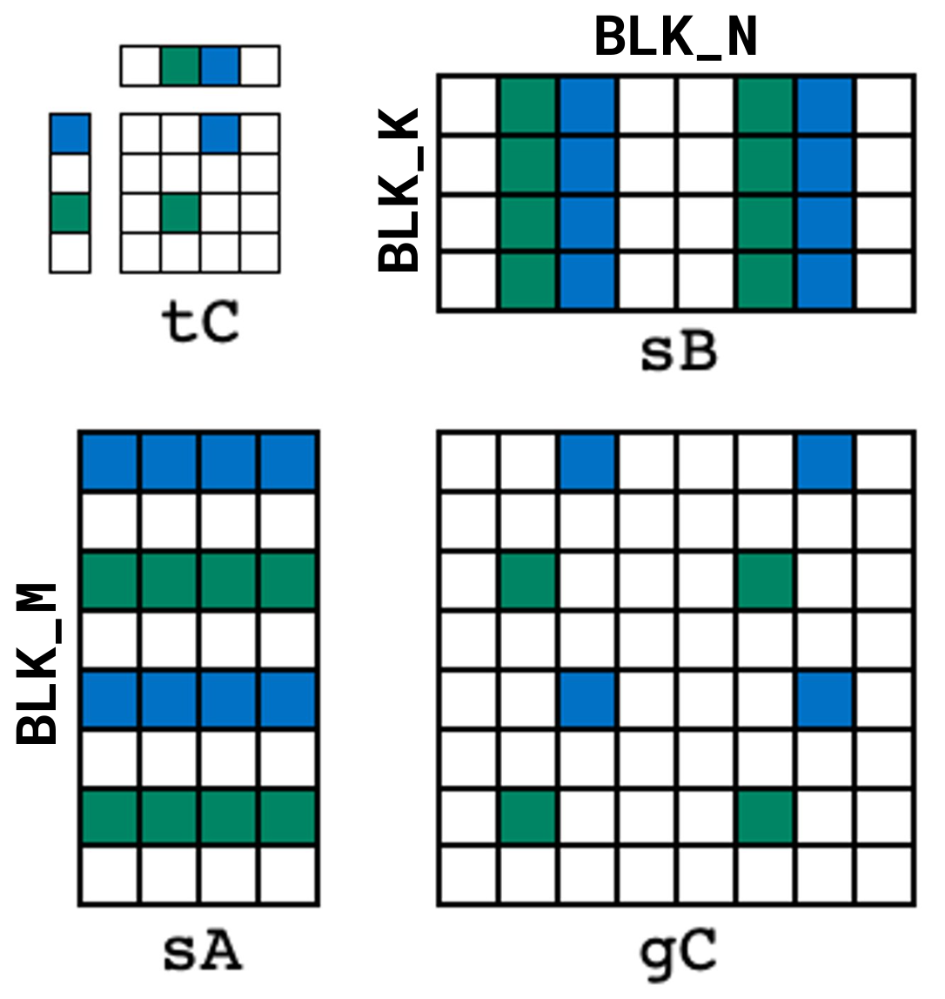
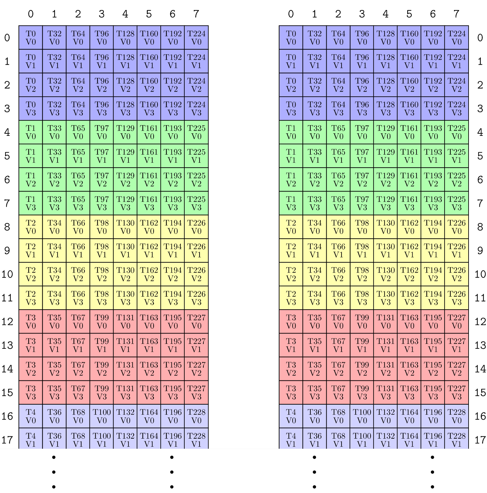
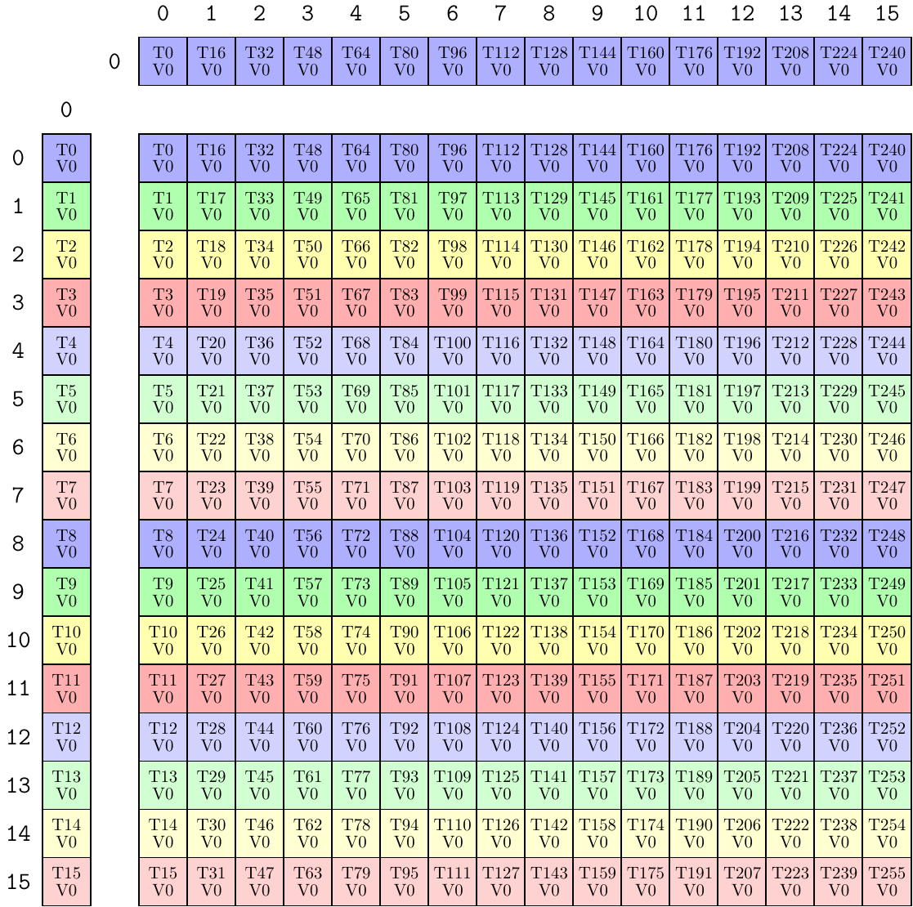

# CuTe dense matrix-matrix multiply 教程

本节回顾 [这些示例](https://github.com/NVIDIA/cutlass/tree/main/examples/cute/tutorial/)。这些示例只使用 CuTe，展示了几个自包含、单文件的 dense matrix-matrix multiply 实现。

## `sgemm_1.cu`

教程中最简单的示例覆盖了几个基础内容：如何把 global memory 按 CTAs（CUDA 中也称 threadblocks）划分为 tiles，如何把 data tiles 按每个 CTA 中的 threads 进一步 partition，以及如何使用 `cute::copy` 和 `cute::gemm` 编写 mainloop。

### 高层接口

先从文件顶部的 kernel 入口 `gemm_device` 开始。

```c++
template <class ProblemShape, class CtaTiler,
          class TA, class AStride, class ASmemLayout, class AThreadLayout,
          class TB, class BStride, class BSmemLayout, class BThreadLayout,
          class TC, class CStride, class CSmemLayout, class CThreadLayout,
          class Alpha, class Beta>
__global__ static
__launch_bounds__(decltype(size(CThreadLayout{}))::value)
void
gemm_device(ProblemShape shape_MNK, CtaTiler cta_tiler,
            TA const* A, AStride dA, ASmemLayout sA_layout, AThreadLayout tA,
            TB const* B, BStride dB, BSmemLayout sB_layout, BThreadLayout tB,
            TC      * C, CStride dC, CSmemLayout          , CThreadLayout tC,
            Alpha alpha, Beta beta)
```

这里有很多模板参数，先快速说明它们，然后再深入其用途。

* `ProblemShape`：该 matrix multiply 的 MxNxK problem shape。

* `CtaTiler`：一个 CuTe [tiler concept](./02_layout_algebra.md#composition-tilers)，决定如何从 problem shape 中提取一个 data tile。

* `TA const* A`、`TB const* B`、`TC* C`：分别是 A、B、C 数据的类型和 pointers。

* `AStride`、`BStride`、`CStride`：分别对应每个 A、B、C 在 `ProblemShape` 下的 layout strides。

* `ASmemLayout`、`BSmemLayout`、`CSmemLayout`：每个 CTA 内用于 staging A-data、B-data 和 C-data 的 shared memory layouts，如果需要的话。

* `AThreadLayout`、`BThreadLayout`、`CThreadLayout`：用于 partition 每个阶段的线程 layouts。

* `Alpha alpha`、`Beta beta`：计算 GEMM 的标量常量类型和值：`C = alpha * A * B + beta * C`。

### 完整 Tensors：Shapes、Strides 和 Data

大多数 GEMM 接口按 M、N、K 顺序列出矩阵维度。CuTe 也使用这个约定，但会把它们打包到单个 `IntTuple` 中。在本例中，这些是 dynamic values，定义在调用 device kernel 的 `gemm_nt` 和 `gemm_tn` host functions 顶部。

```cpp
  // Define shapes (dynamic)
  auto M = int(m);
  auto N = int(n);
  auto K = int(k);
  auto prob_shape = make_shape(M, N, K);    // (M, N, K)
```

在 kernel 内部，problem shape 会先根据 preconditions 检查，然后用于构造每个完整矩阵。

```cpp
  // Preconditions
  CUTE_STATIC_ASSERT_V(rank(shape_MNK) == Int<3>{});                      // (M, N, K)

  CUTE_STATIC_ASSERT_V(congruent(select<0,2>(shape_MNK), dA));            // dA strides for shape MK
  CUTE_STATIC_ASSERT_V(congruent(select<1,2>(shape_MNK), dB));            // dB strides for shape NK
  CUTE_STATIC_ASSERT_V(congruent(select<0,1>(shape_MNK), dC));            // dC strides for shape MN

  // Represent the full tensors
  Tensor mA = make_tensor(make_gmem_ptr(A), select<0,2>(shape_MNK), dA);  // (M,K)
  Tensor mB = make_tensor(make_gmem_ptr(B), select<1,2>(shape_MNK), dB);  // (N,K)
  Tensor mC = make_tensor(make_gmem_ptr(C), select<0,1>(shape_MNK), dC);  // (M,N)
```

通过选择 `Shape` 的合适 modes 来构造每个 tensor。preconditions 确保 `Shape` 中每个 integer 在关联 `Stride` 中都有对应 integer。

注意 B 后面的注释是 `(N,K)` 而不是 `(K,N)`。这意味着 B 被当作 NxK 矩阵处理，而不是 BLAS 和大多数 matrix-matrix multiplications 中常见的 KxN 矩阵。CuTe 遵循的矩阵 mode 语义是：A 为 `(M,K)`，B 为 `(N,K)`，C 为 `(M,N)`；我们会尽量在注释中记录这一点。

对 `(M,K)`、`(N,K)` 和 `(M,N)` tensors，`gemm_nt` 和 `gemm_tn` 会构造这些 tensors 使用的 strides。在 `gemm_nt` 中，strides 定义为：

```cpp
  // Define NT strides (mixed)
  auto dA = make_stride(Int<1>{}, ldA);    // (dM, dK)
  auto dB = make_stride(Int<1>{}, ldB);    // (dN, dK)
  auto dC = make_stride(Int<1>{}, ldC);    // (dM, dN)
```

在 `gemm_tn` 中，strides 定义为：

```cpp
  // Define TN strides (mixed)
  auto dA = make_stride(ldA, Int<1>{});    // (dM, dK)
  auto dB = make_stride(ldB, Int<1>{});    // (dN, dK)
  auto dC = make_stride(Int<1>{}, ldC);    // (dM, dN)
```

#### 补充：M-major、N-major、K-major

我们发现，BLAS 使用 “non-transposed”（N）和 “transposed”（T）flags，并结合 `MxK * KxN` 的 mode 约定，容易混淆真正的核心问题：这个矩阵使用什么 layout？我的矩阵在哪个 mode 上 stride-1？事实上，这些问题总能通过检查 CuTe `Layout` 得到答案。

相比 row-major、column-major，或 Transposed、Not-Transposed，我们发现更方便的说法是：如果矩阵在 M-mode 上 stride-1，就称为 “M-major”；如果在 N-mode 上 stride-1，就称为 “N-major”；如果在 K-mode 上 stride-1，就称为 “K-major”。另外，由于 matrix multiply 总是在 K-mode 上执行 reduction，从软件角度看，让 K-mode 总在相同位置并采用 `MxK * NxK` 的 mode 约定非常方便。实现总会对两个输入矩阵的第二个 mode（K mode）进行 reduction，这使得某些实现可以以相同方式处理两个输入矩阵。

如何把这转换成 BLAS 用户体验？

| BLAS | A Majorness | A Layout | B Majorness | B Layout |
| --- | --- | --- | --- | --- |
| NT | M-major | `(M,K):(1,ldA)` | N-major | `(N,K):(1,ldB)` |
| TN | K-major | `(M,K):(ldA,1)` | K-major | `(N,K):(ldB,1)` |
| NN | M-major | `(M,K):(1,ldA)` | K-major | `(N,K):(ldB,1)` |
| TT | K-major | `(M,K):(ldA,1)` | N-major | `(N,K):(1,ldB)` |

不管怎样，在适合的时候，我们仍会在 kernel 的高层描述中使用 BLAS 的 “NT” 和 “TN” 记法。

### CTA Partitioning

现在已经有完整矩阵的表示，可以开始 tile 它们并分配工作了。

最高层级上，工作跨 CTAs 分布。原则上，每个 CTA 的 tile 可以用许多不同方式从输入 tensors 中获得。很多 [CuTe `Tiler`s](./02_layout_algebra.md#composition-tilers) 都可以用于 tile 数据，但对这些例子来说，简单使用期望 CTA tile 的 shape 就足够了。

```cpp
  // Define CTA tile sizes (static)
  auto bM = Int<128>{};
  auto bN = Int<128>{};
  auto bK = Int<  8>{};
  auto cta_tiler = make_shape(bM, bN, bK);  // (BLK_M, BLK_N, BLK_K)
```

定义 tiler 后，就可以用它对 tensors 进行 tile 和 partition，分配给 CTAs。

```cpp
  // Get the appropriate blocks for this threadblock
  auto cta_coord = make_coord(blockIdx.x, blockIdx.y, _);              // (m,n,k)
  Tensor gA = local_tile(mA, cta_tiler, cta_coord, Step<_1, X,_1>{});  // (BLK_M,BLK_K,k)
  Tensor gB = local_tile(mB, cta_tiler, cta_coord, Step< X,_1,_1>{});  // (BLK_N,BLK_K,k)
  Tensor gC = local_tile(mC, cta_tiler, cta_coord, Step<_1,_1, X>{});  // (BLK_M,BLK_N)
```

首先创建 CTA coordinate。

* 该 tile 的 `m` coordinate 由 `blockIdx.x` 给出。
* 该 tile 的 `n` coordinate 由 `blockIdx.y` 给出。
* 该 tile 的 `k` coordinate 不指定，因为我们需要 `K` 中所有 tiles，所以 coordinate 是 `_`，即 `Underscore` 值，用来保留该 mode。

然后，`local_tile` 用于移除 tiler 和 coord 中与 `X` 对应的 modes。也就是说，`Step<_1, X,_1>` 只是下面代码的简写：

```cpp
  // Use select<0,2> to use only the M- and K-modes of the tiler and coord
  Tensor gA = local_tile(mA, select<0,2>(cta_tiler), select<0,2>(cta_coord));
```

这个 `local_tile` 本身是两步的简写：

1. 通过 [`zipped_divide`](./02_layout_algebra.md#zipped-tiled-flat-divides) 应用 tiler。

```cpp
// ((BLK_M,BLK_K),(m,k))
Tensor gA_mk = zipped_divide(mA, select<0,2>(cta_tiler));
```

2. 将 coord 应用于第二个 mode，也就是 “Rest” mode，提取当前 CTA 对应 tiles。

```cpp
// (BLK_M,BLK_K,k)
Tensor gA = gA_mk(make_coord(_,_), select<0,2>(cta_coord));
```

因为 tiler 和 coord 的 projections 是对称的，并且“应用 tiler 后 slice 进入 rest-mode 生成 partition”这两个步骤很常见，所以它们被包装进 projective `local_tile` 接口。

对 tensor `A`，我们得到一个 rank-3 tensor，shape 为 `(BLK_M,BLK_K,k)`。前两个 modes 正是 CTA tile 的 modes，最后一个 mode 索引该 CTA 将要 reduction 的所有 tiles。在下面 mainloop 小节中，这个 mode 会由 `k_tile` loop 遍历。

### SMEM tensors

用于保存 A 和 B 数据 tiles 的 shared memory layouts 也作为参数 `ASmemLayout sA_layout` 和 `BSmemLayout sB_layout` 传入。

它们在 `gemm_nt` 中定义为：

```c++
  // Define the smem layouts (static)
  auto sA = make_layout(make_shape(bM, bK));   // (m,k) -> smem_idx; m-major
  auto sB = make_layout(make_shape(bN, bK));   // (n,k) -> smem_idx; n-major
```

这会产生简单的 M-major 和 N-major layouts。在 `gemm_tn` 中，它们定义为：

```cpp
  // Define the smem layouts (static)
  auto sA = make_layout(make_shape(bM,bK), LayoutRight{});   // (m,k) -> smem_idx; k-major
  auto sB = make_layout(make_shape(bN,bK), LayoutRight{});   // (n,k) -> smem_idx; k-major
```

这会产生简单的 K-major layouts。

显然，这些 smem layouts 几乎可以是任何形式。在 kernel 内，它们只被检查两个性质：shared memory layouts 是 static，并且 top-level shape 与 `CtaTiler` 相同。

```cpp
  // Preconditions
  static_assert(is_static<ASmemLayout>::value);
  static_assert(is_static<BSmemLayout>::value);
  static_assert(is_static<CSmemLayout>::value);

  CUTE_STATIC_ASSERT_V(size<0>(ASmemLayout{}) == size<0>(cta_tiler));  // BLK_M
  CUTE_STATIC_ASSERT_V(size<0>(CSmemLayout{}) == size<0>(cta_tiler));  // BLK_M
  CUTE_STATIC_ASSERT_V(size<0>(BSmemLayout{}) == size<1>(cta_tiler));  // BLK_N
  CUTE_STATIC_ASSERT_V(size<1>(CSmemLayout{}) == size<1>(cta_tiler));  // BLK_N
  CUTE_STATIC_ASSERT_V(size<1>(ASmemLayout{}) == size<2>(cta_tiler));  // BLK_K
  CUTE_STATIC_ASSERT_V(size<1>(BSmemLayout{}) == size<2>(cta_tiler));  // BLK_K
```

使用 static layouts 有几个优点：

* Static layouts 允许我们静态分配 shared memory，如下所示。
* Static layouts 通常更高效，并允许 CuTe dispatch 到优化实现。
* Static layouts 更容易证明算法正确性，并提供如上检查：smem layout sizes 与 CTA tile sizes 相同。

如前所述，shared memory layouts 可以是任何满足这些条件的 layout。优化这类 kernels 往往就是寻找好的 shared memory layout，使写入 shared memory 和从 shared memory 读取都具有良好访问模式。这包括能够向量化 reads/writes，以及避免 shared memory bank conflicts。

有了 static smem layouts，`gemm_device` kernel 可以分配所需 shared memory，并创建 smem `Tensor`s。

```cpp
  // Shared memory buffers
  __shared__ TA smemA[cosize_v<ASmemLayout>];
  __shared__ TB smemB[cosize_v<BSmemLayout>];
  Tensor sA = make_tensor(make_smem_ptr(smemA), sA_layout);  // (BLK_M,BLK_K)
  Tensor sB = make_tensor(make_smem_ptr(smemB), sB_layout);  // (BLK_N,BLK_K)
```

注意 shared memory 分配只依赖数据类型和 layout。什么是 `cosize`？因为 `Layout` 是函数，所以可以谈论它的 domain 和 codomain。layout 的 `size` 是其 domain 的 size，layout 的 `cosize` 是其 codomain 的 size。如果希望分配一个数组，使 layout 产生的所有 offsets 都有效，就可以用 layout 的 `cosize` 作为数组长度，单位是元素。

### Copy partitioning

现在 kernel 已通过把 `CtaTiler` 应用于完整 tensors 得到了 global memory tiles，也通过合适分配得到了 shared memory tiles。现在我们想创建一种高效方式，把一个 global memory tile 复制到 shared memory tile。最平凡的方法是使用单个线程复制每个元素。

```cpp
if (thread0()) {
  Tensor gA0 = gA(_,_,0);  // (BLK_M,BLK_K), the 0th tile
  for (int i = 0; i < size(sA); ++i) {
    sA(i) = gA0(i);
  }
}
```

这能工作，但 CTA 内有很多线程可以用，所以应该使用它们。

如果把两个 data tiles 按 CTA 中的 threads partition，那么每个线程可以复制自己负责的 data subtensor。这种 partitioning 可以有很多方式。

`gemm_nt` 函数定义两个 *threads* layouts：

```c++
  // Define thread layouts (static)
  auto tA = make_layout(make_shape(Int<32>{},Int<8>{}));   // (m,k) -> thr_idx
  auto tB = make_layout(make_shape(Int<32>{},Int<8>{}));   // (n,k) -> thr_idx
```

`gemm_tn` 函数定义两个 *threads* layouts：

```c++
  // Define thread layouts (static)
  auto tA = make_layout(make_shape(Int<32>{},Int<8>{}), LayoutRight{});  // (m,k) -> thr_idx; k-major
  auto tB = make_layout(make_shape(Int<32>{},Int<8>{}), LayoutRight{});  // (n,k) -> thr_idx; k-major
```

两种情况都使用 32x8 threads，它们用于把 128x8 的 gmem 和 smem data tile partition 成每个线程一个 4x1 subtensor。唯一差异是 `gemm_nt` 使用 M-major 和 N-major threads 来匹配 global memory 中的数据顺序，而 `gemm_tn` 使用 K-major threads 来匹配 global memory 中的数据顺序。

同样，kernel 内会检查 thread layouts 的条件。

```cpp
  static_assert(is_static<AThreadLayout>::value);
  static_assert(is_static<BThreadLayout>::value);

  CUTE_STATIC_ASSERT_V(size(tA) == size(tB));                          // NumThreads

  CUTE_STATIC_ASSERT_V(size<0>(cta_tiler) % size<0>(tA) == Int<0>{});  // BLK_M / THR_M
  CUTE_STATIC_ASSERT_V(size<2>(cta_tiler) % size<1>(tA) == Int<0>{});  // BLK_K / THR_K
  CUTE_STATIC_ASSERT_V(size<1>(cta_tiler) % size<0>(tB) == Int<0>{});  // BLK_N / THR_N
  CUTE_STATIC_ASSERT_V(size<2>(cta_tiler) % size<1>(tB) == Int<0>{});  // BLK_K / THR_K
```

这些 thread layouts 随后用于 partition global memory tensors 和 shared memory tensors。

```cpp
  Tensor tAgA = local_partition(gA, tA, threadIdx.x);    // (THR_M,THR_K,k)
  Tensor tAsA = local_partition(sA, tA, threadIdx.x);    // (THR_M,THR_K)

  Tensor tBgB = local_partition(gB, tB, threadIdx.x);    // (THR_N,THR_K,k)
  Tensor tBsB = local_partition(sB, tB, threadIdx.x);    // (THR_N,THR_K)

  CUTE_STATIC_ASSERT_V(size<0>(tAgA) == size<0>(tAsA));  // THR_M
  CUTE_STATIC_ASSERT_V(size<1>(tAgA) == size<1>(tAsA));  // THR_K
  CUTE_STATIC_ASSERT_V(size<0>(tBgB) == size<0>(tBsB));  // THR_N
  CUTE_STATIC_ASSERT_V(size<1>(tBgB) == size<1>(tBsB));  // THR_K
```

`local_partition` 很像 `local_tile`，但 coordinate slice 进入 `zipped_divide` 的 tile-mode（第一个 mode），而不是 rest-mode（第二个 mode）。也就是说，每个线程在每个 thread tile 中获得一个 data 元素，该 thread tile 会重复覆盖整个 data tile。

命名约定 `tAsA` 在 CuTe 和 CUTLASS 中很典型，读作 “partitioning pattern `tA` applied to tensor `sA`”。下一节会看到另一个 partitioner 应用于 `sA` 得到 `tCsA`。对 tensors `sA` 和 `gA` 应用相同 partitioning pattern `tA`，可以保持这些 tensors 的 *logical consistency*，断言会检查这一点。即使它们的数据 layout 不同，两个 tensors 中的逻辑元素仍相互对应。例如在 `cute::copy` 中，这种命名约定让我们能从词法上验证两个 tensors 使用了相同 partitioning pattern。

数据按 threads partition 后，*每个线程* 都可以参与 copy：

```cpp
copy(tAgA(_,_,0), tAsA);
```

因为每个线程拥有将要复制的 tile 的不同 subtensor。

### Math partitioning

现在 kernel 已经有从 global memory 复制到 shared memory 的 tiles。下一步是创建高效方式，在 shared memory tile 上计算并累加矩阵乘积。最平凡的方法是使用单个线程直接计算。

```cpp
if (thread0()) {
  for (int m = 0; m < size<0>(gC); ++m) {
    for (int n = 0; n < size<1>(gC); ++n) {
      for (int k = 0; k < size<1>(sA); ++k) {
        gC(m,n) += sA(m,k) * sB(n,k);
      }
    }
  }
}
```

这能工作，但 CTA 内有很多线程可以用，所以应该使用它们。

如果把输出 tile `gC` 按 CTA 中的 threads partition，那么每个线程可以计算自己负责的 subtensor。这种 partitioning 同样可以有很多方式。

`gemm_nt` 和 `gemm_tn` 函数再定义一个 *threads* layout：

```cpp
  // Define thread layouts (static)
  auto tC = make_layout(make_shape(Int<16>{}, Int<16>{}));   // (m,n) -> thr_idx; m-major
```

这是 m-major 16x16 threads layout，用于 partition 128x128 的 `C` data tile，使每个线程计算自己的 8x8 `gC` subtensor。

同样，kernel 内会检查 thread layouts 的条件。

```cpp
  static_assert(is_static<CThreadLayout>::value);

  CUTE_STATIC_ASSERT_V(size(tC) == size(tA));                          // NumThreads

  CUTE_STATIC_ASSERT_V(size<0>(cta_tiler) % size<0>(tC) == Int<0>{});  // BLK_M / THR_M
  CUTE_STATIC_ASSERT_V(size<1>(cta_tiler) % size<1>(tC) == Int<0>{});  // BLK_N / THR_N
```

这些 thread layouts 随后用于 partition global memory 和 shared memory 中的数据 tiles。

```cpp
  // Partition sA (M,K) by the rows of tC
  Tensor tCsA = local_partition(sA, tC, threadIdx.x, Step<_1, X>{});   // (THR_M,BLK_K)
  // Partition sB (N,K) by the cols of tC
  Tensor tCsB = local_partition(sB, tC, threadIdx.x, Step< X,_1>{});   // (THR_N,BLK_K)
  // Partition gC (M,N) by the tile of tC
  Tensor tCgC = local_partition(gC, tC, threadIdx.x, Step<_1,_1>{});   // (THR_M,THR_N)

  // Allocate the accumulators -- same shape/layout as the partitioned data
  Tensor tCrC = make_tensor_like(tCgC);                                // (THR_M,THR_N)

  CUTE_STATIC_ASSERT_V(size<0>(tCrC) == size<0>(tCgC));                // THR_M
  CUTE_STATIC_ASSERT_V(size<0>(tCrC) == size<0>(tCsA));                // THR_M
  CUTE_STATIC_ASSERT_V(size<1>(tCrC) == size<1>(tCgC));                // THR_N
  CUTE_STATIC_ASSERT_V(size<1>(tCrC) == size<0>(tCsB));                // THR_N
  CUTE_STATIC_ASSERT_V(size<1>(tCsA) == size<1>(tCsB));                // BLK_K
```

这里使用了相同的 projection-style interface，以避免把 `tC` 的 `N`-mode 应用到 `sA` 的 `(BLK_M,BLK_K)` shape，也避免把 `tC` 的 `M`-mode 应用到 `sB` 的 `(BLK_N,BLK_K)` shape。



这张图展示 `tC` layout，高亮绿色和蓝色两个 threads，显示 `tC` layout 的 projections，并最终高亮 `sA`、`sB` 和 `gC` 中 `tCsA`、`tCsB`、`tCgC` 代表的 subtensors。

数据按 threads partition 后，*每个线程* 都可以参与 compute step：

```cpp
gemm(tCsA, tCsB, tCrC);
```

因为每个线程拥有要计算数据的不同 subtensors。

### Mainloop

mainloop 遍历 global memory tiles，把这些 tiles 读入 shared memory，然后执行 matrix-multiply 并累加到 accumulators。

```c++
// TUTORIAL: Example of a very simple compute mainloop
//   copy(.) operates on the global and shared memory via the tA|tB partitioning
//   gemm(.) operates on the shared and register memory via the tC partitioning

auto K_TILE_MAX = size<2>(tAgA);

for (int k_tile = 0; k_tile < K_TILE_MAX; ++k_tile)
{
  // Copy gmem to smem with tA|tB thread-partitioned tensors
  copy(tAgA(_,_,k_tile), tAsA);      // A   (THR_M,THR_K) -> (THR_M,THR_K)
  copy(tBgB(_,_,k_tile), tBsB);      // B   (THR_N,THR_K) -> (THR_N,THR_K)

  cp_async_fence();        // Label the end of (potential) cp.async instructions
  cp_async_wait<0>();      // Sync on all (potential) cp.async instructions
  __syncthreads();         // Wait for all threads to write to smem

  // Compute gemm on tC thread-partitioned smem
  gemm(tCsA, tCsB, tCrC);            // (THR_M,THR_N) += (THR_M,BLK_K) * (THR_N,BLK_K)
  __syncthreads();         // Wait for all threads to read from smem
}
```

可以看到，`k_tile` 遍历每个 data tile；当前 `k_tile` 的 `cute::copy` 使用 `tA` 和 `tB` thread-partitioned tensors 执行；当前 `k_tile` 的 `cute::gemm` 使用 `tC` thread-partitioned tensors 计算。同步被显式提供，所以这个 kernel 可以在任何架构上工作。

## `sgemm_2.cu`

这个示例使用更复杂的 `TiledMMA` 和 `TiledCopy` 来执行 partitioning，替代 `tA`、`tB` 和 `tC` thread layouts。通过这个示例，文档强调 shared memory layouts、partitioning patterns，以及每个阶段使用的 PTX instruction 都可以独立指定。

### TiledCopy

首先，可以把 `tA` partitioning 和 `tB` partitioning 替换为 `TiledCopy` partitioning。后者提供更复杂的 partitioning patterns，并能检查后 dispatch 到具体 copy instructions。

先看 `gemm_nt` 生成的 `TiledCopy`：

```cpp
  TiledCopy copyA = make_tiled_copy(Copy_Atom<UniversalCopy<uint128_t>, TA>{},  // Atom: Copy TAs as if they were uint128_t
                                    Layout<Shape<_32,_8>>{},                    // Thr layout 32x8 m-major
                                    Layout<Shape< _4,_1>>{});                   // Val layout  4x1 m-major
  print_latex(copyA);
```

理解这个 `TiledCopy` 做什么最简单的方法是看 LaTeX 中的 partition pattern。



左侧是 source-tensor partitioning，右侧是 destination-tensor partitioning。本例中 partition patterns 相同，但某些 PTX instructions 要求 source 和 destination 使用不同 patterns。图中显示每个线程读取 4x1 个 `TA` 元素，并且有 32x8 个 threads。`UniversalCopy<uint128_t>` 强制指令使用 128-bit copy instruction。如果 partition（本例中是 `sA` 或 `gA`）没有产生 4 个能向量化成 128-bit load/store 的 `TA` 元素，那么 CuTe 会在静态阶段失败，并给出相应错误信息。

要使用 `TiledCopy`，kernel 写：

```cpp
  ThrCopy thr_copy_a = copy_a.get_slice(threadIdx.x);
  Tensor tAgA = thr_copy_a.partition_S(gA);            // (CPY,CPY_M,CPY_K,k)
  Tensor tAsA = thr_copy_a.partition_D(sA);            // (CPY,CPY_M,CPY_K)
  // Allocate registers same shape/layout as partitioned data
  Tensor tArA = make_fragment_like(tAsA);              // (CPY,CPY_M,CPY_K)
```

这会通过 `partition_S` 将 source-tensor partitioning 应用于 `gA`，并通过 `partition_D` 将 destination-tensor partitioning 应用于 `sA`。结果 tensors 的第一个 mode `CPY` 保存单条指令将消费的所有元素。本例中该 mode 应该 size 为 4，因为单个 128-bit `uint128_t` 中有四个 `TA=float` 元素。

完成 partition 后，可以使用 `copy_a` 中提供的指令，在 thread-partitioned tensors 上执行 `copy`。

```cpp
cute::copy(copy_a, tAgA, tArA);
```

### TiledMMA

接下来，可以把 `tC` partitioning 替换为 `TiledMMA` partitioning。它提供更复杂的 partitioning patterns，并能检查后 dispatch 到具体 MMA instructions。

先看 `gemm_nt` 生成的 `TiledMMA`：

```cpp
  TiledMMA mmaC = make_tiled_mma(UniversalFMA<TC,TA,TB>{},
                                 Layout<Shape<_16,_16,_1>>{});  // 16x16x1 UniversalFMA
  print_latex(mmaC);
```

理解这个 `TiledMMA` 做什么最简单的方法是看 LaTeX 中的 partition pattern。



左侧是 A-tensor partitioning，顶部是 B-tensor partitioning，中间是 C-tensor partitioning。因为 `UniversalFMA` 是 1x1x1 MMA instruction，将其做 16x16x1 tiling 会得到 16x16x1 `TiledMMA`。其他 MMA instructions 会涉及不同 threads，并且有不同 instruction sizes。在本例中，所有线程都会分别从 `A`、`B` 和 `C` 读取单个元素。

要使用 `TiledMMA`，kernel 写：

```cpp
  ThrMMA thr_mma = mma.get_slice(threadIdx.x);
  Tensor tCsA = thr_mma.partition_A(sA);        // (MMA,MMA_M,MMA_K)
  Tensor tCsB = thr_mma.partition_B(sB);        // (MMA,MMA_N,MMA_K)
  Tensor tCgC = thr_mma.partition_C(gC);        // (MMA,MMA_M,MMA_N)
  // Allocate the accumulators -- same size as the projected data
  Tensor tCrC = thr_mma.make_fragment_C(tCgC);  // (MMA,MMA_M,MMA_N)
```

这会通过 `partition_A` 将 A-tensor partitioning 应用于 `sA`，通过 `partition_B` 将 B-tensor partitioning 应用于 `sB`，通过 `partition_C` 将 C-tensor partitioning 应用于 `gC`。结果 tensors 的第一个 mode `MMA` 保存单条指令将消费的所有元素。本例中该 mode 应该 size 为 1，因为 `UniversalFMA` 是 1x1x1 MMA；但一般来说，第一个 mode 的 size 可以变化，并且取决于 MMA，`tCsA`、`tCsB` 和 `tCgC` 之间甚至不一定相同。

完成 partition 后，可以使用 `mma` 中提供的指令，在 thread-partitioned tensors 上执行 `gemm`。

```cpp
cute::gemm(mma, tCsA, tCsB, tCrC);
```

### 其他变化

在这个版本中，`gemm_tn` 的 shared memory layouts 也从 K-major 更新为：

```cpp
  // Define the smem layouts (static)
  auto sA = make_layout(make_shape (      bM,          bK),
                        make_stride(Int<1>{}, bM+Int<1>{}));  // (m,k) -> smem_idx; padded m-major
  auto sB = make_layout(make_shape (      bN,          bK),
                        make_stride(Int<1>{}, bN+Int<1>{}));  // (n,k) -> smem_idx; padded n-major
```

这会产生 M-major 和 N-major layouts，但它们带有 padding，用于避免 shared memory bank conflicts。这只是改善 shared memory 的读写访问模式，kernel 不需要其他改动。

## `sgemm_sm70.cu`

这个示例为 Volta SM70 架构使用优化 mainloop，对 shared memory 和 register memory 做流水线。

## `sgemm_sm80.cu`

这个示例为 Ampere SM80 架构使用优化 mainloop，通过从 global memory 异步读取来显式对 shared memory 做流水线。

## 下一步

上面所有示例都假设 CTA tile size 能整除 problem size，因此 global memory loads 不需要 predication。教程中的 [predication 小节](./0y_predication.md) 解释了当矩阵 tiling 不能完美整除矩阵时应该怎么做。

## GETT as GEMM

这里的 “GETT” 表示 “general(ized) tensor times tensor”，也就是 tensor contraction。

CuTe 允许矩阵具有 nested `Layout`s。这意味着我们可以按 modes 的类别对 `Tensor` 分组，把它折叠成一个 “matrix”。

因此，可以使用已有 GEMM 实现来实现 GETT。下面是一个类似 `gemm_nt` 的 launcher，它使用 `sgemm_1.cu` 中同一个 device kernel 来计算一个具有两个 m-modes 的 GETT。

```cpp
// Setup params for a GETT with two m-modes.
// The A and C tensors are assumed to be m0-major.
//   Calls sgemm_1.cu's gemm_device<<<>>> without modification.
template <class TA, class TB, class TC,
          class Alpha, class Beta>
void
gett(int m0, int m1, int n, int k,
     Alpha alpha,
     TA const* A, int ldAm1, int ldAk,  // m0-major
     TB const* B, int ldBk,
     Beta beta,
     TC      * C, int ldCm1, int ldCn,  // m0-major
     cudaStream_t stream = 0)
{
  using namespace cute;

  // Define shapes (dynamic)
  auto M = make_shape(m0, m1);                               // (m0,m1)-multimode M
  auto N = int(n);
  auto K = int(k);
  auto prob_shape = make_shape(M, N, K);                     // (M, N, K)

  // Define NT strides (mixed)
  auto dA = make_stride(make_stride(Int<1>{}, ldAm1), ldAk); // (dM, dK)
  auto dB = make_stride(Int<1>{}, ldB);                      // (dN, dK)
  auto dC = make_stride(make_stride(Int<1>{}, ldCm1), ldCn); // (dM, dN)

  // Define CTA tile sizes (static)
  auto bM = Shape<_64, _2>{};    // Take _64 elements from m0 and _2 elements from m1
  auto bN = Int<128>{};
  auto bK = Int<  8>{};
  auto cta_tiler = make_shape(bM, bN, bK);                   // (BLK_M, BLK_N, BLK_K)

  // Define the smem layouts (static)
  auto sA = make_layout(make_shape(bM, bK));                 // (m,k) -> smem_idx; m-major
  auto sB = make_layout(make_shape(bN, bK));                 // (n,k) -> smem_idx; n-major
  auto sC = make_layout(make_shape(bM, bN));                 // (m,n) -> smem_idx; m-major

  // Define the thread layouts (static)
  auto tA = make_layout(make_shape(Int<32>{}, Int< 8>{}));   // (m,k) -> thr_idx
  auto tB = make_layout(make_shape(Int<32>{}, Int< 8>{}));   // (n,k) -> thr_idx
  auto tC = make_layout(make_shape(Int<16>{}, Int<16>{}));   // (m,n) -> thr_idx

  dim3 dimBlock(size(tC));
  dim3 dimGrid(size(ceil_div(M, bM)),
               size(ceil_div(N, bN)));
  gemm_device<<<dimGrid, dimBlock, 0, stream>>>
      (prob_shape, cta_tiler,
       A, dA, sA, tA,
       B, dB, sB, tB,
       C, dC, sC, tC,
       alpha, beta);
}
```

注意，唯一变化是 shape `M` 的定义、strides `dA` 和 `dC` 的定义，以及 CTA Tiler `bM` 的定义。上面使用 multimodal problem shape `M = (m0,m1)` 和 multimodal CTA Tiler `bM = <_64,_2>`，改变每个 CTA 负责计算 global memory tensors `A` 和 `C` 的哪一部分。

基于 CuTe 的 CUTLASS 3.x kernels 中也有类似示例，例如 [this Hopper GETT example](https://github.com/NVIDIA/cutlass/tree/main/examples/51_hopper_gett)。

## Copyright

Copyright (c) 2017 - 2026 NVIDIA CORPORATION & AFFILIATES. All rights reserved.
SPDX-License-Identifier: BSD-3-Clause

```text
  Redistribution and use in source and binary forms, with or without
  modification, are permitted provided that the following conditions are met:

  1. Redistributions of source code must retain the above copyright notice, this
  list of conditions and the following disclaimer.

  2. Redistributions in binary form must reproduce the above copyright notice,
  this list of conditions and the following disclaimer in the documentation
  and/or other materials provided with the distribution.

  3. Neither the name of the copyright holder nor the names of its
  contributors may be used to endorse or promote products derived from
  this software without specific prior written permission.

  THIS SOFTWARE IS PROVIDED BY THE COPYRIGHT HOLDERS AND CONTRIBUTORS "AS IS"
  AND ANY EXPRESS OR IMPLIED WARRANTIES, INCLUDING, BUT NOT LIMITED TO, THE
  IMPLIED WARRANTIES OF MERCHANTABILITY AND FITNESS FOR A PARTICULAR PURPOSE ARE
  DISCLAIMED. IN NO EVENT SHALL THE COPYRIGHT HOLDER OR CONTRIBUTORS BE LIABLE
  FOR ANY DIRECT, INDIRECT, INCIDENTAL, SPECIAL, EXEMPLARY, OR CONSEQUENTIAL
  DAMAGES (INCLUDING, BUT NOT LIMITED TO, PROCUREMENT OF SUBSTITUTE GOODS OR
  SERVICES; LOSS OF USE, DATA, OR PROFITS; OR BUSINESS INTERRUPTION) HOWEVER
  CAUSED AND ON ANY THEORY OF LIABILITY, WHETHER IN CONTRACT, STRICT LIABILITY,
  OR TORT (INCLUDING NEGLIGENCE OR OTHERWISE) ARISING IN ANY WAY OUT OF THE USE
  OF THIS SOFTWARE, EVEN IF ADVISED OF THE POSSIBILITY OF SUCH DAMAGE.
```
