# NVIDIA 低比特 GEMM：16/8/6/4 bit 数值、存储、量化与 PTX/CUTLASS 实战

> 版本基线：PTX ISA 9.3、CUDA Math API / cuBLAS 13.3、CUTLASS 4.6.1、Transformer Engine 2.16；核对日期：2026-08-03。低比特接口变化很快，本文凡涉及架构和 API 支持范围，均应连同版本号阅读。

> 图版说明：正文插图均从同目录的 `images/` 读取，无需联网即可显示。每张图下均标出官方来源与本文解读；Mermaid 图只用于串起数据流，不替代官方物理布局图。

## 如何使用本文

本文的主题是 **NVIDIA GPU 上以 GEMM 为核心的 16/8/6/4 bit 数值、量化、存储、搬运与计算**。它既不是只比较数值格式的表格，也不是一份可直接复制到任意 GPU 的通用 kernel。

适合的读者包括：

- 需要辨认 INT4、NF4、E2M1、MXFP4、NVFP4 等概念的模型/量化研发者；
- 需要在 Transformer Engine、TensorRT-LLM、cuBLASLt 或 CUTLASS 中选路径的库用户；
- 需要理解 HBM packing、SMEM padding、TMA、TMEM 与 MMA fragment 的 kernel 开发者。

建议先具备三项基础：矩阵乘和浮点编码、CUDA 的 thread/warp/CTA 与存储层次、基本 C++ 模板阅读能力。若只关心算法选型，可跳过 PTX operand 和 CUTLASS builder 细节。

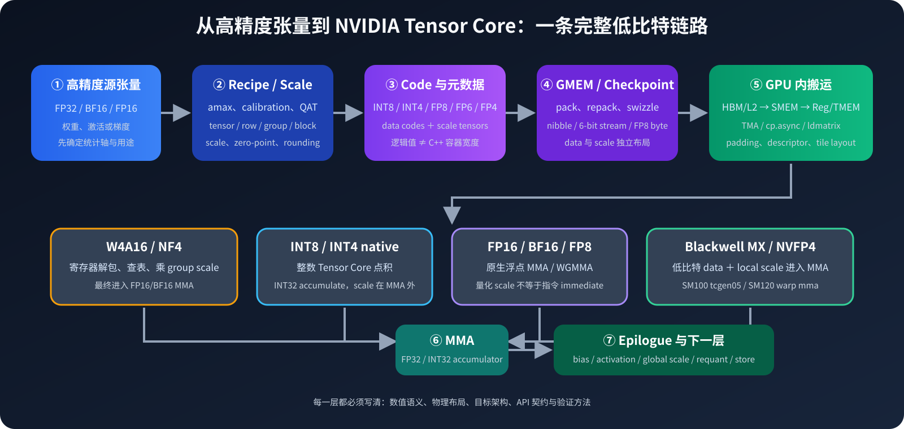

*本文绘制的总图。左半边回答“怎样量化并存下来”，右半边回答“怎样搬到计算单元并累加”；中间四条分支代表四种不可混为一谈的执行路径。*

### 三条阅读路线

| 目标 | 推荐顺序 | 读完后应能回答 |
|---|---|---|
| 量化算法/模型 | 1 → 2 → 4 → 5 → 14 → 16 | 该选什么格式、scale 粒度与误差策略？ |
| 高层库用户 | 1 → 4 → 5 → 10 → 13 → 15 → 18 | 目标 GPU 能否执行，API 需要什么 data/scale layout？ |
| Kernel 开发者 | 1 → 5 → 10 → 3 → 6–13 → 15 → 18 | 数据在 HBM/SMEM/register/TMEM 中如何变形，最后发出哪条 MMA？ |

### 范围边界

本文中的“传输/搬运”默认指单 GPU 内的 checkpoint/GMEM → L2 → SMEM → register/TMEM 数据路径。第 4 节会补充量化张量在 all-gather 中的 compact/swizzled layout 与 scale 同步概念，但 PCIe、NVLink、NCCL 拓扑和通信算法本身不是本文主题。softmax、normalization、KV cache、optimizer state 和稀疏性也不在主线内；不应把“学会低比特 GEMM”等同于“掌握整个模型的全链路压缩”。

## 先给结论

1. **格式名不是执行路径。**“W4A16”通常表示权重以 4 bit 存储，进入 MMA 前在寄存器中反量化成 FP16/BF16；它节省 HBM/缓存流量，但最终仍跑 16 bit Tensor Core。它既不等于 `mma.sync ... s4.s4.s32`，也不等于 Blackwell 的原生 FP4 block-scaled MMA。
2. **操作数位宽不是累加器位宽。**实际常见的是 FP16/BF16/FP8/FP6/FP4 乘法配 FP32 累加，INT8/INT4 乘法配 INT32 累加；输出再由 epilogue 缩放、截断或量化。
3. **FP16 与 BF16 的主要取舍是精度对范围。**FP16 有 10 个 fraction bit、但范围小；BF16 只有 7 个 fraction bit、却继承 FP32 的 8-bit exponent，训练中通常更稳。
4. **FP8 是第一个已大规模部署的低位浮点 Tensor Core 格式。**E4M3 精度更高、范围到 448；E5M2 精度更低、范围到 57344。训练中常用 E4M3 放前向权重/激活，E5M2 放梯度，但这不是硬性规则。
5. **裸 FP6/FP4 的动态范围太小，block scaling 才是关键。**OCP MXFP4/6/8 用每 32 个元素一个 UE8M0 scale；NVIDIA NVFP4 用每 16 个 E2M1 一个 UE4M3 local scale，外加一个 tensor-wide FP32 scale。
6. **“4 bit”至少要区分 INT4、E2M1、MXFP4、NVFP4、NF4。**INT4 是整数；E2M1 是硬件浮点编码；MXFP4/NVFP4 是“编码＋分块 scale”的执行格式；NF4 是面向近似正态权重的非均匀码本，Tensor Core 没有原生 NF4 MMA。
7. **存储有五层。**逻辑编码位宽、CUDA/C++ 标量容器、HBM 紧凑打包、SMEM 喂数布局、PTX 寄存器容器可能都不同。尤其 FP6：逻辑上 6 bit，CUDA 标量 wrapper 却占 8 bit；CUTLASS 数组可在 HBM 中按 6 bit 紧凑打包；给 MMA 喂数时又可能变成带 padding 的 8-bit lane。
8. **Blackwell 也不是一条统一路径。**数据中心 SM100/103 与 DRIVE Thor SM110 使用 `tcgen05.mma`、TMEM 和 block-scale matrix；GeForce SM120 与 DGX Spark/GB10 SM121 的窄精度路径则围绕扩展的 warp `mma.sync`。产品标签、compute capability 和 kernel family 不能只用“Blackwell 支持 FP4”概括。
9. **低比特收益取决于瓶颈。**decode 小 $M$ 常被权重带宽限制，W4A16 即使仍做 BF16 MMA 也可能很值；prefill/训练的大 $M,N,K$ 更需要 FP8/FP4 原生 Tensor Core 吞吐，否则反量化和 16-bit 计算上限会吞掉收益。

## 1. 先把四个概念拆开

讨论一个低比特 GEMM，至少要同时回答四个问题：

| 层次 | 要问的问题 | 例子 |
|---|---|---|
| 数值格式 | 一个 code 表示什么数？有多少 exponent/fraction bit？ | E4M3、E2M1、INT4、NF4 |
| 量化格式 | scale/zero-point 如何组织？粒度是什么？ | per-tensor FP8、groupwise INT4、MXFP4、NVFP4 |
| 存储布局 | HBM、SMEM、寄存器里如何打包和重排？ | 两个 FP4/byte、四个 FP6/3 bytes、`b6x16_p32` |
| 执行指令 | 最终是哪种 MMA，在哪代 SM 上运行？ | `mma.sync`、`wgmma.mma_async`、`tcgen05.mma` |

一个名字只能回答其中一部分。例如 W4A16 回答了“权重/激活的外部精度”，没有说明权重是 INT4 还是 NF4、group size 多大、scale 是 FP16 还是 FP32，也没有说明最终是否使用 native INT4 MMA。

本文默认矩阵乘为

$$
D = \alpha A B + \beta C,
$$

并用 `WbAq` 表示权重 $b$ bit、激活 $q$ bit。MMA 的 accumulator 与最终 $D$ 可以是另一种类型。

## 2. 数值格式：精确到可表示集合

### 2.1 浮点编码

二进制浮点可抽象成 sign $s$、exponent field $e$、fraction field $f$。对正规数：

$$
x=(-1)^s\left(1+\frac{f}{2^M}\right)2^{e-\text{bias}},
$$

对子正规数：

$$
x=(-1)^s\left(\frac{f}{2^M}\right)2^{1-\text{bias}}.
$$

各格式对“全 1 exponent”是否保留给 Inf/NaN 的约定不同，所以不能仅从 `ExMy` 名字推断最大值。

| 格式 | 位域 | bias | 最大有限值 | 最小正规数 | 最小正子正规数 | 1 附近 ULP | Inf / NaN | 典型角色 |
|---|---:|---:|---:|---:|---:|---:|---|---|
| FP16 | S1 E5 M10 | 15 | 65,504 | $2^{-14}$ | $2^{-24}$ | $2^{-10}$ | 有 / 有 | 训练、推理、累加输入 |
| BF16 | S1 E8 M7 | 127 | $\approx3.3895\times10^{38}$ | $2^{-126}$ | $2^{-133}$ | $2^{-7}$ | 有 / 有 | 训练默认、范围敏感张量 |
| FP8 E4M3 | S1 E4 M3 | 7 | 448 | $2^{-6}$ | $2^{-9}$ | $2^{-3}$ | 无 / 有 | 精度优先的 FP8 |
| FP8 E5M2 | S1 E5 M2 | 15 | 57,344 | $2^{-14}$ | $2^{-16}$ | $2^{-2}$ | 有 / 有 | 范围优先的 FP8 |
| FP6 E2M3 | S1 E2 M3 | 1 | 7.5 | 1 | 0.125 | 0.125 | 无 / 无 | 小范围、高一些精度 |
| FP6 E3M2 | S1 E3 M2 | 3 | 28 | 0.25 | 0.0625 | 0.25 | 无 / 无 | 较大范围、低一些精度 |
| FP4 E2M1 | S1 E2 M1 | 1 | 6 | 1 | 0.5 | 0.5 | 无 / 无 | MXFP4 / NVFP4 数据元素 |

这些定义与 NVIDIA PTX 的 [alternate floating-point formats](https://docs.nvidia.com/cuda/parallel-thread-execution/#alternate-floating-point-data-formats)、CUDA Math API 和 OCP MX 规范一致；上表中的可表示值也在第 17 节用穷举程序复验。

E2M1 尤其值得直接记住。其非负集合只有：

$$
\{0,\ 0.5,\ 1,\ 1.5,\ 2,\ 3,\ 4,\ 6\}.
$$

没有 2.5、3.5、5，也没有 Inf/NaN。负数由 sign bit 镜像得到，并存在正负零编码。这样的动态范围若没有细粒度 scale，几乎不可能直接覆盖神经网络张量。

### 2.2 位域直观图

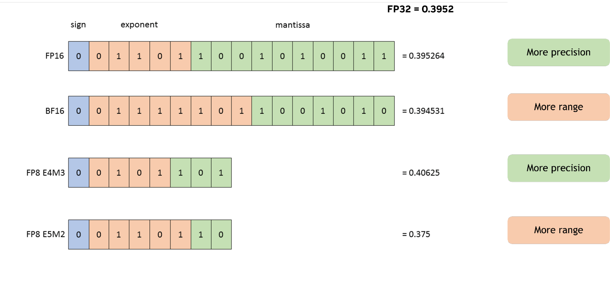

*官方原图：NVIDIA Technical Blog，Figure 1，[Structure of the floating-point data types](https://developer.nvidia.com/blog/floating-point-8-an-introduction-to-efficient-lower-precision-ai-training/)。图中统一编码同一个近似值 0.3952，因此不仅能数出 S/E/M 位数，还能直接看到减少 mantissa 后舍入结果怎样变化。*

读图时抓住两条主线即可：BF16 把 FP16 的 3 个 fraction bit 换成 3 个 exponent bit；E4M3 与 E5M2 则在同样 8 bit 内继续做“精度换范围”。FP6/FP4 的位域在后面的 PTX Figure 199–204 中直接对应到真实 byte/word 位置，不再只画抽象方块。

### 2.3 整数与“非硬件浮点”

| 类型 | 典型数域 | 量化后恢复 | NVIDIA 原生 MMA 情况 |
|---|---|---|---|
| INT8 | signed $[-128,127]$，或 unsigned $[0,255]$ | $\hat x=s(q-z)$ | 成熟；INT8×INT8→INT32 |
| INT4 | signed $[-8,7]$，或 unsigned $[0,15]$ | 同上 | Turing/Ampere warp MMA 有原生 s4/u4 路径 |
| INT6 | 通常由软件自定义 | 同上 | 没有通用 native INT6 Tensor Core MMA；多为打包/反量化格式 |
| NF4 | 16 项非均匀码本 | $\hat x=s\cdot\text{codebook}[q]$ | 没有 native NF4 MMA；先 lookup/反量化 |

QLoRA 的 NF4 是针对近似正态分布权重设计的量化码本，不是 IEEE 风格浮点，也不是 E2M1。它适合参数存储和微调，但执行时仍需要查表/反量化成硬件支持的计算类型。参见 [QLoRA 论文](https://arxiv.org/abs/2305.14314)。

### 2.4 TF32 容易被误放进“16 bit”

TF32 使用 FP32 的 8-bit exponent 和 10-bit fraction 精度，但编程接口与存储通常仍是 32 bit；它是 Ampere Tensor Core 的计算表示，不是 16-bit HBM 存储格式。拿 TF32 与 FP16/BF16 比吞吐可以，拿它算模型权重压缩比则不可以。

## 3. 存储：逻辑 4/6 bit 不等于 `sizeof(T)`

### 3.1 五层模型

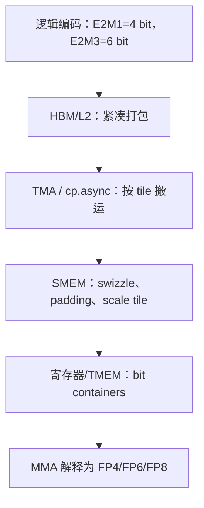

这五层中只有第一层定义数值。其余层服务于寻址、对齐、bank conflict、指令解码和带宽。

### 3.2 CUDA wrapper、CUTLASS 数组与 PTX 寄存器

| 逻辑类型 | CUDA Math API 标量/向量 storage | CUTLASS 紧凑数组 | PTX 操作数容器要点 |
|---|---|---|---|
| FP8 E4M3/E5M2 | scalar 8 bit，x2 16 bit，x4 32 bit | 8 bit/元素 | alternate type 通过 `.b8/.b16/.b32` 承载 |
| FP6 E2M3/E3M2 | scalar 8 bit，x2 16 bit，x4 32 bit | `Array<T,N>` 可按 6 bit/元素打包 | 常以每元素 8-bit lane 承载，低 6 bit 有效、高 2 bit 为 0 |
| FP4 E2M1 | scalar wrapper 8 bit；x2 仍为 8 bit；x4 为 16 bit | 可按 4 bit/元素打包 | `e2m1x2` 可装进 `.b8`；某些 MMA kind 要求 padded 8-bit container |

官方接口见 CUDA Math API 的 [FP4 storage](https://docs.nvidia.com/cuda/cuda-math-api/cuda_math_api/group__CUDA__MATH__FP4__MISC.html) 与 [FP6 storage](https://docs.nvidia.com/cuda/cuda-math-api/cuda_math_api/group__CUDA__MATH__FP6__MISC.html)。CUTLASS 的 [`Array<T,N>`](https://docs.nvidia.com/cutlass/latest/media/docs/cpp/fundamental_types.html) 对 sub-byte 类型有专门的紧凑存储实现。因此：

- `sizeof(__nv_fp6_storage_t) == 1` 不代表 FP6 checkpoint 必须浪费 2 bit；
- `sizeof(cutlass::float_e2m1_t)` 也不应被用来推导 tensor buffer 大小；
- 分配紧凑 tensor 时应按 `ceil(N * bits_per_element / 8)` 计算，并使用库提供的 capacity/layout 工具；
- 标量 wrapper 适合 API 传递与转换，tensor 容器才决定真实 HBM 占用。

### 3.3 PTX alternate type 不能直接声明寄存器

PTX 的 `.f16/.f32/.s32/.b32` 等是 fundamental types；E4M3、E5M2、E2M3、E3M2、E2M1、UE8M0、UE4M3 属于 alternate formats。寄存器仍声明为等宽的 bit type：

```ptx
// 合法的容器声明；具体指令再把位模式解释成 alternate format。
.reg .b16 fp8_pair;
.reg .b16 fp6_pair;   // 两个 8-bit lane，各自低 6 bit 有效
.reg .b8  fp4_pair;   // e2m1x2，两个 nibble
.reg .f32 acc;
```

不能写成 `.reg .e4m3 x;`。这是理解 PTX 代码中大量 `.b32` 的关键：`.b32` 只描述容器宽度，不表示里面一定是整数。

### 3.4 FP4/FP6 的 padding 规则依赖 MMA kind

PTX 9.3 对 `mma` 的窄浮点规定有一个容易漏读的细节：

- 对 `kind::f8f6f4` / `kind::mxf8f6f4`，FP6 放在 8-bit container 的低 6 bit、高 2 bit padding；FP4 E2M1 放在 8-bit container 的中间 4 bit，高低各 2 bit padding。
- 对专门的 `kind::mxf4` / `kind::mxf4nvf4`，E2M1 不要求上述 8-bit padding，可使用紧凑 FP4 feed path。

所以“FP4 原始 buffer 两个 nibble/byte”与“某条 mixed F8/F6/F4 指令看到 padded byte lanes”可以同时成立。必须按具体 instruction kind 准备 SMEM/fragment，而不是按格式名猜。

#### 3.4.1 PTX 官方位图：同一个 E2M1 在两种 kind 中位置不同

下面三张是 `kind::mxf8f6f4` 的 **TMEM 8-bit container**。它为了让 FP8、FP6、FP4 共用一条 mixed-type datapath，把窄元素都规范成 byte lane；图中的白色 `0` 是容器 padding，不是数值字段。


*PTX ISA 9.3 Figure 199：E2M1 在 mixed kind 中位于 bit `[5:2]`，形态为 `00 | S E2 M1 | 00`。[官方章节](https://docs.nvidia.com/cuda/parallel-thread-execution/#packing-format-used-for-matrix-a-by-kind-mxf8f6f4-in-tensor-memory)*

| E3M2：低 6 bit 有效 | E2M3：低 6 bit 有效 |
|---|---|
|  |  |

*PTX Figure 200–201：FP6 都是 `00 | S | E/M`，即有效位在 `[5:0]`、高 2 bit 清零；E3M2 与 E2M3 只改变 exponent/fraction 的分界。*

专用 `kind::mxf4` / `kind::mxf4nvf4` 不需要兼容 FP8/FP6，因此恢复真正的 nibble packing：

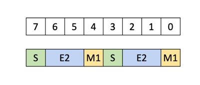

*PTX Figure 204：两个 `S|E2|M1` 紧凑装入同一个 byte，没有 padding。[官方章节](https://docs.nvidia.com/cuda/parallel-thread-execution/#packing-format-used-for-matrix-a-by-kind-mxf4-and-kind-mxf4nvf4-in-tensor-memory)*

SMEM 喂给 mixed kind 时又是 tile 级规则：每 16 个 FP4/FP6 元素后补齐到 128 bit，而不是简单地把上面某个 byte 无限重复。


*PTX Figure 202：16×4 bit = 64 bit 有效数据，尾部再留 64 bit padding。*


*PTX Figure 203：16×6 bit = 96 bit 有效数据，尾部再留 32 bit padding。[官方章节](https://docs.nvidia.com/cuda/parallel-thread-execution/#packing-format-used-for-matrix-a-and-b-by-kind-mxf8f6f4-in-shared-memory)*

### 3.5 Blackwell `ldmatrix` 的窄格式喂数布局

PTX 9.3 增加的 narrow `ldmatrix` 变体把带 padding 的 SMEM row 展开成 8-bit lane，例如：

```ptx
// 语法模板：每行 16 个 6-bit 元素（96 bit）+ 32 bit padding。
ldmatrix.sync.aligned.m8n16.x1.shared::cta.b8x16.b6x16_p32
  {dst}, [smem_addr];

// 每行 16 个 4-bit 元素（64 bit）+ 64 bit padding。
ldmatrix.sync.aligned.m16n16.x1.trans.shared::cta.b8x16.b4x16_p64
  {dst0, dst1}, [smem_addr];
```

`b6x16_p32` 与 `b4x16_p64` 描述的是 **SMEM source row 的喂数形态**，不是要求模型在 HBM 永久按 8 bit/元素保存。完整的 operand tuple 数量和 address ownership 应按 PTX 的 [`ldmatrix` 章节](https://docs.nvidia.com/cuda/parallel-thread-execution/#warp-level-matrix-load-instruction-ldmatrix)生成。

#### 3.5.1 PTX 官方搬运图：TMA 在 GMEM 与 SMEM 之间做 pack / expand

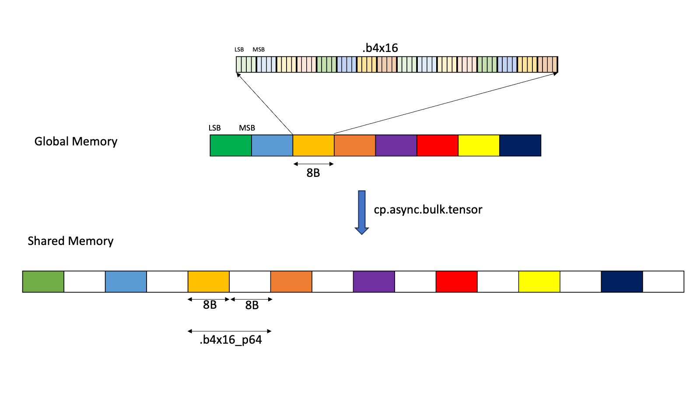

*PTX Figure 5：GMEM 中每 16 个 FP4 只占 8B；`cp.async.bulk.tensor` 写入 SMEM 时变成 8B data + 8B 未初始化 padding。白块不是从 HBM 读取的零。*

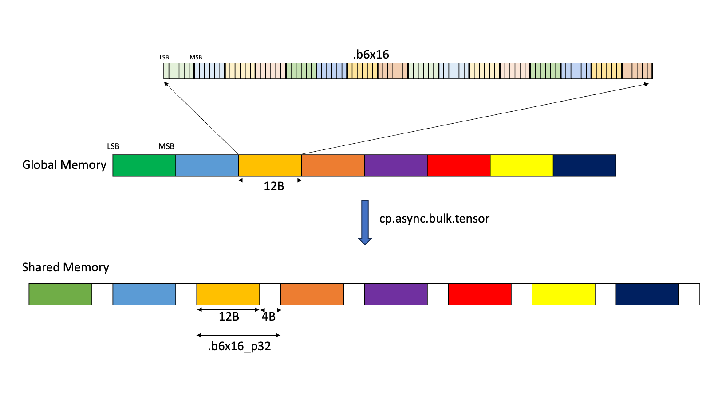

*PTX Figure 6：GMEM 中 16×6 bit = 12B；写入 SMEM 时追加 4B 未初始化 padding，凑成 16B feed row。*

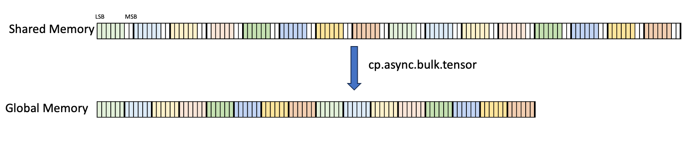

*PTX Figure 7：反方向写回时，每个 SMEM byte 的高 2 bit 被丢弃，只把低 6 bit 连续压到 GMEM。三图来源均为 PTX ISA 的 [Sub-byte Types / Padding and alignment](https://docs.nvidia.com/cuda/parallel-thread-execution/#padding-and-alignment-of-the-sub-byte-types)。*

这三图把最容易混淆的一点画死了：**checkpoint/HBM 可以是真正的 4/6 bit 紧凑流，而 Tensor Core 所需的 SMEM 行可以由 TMA 在搬运时扩成带 padding 的 128-bit 形态**；两边的物理字节数不必相同。

## 4. 量化数学：scale 粒度比 bit 数更重要

### 4.1 对称整数、非对称整数与浮点量化

对称整数常写成：

$$
s=\frac{\max_i |x_i|}{q_{\max}},\qquad
q_i=\operatorname{clip}\left(\operatorname{round}\left(\frac{x_i}{s}\right),q_{\min},q_{\max}\right),\qquad
\hat x_i=sq_i.
$$

非对称量化增加 zero-point $z$：

$$
q_i=\operatorname{clip}\left(\operatorname{round}\left(\frac{x_i}{s}\right)+z,q_{\min},q_{\max}\right),
\qquad \hat x_i=s(q_i-z).
$$

浮点量化一般不需要 integer zero-point：

$$
q_i=Q_F(x_i/s),\qquad \hat x_i=s\,q_i,
$$

其中 $Q_F$ 是到 E4M3、E2M1 等有限集合的 rounding 与 saturation。真正实现还必须明确：round-to-nearest-even 还是 stochastic rounding、NaN/Inf 如何处理、subnormal 是否 flush，以及 `amax=0` 时 scale 取什么。

### 4.2 granularity 与元数据成本

| 粒度 | scale 数量 | 优点 | 代价/风险 |
|---|---:|---|---|
| per-tensor | 1/tensor | 最便宜、kernel 简单 | outlier 支配全 tensor，低 bit 误差大 |
| per-row / per-column | $M$ 或 $N$ | 适合 GEMM 广播；权重 per-output-channel 常用 | epilogue/访存需对齐轴 |
| groupwise | 每 $G$ 个权重 1 个 | W4 常见，质量与开销折中 | group axis、K 排列和转置必须约定清楚 |
| microblock | 每 16/32 个元素 1 个 | FP4/FP6 可用性显著提升；硬件可融合 | scale layout、padding、搬运更复杂 |

若每组 $G$ 个 $b_q$-bit code 共用一个 $b_s$-bit scale 和 $b_z$-bit zero-point，忽略尾部 padding 后：

$$
b_{\text{effective}}=b_q+\frac{b_s+b_z}{G}.
$$

所以“4-bit 模型”通常不是严格 4.000 bit/weight。还要加 scale、zero-point、稀疏 metadata、对齐 padding，以及可能未量化的 embedding/norm/head。

### 4.3 先写清 scale 契约：同一个“scale”可能方向相反

低比特 API 中最危险的错误之一，是数值格式、shape 和 pointer 都正确，但把 quantization multiplier 当成 dequantization scale。不要只依赖变量名 `scale` / `inv_scale`，而应先写出它参与的公式。

| 契约 | 逻辑公式 | 常见存储 | 最容易犯的错 |
|---|---|---|---|
| dequant scale | $\hat x=s_d(q-z)$ | FP16/FP32、UE8M0、UE4M3 | 误传成 $1/s_d$ |
| quant multiplier | $q=Q(x\,s_q)+z$ | 常在 quantizer state 中 | 默认它和 $s_d$ 同向；通常 $s_q\approx1/s_d$ |
| local block scale | $\hat x_i=s_{\lfloor i/G\rfloor}p_i$ | 一个 byte 或 FP32/block | 弄错 block 轴、row/column 方向或 swizzle |
| global tensor scale | $\hat x=S_{\text{tensor}}s_b p$ | 1 个 FP32/tensor 或 row | 以为它和 local scale 一样都是 MMA scale matrix |
| output/requant scale | $q_D=Q(y\,s_{q,D})$ | epilogue 参数，可伴随 `amax` | 忽略 bias/activation 后的新范围 |

对 cuBLASLt 还要区分两个类型层次：矩阵 block-scale tensor 的元素可以是 `CUDA_R_8F_UE4M3` / `CUDA_R_8F_UE8M0`，而 matmul descriptor 里用于 $\alpha,\beta$ 等 scalar 的 scale type 可仍是 `CUDA_R_32F`。“局部 scale 的元素类型”与“标量计算类型”不是同一个概念。

最小单元测试应固定 `code=1`、`zero-point=0`，并检查恢复值是 $s_d$ 还是 $1/s_d$。这个测试无法验证 layout，但能在进入 GEMM 前排除整个 tensor 缩放方向反了的错误。

### 4.4 MX block scaling

[OCP Microscaling Formats (MX) 规范论文](https://arxiv.org/abs/2310.10537)定义一个 block 为共享 scale $X$ 与 $k$ 个低精度元素 $P_i$：

$$
v_i \approx X P_i.
$$

当前标准 MXFP8、MXFP6、MXFP4 都取 $k=32$，scale 为 UE8M0（只表达 2 的幂）：

| 格式 | 数据元素 | local scale | block | 理论有效位/元素 |
|---|---|---|---:|---:|
| MXFP8 | E4M3 或 E5M2 | UE8M0, 8 bit | 32 | $8+8/32=8.25$ |
| MXFP6 | E2M3 或 E3M2 | UE8M0, 8 bit | 32 | $6+8/32=6.25$ |
| MXFP4 | E2M1 | UE8M0, 8 bit | 32 | $4+8/32=4.25$ |

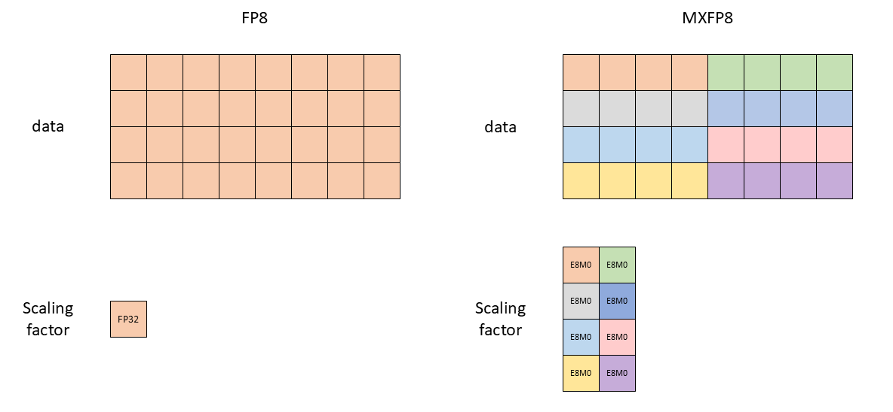

*官方原图：NVIDIA Technical Blog Figure 2，[FP8 and MXFP8 scaling factors](https://developer.nvidia.com/blog/floating-point-8-an-introduction-to-efficient-lower-precision-ai-training/)。图中为了可读性只画 4 个元素一组；真实 MX block 是 32 个连续元素共享一个 UE8M0。*

UE8M0 没有 fraction，有限 scale 是 $2^{e-127}$；code 255 表示 NaN。不同规范/库对“如何把连续的理想 scale 投影成 UE8M0”可以采用不同 policy，必须和结果可否允许顶端 saturation 一起阅读。

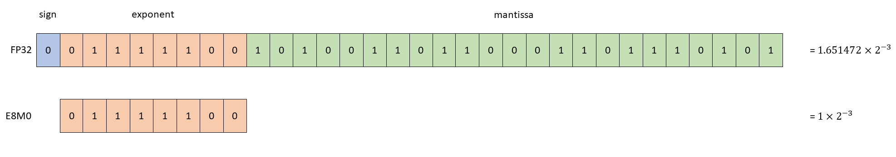

*官方原图：NVIDIA Transformer Engine，Figure 6，[Structure of E8M0](https://docs.nvidia.com/deeplearning/transformer-engine/user-guide/examples/fp8_primer.html#mxfp8-vs-fp8)。它没有 sign 和 mantissa，8 个 bit 全是 exponent，所以只能表示 2 的幂。*

OCP MX 风格的 shared-exponent 选择可以抽象为：

```text
amax       = max(abs(block))
shared_exp = floor(log2(amax)) - emax_of_element_format
scale      = 2 ** shared_exp
q[i]       = saturating_round_to_format(x[i] / scale)
```

这里 `emax_of_element_format` 是元素格式的最大无偏 exponent，不是“最大有限数”。这种 floor-style policy 可能让 block 顶端值被 saturate，不能当成所有 NVIDIA 库的实际算法。

Transformer Engine 2.16 的 MXFP8 采用不溢出的 round-up 思路：先计算 `amax / 448`，再把它转成 UE8M0；若 FP32 mantissa 非零，exponent 向上调整。忽略特殊值时可写成：

$$
s_{\text{TE}}=2^{\left\lceil\log_2\left(\frac{\operatorname{amax}}{x_{\max}}\right)\right\rceil},
\qquad x_{\max}=448\ \text{for E4M3}.
$$

例如 E4M3 block 的 `amax=500`，floor-style 示意式可能取 `scale=1` 并依赖 saturation，而 round-up policy 取 `scale=2`，使 $500/2=250$ 不超过 448。真实实现还要定义 `amax=0`、NaN/Inf、exponent 上下界和 rounding mode。

重要的是 scale 轴：对 $A_{M\times K}$ 往往沿 K 分块，对 $B_{K\times N}$ 也沿 K 分块。先量化再转置与先转置再量化一般不交换，因为 block 成员变了。Transformer Engine 的 [MXFP8 文档](https://docs.nvidia.com/deeplearning/transformer-engine/user-guide/features/low_precision_training/mxfp8/mxfp8.html) 还要求 rowwise 与 columnwise 表示从高精度源分别量化，而不是对已量化 tensor 直接转置。

### 4.5 NVFP4：更小 block、更精细 scale、两级缩放

NVFP4 的逻辑值可写成：

$$
\hat x_i=S_{\text{tensor}}\;s_{\lfloor i/16\rfloor}\;p_i,
$$

其中 $p_i$ 是 E2M1，16 个元素共享一个 UE4M3 local scale，整个 tensor 另有一个 FP32 scale。UE4M3 是无符号 E4M3 magnitude，PTX 用 `.b8` 承载并要求最高 bit 为 0；cuBLASLt 的 UE4M3 路径忽略 sign bit。

| 属性 | MXFP4 | NVFP4 |
|---|---|---|
| data | E2M1 | E2M1 |
| local block | 32 | 16 |
| local scale | UE8M0，只含 exponent | UE4M3，含 3-bit fraction |
| global scale | 无 | tensor-wide FP32 |
| local 元数据后有效位 | 4.25 bit/value | 4.5 bit/value（不计摊薄后的 1 个 FP32） |
| 典型质量 | metadata 少 | scale 更细、block 更小，通常误差更低 |

两级 scaling 的意义是：UE4M3 local scale 有 mantissa，能更精确地拟合每个 16-value block；tensor-wide FP32 scale 则补回 local scale 自身有限的全局动态范围。参见 NVIDIA 的 [NVFP4 介绍](https://developer.nvidia.com/blog/introducing-nvfp4-for-efficient-and-accurate-low-precision-inference/)与 [Transformer Engine NVFP4 文档](https://docs.nvidia.com/deeplearning/transformer-engine/user-guide/features/low_precision_training/nvfp4/nvfp4.html)。

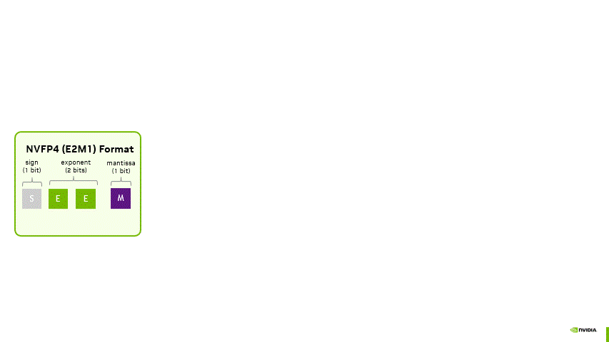

*官方动画：NVIDIA NVFP4 blog Figure 2，[two-level scaling](https://developer.nvidia.com/blog/introducing-nvfp4-for-efficient-and-accurate-low-precision-inference/)。这里 blog 写 E4M3；映射到 PTX scale operand 时是去掉 sign、最高位补 0 的 UE4M3 byte container。*

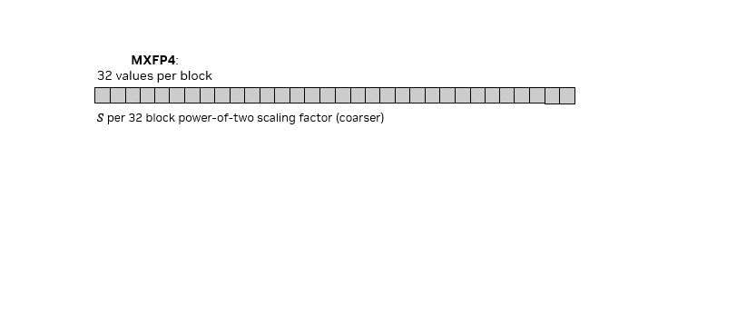

*官方动画：同一博客 Figure 5。上半是 32 个 E2M1 共用一个 UE8M0 scale；下半是每 16 个 E2M1 共用一个更细的 UE4M3 scale。*

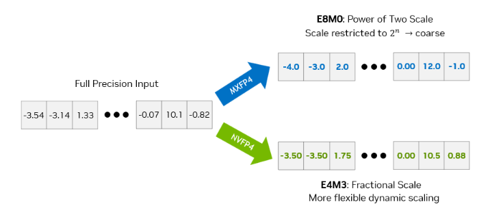

*官方原图：同一博客 Figure 3。它说明 NVFP4 的优势不只是 block 从 32 缩到 16：local scale 自身从只能取 $2^n$ 的 UE8M0 变成带 fraction 的 UE4M3，也减少了 scale 的量化误差。*

#### 4.5.1 从格式到训练 recipe：不是所有 tensor 都做同一种 block-16

Transformer Engine 2.16 的 NVFP4 训练 recipe 不只是“把每 16 个值压成 E2M1”。它会根据 tensor 在 forward/backward GEMM 中的用途选择不同缩放与数值稳定策略：

| tensor/用途 | local scaling | 额外策略 | 原因 |
|---|---|---|---|
| activation | 默认 1D，每 16 个连续值 | rowwise/columnwise 需按用途生成 | 保留更细粒度，适配 forward/dgrad/wgrad |
| gradient | 默认 1D block-16 | stochastic rounding | 降低低比特梯度的系统性舍入偏差 |
| weight | 默认 2D $16\times16$ | 可通过 recipe 选项改成 1D | 让 rowwise/columnwise 视图共享同一个二维 block 语义，提高训练稳定性 |
| WGRAD 的列向 input/gradient | 1D block-16 | BF16 Random Hadamard Transform，tile $d=16$ | 在不改变点积的前提下平滑 outlier |

stochastic rounding 在两个相邻 E2M1 值之间按距离概率选择，使舍入在期望上无偏；Transformer Engine 默认将它用于 NVFP4 gradient。RHT 则对参与 WGRAD 的两个操作数施加可相消的正交变换：

$$
C=(AH)(H^T B)=AB,
\qquad H H^T=I.
$$

这样可以在不改变 GEMM 数学结果的情况下，先把不利于 FP4 表示的尖峰分布旋转得更平滑。它是 NVFP4 训练 recipe 的数值策略，不是 E2M1 bit encoding 本身的一部分。

#### 4.5.2 local scale 进 MMA，global scale 不必是 scale matrix

在 Blackwell block-scaled MMA 中，与 K block 对齐的 UE4M3 local scales 是 SFA/SFB scale matrix 的数值。NVFP4 的 tensor-wide FP32 global scale 是更高一层的量化契约，通常折入 matmul scalar、与对侧 global scale 合并，或在 epilogue 中应用。因此“NVFP4 两级 scale”不等于“两级 scale 都作为 `tcgen05.mma` 的 TMEM scale matrix”。

分布式训练中，local block scales 只描述本 block，通常不需要跨 rank 同步；但需要在 all-gather 后保持同一全局语义的 NVFP4 tensor，必须在量化前通过 global amax reduction 得到共享的 FP32 global scale。详细规则见 Transformer Engine 2.16 的 [NVFP4 文档](https://docs.nvidia.com/deeplearning/transformer-engine/user-guide/features/low_precision_training/nvfp4/nvfp4.html)。

### 4.6 Transformer Engine 的 FP8/NVFP4 recipes 不只是 current 与 delayed

仅用“per-tensor 或 block scale”不足以区分 Transformer Engine 2.16 的低精度 recipe。下表的 block shape 写的是 recipe 逻辑粒度，不是 Tensor Core instruction tile：

| recipe | data | scale 与粒度 | 主要交换 | 典型设备 |
|---|---|---|---|---|
| FP8 Current | E4M3 或 Hybrid | 当前 `amax`，tensor-wide FP32 | 对当前分布响应快，但统计与 cast 难以完全隐藏 | Ada/Hopper/Blackwell |
| FP8 Delayed | E4M3 或 Hybrid | 历史 `amax`，tensor-wide FP32 | 更容易融合，但对分布突变滞后 | Ada/Hopper/Blackwell |
| FP8 Blockwise | E4M3 或 Hybrid | activation/gradient 默认 $1\times128$，weight 默认 $128\times128$；FP32 scale | 比 per-tensor 抗 outlier，但 row/column、padding 和通信 layout 更复杂 | Hopper；Blackwell 以 MXFP8 模拟，官方优先推荐 MXFP8 |
| MXFP8 | E4M3（可 Hybrid） | $1\times32$ / $32\times1$，UE8M0 | 原生 block-scale 与紧凑 metadata，row/column 必须分别量化 | Blackwell SM100/SM103 |
| NVFP4 | E2M1 | activation/gradient 1D block-16，weight 默认 $16\times16$；E4M3 local＋FP32 global | 最低流量与更高量化难度，依赖 SR/RHT 等稳定策略 | Blackwell |

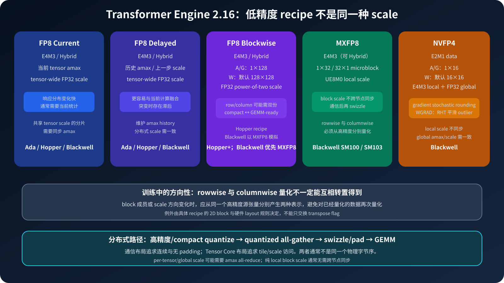

*本文根据 Transformer Engine 2.16 文档绘制。上半区分数值和 scale recipe，下半强调“通信友好 compact layout”与“Tensor Core 友好 swizzled layout”不应混为同一个物理表示。*

#### 4.6.1 rowwise/columnwise 和分布式通信

在训练中，同一个 input、weight 或 output gradient 可能分别作为某个 GEMM 的行向与列向 operand。对一维 block scaling，这两个方向包含的 block 成员不同，因此 codes 和 scales 也不同；应从高精度源生成两份表示，不应对已量化数据做转置后再量化。

通信和 GEMM 还会需要两种 layout：

1. **compact communication layout** 按逻辑顺序保存 data/scales，避免把 hardware padding 一起发送；
2. **GEMM-ready layout** 根据 128×4 scale tile、transpose 与硬件访存规则做 swizzle/pad。

因此常见的分布式路径是 `quantize to compact → quantized all-gather → swizzle/pad → GEMM`；没有通信时，quantize 与 swizzle 才更容易融合。MXFP8 的 local block scale 无需跨节点同步，FP8 current/delayed 的共享 tensor scale 以及 NVFP4 global scale 则可能需要先同步 `amax`。

对应的官方入口是 [FP8 current scaling](https://docs.nvidia.com/deeplearning/transformer-engine/user-guide/features/low_precision_training/fp8_current_scaling/fp8_current_scaling.html)、[FP8 delayed scaling](https://docs.nvidia.com/deeplearning/transformer-engine/user-guide/features/low_precision_training/fp8_delayed_scaling/fp8_delayed_scaling.html)、[FP8 blockwise scaling](https://docs.nvidia.com/deeplearning/transformer-engine/user-guide/features/low_precision_training/fp8_blockwise_scaling/fp8_blockwise_scaling.html)、[MXFP8](https://docs.nvidia.com/deeplearning/transformer-engine/user-guide/features/low_precision_training/mxfp8/mxfp8.html) 和 [NVFP4](https://docs.nvidia.com/deeplearning/transformer-engine/user-guide/features/low_precision_training/nvfp4/nvfp4.html)。

### 4.7 端到端手算：同一个 tensor 如何变成 INT4 与 NVFP4 bytes

下面的例子故意选择可精确表示的 FP16/FP32/UE4M3 scales，因此误差只来自 4-bit data code rounding。它验证逻辑量化和紧凑 nibble stream，**不声称这就是某个 cuBLASLt/CUTLASS kernel 的 swizzled 物理 layout，也不是 GPU 性能实测**。

定义 16-value 模板：

```text
z = [-6, -5, -4, -3, -2, -1.5, -1, -0.5,
      0, 0.25, 0.5, 1, 1.5, 2.5, 4, 6]

x = (7/8) z || (7/16) z
```

张量 $x$ 有 32 个值，分成两个 16-value block；第二个 block 正好是第一个的一半。统一约定 round-to-nearest, ties-to-even，每个 byte 中先出现的元素放低 nibble。

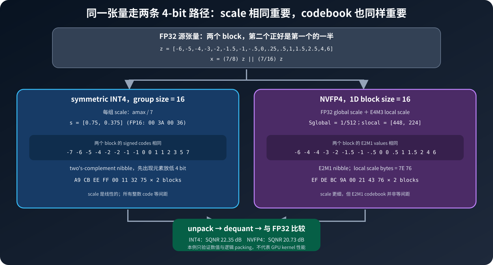

*本文绘制。两条路径读取同一高精度 tensor，但 scale 体系、codebook 与 metadata 都不同；不能用“都是 4 bit”预测误差。*

#### 4.7.1 symmetric INT4：线性 code 与 group scale

对每个 16-value group 使用 signed symmetric INT4，$q_{\max}=7$：

$$
s_g=\frac{\operatorname{amax}_g}{7},\qquad
q_i=\operatorname{clip}\left(\operatorname{round}\left(\frac{x_i}{s_g}\right),-7,7\right).
$$

两组 `amax` 分别为 5.25 和 2.625，所以：

$$
s_0=0.75,\qquad s_1=0.375.
$$

它们的 FP16 bits 分别为 `0x3A00` 和 `0x3600`，little-endian scale bytes 为 `00 3A 00 36`。两组的整数 code 相同：

```text
signed q:  -7 -6 -5 -4 -2 -2 -1 -1  0 0 1 1 2 3 5 7
nibbles:    9  A  B  C  E  E  F  F  0 0 1 1 2 3 5 7
bytes:     A9 CB EE FF 00 11 32 75
```

完整 32-value data stream 是这 8 bytes 重复两次，共 16 bytes；再加两个 FP16 scales，逻辑容量为 20 bytes，即 5 bit/value。

#### 4.7.2 NVFP4：FP32 global × E4M3 local × E2M1 code

全 tensor 的 `amax` 是 5.25，按 Transformer Engine 文档中的两级缩放：

$$
S_{\text{global}}
=\frac{5.25}{448\times6}
=\frac{1}{512}
=0.001953125.
$$

它的 FP32 bits 是 `0x3B000000`，little-endian bytes 为 `00 00 00 3B`。两个 local E4M3 scales 为：

$$
s_0=\frac{5.25/6}{1/512}=448,\qquad
s_1=\frac{2.625/6}{1/512}=224.
$$

它们都可精确表示，对应 UE4M3 bytes `7E 76`。两个 block 的有效 dequant scale 分别是 $7/8$ 与 $7/16$，因此归一化后都量化同一个 $z$：

```text
E2M1 value: -6 -4 -4 -3 -2 -1.5 -1 -0.5  0 0 0.5 1 1.5 2 4 6
nibbles:     F  E  E  D  C   B   A   9   0 0  1  2  3  4 6 7
bytes:      EF DE BC 9A 00 21 43 76
```

数据为 16 bytes，local scales 为 2 bytes，global scale 为 4 bytes，在这个极小 tensor 上共 22 bytes。对含 $N$ 个元素的大 tensor：

$$
b_{\text{effective}}
=4+\frac{8}{16}+\frac{32}{N}
=4.5+\frac{32}{N},
$$

所以 global FP32 scale 摊薄后趋近 4.5 bit/value。这个数字仍未计入 hardware scale-layout padding。

#### 4.7.3 第一个 block 的逐项恢复

| $i$ | $x_i$ | INT4 $q_i$ | INT4 $\hat x_i$ | INT4 error | E2M1 code/value | NVFP4 $\hat x_i$ | NVFP4 error |
|---:|---:|---:|---:|---:|---:|---:|---:|
| 0 | -5.25 | -7 | -5.25 | 0 | `0xF` / -6 | -5.25 | 0 |
| 1 | -4.375 | -6 | -4.5 | -0.125 | `0xE` / -4 | -3.5 | +0.875 |
| 2 | -3.5 | -5 | -3.75 | -0.25 | `0xE` / -4 | -3.5 | 0 |
| 3 | -2.625 | -4 | -3 | -0.375 | `0xD` / -3 | -2.625 | 0 |
| 4 | -1.75 | -2 | -1.5 | +0.25 | `0xC` / -2 | -1.75 | 0 |
| 5 | -1.3125 | -2 | -1.5 | -0.1875 | `0xB` / -1.5 | -1.3125 | 0 |
| 6 | -0.875 | -1 | -0.75 | +0.125 | `0xA` / -1 | -0.875 | 0 |
| 7 | -0.4375 | -1 | -0.75 | -0.3125 | `0x9` / -0.5 | -0.4375 | 0 |
| 8 | 0 | 0 | 0 | 0 | `0x0` / 0 | 0 | 0 |
| 9 | 0.21875 | 0 | 0 | -0.21875 | `0x0` / 0 | 0 | -0.21875 |
| 10 | 0.4375 | 1 | 0.75 | +0.3125 | `0x1` / 0.5 | 0.4375 | 0 |
| 11 | 0.875 | 1 | 0.75 | -0.125 | `0x2` / 1 | 0.875 | 0 |
| 12 | 1.3125 | 2 | 1.5 | +0.1875 | `0x3` / 1.5 | 1.3125 | 0 |
| 13 | 2.1875 | 3 | 2.25 | +0.0625 | `0x4` / 2 | 1.75 | -0.4375 |
| 14 | 3.5 | 5 | 3.75 | +0.25 | `0x6` / 4 | 3.5 | 0 |
| 15 | 5.25 | 7 | 5.25 | 0 | `0x7` / 6 | 5.25 | 0 |

第二个 block 的输入、恢复值和误差均为第一组的一半，codes 完全相同。全部 32 个值的 CPU 复验结果为：

| 格式 | MAE | RMSE | max error | SQNR |
|---|---:|---:|---:|---:|
| symmetric INT4 | 0.130371094 | 0.164457300 | 0.375 | 22.3488 dB |
| NVFP4 | 0.071777344 | 0.198124291 | 0.875 | 20.7311 dB |

这个结果故意保留了一个反直觉现象：NVFP4 的 MAE 更低，但 RMSE 和最大误差更高。归一化后的 `-5` 位于 E2M1 的 `-4` 与 `-6` 中点，ties-to-even 选到 `-4`，产生一个较大局部误差。格式优劣不能只由 bit 数或单一误差指标决定。

## 5. 四条完全不同的低比特 GEMM 数据流

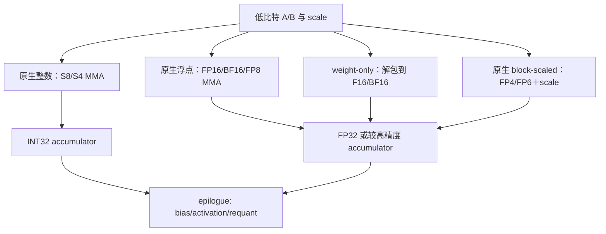

### 5.1 INT8 / INT4 native integer MMA

数据是整数 code，Tensor Core 做整数点积，累加到 INT32。scale 通常在 MMA 外应用：

$$
AB \approx (s_A s_B)(Q_A Q_B).
$$

若 $s_A$ 按行、$s_B$ 按列，二者可以在输出 epilogue 广播。非对称量化还会产生与 row/column sums 相关的 zero-point 修正，kernel 更复杂。

### 5.2 FP16 / BF16 / FP8 native floating MMA

MMA 直接解释浮点 code。FP8 仍需要把原始 tensor 缩放进格式范围，但 Hopper WGMMA 指令里的 `scale-a/scale-b` immediate 不是任意 FP32 quantization scale；真实 tensor scale 往往在输入 cast 或输出/后续算子中处理。

### 5.3 W4A16 weight-only

典型流水是：

```text
packed INT4/NF4 weights in HBM
  -> 64/128-bit coalesced load
  -> nibble extract / sign extend / codebook lookup
  -> multiply group scale, convert to FP16/BF16 in registers
  -> FP16/BF16 Tensor Core MMA with FP16/BF16 activations
  -> FP32 accumulate
```

这里的收益主要来自少读权重；代价是位操作、convert、scale load 和额外寄存器。NVIDIA TensorRT-LLM 也将 [W4A16/W8A16](https://nvidia.github.io/TensorRT-LLM/reference/precision.html)描述为权重量化、运行时反量化、激活保持 FP16/BF16。

### 5.4 Blackwell native FP4/FP6 block-scaled MMA

低比特 A/B 和 scale matrix 都是硬件 MMA 的输入，scale 应用与 Tensor Core 计算融合。它不需要把整个 tile 先展开为 BF16，因此既能省带宽，也能使用窄精度 Tensor Core 的峰值吞吐。这才是“native FP4/FP6 compute”。

## 6. 16 bit：FP16、BF16 与累加精度

### 6.1 怎么选

- 训练首选 BF16 的常见原因是它和 FP32 共享 exponent 范围，loss scale/overflow 压力小；
- FP16 在同样 16 bit 下多 3 个 fraction bit，值处在安全范围时相对误差更小；
- 推理中若权重/激活范围受控，FP16 与 BF16 的选择经常由已有 checkpoint、融合 kernel 和硬件吞吐决定；
- 无论输入是 FP16 还是 BF16，GEMM 通常都应选 FP32 accumulator。将 accumulator 降到 FP16/BF16 会显著增加长 K reduction 的舍入误差。

### 6.2 Warp MMA 例子

下面是 PTX 的典型 warp-level 形式；每个 brace 中寄存器数量由 fragment shape/type 决定：

```ptx
// D = A(FP16) * B(FP16) + C(FP32), shape m16n8k16
mma.sync.aligned.m16n8k16.row.col.f32.f16.f16.f32
  {d0, d1, d2, d3},
  {a0, a1, a2, a3},
  {b0, b1},
  {c0, c1, c2, c3};

// BF16 输入、FP32 累加；BF16 fragments 仍由 bit registers 承载。
mma.sync.aligned.m16n8k16.row.col.f32.bf16.bf16.f32
  {d0, d1, d2, d3},
  {a0, a1, a2, a3},
  {b0, b1},
  {c0, c1, c2, c3};
```

代码摘取的是 [PTX `mma` 语法](https://docs.nvidia.com/cuda/parallel-thread-execution/#warp-level-matrix-instructions-mma)的最小形式。真正 inline PTX 还需让 32 个 lane 按官方 fragment table 提供对应元素；不能把每个线程的普通 row-major 连续片段直接塞进寄存器。

## 7. 8 bit：INT8 与 FP8 是两套体系

### 7.1 INT8

INT8 是 affine quantization 的成熟路径。Ampere 风格 warp MMA 示例：

```ptx
// signed INT8 × signed INT8 -> INT32 accumulator
mma.sync.aligned.m16n8k32.row.col.s32.s8.s8.s32
  {d0, d1, d2, d3},
  {a0, a1, a2, a3},
  {b0, b1},
  {c0, c1, c2, c3};
```

一个 `.b32` source register 可装 4 个 INT8。最终实数输出常在 epilogue 中计算：

$$
D_{ij}=s_{A,i}s_{B,j}\,D^{(\mathrm{int32})}_{ij}+\text{bias}_j,
$$

然后转 FP16/BF16，或用 output scale 再量化为 INT8。若 A/B 有非零 zero-point，则还要修正 $z_A\sum B$、$z_B\sum A$ 与 $Kz_Az_B$，这也是大多数高性能 LLM INT8 路径偏好对称量化的原因之一。

### 7.2 FP8 E4M3 与 E5M2

FP8 的关键不是“有没有小数”，而是 exponent/fraction 的预算：

- E4M3：1 附近约 3-bit fraction 精度，最大 448；适合量化后范围可控且精度敏感的权重/激活；
- E5M2：少 1 个 fraction bit，最大 57,344；对梯度尖峰、范围不稳定 tensor 更宽容；
- 两者都应配合 scale；所谓 FP8 tensor 事实上通常是 `{FP8 codes, scale state, amax history}`。

[FP8 formats 论文](https://arxiv.org/abs/2209.05433)解释了 E4M3/E5M2 的设计选择。Transformer Engine 的常见 hybrid recipe 是前向 E4M3、反向梯度 E5M2，但框架可针对不同 tensor 覆盖。

### 7.3 Ada warp MMA 与 Hopper WGMMA

Ada SM89 提供 FP8 warp MMA；Hopper SM90a 的主力是 128-thread warpgroup 异步 WGMMA。下面是 PTX 文档中的最小化 FP8 WGMMA 形态：

```ptx
// 128 threads cooperatively issue one m64n8k32 operation.
// A/B live in shared memory and are addressed by matrix descriptors.
wgmma.fence.sync.aligned;
wgmma.mma_async.sync.aligned.m64n8k32.f32.e5m2.e4m3
  {d0, d1, d2, d3}, desc_a, desc_b, use_d, -1, -1;
wgmma.commit_group.sync.aligned;
wgmma.wait_group.sync.aligned 0;
```

这里最后两个 immediate 只提供 WGMMA 定义的有限 input sign/scale 选项，不能替代任意 per-tensor/per-channel quant scale。`desc_a/desc_b` 还编码 SMEM 地址、leading/stride offset 与 swizzle；手写 descriptor 时最容易在 16-byte 单位和 swizzle base 上出错。

一个反直觉的精度点：对 FP8 输入，即使 destination type 写 `.f32`，PTX 的 [`wgmma.mma_async` 章节](https://docs.nvidia.com/cuda/parallel-thread-execution/#asynchronous-warpgroup-level-matrix-instructions-wgmma-mma)仍明确提示，Hopper 当前实现的内部 accumulation 精度高于 FP16、但低于完整 FP32。`.f32` 说明 accumulator 寄存器接口和输出类型，不应被理解为每一步 reduction 都严格 IEEE FP32 rounding。

## 8. 6 bit：FP6 是 Blackwell 窄浮点，不是“删两位的 FP8”

### 8.1 E2M3 与 E3M2

E2M3 的 precision 多一位、最大值只有 7.5；E3M2 最大值 28，但 1 附近 ULP 是 0.25。两者都没有 Inf/NaN。选型逻辑与 E4M3/E5M2 类似：

- block 内值域紧、希望多一点有效数字：E2M3；
- block 内范围更大、outlier 更明显：E3M2；
- 无论哪个，通常都与 UE8M0 block-32 scale 组成 MXFP6，而不是裸格式长期贯穿网络。

### 8.2 存储路径

连续 FP6 codes 可理论上每 4 个打包成 24 bit。对 $N$ 个元素，紧凑字节数是 `ceil(6*N/8)`。但是：

- CUDA scalar `__nv_fp6_storage_t` 是 1 byte；
- CUDA x2/x4 wrapper 分别是 2/4 bytes；
- CUTLASS tensor array 可以保持 6 bit/element 的紧凑 GMEM；
- mixed F8/F6/F4 MMA feed path 常把每个 FP6 放入一个 8-bit lane 的低 6 bit；
- `ldmatrix ... b6x16_p32` 负责从带 padding 的 SMEM row 形成该 lane 形态。

这解释了为什么 profiler 中“FP6 tile 的 shared-memory footprint”可能不等于 `M*K*6/8`。

### 8.3 软件栈现状

截至 cuBLAS 13.3，公开的 `cudaDataType_t` / cuBLASLt narrow datatype 中有 E4M3、E5M2、E2M1 与相应 scale type，但没有对称的 public `CUDA_R_6F_E2M3/E3M2` GEMM 类型。FP6 的原生公开路径主要在 PTX `tcgen05` 和 CUTLASS narrow-precision templates；这不是说硬件不支持，而是说不要假定“有 PTX 类型就一定有 cuBLASLt 一行 API”。可核对 [cuBLAS data types 与 scaling modes](https://docs.nvidia.com/cuda/cublas/index.html#data-types-reference)。

SM120 warp MMA 的无 block-scale mixed-FP 示例把 A 解释为 E3M2、B 解释为 E2M3：

```ptx
.reg .b32 a<4>, b<2>;
.reg .f32 c<4>, d<4>;

mma.sync.aligned.m16n8k32.row.col.kind::f8f6f4.f32.e3m2.e2m3.f32
  {d0, d1, d2, d3},
  {a0, a1, a2, a3},
  {b0, b1},
  {c0, c1, c2, c3};
```

这里 `.b32` 仍是容器；每个 FP6 element 在 mixed kind fragment 中占一个 padded 8-bit lane。该形态来自 PTX 9.3 `mma` examples，目标支持需按其 target note 使用 SM120 family，不能在 Ampere/Hopper 上仅靠升级 PTX version 获得硬件支持。

## 9. 4 bit：先辨认你说的是哪一种 4 bit

### 9.1 原生 INT4 MMA

Turing 引入 s4/u4 Tensor Core MMA，Ampere 提供更大的 m16n8k64 形态。例如：

```ptx
// 4-bit two's-complement integers, K=64, INT32 accumulate.
mma.sync.aligned.m16n8k64.row.col.s32.s4.s4.s32
  {d0, d1, d2, d3},
  {a0, a1, a2, a3},
  {b0, b1},
  {c0, c1, c2, c3};
```

每个 `.b32` source register 打包 8 个 nibble。指令要求 A 和 B **都已经是** s4/u4，且累加结果是整数。它适合 A4W4 一类对称整数计算，但不能直接消费 BF16 activation，因此不是 W4A16 的实现。

Hopper 仍能执行继承的 warp `mma.sync` INT4 形态，但新的 WGMMA type menu 没有 s4/u4。于是 Hopper 上高性能 LLM W4A16 通常采用寄存器内反量化，再做 BF16/FP16 WGMMA。

### 9.2 Hopper W4A16：存储压缩，不是 4-bit Tensor Core

CUTLASS 的 [Hopper mixed-dtype INT4×BF16 example](https://github.com/NVIDIA/cutlass/blob/main/examples/55_hopper_mixed_dtype_gemm/55_hopper_int4_bf16_gemm.cu)展示了这条路径：窄权重进入 register file，按 group scale 转成 BF16，再参与 WGMMA。该示例还把权重离线 shuffle，使一个线程需要的 16 个 INT4 连续，从而一次 64-bit load 取齐；nibble 预排成类似 `[0,2,4,6,1,3,5,7]` 的顺序，以便并行 extract/convert。

这种 kernel 的主要工程约束是：

- K 方向 group scale 必须和线程 fragment 的权重一致；
- packed 权重 layout 通常不是普通 row-major，需要离线预处理；
- packed registers、expanded BF16 registers、scale 和 accumulator 同时存在，寄存器压力高；
- 小 $M$ decode 主要省带宽，大 $M$ 时反量化和 BF16 MMA 峰值可能成为上限；
- NF4 比 INT4 多一个 codebook lookup，不能直接套 s4 位解码。

### 9.3 MXFP4 与 NVFP4：原生浮点 4 bit

两者的数据 code 都是 E2M1，但 scale 体系不同。Blackwell Tensor Core 能在 MMA 内应用 scale，输出通常 FP32 accumulate。与 W4A16 相比：

| 项目 | W4A16 | MXFP4 / NVFP4 native |
|---|---|---|
| 激活 | FP16/BF16 | E2M1 block-scaled |
| 权重读流量 | 4 bit + scale | 4 bit + scale |
| MMA 前展开 | 权重要展开到 F16/BF16 | 不展开整个 tile |
| Tensor Core 乘法输入 | F16/BF16 | FP4 |
| 主要平台 | 多代 GPU 可实现 | Blackwell 窄精度路径 |
| 质量策略 | 权重 groupwise、激活不量化 | 权重与激活都需校准/训练 recipe |

### 9.4 NF4、GPTQ、AWQ 是算法层，不是 PTX type

- [GPTQ](https://arxiv.org/abs/2210.17323)用近似二阶信息逐列/逐块修正 weight-only PTQ 误差；
- [AWQ](https://arxiv.org/abs/2306.00978)借助 activation statistics 保护少量 salient weight channels，并通过缩放改善量化；
- [QLoRA/NF4](https://arxiv.org/abs/2305.14314)用 16 项非均匀码本与 double quantization 降低微调显存；
- 它们决定“code 怎样得到、scale 怎样得到”，但 kernel 最后仍须映射到 INT4 unpack、codebook dequant 或 FP16/BF16 MMA。论文里的 4 bit 精度与硬件的 E2M1 FP4 不是同义词。

## 10. NVIDIA 架构与指令路径总表

| 架构 | 代表 SM | 关键矩阵指令 | 低比特重点 | 容易误判之处 |
|---|---:|---|---|---|
| Volta | SM70 | warp `wmma`/`mma` | FP16 Tensor Core | 还没有 BF16/TF32/FP8 |
| Turing | SM75 | warp `mma.sync` | FP16、INT8、INT4、binary | INT4 是双低比特整数，不是 W4A16 |
| Ampere | SM80/86 | warp `mma.sync`、async copy | BF16、TF32、INT8/INT4，更大 shape | 没有原生 FP8 Tensor Core |
| Ada | SM89 | warp `mma.sync` | FP8 E4M3/E5M2 | FP8 scale 仍主要在 MMA 外管理 |
| Hopper | SM90a | warpgroup `wgmma.mma_async` | FP16/BF16/TF32/FP8/INT8 | WGMMA 没有 INT4；W4A16 走 mixed-dtype dequant |
| Blackwell 数据中心 | SM100a/103a | `tcgen05.mma`、TMEM | FP8/FP6/FP4、MX、NVFP4、INT8 | A/B/scale/D 涉及 descriptor 与 TMEM，不是传统 per-lane fragment |
| Blackwell DRIVE Thor | SM110a（CUDA 13.0 前称 SM101） | `tcgen05.mma`、TMEM | Blackwell 5th-gen Tensor Core 路径 | 产品为车载/嵌入式，不应从 SM100 产品名直接推导库覆盖 |
| Blackwell GeForce | SM120a | 扩展 warp `mma.sync` | FP8/FP6/FP4 与 block scaling | 不是 `tcgen05` kernel；CUTLASS 窄精度主要有 TN、cluster 1×1×1 等限制 |
| Blackwell DGX Spark / GB10 | SM121a | 扩展 warp `mma.sync` family | FP8/FP6/FP4 与 block scaling | 不要把 GeForce SM120 的每一条调度/产品限制未经核对地外推到 SM121 |

PTX target requirements 应以 [PTX ISA 9.3 的 architecture-specific instructions](https://docs.nvidia.com/cuda/parallel-thread-execution/#release-notes)及各指令 target notes 为准；CUTLASS 对 Blackwell 的差异总结见 [Blackwell functionality](https://docs.nvidia.com/cutlass/latest/media/docs/cpp/blackwell_functionality.html)。

### 10.1 为什么 `tcgen05` 与 SM120/121 warp MMA 必须分开写

SM100/103/110 的 `tcgen05` 是单线程 issue、CTA 协作的异步 Tensor Core 接口。A/B 由 SMEM descriptors（某些形态 A 也可来自 TMEM）描述，D 在 TMEM，block-scale matrices 也在 TMEM。SM120/121 的 narrow path 则仍围绕 warp MMA fragments。CUTLASS 对 GeForce SM120 的当前文档要求窄精度主要使用 TN（A row-major、B column-major）、cluster shape 1×1×1，且没有 SM100 式 multicast 路径；SM121 的库支持与调度限制应按具体 CUTLASS 版本另行核对。

因此以下内容都不能直接复用：

- collective mainloop 类型与 operator class；
- scale factor layout/copy；
- accumulator 所在地址空间；
- thread/warp/CTA ownership；
- tile 与 cluster shape；
- 编译 target（`sm_100a` / `sm_103a` / `sm_110a` 与 `sm_120a` / `sm_121a`）。

### 10.2 SM120 的 NVFP4 block-scaled warp MMA 长什么样

PTX 9.3 的官方 `mma` example 展示了寄存器 fragment 与 scale operand；这与下一节 SM100 的 TMEM interface 形成直接对照：

```ptx
.reg .b32 a<4>, b<2>;
.reg .f32 c<4>, d<4>;
.reg .b32 scale_a_data, scale_b_data;
.reg .u16 bid_a, tid_a, bid_b, tid_b;

mma.sync.aligned.m16n8k64.row.col
  .kind::mxf4nvf4.block_scale.scale_vec::4X
  .f32.e2m1.e2m1.f32.ue4m3
  {d0, d1, d2, d3},
  {a0, a1, a2, a3},
  {b0, b1},
  {c0, c1, c2, c3},
  scale_a_data, {bid_a, tid_a},
  scale_b_data, {bid_b, tid_b};
```

- `scale_vec::4X` 与 UE4M3 对应该 instruction tile 的 block16 NVFP4；
- `bid/tid` 选择 scale block/thread group，scale data 在普通寄存器 operand 中；
- A/B fragments 也在 warp registers 中，D 是每线程 FP32 registers；
- 对比 SM100：后者把 D 与 scale matrices 放 TMEM，用 descriptor/`idesc` 发起 `tcgen05.mma`。

这段是完整 instruction invocation，仍不是完整 kernel：A/B/scale fragment 的 lane mapping、`ldmatrix`、SMEM layout 和同步要按同一 PTX section 的 tables 实现。

## 11. PTX 深挖：SM100 `tcgen05.mma` 与 block-scale matrix

### 11.1 数学语义

对 scale vector size $SV\in\{16,32\}$，逻辑上：

$$
D_{ij}=C_{ij}+\sum_k
\left(A_{ik}\,S^A_{i,\lfloor k/SV\rfloor}\right)
\left(B_{kj}\,S^B_{\lfloor k/SV\rfloor,j}\right).
$$

这不是先把完整 $A,B$ 反量化写回 SMEM，而是 Tensor Core 在 reduction 中按 K block 应用 scale。


*PTX ISA 9.3 Figure 230，[`tcgen05.mma` block scaling](https://docs.nvidia.com/cuda/parallel-thread-execution/#block-scaling-for-tcgen05-mma)。图中 A 按行沿 K 分块、B 按列沿 K 分块；SFA/SFB 都跟 reduction block 对齐，而不是跟输出 D 的二维 tile 一一对应。*

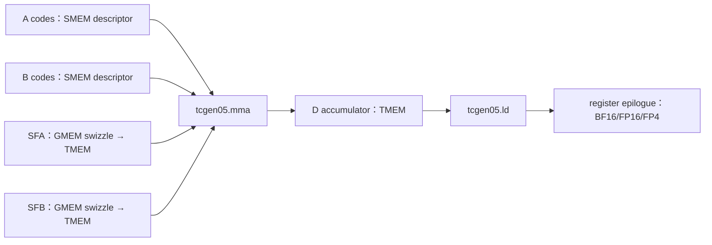

这是根据 PTX [Block Scaling for `tcgen05.mma`](https://docs.nvidia.com/cuda/parallel-thread-execution/#block-scaling-for-tcgen05-mma)重画的数据流；官方页面的 Figure 230–233 给出了 scale matrix 在 TMEM sub-columns 中的精确选择图。

### 11.2 kind、元素类型与 scale 的合法组合

| `tcgen05.mma` kind | A/B data | scale type | vector size |
|---|---|---|---|
| `kind::mxf8f6f4` | E4M3/E5M2/E2M3/E3M2/E2M1，可混合 | UE8M0 | block32 |
| `kind::mxf4` | E2M1 × E2M1 | UE8M0 | block32 |
| `kind::mxf4nvf4` | E2M1 × E2M1 | UE8M0 | block32 或 block16 |
| `kind::mxf4nvf4` | E2M1 × E2M1 | UE4M3 | block16 |

`.scale_vec::1X/2X/4X` 描述一个 instruction K tile 内有几列 scale；`.block32/.block16` 是更直接的 block-size alias。两者的对应关系会随 kind 和 K shape 变化，不能简单地把 `1X` 永远翻译成一个固定 block。

### 11.3 官方语法的最小 block-scaled 形态

```ptx
// PTX grammar：下面的名字代表已经构造好的 TMEM 地址、
// SMEM descriptor、instruction descriptor 与 predicate。
tcgen05.mma.cta_group::1.kind::mxf4nvf4.block_scale.block16
  [d_tmem], a_desc, b_desc, idesc,
  [sfa_tmem], [sfb_tmem], enable_d;
```

该语法来自 [`tcgen05.mma`](https://docs.nvidia.com/cuda/parallel-thread-execution/#tensorcore-5th-generation-instructions-tcgen05-mma)。几点解释：

- `d_tmem` 是 accumulator tile 的 Tensor Memory 地址，不是每线程的 `{d0,d1,...}`；
- `a_desc/b_desc` 描述 SMEM tile 与 swizzle，`idesc` 描述 shape、type、transpose 和 scale factor IDs 等指令字段；
- `sfa_tmem/sfb_tmem` 是 scale matrices 在 TMEM 中的地址；
- `enable_d` 决定是否读入旧 D，相当于 mainloop 中的 accumulate predicate；
- 指令异步完成，真实 kernel 还需要 `tcgen05.commit`/mbarrier、TMEM allocation、producer-consumer fencing 和 `tcgen05.ld`；单独这一行是准确的 instruction form，不是完整可运行 kernel。

### 11.4 scale matrix 为什么不是普通 row-major byte array

逻辑 scale shape 很简单：

$$
SFA:\ M\times\lceil K/SV\rceil,\qquad
SFB:\ \lceil K/SV\rceil\times N.
$$

物理上，CUTLASS/SM100 使用 512-byte 基本块，每块覆盖 128 个 M（或 N）位置和 4 个 K-scale 位置。块内 byte order 先放 `M0:32` 的 4 个 scale，再放 `M32:64`、`M64:96`、`M96:128`；多个基本块按 K-major 方式排布。CUTLASS 提供 `Sm1xxBlockScaledConfig<SFVecSize>`，不要手搓 stride：

PTX 先规定 scale 进入 TMEM 后如何占 sub-column。下面三张分别是每个 instruction K tile 中含 1、2、4 个 scale 的 SFA 形态：


*PTX Figure 231：每行一个 scale，`SFA_ID=0/1/2/3` 选择 32-bit TMEM word 内的某个 byte sub-column。*


*PTX Figure 232：每行两个 scale，必须按 2-byte 对齐；`SFA_ID` 只能选择 half-word 起点 0 或 2。*

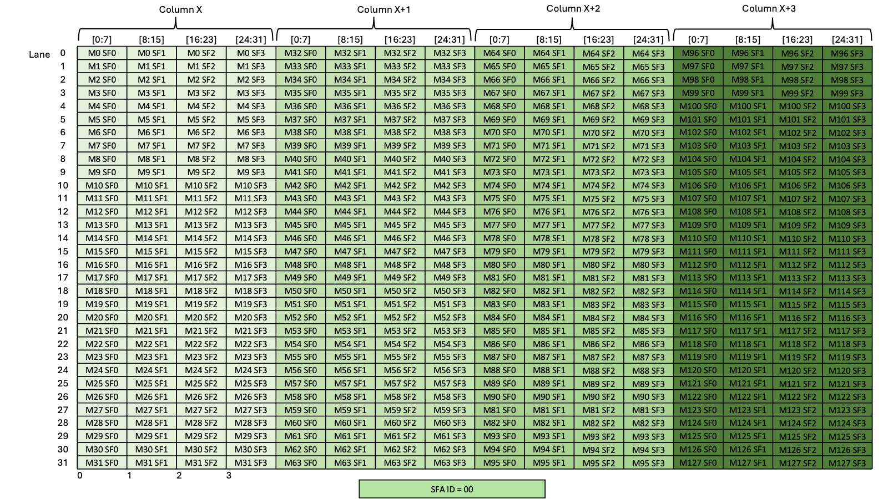

*PTX Figure 233：每行四个 scale 占满 32-bit word，`SFA_ID=0`。三图均来自 [Scale Factor A ID](https://docs.nvidia.com/cuda/parallel-thread-execution/#scale-factor-a-id)；SFB 的 Figure 240–242 是转置方向的同类规则。*

真正的难点是：这些图画的是 **TMEM 消费布局**，而下一段 CUTLASS layout 解决的是 **GMEM 中怎样排，才能让 TMA 高效送成这个 TMEM 形态**。两者不能拿同一条 row-major stride 描述。

```cpp
auto problem_shape = cute::make_shape(M, N, K, L);
using SfConfig = cutlass::detail::Sm1xxBlockScaledConfig<SFVecSize>;

auto layout_sfa = SfConfig::tile_atom_to_shape_SFA(problem_shape);
auto layout_sfb = SfConfig::tile_atom_to_shape_SFB(problem_shape);

auto tensor_sfa = cute::make_tensor(sfa_ptr, layout_sfa);
auto tensor_sfb = cute::make_tensor(sfb_ptr, layout_sfb);
```

这段接口来自 CUTLASS [Blackwell scale-factor layouts](https://docs.nvidia.com/cutlass/latest/media/docs/cpp/blackwell_functionality.html#scale-factor-layouts)。GMEM layout、TMA copy 到 TMEM 后的 lane/sub-column layout、以及 `SFA_ID/SFB_ID` 是三个相关但不同的层次。

### 11.5 mixed F8/F6/F4 kind 与专用 F4 kind 的存储区别

`kind::mxf8f6f4` 为了允许 A/B 在 8、6、4 bit 间混合，TMEM 里的 FP6/FP4 都使用 8-bit containers，再把 4 个 container 连续装入一个 32-bit TMEM word。相反，`kind::mxf4` 与 `kind::mxf4nvf4` 在 SMEM/TMEM 都允许两个 E2M1 紧凑装入 1 byte。若目标就是 FP4×FP4，专用 kind 不仅 scale 语义不同，也避免了 mixed kind 的 padding 开销。

## 12. CUTLASS：从类型到可实例化 kernel

### 12.1 低比特类型体系

CUTLASS [`float_subbyte.h`](https://github.com/NVIDIA/cutlass/blob/main/include/cutlass/float_subbyte.h)提供：

```cpp
cutlass::float_e4m3_t;
cutlass::float_e5m2_t;
cutlass::float_e2m3_t;
cutlass::float_e3m2_t;
cutlass::float_e2m1_t;
cutlass::float_ue8m0_t;
cutlass::float_ue4m3_t;

cutlass::mx_float6_t<cutlass::float_e2m3_t>;  // data E2M3, scale UE8M0
cutlass::mx_float4_t<cutlass::float_e2m1_t>;  // data E2M1, scale UE8M0
cutlass::nv_float4_t<cutlass::float_e2m1_t>;  // data E2M1, scale UE4M3
```

`mx_float4_t` / `nv_float4_t` 是 **builder-level compound type**：它们告诉 CollectiveBuilder 应选哪个 MMA kind、scale type 和 vector size。真实参数仍是 data pointer 与 scale pointer 两个 tensor，不是每个 C++ object 内嵌一个 scale。

### 12.2 SM100 NVFP4×NVFP4→BF16 配置片段

下面保留了 CUTLASS 官方 [72a example](https://github.com/NVIDIA/cutlass/blob/main/examples/72_blackwell_narrow_precision_gemm/72a_blackwell_nvfp4_bf16_gemm.cu)的核心类型配置，省略 CLI、初始化、builder 完整模板和 launch boilerplate：

```cpp
using ElementA = cutlass::nv_float4_t<cutlass::float_e2m1_t>;
using LayoutATag = cutlass::layout::RowMajor;
constexpr int AlignmentA = 32;  // elements: 32 * 4 bit = 16 bytes

using ElementB = cutlass::nv_float4_t<cutlass::float_e2m1_t>;
using LayoutBTag = cutlass::layout::ColumnMajor;
constexpr int AlignmentB = 32;

using ElementC = cutlass::bfloat16_t;
using ElementD = cutlass::bfloat16_t;
using ElementAccumulator = float;

using ArchTag = cutlass::arch::Sm100;
using OperatorClass = cutlass::arch::OpClassBlockScaledTensorOp;
using MmaTileShape = cute::Shape<cute::_256, cute::_256, cute::_256>;
using ClusterShape = cute::Shape<cute::_2, cute::_4, cute::_1>;
```

这里最有信息量的不是 tile 数字，而是四件事：

1. `nv_float4_t<E2M1>` 同时选择 E2M1 data 和 UE4M3 block-16 scale；
2. A/B alignment 是“元素个数”，32 个 FP4 恰好 16 bytes；
3. `OpClassBlockScaledTensorOp` 让 builder 选 `tcgen05 ... mxf4nvf4.block_scale`；
4. accumulator 是 float，C/D 可以是 BF16。FP4 是乘法输入，不意味着输出也必须 FP4。

官方示例随后从生成的 kernel 类型取得 `LayoutSFA/LayoutSFB`，并分别传 A、SFA、B、SFB：

```cpp
using LayoutSFA = typename Gemm::GemmKernel::CollectiveMainloop::LayoutSFA;
using LayoutSFB = typename Gemm::GemmKernel::CollectiveMainloop::LayoutSFB;

cutlass::HostTensor<ElementA::DataType,
                    cutlass::layout::PackedVectorLayout> block_A;
cutlass::HostTensor<ElementA::ScaleFactorType,
                    cutlass::layout::PackedVectorLayout> block_SFA;
```

这正好印证“data 与 scale 独立存储、compound type 负责 dispatch”。完整示例要求合适的 CUDA/CUTLASS 版本与 SM100 编译 target；不要只复制 type alias 后在 Hopper 上期待 fallback。

### 12.3 Hopper W4A16 的关键 CUTLASS 配置

官方 [55 example](https://github.com/NVIDIA/cutlass/blob/main/examples/55_hopper_mixed_dtype_gemm/55_hopper_int4_bf16_gemm.cu)的核心是 mixed input，而非 INT4 MMA：

```cpp
using MmaType   = cutlass::bfloat16_t;
using QuantType = cutlass::int4b_t;

using ElementA = MmaType;    // activation
using ElementB = QuantType;  // packed weight
using ElementScale = MmaType;

using ElementAccumulator = float;
using ArchTag = cutlass::arch::Sm90;
using OperatorClass = cutlass::arch::OpClassTensorOp;

// INT4 pre-shuffle: [0,2,4,6,1,3,5,7]
using ValueShuffle = cute::Layout<
    cute::Shape<cute::_2, cute::_4>,
    cute::Stride<cute::_4, cute::_1>>;
```

`QuantType` 决定 GMEM 是 4-bit；`MmaType` 决定展开后的 WGMMA 输入是 BF16。`ValueShuffle` 让同线程要转换的 nibbles 聚集并适配向量化 conversion。若离线权重没有按同一个 `LayoutAtomQuant` 重排，结果不是“慢一点”，而是数值次序直接错。

### 12.4 用 builder 时最常见的五个错误

1. 用 `sizeof(Element)` 计算 sub-byte capacity，而不是 `cutlass::sizeof_bits<T>`/layout capacity；
2. A/B 的 row/column-major tag 与已经预打包的 tensor 不一致；
3. 只生成 data tensor，忘了 SFA/SFB 的专用 layout；
4. 把 alignment 的单位“elements”误当“bytes”；
5. 把 `Sm100` kernel、`Sm120` kernel 和 Hopper mixed-dtype kernel 当模板参数可互换。

## 13. CUDA Math API 与 cuBLASLt：公开接口能做什么

### 13.1 先按任务选择软件层

优先选择能完整表达目标的最高层接口；只有当布局、融合、数据类型或指令控制超出该层能力时，才继续下沉。

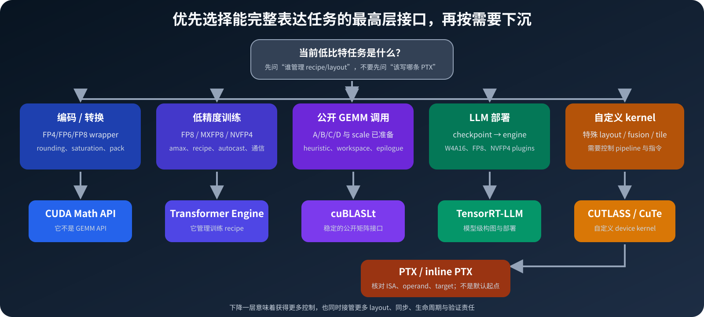

*本文绘制。图中的箭头不表示“越底层越好”，而表示当上层不能表达目标时才接管更多责任。*

| 软件层 | 最适合解决的问题 | 不应误以为它会自动完成 |
|---|---|---|
| CUDA Math API | FP4/FP6/FP8 storage、conversion、rounding、packed vector | GEMM dispatch、scale layout 和模型量化 |
| Transformer Engine | 训练中的 FP8/MXFP8/NVFP4 recipe、scale 管理和算子集成 | 任意私有 checkpoint packing 或任意 PTX 路径 |
| TensorRT-LLM | LLM 推理的量化、构图、plugin 和部署 | 通用矩阵库或训练 recipe |
| cuBLASLt | 稳定公开的 GEMM 接口、算法选择与 epilogue | 接受任意私有 packed layout |
| CUTLASS / CuTe | 自定义 tile、layout、pipeline、fusion 和新架构 kernel | 自动匹配模型 checkpoint 量化语义 |
| PTX | 精确核对 instruction、operand、packing 和 target 限制 | 自动处理完整 kernel 的调度、同步和生命周期 |

例如，“把 FP32 转成 E2M1 codes”只需要 CUDA Math API；“让 Transformer 训练使用 FP8/NVFP4”通常先选 Transformer Engine；“已有 A/B 和 scale，调用一个 Blackwell GEMM”先查 cuBLASLt；只有需要特殊布局、融合或库中尚未暴露的路径时才进入 CUTLASS/PTX。

### 13.2 CUDA storage/conversion types

CUDA Math API 的 FP4/FP6/FP8 headers 主要提供：

- storage wrappers：scalar、x2、x4；
- 与 half/bfloat16/float 的显式转换；
- rounding/saturation 模式；
- packed vector conversion，避免逐标量处理。

这些 wrappers 不是 GEMM API。能 `__nv_fp4_e2m1` 转换，不等于当前设备有 FP4 Tensor Core；目标 SM 与上层库 dispatch 仍需单独检查。

### 13.3 cuBLASLt scaling modes

cuBLAS 13.3 的公开窄精度主线可整理为：

| 数据 | mode | scale | block/粒度 | 典型最低能力 |
|---|---|---|---|---|
| FP8 E4M3/E5M2 | `SCALAR_32F` | FP32 | tensor-wide | CC 8.9+ |
| FP8 | `OUTER_VEC_32F` 等 | FP32 | row/column vector | 依具体 mode/架构 |
| FP8 | `VEC128_32F` / 2D scaling | FP32 | 128 粒度 | Hopper 路径 |
| FP8 | `VEC32_UE8M0` | UE8M0 | 32 adjacent values | CC 10.x+ |
| FP4 E2M1 | `VEC16_UE4M3` | UE4M3 | 16 adjacent values | CC 10.x+ |

不要把属性名写成可照抄的“集合宏”。实际 scale-mode 标识符分别是 `CUBLASLT_MATMUL_DESC_A_SCALE_MODE`、`CUBLASLT_MATMUL_DESC_B_SCALE_MODE`、`CUBLASLT_MATMUL_DESC_C_SCALE_MODE`、`CUBLASLT_MATMUL_DESC_D_SCALE_MODE`；输出量化另用 `CUBLASLT_MATMUL_DESC_D_OUT_SCALE_MODE`，地址则通过各自的 `..._SCALE_POINTER` 属性设置。FP4 路径的关键限制包括：A/B 都是 FP4（当前不支持任意 mixed precision）、TN 形态、`CUBLAS_COMPUTE_32F`、`VEC16_UE4M3`、以及 data/scale 的 16-byte 对齐要求。详情必须查 [cuBLAS 13.3 narrow precision and scaling](https://docs.nvidia.com/cuda/cublas/index.html#d-block-scaling-factors-layout)。

### 13.4 cuBLASLt 的 128×4 scale tile

cuBLASLt 不接受朴素 row-major 的 `outer × ceil(inner/SV)` byte array。每个 scale tile 是 128×4，其 tile 内 offset 为：

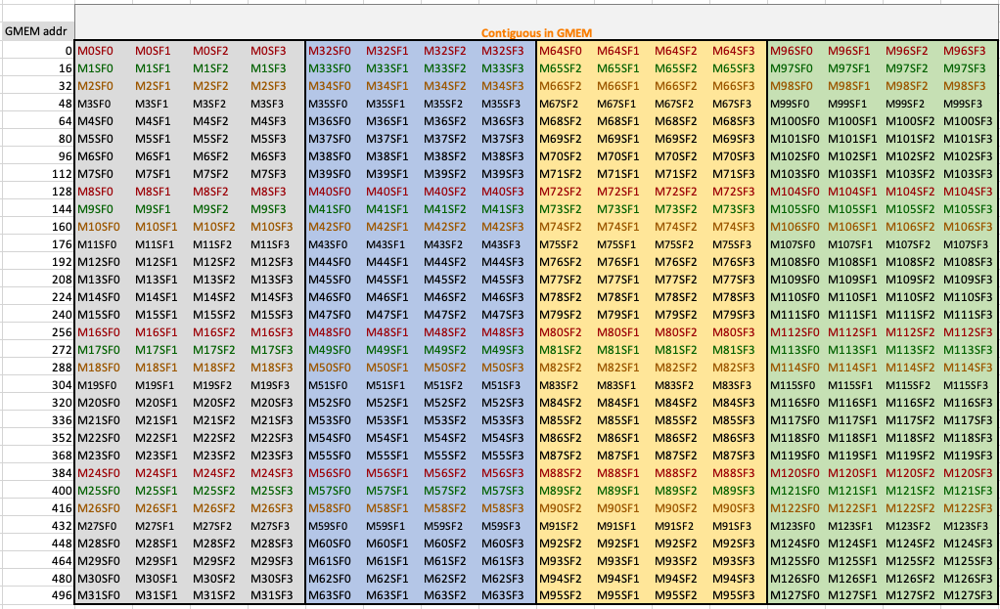

*CUTLASS 官方图：[Scale Factor Layouts](https://docs.nvidia.com/cutlass/latest/media/docs/cpp/blackwell_functionality.html#scale-factor-layouts)。每一行标的是 GMEM byte address；彩色标签 `M_i SF_j` 直接给出逻辑 `(outer=i, inner=j)` 到物理 offset 的置换。*

```cpp
// inner in [0,4), outer in [0,128)
int offset = (outer % 32) * 16 + (outer / 32) * 4 + inner;

// inverse
int outer2 = ((offset % 16) / 4) * 32 + (offset / 16);
int inner2 = offset % 4;
```

在 FP4 `VEC16_UE4M3` 下，一个 tile 覆盖原数据的 128×64 block；在 FP8 `VEC32_UE8M0` 下覆盖 128×128 block。多个 tile 再按 row-major 排列，scale 起始地址需 16-byte aligned。对 A/B，`inner` 都沿 GEMM K，`outer` 分别对应 M/N；预转置矩阵时必须重新按逻辑轴生成 scale layout，不能只交换 data pointer 的 transpose flag。

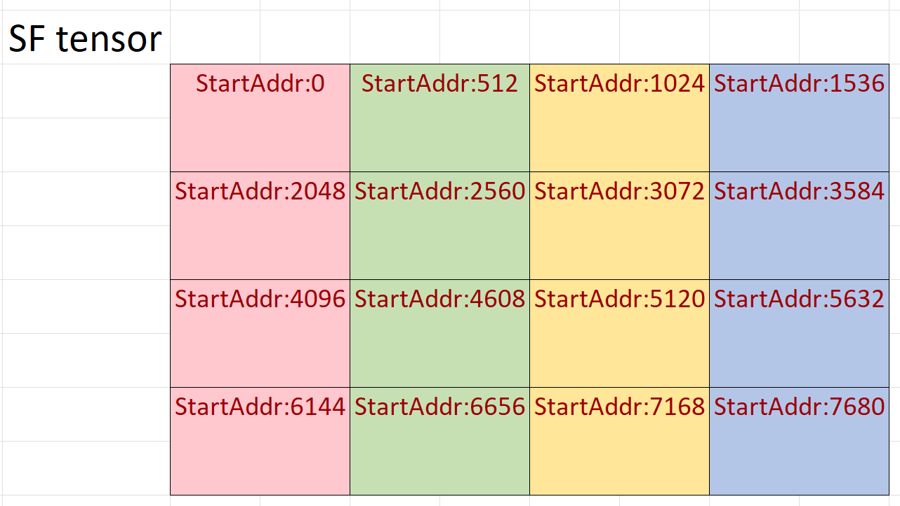

*CUTLASS 官方图：多个基本块的排布。左边是逻辑 scale matrix，右边是每个 512B block 内部的 swizzle；这正是 `Sm1xxBlockScaledConfig` 存在的原因。*

## 14. 量化算法怎样映射到 kernel

### 14.1 W8A8：SmoothQuant 解决 activation outlier

Transformer activation 的 outlier 往往集中在少数 channel，使 per-tensor INT8 scale 被拉大。[SmoothQuant](https://arxiv.org/abs/2211.10438)利用线性层的等价变换：

$$
XW=(X\operatorname{diag}(s)^{-1})(\operatorname{diag}(s)W).
$$

把一部分 activation channel 的量化难度离线迁移到更容易量化的 weight channel。常见启发式为：

$$
s_j=\frac{\max|X_j|^\alpha}{\max|W_j|^{1-\alpha}},\qquad 0\le\alpha\le1.
$$

处理后 (X') 与 (W') 都做 INT8，映射到 `s8×s8→s32` MMA。关键 kernel 工作不是 SmoothQuant 本身，而是：输入 quantize、INT8 GEMM、row/column scale epilogue 和可能的输出 requant 能否融合。

### 14.2 GPTQ / AWQ / NF4：主要映射到 W4A16

| 方法 | 核心目的 | 运行时需要什么 | 不会自动得到什么 |
|---|---|---|---|
| GPTQ | 用二阶信息补偿逐块 weight PTQ 误差 | packed INT4＋group scale/zero | 原生 INT4×BF16 MMA |
| AWQ | 依据 activation 保护 salient weight channels | 预缩放 weight/activation＋W4 dequant | 自动匹配任意 CUTLASS packed layout |
| NF4 / QLoRA | 用非均匀码本提高近似正态权重的 4-bit 表达 | nibble lookup＋scale；可能 double-quantized scales | E2M1/NVFP4 指令兼容性 |

模型算法输出的 checkpoint layout 往往面向框架，而 CUTLASS kernel 需要 thread-fragment-friendly layout。中间通常必须做一次离线 repack/shuffle，且要把 group scale 同步重排。

### 14.3 FP6-LLM 与现在的 native FP6 要分代看

[FP6-LLM](https://arxiv.org/abs/2401.14112)发表于 Blackwell native FP6 普及之前。其重点是 6-bit weight 的紧凑访存与高效反量化，通过 TC-FPx 把自定义 FPx 映射到当时已有 Tensor Core 类型。它证明“6 bit 可能是质量/容量的好折中”，但论文 kernel 不是 `tcgen05 kind::mxf8f6f4`。今天读它时应拆成两部分：

- 算法结论、bit-centric packing、thread-wise dequant 仍有参考价值；
- 在 SM100/SM120 上，应重新评估 native MXFP6 是否能替代旧的 software emulation path。

### 14.4 QAT、PTQ 与动态量化

| 路径 | scale/code 何时产生 | 优点 | 典型用途 |
|---|---|---|---|
| PTQ | 训练后用 calibration set 或权重统计 | 成本低 | GPTQ/AWQ、W8A8 calibration |
| QAT | 训练中 fake-quant / low-precision recipe | 最能适应 FP4 误差 | NVFP4/MXFP4 训练或微调 |
| weight-only static | 权重离线量化，activation 不量化 | serving 简单、质量稳 | W4A16/W8A16 |
| activation dynamic | 运行时对 token/row 求 `amax` | 适应输入变化 | dynamic INT8/FP8 |
| block-scaled online | 每 tile/block 生成 scale | 误差低、可接 native MMA | Blackwell training/inference |

在线 block quantization 自己也吃带宽与 latency：先求 `amax` 再 cast 通常是双遍读；若上游 epilogue 同时产出低比特 data 和 scale，才能真正避免额外 round-trip。CUTLASS 4.x 的 block-scale-factor epilogue fusion 就是为此设计。

### 14.5 checkpoint 与 kernel 之间需要一份可逆契约

“文件是 INT4/NVFP4”不足以让另一个框架正确读取。checkpoint 应保存 **逻辑量化表示**；部署阶段再按 GPU、库版本和 kernel 做可再生的 physical repack。不要把某个 CUTLASS fragment/swizzle 当成唯一模型格式，否则换架构或换 kernel 就很难迁移。

| 契约字段 | 至少要记录什么 | 缺失时的典型故障 |
|---|---|---|
| 数值格式 | signed/unsigned、INT/FP codebook、FP exponent/mantissa、特殊值规则 | 同一 nibble 被解成不同数值 |
| scale 语义 | dequant 乘数还是 quant 乘数、local/global 的组合顺序 | 整体差固定倍数或 reciprocal 用反 |
| 粒度与逻辑轴 | per-tensor/row/channel/group/block，group size，沿 M/N/K 哪一轴 | 数值看似随机、转置后失效 |
| zero-point | 是否存在、dtype、每组还是每张量、公式中加减方向 | 非对称整数产生系统偏置 |
| 位级布局 | 两个 4-bit code 谁在低 nibble，FP6 bitstream 顺序、端序 | 邻元素交换或跨字节错位 |
| tensor 元数据 | 原始 shape/stride、transpose 语义、padding/tail 长度 | 最后一块越界或把 padding 当数据 |
| scale 存储 | scale dtype、shape、layout、对齐与 padding | 读到错误 block 的 scale |
| repack provenance | 目标 SM、库/kernel/版本、layout ID、逆变换或重建版本 | checkpoint 被错误复用到另一代 kernel |

推荐保留 canonical packed data、canonical scales 和 manifest，并把 SM90 mixed-dtype shuffle、SM100 scale swizzle 等作为可删除的派生 cache。验收条件不是“文件大小对了”，而是 `canonical -> physical -> canonical` 对每个 code、scale 和 tail 都可逆；数值误差只应来自明确记录的 quantization，而不是 repack。

## 15. 性能模型：低 bit 何时真的快

### 15.1 先看 bytes，再看 Tensor Core 峰值

忽略 cache reuse 与 metadata 时，$M\times K$ 乘 $K\times N$ 的近似算术强度为：

$$
AI\approx\frac{2MNK}
{MKb_A/8+KNb_B/8+MN(b_C+b_D)/8+B_{scale}+B_{padding}}
\quad\text{FLOP/byte}.
$$

真实 kernel 还要计入：

- scale/zero-point reads；
- A/B tile 的重复读取与 cache hit；
- quantize/dequantize 指令；
- SMEM padding/swizzle；
- alignment tail 与不完整 tile；
- C read（若 β≠0）和 D write；
- warp specialization/TMA pipeline 的空泡。

### 15.2 只看权重存储的理想压缩比

| 格式 | 含 local scale 的有效位/值 | 相对 BF16 理想压缩比 |
|---|---:|---:|
| BF16 | 16 | 1.00× |
| FP8 tensor-wide | 8（全局 metadata 可忽略） | 2.00× |
| MXFP8 | 8.25 | 1.94× |
| MXFP6 | 6.25 | 2.56× |
| MXFP4 | 4.25 | 3.76× |
| NVFP4 | 4.50（不计 1 个 tensor FP32） | 3.56× |
| symmetric INT4, FP16 scale, G=128 | $4+16/128=4.125$ | 3.88× |

这些是 **单个量化 tensor** 的容量比，不是端到端模型显存比，更不是 GEMM latency 比。W4A16 仍要读 A16、写 D16，并做 BF16/FP16 MMA。

### 15.3 一个 decode 例子

考虑单 token 线性层 $M=1,N=K=4096$：

- BF16 权重：$4096^2\times2=32$ MiB；
- symmetric INT4 权重：8 MiB；
- 若 G=128、每组 1 个 FP16 scale：共有 $4096\times32=131072$ scales，即 0.25 MiB；
- 权重总读约 8.25 MiB，理论是 BF16 的 3.88× 压缩；A 与 D 各约 8 KiB，可忽略。

这正是 W4A16 最舒服的形态：权重带宽占绝对主导，即便最终还是 BF16 Tensor Core，少读约 24 MiB 也可能近似转成 latency 收益。实际低于 3.88×，因为 memory latency、dequant、cache、launch 和小 M 利用率。

### 15.4 一个大 M 例子

若 $M=N=K=4096$，只量化 B 为 W4A16：

- A16 约 32 MiB，B4+scale 约 8.25 MiB，D16 约 32 MiB；
- 相比 A16+B16+D16 的约 96 MiB，主 tensor bytes 仅从 96 降到约 72.25 MiB，约 1.33×；
- 计算仍受 BF16 Tensor Core ceiling 限制，且要做 B dequant。

若 A/B 都能用 native NVFP4，两个输入各约 9 MiB 量级，且 MMA 本身是 FP4，才同时得到输入流量和 Tensor Core throughput 的好处。这也是 prefill/training 场景更关心 W4A4/FP4A4，而 decode 常满足于 W4A16 的原因。

### 15.5 Roofline 之外的几个硬瓶颈

1. **寄存器压力。**W4A16 同时保存 packed、expanded、scale、accumulator；occupancy 下降后，省下的 HBM 带宽可能换成 latency 暴露。
2. **K 与 alignment。**低比特向量通常要求 16-byte access，MMA K tile 也更大；小 K、奇数 tail、非对齐 leading dimension 会触发慢 kernel 或根本无候选。
3. **scale bandwidth 很小但搬运不免费。**SM100 scale 需 GMEM swizzle、TMA/TMEM layout 和 instruction IDs；元数据只占 0.25/0.5 bit，不代表控制成本为零。
4. **layout conversion。**离线 weight 可以一次性 repack；动态 activation 每步 repack 则可能抵消收益，因此需要上游融合产生目标 layout。
5. **累加误差。**K 很长时，输入量化误差和 accumulator rounding 都积累；吞吐测试必须同时跑 reference error，而不是只看 TFLOP/s。

## 16. 选型速查

| 场景 | 优先尝试 | 原因 | 备选/警告 |
|---|---|---|---|
| Ampere 稳定训练 | BF16×BF16→FP32 | 范围大、软件栈成熟 | FP16 需关注 overflow/loss scaling |
| Ada/Hopper 训练 | Transformer Engine FP8 | 原生 FP8，recipe 成熟 | 对 loss/softmax/norm 等敏感算子保留更高精度 |
| Hopper LLM decode | W4A16 或 W8A16 | 权重带宽主导 | 关注 group size、repack 与 register pressure |
| Hopper 大 M GEMM | FP8；或 BF16 | FP8 有 native WGMMA | W4A16 只省 B bytes，计算仍是 16 bit |
| Blackwell 最高吞吐 | NVFP4/MXFP4 native | A/B 与 scale 融合进窄 MMA | 需要 calibration/QAT 与正确 scale layout |
| 质量介于 FP4/FP8 | MXFP6 | 6.25 effective bits，native Blackwell | cuBLASLt public API 覆盖不如 CUTLASS/PTX |
| 跨多代 GPU 部署 | INT8 或 BF16/FP16 | 兼容面最好 | “相同 quant 名”仍需每代独立 autotune |
| QLoRA checkpoint | NF4 W4A16 dequant | 保留 NF4 码本优势 | 不能直接喂 E2M1 MMA |

工程上建议按以下顺序做决策：

1. 先判定是 decode bandwidth-bound 还是大 M compute-bound；
2. 再选 `native narrow MMA`、`weight-only dequant` 或 `integer MMA`；
3. 再确定格式与 granularity；
4. 再确定 checkpoint/GMEM layout、scale layout 和 conversion fusion；
5. 最后才调 tile、stage、cluster、schedule。

如果顺序反过来，常见结果是先写出一个漂亮的 PTX microbenchmark，最后发现模型权重格式、scale 轴或目标 GPU 根本无法接上。

## 17. 本文复验：哪些是跑出来的，哪些是文档核对的

### 17.1 数值与打包的可运行穷举

以下脚本不依赖 NumPy，穷举每种格式的正数 code，检查最大值、最小子正规数、E2M1 精确集合、FP4/FP6 紧凑字节数，以及 MX/NVFP4 metadata。本文生成时已用 Python 3 实际运行。

```python
#!/usr/bin/env python3
import math


def decode(code, ebits, mbits, bias, special="none"):
    sign = -1.0 if code >> (ebits + mbits) else 1.0
    emax, mmask = (1 << ebits) - 1, (1 << mbits) - 1
    exp, frac = (code >> mbits) & emax, code & mmask
    if exp == emax and special == "ieee":
        return sign * math.inf if frac == 0 else math.nan
    if exp == emax and special == "e4m3fn" and frac == mmask:
        return math.nan
    if exp == 0:
        mag = 0.0 if frac == 0 else frac / (1 << mbits) * 2 ** (1 - bias)
    else:
        mag = (1 + frac / (1 << mbits)) * 2 ** (exp - bias)
    return sign * mag


def positive_values(spec):
    ebits, mbits, bias, special = spec
    xs = [decode(c, *spec) for c in range(1 << (ebits + mbits))]
    return sorted(set(x for x in xs if math.isfinite(x) and x >= 0))


formats = {
    "FP16": ((5, 10, 15, "ieee"), 65504, 2**-24),
    "BF16": ((8, 7, 127, "ieee"), (2 - 2**-7) * 2**127, 2**-133),
    "E4M3": ((4, 3, 7, "e4m3fn"), 448, 2**-9),
    "E5M2": ((5, 2, 15, "ieee"), 57344, 2**-16),
    "E2M3": ((2, 3, 1, "none"), 7.5, 0.125),
    "E3M2": ((3, 2, 3, "none"), 28, 0.0625),
    "E2M1": ((2, 1, 1, "none"), 6, 0.5),
}
for name, (spec, expected_max, expected_min) in formats.items():
    xs = positive_values(spec)
    assert (xs[-1], xs[1]) == (expected_max, expected_min)
    print(f"PASS {name}: max={xs[-1]:g}, min_subnormal={xs[1]:g}")

e2m1 = positive_values(formats["E2M1"][0])
assert e2m1 == [0, .5, 1, 1.5, 2, 3, 4, 6] and 5 not in e2m1


def pack(codes, width):
    word = sum(code << (i * width) for i, code in enumerate(codes))
    return word.to_bytes((len(codes) * width + 7) // 8, "little")


assert len(pack(range(16), 4)) == 8
assert len(pack([0, 1, 17, 63], 6)) == 3
assert 4 + 8/32 == 4.25 and 6 + 8/32 == 6.25
assert 8 + 8/32 == 8.25 and 4 + 8/16 == 4.5
print("PASS E2M1 exact set, dense FP4/FP6 packing, MX/NV metadata")
print("ALL CHECKS PASSED")
```

本次实际输出：

```text
PASS FP16: max=65504, min_subnormal=5.96046e-08
PASS BF16: max=3.38953e+38, min_subnormal=9.18355e-41
PASS E4M3: max=448, min_subnormal=0.00195312
PASS E5M2: max=57344, min_subnormal=1.52588e-05
PASS E2M3: max=7.5, min_subnormal=0.125
PASS E3M2: max=28, min_subnormal=0.0625
PASS E2M1: max=6, min_subnormal=0.5
PASS E2M1 exact set, dense FP4/FP6 packing, MX/NV metadata
ALL CHECKS PASSED
```

### 17.2 端到端 INT4/NVFP4 算例复验

4.7 节的 32 元素算例不是手填表格。下面脚本使用 Python 标准库重新生成 INT4 与 NVFP4 的 scale、logical codes、低 nibble 在前的 packed bytes、反量化结果和误差指标；它是 **CPU 数值实测**，不依赖 CUDA。为避免“量化器与 reference 共用同一段 bit trick”掩盖错误，E2M1 的反量化从显式值表出发，E4M3 scale code 则由独立 decoder 穷举得到。

```python
#!/usr/bin/env python3
import math
import struct

Z = [-6, -5, -4, -3, -2, -1.5, -1, -.5,
     0, .25, .5, 1, 1.5, 2.5, 4, 6]
X = [7/8 * z for z in Z] + [7/16 * z for z in Z]
E2M1_POS = [0, .5, 1, 1.5, 2, 3, 4, 6]


def pack_nibbles(codes):
    assert len(codes) % 2 == 0
    return bytes(codes[i] | (codes[i + 1] << 4)
                 for i in range(0, len(codes), 2))


def quant_int4(xs):
    scales, codes, recon = [], [], []
    for start in range(0, len(xs), 16):
        block = xs[start:start + 16]
        scale = max(map(abs, block)) / 7
        q = [max(-7, min(7, round(x / scale))) for x in block]
        scales.append(scale)
        codes.extend(v & 0xF for v in q)
        recon.extend(v * scale for v in q)
    return scales, codes, recon


def e2m1_code(x):
    # RTNE：距离相同就选 code LSB 为 0 的候选。
    mag = abs(x)
    i = min(range(8), key=lambda j: (abs(mag - E2M1_POS[j]), j & 1))
    return i | (0x8 if x < 0 and i else 0)


def decode_e2m1(code):
    value = E2M1_POS[code & 0x7]
    return -value if code & 0x8 else value


def decode_e4m3fn(code):
    exp, frac = (code >> 3) & 0xF, code & 0x7
    if exp == 0xF and frac == 0x7:
        return math.nan
    if exp == 0:
        return frac / 8 * 2**-6
    return (1 + frac / 8) * 2**(exp - 7)


def exact_e4m3_code(x):
    hits = [c for c in range(0x7F) if decode_e4m3fn(c) == x]
    assert len(hits) == 1
    return hits[0]


def quant_nvfp4(xs):
    global_scale = max(map(abs, xs)) / (448 * 6)
    locals_, scale_codes, codes, recon = [], [], [], []
    for start in range(0, len(xs), 16):
        block = xs[start:start + 16]
        local_scale = max(map(abs, block)) / (6 * global_scale)
        local_code = exact_e4m3_code(local_scale)
        local_scale = decode_e4m3fn(local_code)
        block_codes = [e2m1_code(x / (global_scale * local_scale))
                       for x in block]
        locals_.append(local_scale)
        scale_codes.append(local_code)
        codes.extend(block_codes)
        recon.extend(decode_e2m1(c) * local_scale * global_scale
                     for c in block_codes)
    return global_scale, locals_, scale_codes, codes, recon


def metrics(ref, got):
    err = [a - b for a, b in zip(ref, got)]
    mae = sum(map(abs, err)) / len(err)
    rmse = math.sqrt(sum(e * e for e in err) / len(err))
    max_abs = max(map(abs, err))
    sqnr = 10 * math.log10(sum(x * x for x in ref) /
                           sum(e * e for e in err))
    return mae, rmse, max_abs, sqnr


i_scales, i_codes, i_recon = quant_int4(X)
g_scale, n_scales, n_scale_codes, n_codes, n_recon = quant_nvfp4(X)
assert pack_nibbles(i_codes).hex(" ") == \
       "a9 cb ee ff 00 11 32 75 a9 cb ee ff 00 11 32 75"
assert n_scale_codes == [0x7E, 0x76]
assert pack_nibbles(n_codes).hex(" ") == \
       "ef de bc 9a 00 21 43 76 ef de bc 9a 00 21 43 76"

print("INT4 scales:", i_scales,
      "FP16 LE:", b"".join(struct.pack("<e", x) for x in i_scales).hex(" "))
print("INT4 data:  ", pack_nibbles(i_codes).hex(" "))
print("NV global:  ", g_scale,
      "FP32 LE:", struct.pack("<f", g_scale).hex(" "))
print("NV locals:  ", n_scales,
      "codes:", bytes(n_scale_codes).hex(" "))
print("NV data:    ", pack_nibbles(n_codes).hex(" "))
for name, recon in [("INT4", i_recon), ("NVFP4", n_recon)]:
    mae, rmse, max_abs, sqnr = metrics(X, recon)
    print(f"{name}: MAE={mae:.9f}, RMSE={rmse:.9f}, "
          f"max={max_abs:.6f}, SQNR={sqnr:.4f} dB")
```

本文成稿环境使用 conda base 的 Python 实际输出：

```text
INT4 scales: [0.75, 0.375] FP16 LE: 00 3a 00 36
INT4 data:   a9 cb ee ff 00 11 32 75 a9 cb ee ff 00 11 32 75
NV global:   0.001953125 FP32 LE: 00 00 00 3b
NV locals:   [448.0, 224.0] codes: 7e 76
NV data:     ef de bc 9a 00 21 43 76 ef de bc 9a 00 21 43 76
INT4: MAE=0.130371094, RMSE=0.164457300, max=0.375000, SQNR=22.3488 dB
NVFP4: MAE=0.071777344, RMSE=0.198124291, max=0.875000, SQNR=20.7311 dB
```

这组数只回答“格式怎样编码、反量化误差怎样算”。它没有 CUDA layout swizzle、kernel rounding、GEMM 累加或硬件吞吐，因此不能当作 B200 上的 NVFP4 kernel 结果。

### 17.3 一个真实的版本化勘误：CUTLASS E2M1 注释多了 5

截至核对日，CUTLASS `main` 的 [`float_subbyte.h`](https://github.com/NVIDIA/cutlass/blob/main/include/cutlass/float_subbyte.h)在 `float_e2m1_t` 前的 range 注释把 5 也列进可表示集合。但 E2M1 只有 sign 之外的 3 个 magnitude bits，共 8 个非负 codes；按 PTX 定义与上面的穷举，集合是 `{0, 0.5, 1, 1.5, 2, 3, 4, 6}`，5 不可表示。

这应视为 **源码注释 typo**，不是本文发现 CUTLASS conversion implementation 错误：类型的 encoding、`sizeof_bits=4` 与其余 numeric traits 并未因此改变。之所以专门记录，是因为抄表时“源码注释”也需要用编码空间做 sanity check。

### 17.4 文档与源码交叉核对矩阵

| 结论 | 第一来源 | 第二来源/复验 | 状态 |
|---|---|---|---|
| alternate format 与 PTX bit container | PTX 9.3 type system | CUTLASS sub-byte traits | 已核对 |
| FP4/FP6 padded vs compact feed | PTX `mma`/`tcgen05` packing figures | CUDA wrapper size、CUTLASS unpack types | 已核对 |
| MX block32、UE8M0 | OCP MX 论文/规范 | PTX/CUTLASS block-scaled table | 已核对 |
| NVFP4 block16、UE4M3＋tensor FP32 | NVIDIA NVFP4/TE 文档 | PTX `mxf4nvf4`、cuBLASLt VEC16 | 已核对 |
| Hopper W4A16 是 mixed-dtype dequant | CUTLASS 55 example | TensorRT-LLM precision 文档 | 已核对 |
| SM100 `tcgen05` 与 SM120 warp MMA 不同 | PTX target notes | CUTLASS Blackwell SM100/SM120 文档 | 已核对 |
| format range / exact E2M1 set | PTX/CUDA format definition | Python 全码空间穷举 | PASS |
| packed storage / metadata 位数 | 规格公式 | Python packing/assert | PASS |

### 17.5 没有伪装成做过的验证

当前成稿环境没有 `nvcc`、`ptxas`、`nvidia-smi`，因此本文没有声称：

- PTX 片段已在 SM75/80/89/90/100/120 全部汇编；
- CUTLASS 72a/55 示例已在本机跑过性能与误差；
- 某个具体模型使用 NVFP4 后能无损或达到某个加速比。

PTX 代码中的 `mma.sync`/`wgmma` 指令是按官方 operand shape 摘取的最小形式；`tcgen05` 展示的是官方 grammar 的 typed operand 模板。完整 kernel 还需要 fragment mapping、descriptors、barriers、TMEM 生命周期和 target-specific 编译。数值/存储结论已自动复验，GPU 行为结论则以官方 PTX/CUTLASS sources 交叉验证。

### 17.6 无 GPU 环境下的证据分级

为便于继续学习而不制造“云实测”，本文以后对结论采用四级证据标签：

| 等级 | 含义 | 本文实例 | 能否写成实测结论 |
|---|---|---|---|
| **L1 本地实测** | 在成稿环境实际执行，命令、输入和输出可复现 | Python 全码空间穷举、4.7 节 CPU 算例 | 可以，但必须注明 CPU/软件版本 |
| **L2 官方核对** | 由当前 PTX、CUDA、cuBLASLt、CUTLASS 或 TE 一手资料支持，并尽量双源交叉 | 指令 shape、支持的 datatype、scale layout | 可以写“官方支持/规定”，不能写本机性能 |
| **L3 解析预测** | 由位数、tile、带宽/算力模型推导出的方向性假设 | effective bits、roofline 趋势、tail 开销 | 只能写“预计/假设”，同时列出推导前提 |
| **L4 待 GPU 复验** | 依赖编译器 lowering、具体 kernel、GPU、模型或测量环境 | TFLOP/s、延迟、occupancy、端到端精度 | 不得伪装成结果；保留实验矩阵和空白结果栏 |

“假设有 A100/H100/B200”只用于固定架构、API、shape 和预期指令路径，相当于写实验设计；它不授权填写不存在的延迟、吞吐、功耗或模型精度数字。若引用官方 benchmark，也应保留其硬件、软件版本、shape 和来源，并标成 **他方结果**，不能改写为本文实测。

## 18. 在真实 GPU 上复验一个低比特 kernel 的清单

### 18.1 正确性 corpus

至少覆盖：

1. 全零、全一、正负交替；
2. 每个 code 的 exact representable values；
3. 半 ULP tie，验证 rounding mode；
4. 刚低于/等于/高于最大有限值，验证 saturation；
5. subnormal、正负零、NaN/Inf（若格式支持）；
6. 单个 extreme outlier，验证 scale 粒度；
7. 随机 Gaussian、uniform、heavy-tail；
8. M/N/K 为 tile 整数倍与各种 tail；
9. K group/block 边界前后一个元素；
10. transposed A/B、batch、非平凡 leading dimension。

reference 不应只是一份同样的 bit trick。建议：先用独立 CPU/FP64 解码 code 和 scale，再做 FP64 GEMM；另跑 BF16/FP32 cuBLAS baseline。报告至少包含 max-abs、max-relative（排除接近零）、normalized L2、cosine similarity，以及 task metric。

### 18.2 packing/layout 验证

- `pack -> unpack` 必须逐 code round-trip；
- 随机抽样检查 logical `(m,k)` 到物理 byte/bit offset；
- 对 scale tensor 同时验证 logical coordinate、GMEM tile offset、TMA/TMEM copy 后的 ID 选择；
- 用只含单个非零 code 的 impulse matrix 找 transpose/swizzle 错位；
- 对 W4A16 离线 shuffle，验证 inverse shuffle 能恢复原权重与 scale group。

### 18.3 指令与性能验证

1. 用 `cuobjdump`/`nvdisasm` 确认实际 binary 出现目标 Tensor Core family，而不是 fallback SIMT/conversion-heavy kernel；
2. Nsight Compute 观察 Tensor Core utilization、HBM/L2 bytes、SMEM throughput、register usage、occupancy 和 scheduler stalls；
3. 分开 benchmark quantize、repack、GEMM、epilogue，以及 end-to-end fused path；
4. 报告 effective bytes，包括 scales/padding，不要用逻辑 bit 数反推；
5. 对不同 M/N/K、batch、并发流做 autotune，单一 4096³ 不能代表 decode；
6. 固定 clock/功耗策略、warm-up、重复次数和统计量，避免把首次 JIT/cache miss 算进结果；
7. 同时输出 error 与性能，拒绝只快但超出误差预算的 kernel。

### 18.4 三代 GPU 的最小实验矩阵（设计稿，非实测）

下面假设实验室里有 A100、H100 和 B200，只为把目标架构与问题定义清楚。所有 GPU 结果栏均保持 **L4 待复验**；没有设备时可先完成 E0、数据生成、CPU reference、结果 schema 和命令模板。

| ID | 假设设备 | 对照格式/路径 | 主要问题 | 当前证据 |
|---|---|---|---|---|
| E0 | CPU | FP32 原值、INT4、E2M1/NVFP4 logical pack | code、scale、nibble 顺序和纯量化误差是否正确 | **L1**，4.7/17.2 已跑 |
| E1 | A100（SM80） | BF16 Tensor Core vs INT8 Tensor Core | INT8 的量化/反量化成本何时能由 native integer MMA 收回 | **L4** |
| E2 | H100（SM90） | BF16 vs native FP8 WGMMA vs W4A16 mixed-dtype dequant | decode 的权重带宽收益与大 $M$ 的 native FP8 计算收益如何分界 | **L4** |
| E3 | B200（SM100） | BF16/FP8 vs NVFP4 与 MXFP4/MXFP8 block-scaled MMA | 低比特 native MMA、scale feed 与校准误差的联合收益 | **L4** |
| E4 | 对每张卡重复 | tile 整数倍与边界 shape，例如 127/128/129、255/256/257 | padding、tail kernel、layout conversion 是否吞掉理论收益 | **L4** |

每组输入至少分成 decode-like 小 $M$（如 $M\in\{1,8,32\}$）与 prefill/training-like 大 $M$（如 $M\in\{512,2048,8192\}$），再对 $N,K$、batch 和 transpose 做分层采样。不要只测一个 $4096^3$ 方阵，也不要跨格式悄悄改变 accumulator、epilogue 或输出精度。

每个 case 同时保存三个 reference：

1. **原始高精度 reference**：未量化输入在 CPU FP64（或足够高精度的独立实现）上计算 $Y_{\mathrm{fp64,orig}}$；
2. **纯量化 reference**：CPU 独立解码实际 packed data 与 scale，再用 FP64 计算 $Y_{\mathrm{fp64,dequant}}$；
3. **同设备 baseline**：相同 shape、epilogue 与输出 dtype 的 BF16/FP32 库实现。

这样可把总误差拆成：

$$
E_{\mathrm{total}} = Y_{\mathrm{gpu,low}} - Y_{\mathrm{fp64,orig}},\qquad
E_{\mathrm{quant}} = Y_{\mathrm{fp64,dequant}} - Y_{\mathrm{fp64,orig}},\qquad
E_{\mathrm{kernel}} = Y_{\mathrm{gpu,low}} - Y_{\mathrm{fp64,dequant}}.
$$

如果 $E_{\mathrm{kernel}}$ 异常而 $E_{\mathrm{quant}}$ 正常，应先查 pack、layout、scale 索引、累加与 epilogue，而不是重新做 calibration。

推荐每条结果固定记录：

- **环境**：GPU 完整 SKU/SM、driver、CUDA、cuBLASLt/CUTLASS/TE 版本或 commit、编译参数、clock/功耗策略；
- **工作负载**：$M/N/K$、batch、transpose、leading dimensions、输入/输出/accumulator dtype、epilogue；
- **量化契约**：格式/codebook、scale 方向与粒度、zero-point、rounding、saturation、nibble 顺序、tail/padding；
- **路径证据**：调用层、kernel 名、反汇编确认的指令 family，以及 quantize/repack 是否计入端到端时间；
- **正确性**：max-abs、normalized L2、cosine、SQNR 与 task metric；
- **性能**：warm-up/重复次数、p50/p95 latency、有效 TFLOP/s、实际 HBM bytes（含 scale/padding）、功耗（若可读）；
- **证据状态**：L1/L2/L3/L4；引用他方数据时另记来源 URL 和其测试环境。

在真正测量前，只保留以下可证伪假设，不预填结果：

- H100 decode-like 小 $M$ 中，W4A16 可能因减少 B 权重流量获益，但 conversion、shuffle 与 scale 读取决定净收益；
- H100 大 $M$ 中，native FP8 WGMMA 更可能发挥计算吞吐，而 W4A16 仍走解码到较宽计算 dtype 的路径；
- B200 上，NVFP4/MX block-scaled native MMA 只有在 scale/layout 契约正确、转换充分融合时才接近其理论优势；
- 非对齐 shape、动态 activation repack、小 batch 与严格误差预算都会缩小或反转低比特收益。

## 19. 阅读路线与第一来源

### 19.1 NVIDIA 官方

- [PTX ISA 9.3](https://docs.nvidia.com/cuda/parallel-thread-execution/index.html)：先读 type system，再读 `mma`、`ldmatrix`、WGMMA、`tcgen05` 与 target notes；所有 packing/fragment 结论最终以这里为准。
- [CUDA Math API](https://docs.nvidia.com/cuda/cuda-math-api/index.html)：FP4/FP6/FP8 storage wrappers、conversion 与 rounding。
- [cuBLAS 13.3](https://docs.nvidia.com/cuda/cublas/index.html)：cuBLASLt datatype、scale mode、scale tile layout 和支持限制。
- [CUTLASS documentation](https://docs.nvidia.com/cutlass/latest/overview.html) 与 [CUTLASS source](https://github.com/NVIDIA/cutlass)：从 `float_subbyte.h` 到 collective builders、SM100/SM120 functionality。
- [CUTLASS example 55：Hopper mixed INT4/BF16](https://github.com/NVIDIA/cutlass/blob/main/examples/55_hopper_mixed_dtype_gemm/55_hopper_int4_bf16_gemm.cu)。
- [CUTLASS example 72a：SM100 NVFP4→BF16](https://github.com/NVIDIA/cutlass/blob/main/examples/72_blackwell_narrow_precision_gemm/72a_blackwell_nvfp4_bf16_gemm.cu)。
- [Transformer Engine FP8 primer](https://docs.nvidia.com/deeplearning/transformer-engine/user-guide/examples/fp8_primer.html) 与 [NVFP4 recipe](https://docs.nvidia.com/deeplearning/transformer-engine/user-guide/features/low_precision_training/nvfp4/nvfp4.html)。
- [TensorRT-LLM precision guide](https://nvidia.github.io/TensorRT-LLM/reference/precision.html)：部署层的 W4A16/W8A16/FP8/NVFP4 语义。
- [NVIDIA NVFP4 technical blog](https://developer.nvidia.com/blog/introducing-nvfp4-for-efficient-and-accurate-low-precision-inference/)：两级 scale 与推理定位；博客中的性能/精度数字应结合具体模型和版本阅读。

### 19.2 论文

- [FP8 Formats for Deep Learning](https://arxiv.org/abs/2209.05433)：E4M3/E5M2 设计与训练实验。
- [Microscaling Data Formats for Deep Learning](https://arxiv.org/abs/2310.10537)：MXFP8/6/4、UE8M0、block-32 的规范基础。
- [SmoothQuant](https://arxiv.org/abs/2211.10438)：activation outlier 迁移与 W8A8。
- [GPTQ](https://arxiv.org/abs/2210.17323)：二阶 weight-only PTQ。
- [AWQ](https://arxiv.org/abs/2306.00978)：activation-aware salient weight 保护。
- [QLoRA](https://arxiv.org/abs/2305.14314)：NF4 与 double quantization。
- [FP6-LLM](https://arxiv.org/abs/2401.14112)：pre-Blackwell 的 FP6 packing/dequant/Tensor Core co-design。

### 19.3 推荐阅读顺序

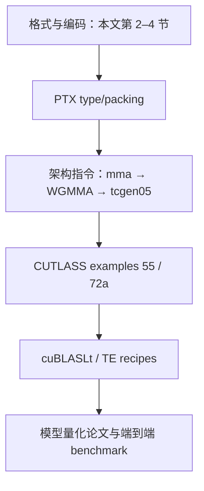

不要从某篇“4-bit 加速”博客直接跳到 inline PTX。先确认它指 INT4、NF4、MXFP4 还是 NVFP4，再确认目标 GPU 和实际 accumulator；大多数概念混淆都会在这两步被排除。

## 20. 最后一页速记

- FP16：`1/5/10`，max 65504；BF16：`1/8/7`，FP32 级范围。
- FP8：E4M3 max 448、精度优先；E5M2 max 57344、范围优先。
- FP6：E2M3 max 7.5；E3M2 max 28；常与 UE8M0 block32 组成 MXFP6。
- FP4 E2M1 非负值只有 `0,.5,1,1.5,2,3,4,6`。
- MXFP4：E2M1＋UE8M0/32，4.25 bit/value。
- NVFP4：E2M1＋UE4M3/16＋tensor FP32 scale，约 4.5 bit/value。
- W4A16：4-bit HBM weight → register dequant → F16/BF16 MMA。
- INT4 MMA：A4×B4→S32，和 W4A16 不是一回事。
- Hopper：FP8 WGMMA；新的 WGMMA 没有 INT4。
- SM100：`tcgen05`＋TMEM；SM120：扩展 warp `mma.sync`。
- 逻辑 bit、C++ wrapper、HBM packing、SMEM padding、register/TMEM container 分开算。
- benchmark 必须同时看 effective bytes、实际指令、误差和端到端融合成本。
