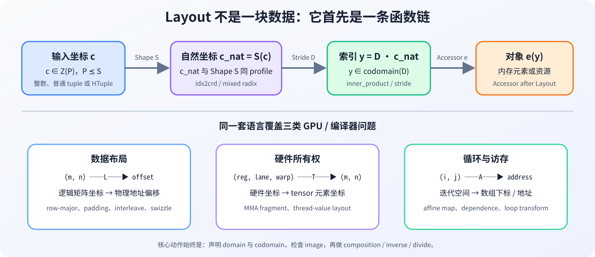
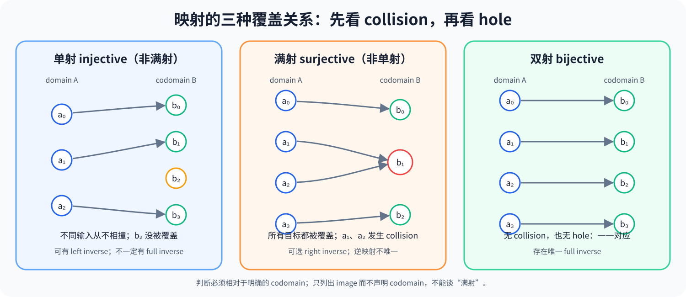
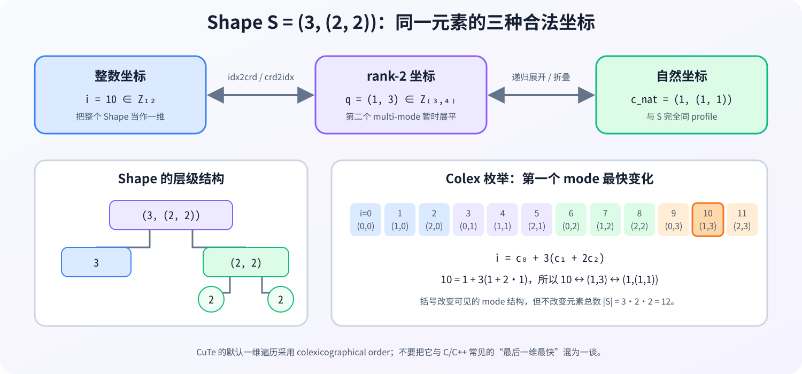
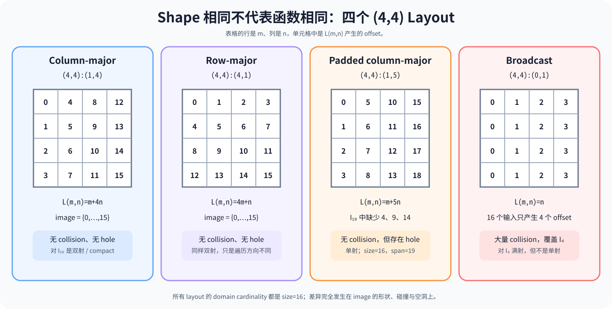
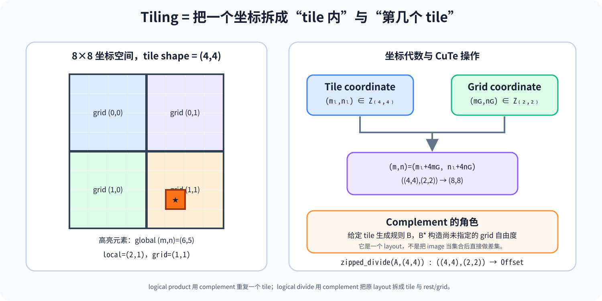
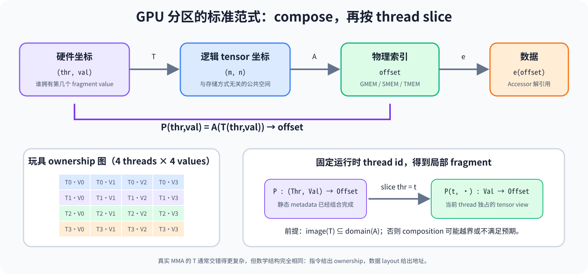
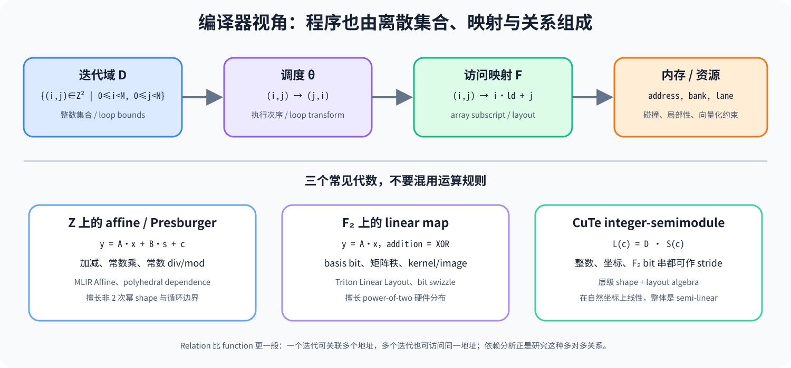

# GPU Layout 的数学基础

## 从离散坐标到 CuTe Layout Algebra，再到编译器索引变换

> 版本基线：Cris Cecka, *CuTe Layout Representation and Algebra*, arXiv:2603.02298v2，2026-07-29；核对日期：2026-08-21。
>
> 读者定位：已经掌握 C/C++、CUDA 的 thread / warp / CTA、寄存器与存储层次，也接触过 GEMM/MMA；没有系统学过离散数学。本文只补 layout 与编译器索引分析真正会用到的部分。

本文不是离散数学课程的缩写，也不是 CuTe API 手册。目标是建立一套可以直接用于推导的语言，使下面这些表达不再依赖死记：

- `Layout<Shape, Stride>` 为什么是函数；
- hierarchical shape 为什么不只是“嵌套 tuple”；
- `composition`、`coalesce`、`complement`、`logical_divide` 在保持什么性质；
- `left_inverse` 与 `right_inverse` 为什么不同；
- `(thread, value) → tensor coordinate → offset` 如何变成一个 layout；
- CuTe、Triton Linear Layout 与 MLIR Affine 分别使用哪套代数。

正文中的数学符号以 Cecka 论文为准，代码名以 CUTLASS/CuTe 为准。为了在 Typora 中稳定渲染，行内公式统一使用 `$...$`，独立公式统一使用 `$$...$$`。

### 阅读路线

| 目标 | 推荐章节 |
|---|---|
| 先看懂 `Shape:Stride` | 0 → 1 → 2.1–2.6 |
| 推导 CuTe layout algebra | 0 → 1 → 2 → 3 |
| 分析 MMA thread/value layout | 0 → 1 → 2 → 3.3–3.5 → 4 |
| 补编译器索引数学 | 1.1–1.7 → 2.4–2.6 → 5 |
| 调试一个真实 layout | 2 → 3 → 6 |

### 记号表

| 记号 | 含义 |
|---|---|
| $\mathbb Z$、$\mathbb N$、$\mathbb Z_+$ | 整数、非负整数、正整数 |
| $I_N$ 或 $\mathbb Z_N$ | $\{0,1,\ldots,N-1\}$；本文二者同义 |
| $\lvert S\rvert$ | shape $S$ 的元素总数，各叶子 extent 的乘积 |
| $\mathbb Z_S$ | 与 shape $S$ 同 profile 的自然坐标集合 |
| $\mathcal Z(S)$ | shape $S$ 接受的全部兼容坐标集合 |
| $S\sim D$ | HTuple $S$ 与 $D$ congruent，层级轮廓相同 |
| $P\lesssim S$ | $P$ weakly congruent with $S$，$P$ 比 $S$ 粗或相同 |
| $P\preceq S$ | shape $P$ compatible with $S$，$P$ 是 $S$ 的兼容粗化 |
| $\operatorname{image}(f)$ | 函数真正产生的输出集合 |
| $A\circ B$ | composition，先执行 $B$，再执行 $A$ |

---

## 0. 先建立总图：Layout 是什么？

最重要的结论只有一句：

> **Layout 首先是离散坐标空间之间的函数。**



*本文绘制。上方是 Cecka 论文的 $T=e\circ D\circ S$；下方说明内存 layout、硬件 ownership 和编译器访问映射只是 domain/codomain 不同。*

设一个矩阵的逻辑坐标为 $(m,n)\in I_M\times I_N$。row-major 内存布局是

$$
L_{\mathrm{row}}(m,n)=mN+n,
$$

column-major 内存布局是

$$
L_{\mathrm{col}}(m,n)=m+nM.
$$

二者的 domain 相同，都是逻辑矩阵坐标；函数不同，所以产生的 offset 顺序不同。`Shape` 描述可以输入哪些坐标，`Stride` 描述自然坐标的各分量如何贡献到输出。

GPU register layout 只是换了 domain 与 codomain：

$$
T:I_{Reg}\times I_{Lane}\times I_{Warp}
\longrightarrow I_M\times I_N.
$$

它回答“某个 register slot 归属于哪个 tensor element”，并不直接回答内存地址。若数据 layout 为

$$
A:I_M\times I_N\longrightarrow \mathbb Z,
$$

那么

$$
A\circ T:(reg,lane,warp)\longrightarrow offset
$$

才把硬件 ownership 与物理存储接起来。

以后遇到任何 layout，先写四件事：

1. domain 是什么；
2. codomain 是什么；
3. image 实际覆盖什么；
4. 要和哪个函数 composition。

这四件事没有说清，直接讨论 shape、stride 或 inverse，通常都会混乱。

---

## 1. 必要的离散数学

### 1.1 有限集合、基数与笛卡尔积

集合只描述“有哪些元素”。GPU 索引最常用的集合是从 0 开始的有限整数区间

$$
I_N=\{0,1,\ldots,N-1\}.
$$

例如

$$
I_4=\{0,1,2,3\}.
$$

它常表示“长度为 4 的对象有哪些合法下标”。集合的元素数量称为基数，竖线 $\lvert A\rvert$ 表示“数一数集合 $A$ 有几个元素”，所以

$$
\lvert I_4\rvert=4,
\qquad
\lvert I_N\rvert=N.
$$

若 $A$ 与 $B$ 是集合，它们的笛卡尔积为

$$
A\times B=\{(a,b)\mid a\in A,\ b\in B\}.
$$

这不是把两个集合拼接或求并集，而是从 $A$、$B$ 各取一个元素，组成所有可能的有序对。比如

$$
I_2\times I_3
=\{(0,0),(0,1),(0,2),(1,0),(1,1),(1,2)\},
$$

第一项有 2 种选择，第二项有 3 种选择，因此共有 $2\times3=6$ 个坐标。一般地，所有配对的数量等于两边选择数的乘积：

$$
\lvert A\times B\rvert=\lvert A\rvert\,\lvert B\rvert.
$$

因此 shape $(M,N)$ 对应一个有 $MN$ 个元素的离散坐标空间，而不是两个整数构成的“集合”。

### 1.2 Tuple 与 HTuple

tuple 是有序结构：

$$
(1,2)\ne(2,1).
$$

它与集合 $\{1,2\}$ 不同。CuTe 还使用 hierarchical tuple，简称 HTuple。递归定义为：

- 一个叶子值是 HTuple；
- 若 $X_0,\ldots,X_{r-1}$ 都是 HTuple，则 $(X_0,\ldots,X_{r-1})$ 也是 HTuple。

所以这些都是 HTuple：

```text
8
(4, 8)
(2, (4, 8))
((2, 2), (4, (2, 2)))
```

在 CuTe 中，tuple 最外层的每一项称为一个 `mode`（维度或分量）；一个 mode 内部还可以继续嵌套，这种嵌套项称为 multi-mode。例如 `(3,(2,2))` 有两个外层 mode：`3` 和 `(2,2)`。

三个量需要分开：

| 量 | 对 `S = (3,(2,2))` 的值 | 含义 |
|---|---:|---|
| `rank(S)` | 2 | 最外层 mode 数 |
| `depth(S)` | 2 | 最大嵌套深度 |
| `size(S)` | 12 | 全部叶子 extent 的乘积 |

`rank` 不是叶子数量。`(3,(2,2))` 有三个叶子，却是 rank-2 shape；第二个外层 mode 是一个 multi-mode。

### 1.3 函数、domain、codomain 与 image

先把函数记号逐项读开：

$$
f:A\to B.
$$

其中 $f$ 是函数名，$A$ 是 domain（定义域），$B$ 是 codomain（陪域）。它表示：允许从 $A$ 中输入一个元素，函数必须给出唯一一个属于 $B$ 的输出。

例如

$$
f:I_4\to I_7,
\qquad
f(x)=2x.
$$

因为 $I_4=\{0,1,2,3\}$、$I_7=\{0,1,2,3,4,5,6\}$，所以这个函数逐项做的是：

| 输入 $x$ | 输出 $f(x)$ |
|---:|---:|
| 0 | 0 |
| 1 | 2 |
| 2 | 4 |
| 3 | 6 |

三个集合不要混在一起：

| 名称 | 本例 | 它回答的问题 |
|---|---|---|
| domain | $I_4=\{0,1,2,3\}$ | 允许输入什么？ |
| codomain | $I_7=\{0,1,\ldots,6\}$ | 声明输出放在哪个集合？ |
| image | $\{0,2,4,6\}$ | 实际输出了什么？ |

`codomain` 是声明的一部分，`image` 是实际产生的集合：

$$
\operatorname{image}(f)=\{f(x)\mid x\in A\}\subseteq B.
$$

因此 image 是 codomain 中真正被命中的部分，不一定等于整个 codomain。对一个已经定义好的函数，image 当然已经确定；但使用同样 domain 和 codomain 的另一个函数，可以有不同的 image。

二者没有谁天然“更重要”：codomain 用于声明函数类型和检查 composition 能否连接，image 用于判断实际覆盖、collision 与 hole。

#### 单射、满射与双射



*本文绘制。GPU layout 中可把 collision 理解为多个逻辑元素落到同一 slot，把 hole 理解为目标区域中没有被访问的 slot。*

| 性质 | 定义 | 工程直觉 |
|---|---|---|
| 单射 injective | $f(x_1)=f(x_2)\Rightarrow x_1=x_2$ | 不同输入不 collision |
| 满射 surjective | $\forall y\in B,\ \exists x\in A:f(x)=y$ | codomain 中没有 hole |
| 双射 bijective | 同时单射与满射 | 一一对应，可完整求逆 |

“是否满射”必须相对于声明的 codomain。只给公式 $f(x)=2x$ 而不声明 $B$，不能严谨地判断满射。

有限集合还有两个实用结论：

- 若 $\lvert A\rvert>\lvert B\rvert$，任何 $f:A\to B$ 都不可能单射；这就是抽屉原理。
- 若 $\lvert A\rvert<\lvert B\rvert$，任何 $f:A\to B$ 都不可能满射。

做 layout 检查时，先比较 cardinality，常能在算 stride 前排除错误方案。

### 1.4 Identity 与 composition

集合 $A$ 上的恒等函数记作 $\operatorname{id}_A$，有些资料也写成 $I_A$：

$$
\operatorname{id}_A:A\to A,
\qquad
\operatorname{id}_A(x)=x.
$$

它的作用就是原样返回输入。本文优先写 $\operatorname{id}_A$，避免和有限索引集合 $I_N=\{0,\ldots,N-1\}$ 混淆。

若

$$
f:X\to Y,\qquad g:Y\to Z,
$$

则 composition 为

$$
g\circ f:X\to Z,
$$

并满足

$$
(g\circ f)(x)=g(f(x)).
$$

它只是把两个函数接起来：

$$
x\xrightarrow{f}f(x)\xrightarrow{g}g(f(x)).
$$

函数复合永远从右向左执行：$g\circ f$ 先用 $f$，再用 $g$。对应 CuTe：

```cpp
composition(A, B);  // A ∘ B
A.compose(B);       // 同上
```

composition 的第一道检查不是代数计算，而是 type check：右侧函数的输出必须是左侧函数能接受的输入。上例中，$f$ 输出到 $Y$，而 $g$ 正好从 $Y$ 接收输入。

普通函数在定义域匹配时满足结合律：

$$
A\circ(B\circ C)=(A\circ B)\circ C.
$$

CuTe 允许在 extended domain 上评价 out-of-bounds 坐标，且不是每次 composition 都能压回一个 `Shape:Stride`；因此第 3.3 节会补充它的可表示性与结合律前提。

### 1.5 Full inverse、left inverse 与 right inverse

Inverse 不是第三种神秘运算，而是一个函数相对于另一个函数的身份。两个函数 composition 后，如果能抵消前面的变化、恢复原值，其中一个就扮演 inverse。

若 $f:A\to B$ 是双射，则存在唯一 full inverse

$$
f^{-1}:B\to A
$$

满足

$$
f^{-1}\circ f=\operatorname{id}_A,
\qquad
f\circ f^{-1}=\operatorname{id}_B.
$$

一般函数未必双射，于是要把两个方向分开。

| 名称 | 条件 | 对 $f$ 的必要性质 | 含义 |
|---|---|---|---|
| left inverse $g$ | $g\circ f=\operatorname{id}_A$ | $f$ 单射 | 先前向，再恢复输入 |
| right inverse $h$ | $f\circ h=\operatorname{id}_B$ | $f$ 满射 | 每个目标选一个原像 |

名字按 inverse 写在 $f$ 的哪一侧判断，不按箭头朝向背。

例一：$f:I_4\to I_7,\ f(x)=2x$ 是单射。可定义

$$
g:I_7\to I_4,\qquad g(y)=\left\lfloor\frac{y}{2}\right\rfloor,
$$

于是

$$
x\xrightarrow{f}2x\xrightarrow{g}
\left\lfloor\frac{2x}{2}\right\rfloor=x.
$$

例如 $3\to6\to3$。因此对所有 $x\in I_4$，都有

$$
g(f(x))=x,
\qquad
g\circ f=\operatorname{id}_{I_4}.
$$

这里 $g$ 是函数名，left inverse 是 $g$ 相对于 $f$ 的身份。组合后“最终没有变化”正是 inverse 的目的：它保证经过 $f$ 后没有丢失输入信息，之后还能恢复。

奇数不在 $f$ 的 image 中，$g$ 在这些点取什么值不影响 left-inverse 条件。反方向也不成立，例如

$$
f(g(1))=f(0)=0\ne1,
$$

所以 $g$ 只是 left inverse，不是完整的 $f^{-1}$。

例二：$q:I_4\to I_2,\ q(x)=x\bmod2$ 是满射，它的全部映射是

$$
q(0)=0,\quad q(1)=1,\quad q(2)=0,\quad q(3)=1.
$$

可以选择第一个 right inverse

$$
h_1:I_2\to I_4,
\qquad
h_1(0)=0,\ h_1(1)=1.
$$

也可以选择另一个函数

$$
h_2:I_2\to I_4,
\qquad
h_2(0)=2,\ h_2(1)=3.
$$

两者分别满足

$$
0\xrightarrow{h_1}0\xrightarrow{q}0,
\qquad
1\xrightarrow{h_1}1\xrightarrow{q}1,
$$

以及

$$
0\xrightarrow{h_2}2\xrightarrow{q}0,
\qquad
1\xrightarrow{h_2}3\xrightarrow{q}1.
$$

所以 $q\circ h_1=\operatorname{id}_{I_2}$、$q\circ h_2=\operatorname{id}_{I_2}$。不是同一个 $h$ 的 image 突然改变了，而是存在两个不同的 right inverse；$h_1$ 的 image 是 $\{0,1\}$，$h_2$ 的 image 是 $\{2,3\}$。

CuTe 的 `left_inverse` / `right_inverse` 还允许广义伪逆；不要仅凭本节的标准定义猜它们返回的 shape，第 3.5 节会精确定义。

### 1.6 Relation、等价关系与偏序

函数要求每个输入恰好对应一个输出；关系 relation 更宽，只负责记录“哪些元素之间有关联”。在集合语言中，$A$ 到 $B$ 的关系就是从 $A\times B$ 中把有关联的有序对挑出来：

$$
R\subseteq A\times B.
$$

函数也能写成这种有序对集合 $\{(a,f(a))\mid a\in A\}$，但普通关系还允许一对多、多对一和多对多，所以比函数更一般。

自反、对称、传递等性质需要比较同一个集合内的元素，此时关系写成

$$
R\subseteq A\times A.
$$

记号

$$
a\mathrel{R}b
\quad\Longleftrightarrow\quad
(a,b)\in R
$$

表示“$a$ 与 $b$ 有关系”。例如 $A=\{1,2,3\}$，规定 1、2 属于同一组，3 单独一组，那么“同组”关系是

$$
R=\{(1,1),(1,2),(2,1),(2,2),(3,3)\}.
$$

例如 $(1,2)\in R$ 表示 1 和 2 同组，$(1,3)\notin R$ 表示 1 和 3 不同组。

判断关系性质时，只需检查下面几条规则：

| 性质 | 公式 | 不省略的读法 |
|---|---|---|
| 自反 reflexive | $\forall a\in A,\ (a,a)\in R$ | 每个元素都必须与自己有关系 |
| 对称 symmetric | $(a,b)\in R\Rightarrow(b,a)\in R$ | 交换前后，关系仍成立 |
| 传递 transitive | $(a,b),(b,c)\in R\Rightarrow(a,c)\in R$ | 能经过中间元素接力，就必须有直接关系 |
| 反对称 antisymmetric | $(a,b),(b,a)\in R\Rightarrow a=b$ | 不同元素不能同时具有双向关系 |

上面的“同组”关系是自反的，因为 $(1,1),(2,2),(3,3)$ 全部在 $R$ 中；是对称的，因为 $(1,2)$ 与 $(2,1)$ 成对出现；也是传递的，因为同一组内经过中间元素后仍在同一组。

同时满足自反、对称、传递的关系称为等价关系。它的用途是按照某个标准，把元素分成互不重叠的等价类。上例的两个等价类就是

$$
\{1,2\},
\qquad
\{3\}.
$$

同时满足自反、反对称、传递的关系称为偏序。最熟悉的例子是 $\le$：如果 $a\le b$ 且 $b\le a$，只能有 $a=b$。注意“反对称”不是“反过来一定不成立”，而是说不同元素不能双向同时成立；偏序也不要求任意两个元素都能比较。

这些定义在 CuTe 中不是单独执行的 GPU 操作，而是用来描述 shape 的结构关系。HTuple congruence $\sim$ 按层级 profile 分组；shape compatibility $\preceq$ 表示一种从粗坐标结构到细坐标结构的先后关系。第 2.2–2.3 节会把它们落实到具体 shape。

### 1.7 `div`、`mod` 与 mixed radix

`div` 取商，`mod` 取余数。对整数 $i$ 和正整数 $N$，总能唯一写成

$$
i=qN+r,\qquad 0\le r<N,
$$

其中

$$
q=i\mathbin{\mathrm{div}}N,
\qquad
r=i\bmod N.
$$

例如 $17=2\times6+5$，所以

$$
17\mathbin{\mathrm{div}}6=2,
\qquad
17\bmod6=5.
$$

这些运算用于在一维编号 $i$ 与多维坐标 $(c_0,c_1,\ldots)$ 之间来回转换：

```text
一维编号 i  --delinearize / idx2crd-->  多维坐标 c
一维编号 i  <--linearize / crd2idx--    多维坐标 c
```

先翻译本节术语：

| 英文 | 本文含义 |
|---|---|
| mode | shape 的一个维度或分量 |
| radix | 该 mode 的基数；若 extent 是 $S_r$，坐标可取 $0,\ldots,S_r-1$ |
| mixed radix | 各 mode 的 radix 可以不同，即混合进制 |
| enumeration | 按顺序枚举所有坐标 |
| colexicographical order | CuTe 的枚举顺序：$c_0$ 最快变化 |

若 shape 为 $(S_0,S_1,\ldots,S_{R-1})$，并约定第 0 个 mode 最快变化，则对合法编号

$$
0\le i<\prod_{r=0}^{R-1}S_r,
$$

它的第 $r$ 个坐标为

$$
c_r=\left\lfloor
\frac{i}{\prod_{k<r}S_k}
\right\rfloor\bmod S_r,
$$

其中

$$
\prod_{k<r}S_k=S_0S_1\cdots S_{r-1}.
$$

当 $r=0$ 时，条件 $k<0$ 选不到任何因子，数学规定空乘积等于 1：

$$
\prod_{k<0}S_k=1.
$$

这不是说 $S_0=1$，而只是说 $c_0$ 的分母为 1。因此前几个坐标展开为

$$
\begin{aligned}
c_0&=i\bmod S_0,\\
c_1&=\left\lfloor\frac{i}{S_0}\right\rfloor\bmod S_1,\\
c_2&=\left\lfloor\frac{i}{S_0S_1}\right\rfloor\bmod S_2.
\end{aligned}
$$

反向把多维坐标折叠成一维编号：

$$
i=\sum_{r=0}^{R-1}c_r\prod_{k<r}S_k.
$$

例如 shape $(2,3)$ 中，$c_0$ 的 radix 是 2，$c_1$ 的 radix 是 3。CuTe 按 colexicographical order 枚举：

| $i$ | $(c_0,c_1)$ |
|---:|---:|
| 0 | $(0,0)$ |
| 1 | $(1,0)$ |
| 2 | $(0,1)$ |
| 3 | $(1,1)$ |
| 4 | $(0,2)$ |
| 5 | $(1,2)$ |

$c_0$ 像个位一样先变化；到达 radix 2 后归零，并向 $c_1$ 进一位。对应折叠公式是

$$
i=c_0+2c_1.
$$

这与 C/C++ 多维数组常见的“最后一维最快”不是一回事。这里讲的是 shape 如何枚举坐标；真正映到什么内存顺序，仍由 stride 决定。

### 1.8 为什么论文需要 integer-semimodule？

先只记核心公式。若自然坐标为 $c=(c_0,c_1,\ldots)$，stride 为 $D=(d_0,d_1,\ldots)$，layout 计算

$$
L(c)=c_0d_0+c_1d_1+\cdots.
$$

每一项 $c_rd_r$ 表示“沿第 $r$ 个 mode 走 $c_r$ 步所产生的变化”，最后把各个 mode 的变化相加。

普通内存 layout 的 stride 是整数。例如

$$
L=(4,3):(1,4)
$$

满足

$$
L(c_0,c_1)=c_0\cdot1+c_1\cdot4.
$$

所以 $L(2,1)=6$，输出是一个整数 memory offset。此时每个 stride 叶子和最终输出都是整数，因此

$$
M=\mathbb Z.
$$

但 GPU layout 有时希望输出二维坐标，而不是整数地址。例如令

$$
d_0=(1,0),
\qquad
d_1=(0,1),
$$

则

$$
L(2,1)=2(1,0)+1(0,1)=(2,1).
$$

同一个公式仍然成立，只是每个 stride 叶子和最终输出变成了二维整数向量，此时 $M=\mathbb Z^2$。swizzle 还可能让输出成为 bit 串，并把上式中的加法解释成 XOR。

因此，$M$ 可以先理解为“stride 和 layout 输出所属的集合或数据类型”。论文不把 $M$ 限死为整数，而只要求里面的元素能完成 layout 公式真正需要的运算。这类结构称为 integer-semimodule。

对本文而言，只需记住 $M$ 支持：

| 要求 | 直觉 |
|---|---|
| 可结合的加法 $M\times M\to M$ | 两个 mode 的贡献能够相加，先加哪一对不影响结果 |
| 整数数乘 $\mathbb Z\times M\to M$ | 坐标 $c_r$ 能够把 stride $d_r$ 缩放为 $c_rd_r$ |
| $1m=m$ | 沿某个 stride 走一步，得到它本身 |
| $a(bm)=(ab)m$ | 分两次缩放与一次缩放的结果一致 |

Cecka 论文采用的定义不强制加法单位元与逆元；这是为了容纳比传统 module 更宽的 stride 类型。常见实例为：

| $M$ | 加法 / 数乘 | layout 输出 |
|---|---|---|
| $\mathbb Z$ | 普通整数运算 | memory offset |
| $\mathbb Z^m$ 或 coordinate HTuple | 分量运算 | 多维 tensor coordinate |
| $\mathbb F_2^m$ | 加法为 XOR，乘法按 bit 的模 2 运算 | bit permutation / swizzle |

所以第一次阅读时不必先学习完整抽象代数，只需记住：

> stride 不一定是整数；只要它能被整数坐标缩放，而且缩放结果能够相加，CuTe 就能用同一个“坐标与 stride 的内积”公式产生整数 offset、tensor coordinate 或 swizzle bit。

---

## 2. CuTe Layout 的表示

### 2.1 Shape 是正整数 HTuple

论文定义 shape 为

$$
S\in\operatorname{HTuple}(\mathbb Z_+).
$$

它的 size 是全部叶子元素之积：

$$
\lvert S\rvert=\prod_{s\in\operatorname{leaves}(S)}s.
$$

例如

```text
S = (3, (2, 2))
rank(S)  = 2
depth(S) = 2
size(S)  = 12
```

Shape 不只是容器；它同时规定了一族合法坐标空间。层级越细，保留的逻辑边界越多。

### 2.2 Congruence 与 weak congruence

Congruence 回答的是：两个 HTuple 的**括号结构是否相同**。这里的 profile（层级轮廓）只记录哪里是叶子、哪里是 tuple，以及每层 tuple 有几项；它不记录叶子里的具体数值。

两个 HTuple congruent，记作 $P\sim S$，递归判断规则是：

- 二者都是叶子；或
- 二者都是相同 rank 的 tuple，且对应子项递归 congruent。

例如

$$
(4,(2,3))\sim(7,(9,5)),
$$

因为两边的结构都是

```text
(叶子, (叶子, 叶子))
```

递归配对关系为

```text
4  ↔ 7
2  ↔ 9
3  ↔ 5
```

每一对都是“叶子对叶子”，所以 congruent。它不是只比较最外层 `len`；下面两边最外层 `len` 都是 2、叶子总数也都是 3，但嵌套位置不同：

$$
(4,(2,3))\nsim((4,2),3).
$$

自反性在这里的具体体现是，任意 HTuple 都与自己 congruent：

$$
S\sim S.
$$

例如把 $(4,(2,3))$ 与自身递归比较时，每一层的 rank、嵌套位置和叶子位置当然都一致。对称性表示 $P\sim S$ 就有 $S\sim P$；传递性表示 $P\sim S$ 且 $S\sim T$ 就有 $P\sim T$。因此“相同 profile”是等价关系，可以把所有 HTuple 按层级结构分组。

这在 CuTe 中不是额外的运行时计算，而是 shape 与 stride 能否逐层配对的结构条件。例如

$$
S=(4,(2,3)),
\qquad
D=(1,(4,8))
$$

满足 $S\sim D$，所以三个 shape 叶子能分别配对三个 stride 叶子。对应 C++ 检查是：

```cpp
static_assert(congruent(my_shape, my_stride));
```

Weak congruence 记作 $P\lesssim S$，允许 $P$ 用一个叶子粗化 $S$ 的任意子树。比如

$$
12\lesssim(3,4)\lesssim(3,(2,2)).
$$

可以把这条链读成：单个叶子 `12` 最粗，`(3,4)` 展开一层，`(3,(2,2))` 又把第二个 mode 展开一层。它回答“左边的坐标层级是否不比右边更细”，不要求叶子 extent 相等。真正用于判断 shape 能否接受某种粗坐标时，还要加入 size 条件，这就是下一节的 compatibility。

### 2.3 Shape compatibility

Compatibility 记作 $P\preceq S$。它在 weak congruence 的结构要求之外，还要求每次被折叠的子树 size 相同：

$$
P\preceq S
\iff
\begin{cases}
P\in\mathbb Z_+\ \text{且}\ P=\lvert S\rvert, & P\text{ 是叶子};\\
\operatorname{rank}(P)=\operatorname{rank}(S)\ \text{且}\ P_i\preceq S_i, & \text{二者是 tuple}.
\end{cases}
$$

公式可以按两种情况读：

- 如果左边 $P$ 是一个叶子，它要代表右边整棵子树，所以 $P$ 必须等于右边子树的 size；
- 如果两边都是 tuple，它们的最外层 rank 必须相同，再逐项递归检查。

典型链为

$$
12\preceq(3,4)\preceq(3,(2,2)).
$$

第一步成立是因为 $12=3\times4$；第二步中，第一个 mode 保持为 3，第二个 mode 则由 $4=2\times2$ 展开成 `(2,2)`。三种 shape 都描述同样的 12 个位置，只是坐标层级由粗到细。

因此 shape $(3,(2,2))$ 至少接受三类坐标：

```text
integral:  i ∈ Z₁₂
rank-2:    (a,b) ∈ Z₍₃,₄₎
natural:   (a,(b,c)) ∈ Z₍₃,(₂,₂)₎
```

同 size 不代表 compatible。例如 $(2,6)$ 与 $(3,4)$ 都有 12 个元素，但二者 rank-2 mode 的 extent 无法逐项兼容，所以互不满足 $\preceq$；它们只共享更粗的 integral shape 12。

所有与 $S$ 兼容的 shape 所产生的坐标集合，合称 $\mathcal Z(S)$。若 $P\preceq S$，则 $\mathcal Z(P)\subseteq\mathcal Z(S)$。

### 2.4 Shape 是坐标系统之间的双射

Shape 的函数角色是把任意兼容坐标转换成 natural coordinate。自然坐标与 $S$ congruent。



*本文绘制。例子严格采用论文的 colex 顺序：shape $(3,(2,2))$ 中，$10\leftrightarrow(1,3)\leftrightarrow(1,(1,1))$。*

对 flat shape $(S_0,\ldots,S_{R-1})$，`idx2crd` 使用第 1.7 节的 mixed-radix 公式；对 HTuple 则递归应用。其逆 `crd2idx` 递归折叠。

所以对每个兼容坐标集合 $Z\in\mathcal Z(S)$，shape 都提供双射

$$
S:Z\longleftrightarrow\mathbb Z_S.
$$

这解释了 CuTe 一个很特别的行为：rank-2 layout 可以接受一个整数坐标，层级 layout 也可以接受较粗的 tuple 坐标。不同写法只是同一个元素在不同坐标系统中的名字。

### 2.5 Stride 是从自然坐标到 codomain 的线性映射

Stride $D$ 必须与 shape congruent：

$$
S\sim D.
$$

若自然坐标为 $\tilde c$，stride 通过递归内积得到输出：

$$
D(\tilde c)=D\cdot\tilde c
=\sum_i D_i\cdot\tilde c_i.
$$

对普通整数 stride，flat 情况就是

$$
D\cdot\tilde c=\sum_{i=0}^{R-1}\tilde c_iD_i.
$$

例如

$$
S=(3,(2,2)),\qquad D=(3,(12,1)),
$$

则自然坐标 $(i,(j,k))$ 产生

$$
D\cdot(i,(j,k))=3i+12j+k.
$$

当 stride 元素是二维 basis $e_0=(1,0),e_1=(0,1)$ 时，输出不再是整数 offset，而可以是坐标：

$$
(M,N):(e_0,e_1),\qquad (m,n)\mapsto(m,n).
$$

这类 coordinate layout 对 thread ownership、TMA 坐标和 layout conversion 很重要。

### 2.6 Layout 的第一性定义

CuTe layout 是 shape 与 stride 的函数复合：

$$
L=D\circ S,
\qquad S\sim D.
$$

对输入坐标 $c\in Z$，其中 $Z\in\mathcal Z(S)$：

$$
L(c)=D(S(c))=D\cdot\tilde c.
$$

常见记法完全等价：

$$
S:D
\quad\equiv\quad
\frac{S}{D}
\quad\equiv\quad
D\circ S.
$$

在 C++ 中：

```cpp
auto L = make_layout(
    make_shape (_4{}, _8{}),
    make_stride(_1{}, _4{}));  // (4,8):(1,4)
```

该 layout 的有限 in-bounds domain 是 $\mathcal Z(S)$ 中各个等价坐标集合；为枚举方便，通常取 integral domain $I_{\lvert S\rvert}$。codomain 由 stride 所在的 integer-semimodule 决定，常见为无限集合 $\mathbb Z$ 或 $\mathbb Z^m$。实际 image 才是有限的：

$$
\operatorname{image}(L)
=L(I_{\lvert L\rvert})
\subseteq\operatorname{codomain}(L).
$$

#### 为什么称为 semi-linear？

在 natural coordinate 上，shape 是 identity，因此

$$
L(\alpha\tilde c_0+\beta\tilde c_1)
=\alpha L(\tilde c_0)+\beta L(\tilde c_1).
$$

但对任意兼容的粗坐标，`idx2crd` 含有 carry、`div` 与 `mod`，一般不满足

$$
S(c_0+c_1)=S(c_0)+S(c_1).
$$

所以 layout 在自然坐标上是线性的，连同 shape 坐标变换看则是 semi-linear。这个区别解释了为什么 layout algebra 很像线性代数，却不能无条件套用普通矩阵规则。

### 2.7 四类 image：compact、padded、broadcast、hierarchical



*本文绘制。四个 layout 的 `size` 都是 16，但 image 的覆盖与碰撞性质不同。*

需要严格区分：

| 量 | 数学含义 | 对 `(4,4):(1,5)` |
|---|---|---:|
| `size(L)` | integral domain 的基数 $\lvert S\rvert$ | 16 |
| `image(L)` | 实际产生的 offset 集合 | $\{0,1,2,3,5,\ldots,18\}$ |
| image cardinality | 不同输出数量 | 16 |
| offset span | 从 0 直接寻址所需范围 | 19 |
| `cosize(L)` | CuTe 的库级计算量，常写作 $L(\lvert L\rvert-1)+1$ | 19 |

`cosize` 不是集合论意义上的 codomain cardinality。数学 codomain 常是无限的 $\mathbb Z$；对非单调、负 stride、swizzle 或其他广义 codomain，也不能不加条件地把 `cosize` 当作 `max(image)+1`。分配与验证时要按具体 layout 契约使用它。

层级 shape 能表示 flat stride 无法表示的折叠。例如

$$
L=(2,(2,2)):(4,(2,1))
$$

作为逻辑 $2\times4$ 矩阵，其 offset 表为

```text
0  2  1  3
4  6  5  7
```

第二个逻辑 mode 内的相邻差为 $2,-1,2$，不存在一个 flat stride 能描述它；hierarchical stride `(2,1)` 却直接保留了内部两层结构。

### 2.8 Tensor、Accessor、folding 与 slicing

Accessor $e$ 支持 offset 与解引用。Tensor 定义为

$$
T=e\circ L.
$$

因此 `tensor(c)` 的逻辑是：

1. shape 把 $c$ 转成自然坐标；
2. stride 把自然坐标转成 offset；
3. accessor 用 offset 取得对象。

这让算法只写逻辑坐标，存储细节留在 layout 中。

#### Tensor folding

考虑物理上 8 个元素的 rank-3 view：

```text
Shape : (2,2,2)
Stride: (2,1,4)
```

把第三个 mode 折叠进第二个逻辑 mode，可得到 rank-2 view：

```text
Shape : (2,(2,2))
Stride: (2,(1,4))
```

这是逻辑 $2\times4$ 矩阵，但第二个 mode 没有单一 flat stride。folding 只改变坐标解释，不要求搬动数据。论文利用这一点把一般 tensor contraction 的 modes 分成 row、column、reduction、batch 四类，再折叠为统一的 batched-GEMM 形式。

#### Slicing

Slicing 固定某些坐标并保留其余自由度。例如

```cpp
auto column = tensor(_, n);  // 固定 n，保留第 0 mode
auto item   = tensor(m, n);  // 全部固定，得到标量引用
```

在 GPU partition 中，常见模式是先 composition 得到 `(thread,value) → offset`，再固定运行时 `thread_id`，留下当前线程的 value tensor。第 4.2 节会完整展开。

---

## 3. Layout Algebra

Layout algebra 的操作不是“随便改 tuple”。每个操作都接收 layout，并返回满足明确函数性质的新 layout。最有效的学习方式是先记 post-condition，再看实现算法。

### 3.1 Concatenate：把多个独立贡献相加

设 layout $L=S:D$ 的顶层 sublayouts 为 $L_0,\ldots,L_{R-1}$，则

$$
L=(L_0,L_1,\ldots,L_{R-1})
$$

并满足

$$
L(c_0,\ldots,c_{R-1})
=\sum_{r=0}^{R-1}L_r(c_r).
$$

例如

$$
L_0=4:1,\qquad L_1=3:4,
$$

concatenate 后

$$
(L_0,L_1)=(4,3):(1,4),
$$

评价为 $L(i,j)=i+4j$。

所有 sublayout 的输出必须能在同一个 integer-semimodule 中相加。`4:2` 与 `3:5` 都输出整数，可以 concatenate；输出整数的 `4:2` 与输出二维坐标的 `3:e_0` 不能直接 concatenate。

Concatenate 保留括号，因此也是构造 hierarchy 的基本动作：

```cpp
auto row = make_layout(Layout<_4,_1>{}, Layout<_3,_4>{});
// (4,3):(1,4)

auto wrapped = make_layout(row);
// ((4,3)):((1,4))，rank 从 2 变为 1，size 不变
```

### 3.2 Coalesce：保留一维函数，删除多余结构

给定 layout $A$，其 coalesced layout $R$ 满足：

$$
\lvert R\rvert=\lvert A\rvert,
$$

$$
\operatorname{depth}(R)\le1,
$$

$$
\forall i\in I_{\lvert A\rvert},\qquad R(i)=A(i).
$$

也就是说，`coalesce` 把 layout 当作“一维整数输入的函数”来化简。它可以丢失 rank、括号与逻辑 mode 信息，但不能改变 integral evaluation。

对普通非负整数 stride，一个核心合并规则是：若相邻 flat modes 为

$$
(s_i,s_j):(d_i,d_j)
$$

且

$$
d_j=s_i d_i,
$$

则它们按 colex 顺序连续，可以合并为

$$
s_is_j:d_i.
$$

extent 为 1 的 mode 不贡献新坐标，stride 为 0 的 mode 需要按 broadcast 规则处理。

论文中的例子：

$$
(2,(1,6)):(1,(6,2))
\xrightarrow{\operatorname{coalesce}}
12:1.
$$

过程是先去掉 shape-1 mode，得到 $(2,6):(1,2)$，再因 $2=2\cdot1$ 合并为 `12:1`。

如果后续算法仍需区分矩阵的 row/column，不能对整个 layout 盲目 coalesce。可按 mode 分别 coalesce，使外层语义保留。

### 3.3 Composition：layout algebra 的中心操作

给定 layout $A$ 与 $B$，group composition $R=A\circ B$ 的核心契约是

$$
\forall c\in\mathcal Z(B),\qquad R(c)=A(B(c)).
$$

$B$ 决定输入坐标结构，$A$ 决定输出类型。因此应先写 type signature：

$$
B:X\to Y,
\qquad
A:Y\to Z,
\qquad
A\circ B:X\to Z.
$$

#### 最简单的 rank-1 例子

令

$$
A=8:3,\qquad B=4:2.
$$

因为 $A(k)=3k$、$B(i)=2i$，所以

$$
(A\circ B)(i)=A(2i)=6i,
$$

结果为

$$
A\circ B=4:6.
$$

rank-1 左 layout 没有 mixed-radix 边界，composition 只是 stride 相乘。多 mode 情况复杂，正是因为 $B(c)$ 穿过 $A$ 的 mode 边界时要执行 `idx2crd`。

#### 数据 layout 与 ownership layout

若

$$
T:(thread,value)\to tensor\_coord
$$

描述硬件 ownership，

$$
A:tensor\_coord\to offset
$$

描述数据存储，则

$$
A\circ T:(thread,value)\to offset
$$

直接给出每个 thread/value 的数据地址。这是 CuTe partition、MMA fragment 和 copy atom 中最常见的 composition。

#### 结合律需要有效的中间 image

对普通合法函数，composition 自动满足结合律。CuTe 还允许在 extended domain 上评价 out-of-bounds 坐标。论文给出的充分条件是

$$
\operatorname{image}(C)\subseteq\operatorname{domain}(B),
\qquad
\operatorname{image}(B)\subseteq\operatorname{domain}(A).
$$

满足这些条件时

$$
A\circ(B\circ C)=(A\circ B)\circ C.
$$

如果中间 image 越界，两边可能都“能算出一个值”，却不再表示同一个合法函数链。工程上不要把“模板成功实例化”当作 domain 合法性的证明。

#### 为什么并非所有 composition 都能压成一个 `Shape:Stride`？

数学函数 $A(B(c))$ 总能逐点评价，但结果未必还能由单个 CuTe layout 表示。论文对基础情形给出了可计算的整除条件。

设 coalesced 左 layout 为

$$
A=(S_0,S_1,\ldots,S_R):(D_0,D_1,\ldots,D_R),
$$

定义 shape 的 exclusive prefix product

$$
\bar S_r=\prod_{k<r}S_k,
$$

右 layout 为 $B=s:d$。在先截断到实际会访问的 $A$ 前缀后，一组充分条件是：

$$
\bar S_r\mid d\quad\text{或}\quad d\mid\bar S_r,
$$

以及

$$
\left\lceil\frac{\bar S_r}{d}\right\rceil\mid s.
$$

第一组保证“每隔 $d$ 个元素取一次”不会在某个 mixed-radix 边界中产生不可表示的切口；第二组保证结果 shape 的 extent 仍是整数。

例如

$$
(4,6,8):(2,3,5)\circ 6:3
$$

在 prefix boundary 4 处失败，因为 3 与 4 互不整除。不存在一个单独的 `Shape:Stride` 能表示跨该边界的“每第三个元素”。这通常意味着 tiler 与数据层级不兼容，而不只是实现能力不足。

论文中一个可表示的例子是

$$
(4,6,8,10):(2,3,5,7)\circ6:12
=(2,3):(9,5).
$$

实际使用时不必手推完整算法，但看到 composition 的 static assertion，应优先检查 coalesce 后的 mode boundary、stride divisibility 与 shape divisibility。

### 3.4 By-mode composition 与 Tiler

很多操作希望分别作用于矩阵的 M、N modes。若 $A=(A_0,A_1)$，可写

$$
A\circ\langle B,C\rangle
=(A_0\circ B,\ A_1\circ C).
$$

尖括号表示一个 tiler，而不是把 $B,C$ 的输出直接相加。论文定义 tiler 为 HTuple，其中每个叶子可以是：

- 一个 layout $S:D$；
- 一个整数 $S$，等价于连续 layout $S:1$。

因此下面几种写法在 by-mode composition 中等价：

$$
(4,8)
\equiv\langle4,8\rangle
\equiv\langle4:1,8:1\rangle
\equiv(4,8):(e_0,e_1).
$$

对一个兼容 shape $(8,16)$ 的 layout，tiler $\langle4,8\rangle$ 选取每个 mode 的前 4、8 个元素；$\langle4:2,8:2\rangle$ 则按 stride 2 选取。单独的 composition 只得到被选中的 sublayout，不会自动生成“剩余有多少 tiles”；后者需要 complement 与 divide。

### 3.5 CuTe 的 right inverse 与 left inverse

论文使用广义逆，以便处理 padded、broadcast 与坐标 codomain。先区分两个定义。

#### Right-(pseudo)inverse

layout $L$ 的 right inverse 记作 $L^{\ddagger}$，是一个 injective layout，并满足

$$
L^{\ddagger}\circ L\circ L^{\ddagger}=L^{\ddagger}.
$$

在最常见的整数 codomain 中，CuTe 选择 $L^{\ddagger}$ 的 domain 为一段连续整数前缀，于是条件简化为

$$
\forall k\in I_{\lvert L^{\ddagger}\rvert},
\qquad
L(L^{\ddagger}(k))=k.
$$

`right_inverse(L)` 通常返回 size 最大的这种 layout。它回答：从 offset 0 开始，有多长的连续前缀能够被 $L$ 准确定位？

#### Left-(pseudo)inverse / quasi-inverse

left inverse 记作 $L^{\dagger}$，满足

$$
L\circ L^{\dagger}\circ L=L.
$$

若 $L$ 是 injective，就恢复标准 left inverse：

$$
\forall k\in I_{\lvert L\rvert},
\qquad
L^{\dagger}(L(k))=k.
$$

若 $L$ 不是 injective，`left_inverse` 只是 quasi-inverse：它可以选某个代表原像，但不能凭输出恢复发生 collision 前的唯一输入。

#### 对比例子

| $L$ | `right_inverse(L)` | `left_inverse(L)` | 解释 |
|---|---|---|---|
| `(4,8):(1,4)` | `32:1` | `32:1` | 对 $I_{32}$ 是 identity |
| `(4,8):(8,1)` | `(8,4):(4,1)` | `(8,4):(4,1)` | compact permutation |
| `(4,8):(1,5)` | `4:1` | `(5,8):(1,4)` | right 只覆盖 offset 0–3；left 跨过 padding holes 恢复全部输入 |

当 $L$ 对 $I_{\lvert L\rvert}$ 是双射时，左右逆相同，论文称这种 layout 为 compact。

#### 两个重要应用

向量化 copy 希望源 layout $A$ 与目标 layout $B$ 的前 $K$ 个物理 offset 对应相同逻辑坐标：

$$
\forall k\in I_K,
\qquad
A^{\ddagger}(k)=B^{\ddagger}(k).
$$

CuTe 可通过检查 $A\circ B^{\ddagger}$ 或 $B\circ A^{\ddagger}$ 的 identity 前缀，求最大安全 vector width。

指令 admissibility 则反过来。若数据 layout $A$ 与指令 offset layout $T$ 都输出物理 offset，要验证指令访问均存在于数据 image 中，应检查

$$
\forall i\in I_{\lvert T\rvert},
\qquad
A(A^{\dagger}(T(i)))=T(i).
$$

此时 $A^{\dagger}\circ T$ 还会返回这些指令 offset 在数据 layout 中的逻辑坐标。

### 3.6 Complement：构造缺失的自由度

Complement 不是普通集合差。给定 $L:\mathcal Z(L)\to D$，其 complement $L^*$ 也是一个 layout，论文要求它：

1. domain profile 能接受 $D$ 中的坐标；
2. 除零点外，其 extended image 与 $L$ 的有限 image 不相交；
3. 按 integral coordinate 产生有序输出，从而选定规范结果。

最直观的例子是

$$
L=4:2,
\qquad
\operatorname{image}(L)=\{0,2,4,6\}.
$$

相对于 cotarget 8，可取

$$
L^*=2:1.
$$

Concatenate 后

$$
(L,L^*)=(4,2):(2,1),
$$

其评价 $2i+j$ 正好覆盖 $I_8$。$L^*$ 不是列出集合 $\{1,3,5,7\}$；它提供的是一个新坐标 $j$，使 $L(i)+L^*(j)$ 填满缺失方向。

```cpp
auto rest = complement(L, _8{});  // 显式 cotarget
auto rest_default = complement(L); // 由过滤后的 layout/cosize 推导范围
```

### 3.7 Logical product：按 grid 重复 tile

Logical product 定义为

$$
A\otimes B=(A,\ A^*\circ B).
$$

第一 mode 原样保留 tile $A$；第二 mode 用 complement 将 $B$ 的每个元素变成一份互不重叠的 tile 偏移。

例如

$$
A=4:1,\qquad B=3:1.
$$

在 12 个元素范围内，$A^*=3:4$；又因为 $B=3:1$ 是其 domain 上的 identity，所以 $A^*\circ B=3:4$，最终

$$
A\otimes B=(4,3):(1,4).
$$

它表示 3 个连续的 4-element tiles。

`blocked_product` 与 `raked_product` 要求两个输入 rank 相同，然后重新关联对应 modes：

- blocked：先放 tile 的某 mode，再放 grid 的同名 mode；
- raked：先放 grid mode，再放 tile mode，形成 cyclic/interleaved 分布。

二者元素总数可相同，但层级与遍历顺序不同。

### 3.8 Logical divide：把 layout 拆成 tile 与 rest

Logical divide 定义为

$$
A\oslash B
=A\circ(B,\ B^*_{\lvert A\rvert}),
$$

其中 $B^*_{\lvert A\rvert}$ 是相对于 $A$ 的 size 构造并适当扩展的 complement。第一 mode 是 $A\circ B$，即 tiler 指中的元素；第二 mode 遍历其余 tile 位置。

一维例子：

$$
A=24:3,\qquad B=8:3.
$$

相对于 size 24，$B^*=3:1$，因此

$$
A\oslash B
=24:3\circ(8,3):(3,1)
=(8,3):(9,3).
$$

第一 mode 产生 $0,9,18,\ldots$，即 $A$ 中每隔 3 个逻辑元素命中的部分；第二 mode 产生三份 tile 的偏移。



*本文绘制。`zipped_divide` 将所有 tile-local modes 收在结果 mode 0，将 grid/rest modes 收在结果 mode 1。*

论文中的二维例子：

$$
A=(8,16):(20,1),
\qquad
B=\langle4:1,8:2\rangle.
$$

By-mode logical divide 后再 zip，得到

$$
\operatorname{zipped\_divide}(A,B)
=((4,8),(2,2)):((20,2),(80,1)).
$$

结果可读为

$$
(tile\_coord,grid\_coord)\to offset.
$$

于是 `result(_, block_coord)` 直接取得某个 tile。

几个 divide 变体只改变 mode 分组：

```text
输入 A shape : (M, N, L, ...)
Tiler shape  : <TileM, TileN>

logical_divide : ((TileM,RestM), (TileN,RestN), L, ...)
zipped_divide  : ((TileM,TileN), (RestM,RestN,L,...))
tiled_divide   : ((TileM,TileN), RestM, RestN, L, ...)
flat_divide    : (TileM, TileN, RestM, RestN, L, ...)
```

`logical_divide` 保留原 modes 的语义；`zipped_divide` 最适合“选一个 tile”；`tiled_divide` 与 `flat_divide` 方便后续直接按 mode 遍历。

### 3.9 操作速查：先记契约

| 操作 | 关键函数性质 | 最容易误解之处 |
|---|---|---|
| concatenate | $L(c)=\sum_iL_i(c_i)$ | 不是集合拼接，输出必须可相加 |
| coalesce | 对所有 integral coordinates 保持评价 | 会丢 hierarchy / mode 语义 |
| composition | $R(c)=A(B(c))$ | 先右后左；结果不一定仍可由单个 layout 表示 |
| right inverse | $L\circ L^{\ddagger}=\operatorname{id}$，只在所选 domain 上 | 常只恢复连续 offset 前缀 |
| left inverse | injective 时 $L^{\dagger}\circ L=\operatorname{id}$ | 非 injective 时只是 quasi-inverse |
| complement | 构造与原 layout 独立的剩余自由度 | 不是把 image 直接做集合差 |
| logical product | $(A,A^*\circ B)$ | 用 $B$ 指定 tile 的复制顺序 |
| logical divide | $A\circ(B,B^*)$ | 同时生成 tile 与 grid/rest |

---

## 4. GPU Ownership、MMA 与 Swizzle

### 4.1 Ownership layout 不是 memory layout

Memory layout 常写成

$$
A:TensorCoord\to Offset.
$$

Ownership layout 常写成

$$
T:HardwareCoord\to TensorCoord,
$$

其中

$$
HardwareCoord
=Reg\times Lane\times Warp\times Block.
$$

二者不能只因都叫 layout 就混为一谈：前者输出地址，后者输出逻辑坐标。只有 composition $A\circ T$ 才输出每个硬件位置要访问的地址。

真实 MMA instruction 的 thread/value pattern 是静态硬件契约。例如论文给出的 Ampere FP64 Tensor Core C-fragment 可表示为

```text
ThrValLayoutC = ((4,8),2):((16,1),8)
```

它把 `(thread_idx,value_idx)` 映射为 $8\times8$ C tile 的一维逻辑坐标。该 layout 本身与 C tile 在 SMEM 中是 row-major、column-major 还是 padded 无关。

### 4.2 Compose-and-slice：分区的统一实现



*本文绘制。真实 MMA pattern 通常比左下角玩具图交错，但函数链与 slicing 步骤完全相同。*

设数据 tensor 为

$$
Data=e\circ A,
$$

则

$$
P=A\circ T:(thread,value)\to offset.
$$

固定当前线程 $t$：

$$
P_t(value)=P(t,value),
$$

便得到当前 thread 的 register fragment view。

伪代码与论文一致：

```python
smem_data = Tensor(MyAccessor, MyLayout8x8)
tv_layout = Layout(((4, 8), 2), ((16, 1), 8))

smem_tv = composition(smem_data, tv_layout)
smem_v  = smem_tv[thread_id, None]
copy(smem_v, rmem_data)
```

静态的 instruction metadata 在 composition 中传播；运行时只需 slice 当前 `thread_id`，这也是 layout algebra 能减少动态索引开销的原因。

### 4.3 在两种 fragment 坐标之间转换

若同一组 tensor elements 有两种坐标描述

$$
L_A:X_A\to T,
\qquad
L_C:X_C\to T,
$$

要把 A-fragment 坐标转换为 C-fragment 坐标，应先到公共 tensor space，再用 $L_C$ 的 left inverse 返回：

$$
X_A
\xrightarrow{L_A}
T
\xrightarrow{L_C^{\dagger}}
X_C.
$$

因此

$$
A\_to\_C=L_C^{\dagger}\circ L_A.
$$

对应代码：

```cpp
auto a_to_c = left_inverse(layout_C).compose(layout_A);
```

这条式子成立需要两个条件：

1. $\operatorname{image}(L_A)\subseteq\operatorname{image}(L_C)$；
2. 在相关 image 上，$L_C$ 能唯一或按预期地恢复坐标。

若 $L_C$ 有 broadcast collision，`left_inverse` 只能选一个代表坐标；必须再用 round-trip

$$
L_C(L_C^{\dagger}(L_A(x)))=L_A(x)
$$

验证转换确实落在 $L_C$ 的 image 上。

### 4.4 $\mathbb F_2$ 与 XOR swizzle

$\mathbb F_2=\{0,1\}$ 中

$$
1+1=0,
$$

所以加法就是 XOR，乘法就是 AND。把整数按 bit 展开后

$$
x=\begin{bmatrix}x_0&x_1&\cdots&x_{n-1}\end{bmatrix}^{\mathsf T},
$$

一个 binary linear layout 可写成

$$
y=Ax,
\qquad
A\in\mathbb F_2^{m\times n}.
$$

例如

$$
y_0=x_0,
\qquad
y_1=x_1\oplus x_0,
\qquad
y_2=x_2
$$

对应

$$
A=
\begin{bmatrix}
1&0&0\\
1&1&0\\
0&0&1
\end{bmatrix}.
$$

这种表示非常适合 bank swizzle、lane permutation 与 register distribution，因为每个 input basis bit 对 output bits 的贡献一目了然。若再加常量 bit vector $b$，得到 affine binary transform

$$
y=Ax\oplus b.
$$

CuTe 可把 $\mathbb F_2^m$ bit sequence 作为 integer-semimodule stride，从而在同一 `Shape:Stride` 框架下表示 binary swizzle。Triton Linear Layout 则把这套 $\mathbb F_2$ 线性代数作为核心表示；优点是 rank、kernel、image 与 inversion 都能用矩阵算法处理，限制是输入输出 extent 基本围绕 2 的幂组织。

### 4.5 用线性代数检查 binary layout

对 $A\in\mathbb F_2^{m\times n}$：

- $\ker(A)=\{x\mid Ax=0\}$；若 kernel 只有零向量，则 map 对输入 bit space 单射。
- $\operatorname{rank}(A)=m$ 时，map 覆盖全部 $m$ 个 output bits。
- $m=n$ 且 $\operatorname{rank}(A)=n$ 时，$A$ 可逆，对应 bit-level bijection。

这与第 1.3 节完全同构：kernel 中的非零向量意味着两个不同输入相差该向量却产生同一输出，也就是 collision。

---

## 5. 编译器中真正会用到的坐标数学

CuTe 论文的出发点之一，就是把循环的迭代顺序与数据的存储顺序分开。编译器做 loop transform、dependence analysis 和 layout conversion 时，也在操作离散集合、映射与关系。



*本文绘制。整数 affine、$\mathbb F_2$ linear 与 CuTe integer-semimodule 都使用“linear”一词，但运算集合和闭包性质不同。*

### 5.1 Canonical loop：先把控制流归一化

论文先考虑标准循环：单一 induction variable，从 0 开始，以 1 递增，exclusive upper bound 为常量或参数。

例如

```cpp
for (int m = 2; m <= 50; m += 3)
  A[m] = e(m);
```

可改写为

```cpp
for (int i = 0; i < 17; ++i)
  (A + 2)[3 * i] = g(i);
```

此时控制流只负责遍历 $I_{17}$，地址模式由 layout

$$
17:3
$$

描述，基址偏移 2 则交给 accessor。复杂 loop nest 同理拆成：

- 迭代域：哪些整数坐标会执行；
- 调度 schedule：以什么顺序执行；
- 访问映射 access map：每个迭代访问哪个逻辑元素或地址；
- 计算体：在这些元素上做什么。

这种拆分使 loop interchange、tiling、fusion、vectorization 可以修改坐标映射，而不必把地址算术散落在算法正文中。

### 5.2 Integer affine map 与 MLIR Affine

最基本的整数仿射映射是

$$
f(x)=Ax+c,
$$

其中 $A$ 是常整数矩阵，$c$ 是常整数向量。MLIR 进一步区分：

- dimensions $d$：当前 map 的坐标输入，例如 loop IV；
- symbols $s$：在分析区域内视作不变的参数，例如外层 size。

基本形式为

$$
f(d)[s]=A d+B s+c.
$$

MLIR 所称的 `affine_map` 还允许对**正整数常量**做 `floordiv`、`ceildiv` 与 `mod`，严格说属于 quasi-affine。例如 1-D 坐标按 8 切 tile：

```mlir
#tile = affine_map<(i) -> (i floordiv 8, i mod 8)>
```

对应

$$
i\mapsto\left(\left\lfloor\frac{i}{8}\right\rfloor,\ i\bmod8\right).
$$

以下表达式在 MLIR affine map 中合法：

```text
(i,j) -> (2*i + j + 1, j)
i     -> (i floordiv 8, i mod 8)
(i,j) -> (16*i + j)
```

以下不是普通 affine expression：

```text
i*j
i*i
i mod j
i / j
```

一个容易忽略的边界：若 $N$ 是动态 symbol，则 $iN+j$ 含有 dimension 与 symbol 相乘，不属于基本 affine map。MLIR 的 semi-affine map 才允许以 symbol 作为乘数或除数。静态 leading dimension 16 的 $16i+j$ 则是普通 affine。

### 5.3 Integer set、Presburger arithmetic 与 relation

一个矩形 loop nest 的迭代域可写成参数化整数集合

$$
D(M,N)=
\{(i,j)\in\mathbb Z^2
\mid 0\le i<M,\ 0\le j<N\}.
$$

MLIR 中可写为

```mlir
#domain = affine_set<(i, j)[M, N] :
  (i >= 0, M - i - 1 >= 0,
   j >= 0, N - j - 1 >= 0)>
```

Presburger arithmetic 研究由整数、加法、顺序、常数倍、量词和可表达的整除/同余约束构成的公式。它刻意排除一般的变量乘变量，从而让许多可达性、空集、包含、交并与投影问题保持可判定。

访问映射可以写成函数，也可以写成其 graph relation。例如固定 leading dimension 16：

$$
R_A=
\{((i,j),a)\mid a=16i+j\}.
$$

Relation 比 function 更一般：

- partial relation 可表达只有满足 predicate 的访问；
- 多对一可直接表达 broadcast/collision；
- 一对多可表达一次迭代访问一个 tile 或多个地址；
- relation composition、inverse 与 projection 可用于跨 IR 层追踪布局。

这也是使用 ISL/Presburger relation 统一分析 CuTe 与 Triton layout 的研究方向。它与 CuTe 的区别不是“谁更数学”，而是表示重点不同：CuTe 优先给出可生成代码的层级函数表示，relation 优先给出可做集合运算与证明的约束表示。

### 5.4 Dependence 与 schedule

若两个迭代点 $p,q\in D$ 访问同一位置，且至少一个访问是写，就可能存在数据依赖。抽象地，可由 read/write relations 求出 dependence relation

$$
\Delta\subseteq D\times D.
$$

例如

```cpp
for (int i = 1; i < N; ++i)
  A[i] = A[i - 1] + x[i];
```

存在

$$
(i-1)\prec i
$$

的 loop-carried dependence，不能把所有 $i$ 无条件并行执行。

Schedule 是把迭代点映射到逻辑时间的函数：

$$
\theta:D\to\mathbb Z^k.
$$

若 $p\to q$ 是必须保持的依赖，则合法 schedule 应满足

$$
\theta(p)<_{lex}\theta(q).
$$

Loop interchange、skew、fusion 本质上是在换 $\theta$。访问 layout 则是从迭代点到数据坐标或地址的另一个 map。把二者分开，才能在不改变程序语义的前提下优化 locality 与并行度。

依赖形成的是偏序，不一定是全序：两个互不依赖的迭代可以不可比较，也就可以并行。将偏序画成 DAG 后，topological order 给出一种合法执行顺序。

### 5.5 图、格与 fixed point：知道何时需要

这些概念不是 CuTe layout algebra 的主线，但在编译器中常见：

| 数学对象 | 编译器对象 | 典型问题 |
|---|---|---|
| 有向图 | CFG、call graph、dependence graph | reachability、SCC、拓扑序 |
| 偏序 | dominance、依赖先后、优化合法性 | 哪些节点必须先发生 |
| 格 lattice | 常量传播、活跃变量、available expressions 的状态空间 | 如何合并控制流信息 |
| 单调函数 | dataflow transfer function | 信息沿 CFG 如何变化 |
| fixed point | 循环上的稳定分析结果 | 迭代到状态不再变化 |

例如 live-variable analysis 以变量集合为状态，集合包含关系给出偏序，分支汇合通常取 union。只要 transfer function 单调、状态格高度有限或采用 widening，迭代就能到达 fixed point。

学习顺序上，先掌握本文章节中的函数、关系与偏序，再补 CFG 与数据流格即可；不需要为了读 CuTe 提前学完整图论或抽象解释。

### 5.6 CuTe、Triton、MLIR/ISL 的边界

| 系统 | 基本对象 | 主要代数 | 最擅长 | 关键限制 / 代价 |
|---|---|---|---|---|
| CuTe | hierarchical `Shape:Stride` | natural coordinate 上的 integer-semimodule linear form | 非 2 次幂 tensor、层级 tile、thread/data layout algebra | 某些 composition 受整除条件限制；hierarchy 需显式维护 |
| Triton Linear Layout | input/output basis bits | $\mathbb F_2$ 线性代数 | lane/register/warp 的 power-of-two 分布与 XOR swizzle | 非 2 次幂与普通整数 stride 不自然 |
| MLIR Affine | affine map + integer set | $\mathbb Z$ 上 quasi-affine / Presburger | loop bounds、访问函数、tiling、依赖变换 | 一般 XOR、变量乘变量不属于基本 affine |
| ISL-style relation | 参数化整数集合与关系 | Presburger set/relation algebra | 包含、交并、投影、逆、依赖与等价验证 | 表示和求解更重，不直接等于高效运行时 layout 对象 |

统一视角是“有限离散坐标之间的 map/relation”；真正做推导时必须保留各自的加法、乘法与合法表达式集合。

---

## 6. 一套可复用的 Layout 分析方法

### 6.1 九步检查法

遇到陌生 layout，按下面顺序做，不要先在模板类型中搜索直觉。

1. **写 signature。** 例如 $L:(reg,lane)\to(m,n)$，而不是只写“register layout”。
2. **展开 shape profile。** 写出 rank、depth、每个叶子范围与总 size。
3. **选一个坐标系统。** 优先写 natural coordinate；必要时同时写 integral 与逻辑 rank-$R$ 坐标。
4. **写评价公式。** 普通 stride 展开成内积，binary stride 展开成 XOR basis。
5. **先比较 cardinality。** domain、目标区域与期望 ownership 的元素数是否可能匹配。
6. **枚举 image。** 小例子直接列全；大例子固定其他 modes，逐 mode 扫描。
7. **检查 collision 与 hole。** 决定 injective / surjective / bijective 的目标集合必须写明。
8. **给 composition 做 type check。** 右侧 image 是否落在左侧合法 domain，mode hierarchy 是否兼容。
9. **用 round-trip 验 inverse。** 不要只看函数名；实际检查 $L(L^{\dagger}(y))=y$ 或 $L^{\dagger}(L(x))=x$ 在哪个集合上成立。

最后才做 `coalesce` / `flatten`。过早消除括号会让问题看起来更短，却丢掉算法想保留的 mode 语义。

### 6.2 一个完整手算例子

分析

$$
L=((2,2),2):((1,8),2).
$$

**第一步：domain。** 外层 rank 为 2，逻辑 shape 是 $(4,2)$；自然坐标为

$$
((a,b),c),
\qquad
a,b,c\in I_2.
$$

size 为 $2\cdot2\cdot2=8$。

**第二步：公式。** 递归内积给出

$$
L((a,b),c)=a+8b+2c.
$$

**第三步：等价坐标。** integral coordinate $i=6$ 在 radices $(2,2,2)$ 下为

$$
6\leftrightarrow(2,1)\leftrightarrow((0,1),1).
$$

因此

$$
L(6)=L(2,1)=L((0,1),1)=10.
$$

**第四步：画 image。** 用逻辑 $(m,n)\in I_4\times I_2$ 表示：

```text
       n=0  n=1
m=0    0    2
m=1    1    3
m=2    8   10
m=3    9   11
```

所以

$$
\operatorname{image}(L)=\{0,1,2,3,8,9,10,11\}.
$$

它是 injective；相对于 $I_{12}$ 不是 surjective，holes 为 4–7。`size(L)=8`，常规 offset span 与 `cosize(L)` 都是 12。

**第五步：inverse 直觉。** offset 0–3 构成可连续恢复的前缀，所以 right inverse 至少有 size 4；left inverse 则需跨过 4–7 的 holes，恢复全部 8 个输入。若算法只想做 4-wide vector copy，right inverse 前缀已经足够；若想把指令 offset 10 转回逻辑坐标，则需要 left inverse 的 image recovery。

这一个例子同时展示了 hierarchy、colex、image、hole 与左右逆的不同用途。

### 6.3 常用证明方法

#### Coverage

要证明 tiling 覆盖目标集合 $Y$：

$$
\forall y\in Y,\ \exists x\in X:L(x)=y.
$$

常用做法是对任意 $y$ 用 `div/mod` 构造 tile-local 与 grid coordinates。

#### No collision

假设

$$
L(x_1)=L(x_2),
$$

再由 mixed-radix 唯一性、stride 整除性或 $\mathbb F_2$ 矩阵的零 kernel 推出 $x_1=x_2$。

#### Exact ownership

有限情况下，若已经证明 injective 且 domain 与目标集合 cardinality 相等，就自动得到 bijective，不必再逐点证明 surjective。

#### Counterexample

要否定 injectivity，只需找 $x_1\ne x_2$ 且 $L(x_1)=L(x_2)$；要否定 coverage，只需找一个未被命中的目标点。对复杂模板，先在最小 shape 上找反例往往最快。

### 6.4 高频误区

| 误区 | 正确检查 |
|---|---|
| “Shape 是 tensor 的内存形状” | Shape 定义坐标空间；Stride 才将自然坐标映到 codomain |
| “一维遍历一定最后一维最快” | CuTe integral coordinate 默认 colex，第一个 mode 最快；存储顺序另由 stride 决定 |
| “size 等于需要分配的 slot 数” | size 是 domain cardinality；另看 image/span 与具体 `cosize` 契约 |
| “image 就是 codomain” | image 是实际输出子集；codomain 是函数声明的一部分 |
| “有 inverse 就一定双射” | CuTe 还提供只在子域有效的 right inverse 与 quasi-left-inverse |
| “complement 就是 holes 的列表” | complement 构造可与原 layout 相加的剩余坐标自由度 |
| “composition(A,B) 先 A 后 B” | 函数记法从右向左：先 B，再 A |
| “flatten 不改变任何东西” | 它可保持 size，却改变 rank、可接受坐标与 mode 语义 |
| “整数加法和 XOR 都叫 linear，所以能混算” | 必须先声明底层 semimodule / field |
| “编译通过就说明 composition 合法” | 仍需检查中间 image、extended-domain 越界与整除条件 |

---

## 7. 练习、答案与速查

### 7.1 练习

#### 练习 1：判断映射性质

分别判断：

1. $f:I_6\to I_3,\ f(x)=x\bmod3$；
2. $g:I_4\to I_8,\ g(x)=2x$；
3. $h:I_4\to I_4,\ h(x)=(x+1)\bmod4$。

#### 练习 2：层级坐标

对 shape

$$
S=(2,(3,2)),
$$

把 integral coordinate 9 转成 rank-2 coordinate 与 natural coordinate。

#### 练习 3：评价 hierarchical layout

令

$$
L=(2,(3,2)):(4,(1,8)).
$$

计算 $L(9)$，并判断该 layout 是否 injective。

#### 练习 4：composition

令

$$
A=12:2,
\qquad
B=(3,2):(1,3).
$$

求 $A\circ B$。

#### 练习 5：complement 与 product

1. 对 $L=4:2$、cotarget 8，构造一个 complement；
2. 对 $A=4:1$、$B=3:1$，求 $A\otimes B$。

#### 练习 6：区分代数

判断下面表达式更自然地属于 MLIR affine、$\mathbb F_2$ linear，还是二者都不是：

1. $(i,j)\mapsto16i+j$；
2. $i\mapsto(i\mathbin{\mathrm{floordiv}}8,\ i\bmod8)$；
3. $(i,j)\mapsto ij$；
4. bit vector $x\mapsto x\oplus(x\gg1)$。

### 7.2 答案

<details>
<summary>展开答案</summary>

**练习 1**

1. $f$ 覆盖 $I_3$，但每个输出有两个原像：满射、非单射。
2. $g$ 的 image 是 $\{0,2,4,6\}$：单射、非满射。
3. $h$ 是循环 permutation：双射。

**练习 2**

$\lvert S\rvert=12$。外层 sizes 为 $(2,6)$，所以

$$
9\leftrightarrow(1,4).
$$

再把 4 按 $(3,2)$ 展开：$4\leftrightarrow(1,1)$。natural coordinate 为

$$
(1,(1,1)).
$$

**练习 3**

$$
L(1,(1,1))=4\cdot1+1\cdot1+8\cdot1=13.
$$

各 mode contributions 为 $\{0,4\}$、$\{0,1,2\}$、$\{0,8\}$，组合 image 为

$$
\{0,1,2,4,5,6,8,9,10,12,13,14\},
$$

共 12 个不同输出，因此 injective，但有 holes。

**练习 4**

$A(k)=2k$，所以只需把 $B$ 的 strides 乘 2：

$$
A\circ B=(3,2):(2,6).
$$

**练习 5**

1. 可取 $L^*=2:1$，因为 $(L,L^*)=(4,2):(2,1)$ 覆盖 $I_8$。
2. 在 12 个元素范围内 $A^*=3:4$，且 $A^*\circ B=3:4$，故

$$
A\otimes B=(A,A^*\circ B)=(4,3):(1,4).
$$

**练习 6**

1. 普通整数 affine map。
2. MLIR 所称的 quasi-affine map；除数是正整数常量 8。
3. 两个 dimensions 相乘，不是普通 affine；也不是固定 bit basis 的 $\mathbb F_2$ linear map。
4. 对固定 bit width，输出每个 bit 都是输入 bits 的 XOR，属于 $\mathbb F_2$ linear map；这是 Gray-code transform。

</details>

### 7.3 最小公式表

#### Shape 与自然坐标

$$
S:Z\longleftrightarrow\mathbb Z_S,
\qquad Z\in\mathcal Z(S).
$$

#### Colex mixed radix

$$
c_r=\left\lfloor
\frac{i}{\prod_{k<r}S_k}
\right\rfloor\bmod S_r,
\qquad
i=\sum_r c_r\prod_{k<r}S_k.
$$

#### Layout

$$
L=D\circ S,
\qquad
L(c)=D\cdot S(c).
$$

#### Composition

$$
(A\circ B)(x)=A(B(x)).
$$

#### Standard inverses

$$
g\circ f=\operatorname{id}\quad\text{(left inverse)},
\qquad
f\circ h=\operatorname{id}\quad\text{(right inverse)}.
$$

#### CuTe generalized inverses

$$
L^{\ddagger}\circ L\circ L^{\ddagger}=L^{\ddagger},
\qquad
L\circ L^{\dagger}\circ L=L.
$$

#### Logical product 与 divide

$$
A\otimes B=(A,A^*\circ B),
$$

$$
A\oslash B=A\circ(B,B^*_{\lvert A\rvert}).
$$

#### Coordinate conversion

$$
A\_to\_C=L_C^{\dagger}\circ L_A.
$$

#### Binary linear layout

$$
y=Ax,
\qquad
A\in\mathbb F_2^{m\times n}.
$$

#### Integer affine map

$$
f(d)[s]=Ad+Bs+c.
$$

### 7.4 读源码时的翻译表

| CuTe / compiler 术语 | 先翻译成 |
|---|---|
| `Shape` | 兼容坐标空间族及其层级边界 |
| `Stride` | natural coordinate basis 对输出的贡献 |
| `Layout` | $D\circ S$，坐标到 offset/coordinate/bit sequence 的函数 |
| `Tensor` | Accessor $\circ$ Layout |
| `coalesce` | 保持 integral evaluation 的函数化简 |
| `composition(A,B)` | $A\circ B$，先 B 后 A |
| `Tiler` | 按 mode 提供的 coordinate selection layouts |
| `complement` | 缺失坐标自由度的生成 layout |
| `zipped_divide` | `(tile coordinate, grid coordinate) → output` |
| thread/value layout | `(thread,value) → tensor coordinate` |
| register layout | `(reg,lane,warp,...) → tensor coordinate` |
| Triton Linear Layout basis | 某个 input bit 对 output bits 的 $\mathbb F_2$ 贡献 |
| MLIR dimension | 当前 map / loop 的坐标变量 |
| MLIR symbol | 在分析区域中视为固定的参数 |
| integer set relation | 带整数约束的多对多坐标关系 |

---

## 参考资料

1. Cris Cecka, [*CuTe Layout Representation and Algebra*](https://arxiv.org/abs/2603.02298), arXiv:2603.02298v2, 2026。本文的 HTuple、compatibility、integer-semimodule、layout algebra 与应用例子以此为主线。
2. NVIDIA CUTLASS, [CuTe Layouts](https://docs.nvidia.com/cutlass/latest/media/docs/cpp/cute/01_layout.html)。适合把本文数学定义对应到 C++ API。
3. NVIDIA CUTLASS, [CuTe Layout Algebra](https://docs.nvidia.com/cutlass/latest/media/docs/cpp/cute/02_layout_algebra.html)。仓库内另有中文整理：[02_layout_algebra.md](../../nvidia/docs/02_layout_algebra.md)。
4. NVIDIA Research, [NVlabs/CuTe（PyCuTe reference implementation）](https://github.com/NVlabs/CuTe)。其 post-conditions 与 Cecka 论文对应，适合逐例验证。
5. Jia Zhen Zhou et al., [*Linear Layouts: Robust Code Generation of Efficient Tensor Computation Using $\mathbb F_2$*](https://arxiv.org/abs/2505.23819)，2025。
6. Bharadwaj S. Bhaskaracharya et al., [*Modeling Layout Abstractions Using Integer Set Relations*](https://arxiv.org/abs/2511.10374)，2025。用于理解 CuTe / Linear Layout 与 ISL relation 的连接。
7. MLIR, [Affine Dialect](https://mlir.llvm.org/docs/Dialects/Affine/)。其中明确区分 dimensions、symbols、affine、semi-affine 与 integer sets。
8. Triton, [`ttg.convert_layout` and TritonGPU operations](https://triton-lang.org/main/dialects/TritonGPUOps.html)。用于把 layout 数学对应到 IR 中的 layout conversion。

读论文时建议按 `2.1 → 2.2 → 2.3 → 2.4 → 3.2 → 3.3 → 3.4 → 3.5` 顺序；首次阅读可以跳过 composition 的完整构造推导，先抓住每个操作的函数 post-condition，再回来核对整除条件。
